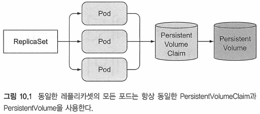
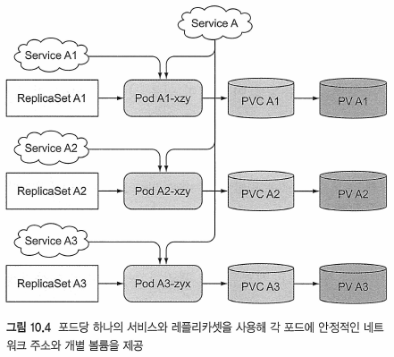
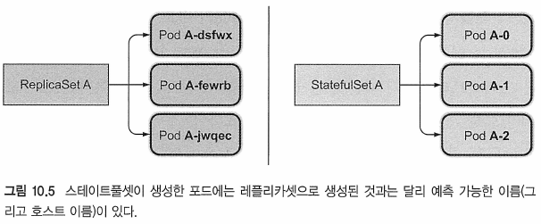
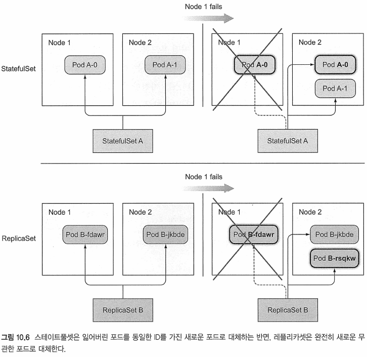
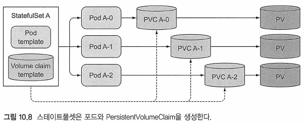
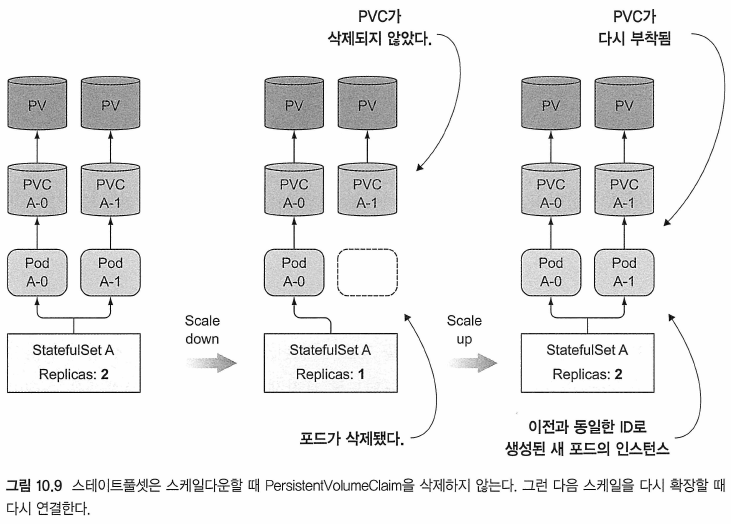
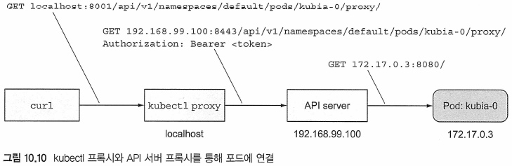
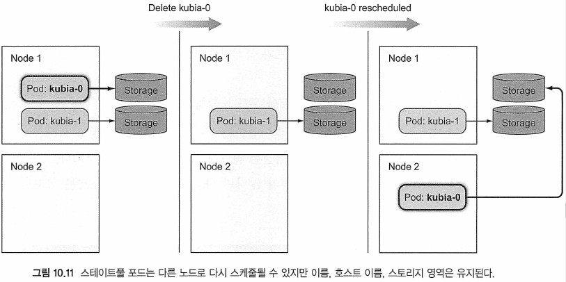
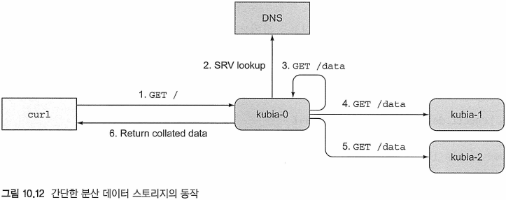

# Kubernetes in Action

---
---
## 10장 스테이트풀셋：복제된 스테이트풀 어플리케이션 배포하기

---
### 10.1 스테이트풀 포드 복제
* 레플리카셋은 단일 포드 템플릿에서 여러 포드 복제본을 생성
	- 복제본은 이름과 IP주소만 다를 뿐 나머지는 똑같음
	- 레플리카셋의 모든 복제본은 동일한 PersistentVolumeClaim을 사용
		+ 그러므로 클레임에 바인딩된 동일한 PersistentVolume을 사용
		



---
#### 10.1.1 각 포드가 분리된 저장소를 갖도록 여러 복제본 실행
* 한 포드의 복제본을 여러 개 실행하고, 각 포드별 자체 스토리지 볼륨을 설정하려면?
	- 레플리카셋 안됨

##### 수동으로 포드 생성
* 레플리카셋이 관리 안함
* 수동 관리 필요
* 사라지면 직접 재생성 필요
	- 좋은 해결책 아님

##### 포드 인스턴스마다 하나의 레플리카셋 사용
* 레플리카셋 본제본 1개에, 여러 레플리카셋 만들기
	- 단일 레플리카셋에 비해 훨씬 번거로움
	- 최선의 방법은 아님

##### 같은 볼륨에서 여러 개의 디렉터리 사용
* 모든 포드가 같은 PersistentVolume을 사용하지만, 각 포드의 볼륨 안에 별도의 파일 디렉터리를 사용
	- 각 인스턴스에 사용해야 하는 디렉터리를 지정할 수는 없지만, 각 인스턴스가 해당 시간에 사용하지 않는 데이터 디렉터리를 자동으로 선택(가능한 경우 생성)하게 할 수는 있음
		+ 인스턴스 간에 조정이 필요하며 올바르게 수행하기 힘듬
		+ 또한 공유 스토리지 볼륨에 병목현상이 발생
		


---
#### 10.1.2 각 포드에 안정적인 ID 제공
* 특정 클러스터 애플리케이션은 각 인스턴스가 장기간 안정적인 ID를 가져야 함
* 레플리카셋이 포드를 대쳬하면 포드는 호스트 이름과 IP가 다른 완전히 새로운 포드가 됨
	- 완전히 새로운 네트워크 ID로 인해 문제가 발생할 수 있음

* 안정적인 네트워크 ID를 요구하는 이유
	- 특정 앱에서는 관리자가 모든 클러스터 멤버와 각 멤버의 구성 파일에 해당 IP 주소(또는 호스트 이름)를 나열해야 함
	- 쿠버네티스에서는 새로운 포드로 인하여, 전체 어플리케이션 클러스터를 재구성해야 함

##### 각 포드 인스턴스에 전용 서비스 사용
* 각 구성원마다 전용 쿠버네티스 서비스를 만들어 클러스터 구성원에게 안정적인 네트워크 주소를 제공하는 방법
	- 개별 포드는 자신이 어떤 서비스를 통해 노출되는지 알 수 없음
		+ 따라서 안징적인 IP를 알 수 없음
	- IP를 사용하는 포드에서 자동으로 등록할 수 없음
	- 좋은 해결 방법이 아님
		+ 스테이트풀셋을 사용해 해결하길 권장
	




---
---
### 10.2 스테이트풀셋 이해
* 스테이트풀셋
	- 애플리케이션의 인스턴스가 안정적인 이름과 상태를 가짐
	- 대체할 수 없으며 개별적으로 처리돼야 하는 애플리케이션에 맞게 조정됨
* 애플리케이션에서 새 인스턴스는 이전 인스턴스와 상태 및 ID가 완전히 같아야 함
* 스테이트풀셋으로 생성(복제)된 포드는 각각 자신만의 볼륨 셋을 가짐

---
#### 10.2.1 스테이트풀셋과 레플리카셋 비교 
* 애완동물(pet)과 가축(cattle)에 비유 가능

---
#### 10.2.2 안적적인 네트워크 ID 제공
* 스테이트풀셋에 의해 생성된 포드
	- 순서형 색인(제로 기반）이 할당되며
		+ 이 색인을 통해 '포드의 이름'과 '호스트 이름'을 부여하며
		+ 포드에 '안정적인 스토리지'를 붙이는 데 사용됨
* 각 포드의 이름은 스테이트풀셋의 이름과 인스턴스의 서수 인테스에 파생됨
	- 예측 가능
	



##### 관리 서비스 소개
* 스테이트풀 포드는 일반 포드와 달리 때로는 호스트 이름에 주소를 지정해야 함
	- 그래서 스테이트풀셋에서는 각 포드의 실제 네트워크ID를 제공함
		+ 이를 사용하기 위해 관리용 헤드리스 서비스가 필요
* 관리용 헤드리스 서비스를 통해, 각 포드는 고유한 DNS 항목을 얻음
	- 클러스터의 피어 가능
	- 호스트 이름으로 포드 지정 가능
* DNS를 사용해, SRV 레코드를 검색해 모든 스테이트풀셋의 포드 이름 조회가 가능

##### 잃어버린 애완 동물 교체
* 실행 중인 포드가 삭제되면, 동일한 이름과 호스트 이름을 갖는 포드가 재생성됨 


##### 스테이트풀셋 스케일링
* 스테이트풀셋은 스케일링하면 사용되지 않는 다음 서수 인덱스를 사용해 새 포드 인스턴스를 생성함
* 스테이트풀셋을 스케일다운하면 항상 가장 높은 서수 인덱스가 있는 인스턴스가 제거됨
	- 따라서 스케일다운 효과를 예측할 수 있음
* 스테이트풀셋은 한 번에 하나의 포드 인스턴스를 스케일다운함
	- 스테이트풀셋이 정상 동작하지 않는 경우, 스케일다운 작업을 허용하지 않음

---
#### 10.2.3 각 스테이트풀 인스턴스에 안정적인 전용 스토리지 제공

##### 볼륨 클레임 템플릿을 갖춘 포드 템플릿 팀 구성
* 스테이트풀셋은 포드를 생성하는 것과 동일한 방법으로 PersistentVolumeClaim을 생성해야 해야함
	- 볼륨 클레임 템플릿을 하나 이상 가질 수 있음
	- 각 포드 인스턴스는 자신만늬 PersistentVolumeClaim을 가지면서 생성 가능



##### PersistentVolumeClaim의 생성과 삭제
* 스테이트풀셋을 하나씩 스케일업하면 두 개 이상의 API 객체가 만들어짐
	- 포드와 하위 포드에서 참조하는 하나 이상의 PersistentVolumeClairn을 만듦
* 스케일다운하면 클레임만 남겨두고 포드를 삭제함
	- 기본 PersistentVolume을 릴리스하기 위해 PersistentVolumeClaim을 수동으로 삭제해야 함
	
##### 같은 포드의 새 인스턴스에 영구 볼륨 클레임 다시 붙이기
* 스케일다운 이후에 PersistentVolumeClaim이 남으며, 이후의 스케일업이 바인딩된 PersistentVolume 및 그 내용을 새 포드 인스턴스에 다시 첨부할 수 있음


	
---
#### 10.2.4 스테이트풀셋의 보장

##### 안정된 ID와 스토리지의 의미
* 쿠버네티스가 이전 포드가 더 이상 존재하지 않음을 확인할 때 발생, 동일한 포드룰 재생성함
	- 만약 쿠버네티스가 포드의 상태를 확신할 수 없다면,
		+ 동일한 ID를 가진 두 개의 어플리케이션 인스턴스가 시스템에서 실행 될 수도 있음
		+ 동일한 스토리지에 바인팅되기 때문에 동일한 파일을 덮어 쓰게 됨
		+ 레플리카셋은 위의 내용상의 걱정이 없음

##### 스테이트풀셋의 최대 하나의 의미 소개
* 스테이트풀셋이 대체 포드를 생성하기 전에 포드를 더 이상 실행하고 있지 않음을 절대적으로 확신해야 함
	- 두 개의 스테이트풀 포드 인스턴스가 동일한 ID로 실행되지 않고
	- 동일한 PersistentVolumeClaim에 바인드되도록 보장해야 함

---
---
### 10.3 스테이트풀셋 사용
* 스테이트풀셋을 사용시, 자체 클러스터된 데이터 스토리지를 구축 필요

---
#### 10.3.1 앱 및 컨테이너 이미지 만들기
Ex) 간단한 스테이트풀 앱(kubia-pet-image/app.js)
```javascript
const http = require('http');
const os = require('os');
const fs = require('fs');

const dataFile = "/var/data/kubia.txt";

function fileExists(file) {
  try {
    fs.statSync(file);
    return true;
  } catch (e) {
    return false;
  }
}

var handler = function(request, response) {
  if (request.method == 'POST') {
    var file = fs.createWriteStream(dataFile);
    file.on('open', function (fd) {
      request.pipe(file);
      console.log("New data has been received and stored.");
      response.writeHead(200);
      response.end("Data stored on pod " + os.hostname() + "\n");
    });
  } else {
    var data = fileExists(dataFile) ? fs.readFileSync(dataFile, 'utf8') : "No data posted yet";
    response.writeHead(200);
    response.write("You've hit " + os.hostname() + "\n");
    response.end("Data stored on this pod: " + data + "\n");
  }
};

var www = http.createServer(handler);
www.listen(8080);
```
* 앱이 POST 요청을 받을 때마다 요청 본문에 받은 데이터를 '/var/data/kubia.txt' 파일에 씀
* GET 요청을 받으면 호스트이름과 저장된 데이터 (파일의 내용)를 반환

Ex) 스트레이트풀 어플리케이션용 Dockerfile(kubia-pet-image/Dockerfile)
```
FROM node:7
ADD app.js /app.js
ENTRYPOINT ["node", "app.js"]
```

---
#### 10.3.2 스테이트풀 셋을 통한 어플리케이션 배포
* 애플리케이션을 배포하려면 두 가지(또는 세 가지)유형의 객체를 만들어야 함
	- 데이터 파일을 저장하는 PersistentVolume
		+ (클러스터가 PersistentVolume의 동적 프로비저닝을 지원하지 않는 경우에만 생성해야 함)
	- 스테이트풀셋에 필요한 관리 서비스
	- 스테이트풀셋 자쳬
* 클러스터가 동적 프로비저닝을 지원하면 수동으로 PersistentVolume을 만들 필요가 없음

##### PersistentVolume 생성
* 샘플 자료
https://github.com/luksa/kubernetes-in-action/tree/master/Chapter10
* persistent-volumes-gcepd.yaml 또는 persistent-volumes-hostpath.yaml 사용

Ex) 세 개의 PersistentVolumes(persistent-volumes-hostpath.yaml)
```yaml
kind: List
apiVersion: v1			# 파일은 세 개의 영구 볼륨 목록을 설명함
items:
- apiVersion: v1
  kind: PersistentVolume
  metadata:
    name: pv-a			# 영구 볼륨의 이름은 pv-a, pv-b, pv-c
  spec:
    capacity:
      storage: 1Mi		# 각 영구 볼륨의 용량은 1 Mebibyte
    accessModes:
      - ReadWriteOnce
    persistentVolumeReclaimPolicy: Recycle 		# 클레임 볼륨을 해제하면 다시 사용하기 위해 재사용됨
    hostPath:									# 볼륨은 로컬 호스트의 디스크를 사용함
      path: /tmp/pv-a
- apiVersion: v1
  kind: PersistentVolume
  metadata:
    name: pv-b
  spec:
    capacity:
      storage: 1Mi
    accessModes:
      - ReadWriteOnce
    persistentVolumeReclaimPolicy: Recycle
    hostPath:
      path: /tmp/pv-b
- apiVersion: v1
  kind: PersistentVolume
  metadata:
    name: pv-c
  spec:
    capacity:
      storage: 1Mi
    accessModes:
      - ReadWriteOnce
    persistentVolumeReclaimPolicy: Recycle
    hostPath:
      path: /tmp/pv-c
```
* List객체를 정의하고 리소스의 객체의 항목으로 나열하는 접근 방식을 사용함

##### 관리 서비스 생성
* 스테이트풀 포드에 네트워크 ID를 제공할 때 사용할 헤드리스 서비스를 생성해야 함

Ex) 스테이트풀셋에 사용할 헤드리스 서비스(kubia-service-headless.yaml)
```yaml
apiVersion: v1
kind: Service
metadata:
  name: kubia
spec:
  clusterIP: None		# 스트레이츠풀셋의 관리 서비스는 헤드리스이어야 함
  selector:
    app: kubia			# app=kubia 라벨을 갖는 모든 포드는 이 서비스에 속함
  ports:
  - name: http
    port: 80
```
* clusterlP 필드를 없음으로 설정하면 헤드리스 서비스가 됨

###### 스테이트풀셋 매니페스트 만들기
Ex) 스테이트풀셋 매니페스트(kubia-service-headless.yaml)
```yaml
apiVersion: apps/v1		# v1beta1 -> v1
kind: StatefulSet
metadata:
  name: kubia
spec:
  selector:				# v1 추가 부분
    matchLabels:		
      app: nginx 		# has to match .spec.template.metadata.labels
  serviceName: kubia
  replicas: 2
  template:
    metadata:
      labels:			# 스테이트풀셋에 의해 생성된 포드는 app=kibia 레이블을 갖음
        app: kubia
    spec:
      containers:
      - name: kubia
        image: luksa/kubia-pet
        ports:
        - name: http
          containerPort: 8080
        volumeMounts:
        - name: data				# 포드 내부의 컨테이너는 이 경로에 PVC 볼륨을 마운트함
          mountPath: /var/data
  volumeClaimTemplates:				# 이 템플릿으로 PersistentVolumeClaim이 작성된다.
  - metadata:
      name: data
    spec:
      resources:
        requests:
          storage: 1Mi
      accessModes:
      - ReadWriteOnce
```
* 버전업을 하였기에 샘플에 수정이 필요
* 이전의 레플리카셋 또는 디플로이먼트 매니페스트와 다르지 않으며,
	- 새로운 것은 volumeClaimTemplates 목록
	- 이전의 포드는 pvc와 구분해서 작성됨

##### 스테이트풀셋 만들기
```bash
$ kubectl create -f kubia-statefulset.yam1

$ kubectl get po
```
* 두 번째 포드는 첫 번째 포드가 준비되고 준비된 후에 만들어 짐
	- 두 개 이상의 클러스터가 멤버가 동시에 나타나면 경합 조건에 민감할 수 있기 때문에 

##### 생성된 스테이트풀 포드 살펴보기
Ex) 스테이트풀셋에 의해 만들어진 스테이트풀 포드
```bash
kubectl get pod kubia-0 -o yaml
apiVersion: v1
kind: Pod
metadata:
...
spec:
  containers:
  - image: luksa/kubia-pet
...
    volumeMounts:
    - mountPath: /var/data			# 매니페스트에 지정된대로의 볼륨 마운트
      name: data
    - mountPath: /var/run/secrets/kubernetes.io/serviceaccount
      name: default-token-bdzcn
      readOnly: true
...
  volumes:
  - name: data
    persistentVolumeClaim:			# 스테이트풀셍에 의해 생성된 볼륨
      claimName: data-kubia-0		# 클레임이 이 볼륨에 참조됨
  - name: default-token-bdzcn
    secret:
      defaultMode: 420
      secretName: default-token-bdzcn
...
```

##### 생성된 PersistentVolumeClaim 살펴보기
Ex) 생성된 영구 볼륨 클레임 확인
```bash
$ kubectl get pvc
NAME           STATUS   VOLUME   CAPACITY   ACCESS MODES   STORAGECLASS   AGE
data-kubia-0   Bound    pv-a     1Mi        RWO                           22m
data-kubia-1   Bound    pv-b     1Mi        RWO                           14m
```

---
#### 10.3.3 실제로 포드를 동작해보기
* 서비스는 헤드리스이기 때문에 서비스를 통해 포드와 통신할 수 없음
* API 서버를 포드의 프록시로 사용


##### API 서버를 통해 포드와 통신하기
* API 서버는 개별 포드에 프록시를 직접 연결 가능
`<apiServerHost>:<port>/api/v1/namespaces/default/pods/kubia-0/proxy/<path>`
* kubia-0 포드 요청 URL

Ex) 프록시 실행
```bash
$ kubectLlproxy
Starting to serve on 127.0.0.1:8001
```
* kubectl 프록시를 사용해 인증 및 SSL 인증서를 거치지 않고도 API 서버와 통신 가능

Ex) 요청 보내기
```bash
$ curl localhost:8001/api/v1/namespaces/default/pods/kubia-0/proxy/
You've hit kubia-0
Data stored on this pod: No data posted yet
```
* 포드 kubia-0에서 실행 중인 어플리케이션의 수신 확인

```
참고 : 빈 응답을 받으면 URL 끝의 마지막 슬래시 문자를 생략하지 않았는지 확인하라(또는 curl이 -L
옵션을 사용해 리다이렉션을 하는지 확인하라)
```


* 요청은 두 개의 프록시를 통해 이루워졌음
* 포드에 보낸 요청은 GET 요청이었지만, API서버를 통해 POST요청을 보낼 수도 있음

Ex) kubia-0 포드에 POST 요청 보내기
```bash
$ curl -X POST -d "Hey there! This greeting was submitted to kubia-0." localhost:8001/api/v1/namespaces/default/pods/kubia-0/proxy/
Data stored on pod kubia-0
```
* 보낸 데이터는 해당 포드에 저장됨

Ex) kubia-0 포드에 GET 요청 보내, 데이터 확인
```bash
$ curl localhost:8001/api/v1/namespaces/default/pods/kubia-0/proxy/
You've hit kubia-0
Data stored on this pod: Hey there! This greeting was submitted to kubia-0.
```

Ex) 다른 클러스터 노드(kubia-1 포드) 확인
```bash
$ curl localhost:8001/api/v1/namespaces/default/pods/kubia-1/proxy/
You've hit kubia-1
Data stored on this pod: No data posted yet
```

##### 재스케줄된 포드가 같은 스토리지에 다시 붙었는지 확인하기 위해 스테이트풀 포드 삭제
Ex) kubia-0포드를 삭제하고 재스케줄 확인
```
$ kubectl get pod -w
NAME      READY   STATUS    RESTARTS   AGE
kubia-0   1/1     Running   0          10s
kubia-1   1/1     Running   0          47h
```
* 이전 포드의 전쳬 ID(이름, 호스트 이름 및 스토라지)는 새 노드로 효과적으로 이전됨



Ex) kubia-0포드의 상태, ID, 스토리지 확인
```
$ curl localhost:8001/apt/v1/namespaces/default/pods/kubta-O/proxy/
You've hit kubia-0
Data stored on this pod: Hey there! This greeting was submitted to kubia-0.
```
* 포드의 응답에 따르면 호스트 이름과 데이터는 모두 이전과 동일
* 스테이트풀셋은 항상 삭제된 포드와 정확히 동일한 포드로 효과적으로 바꿈
<!-- 실제 오류 발생 : Error trying to reach service: 'dial tcp 10.36.0.1:8080: connect: no route to host'# -->

##### 스테이트풀셋 스케일링
* 스테이트풀셋을 스케일다운하면 포드는 삭제되지만, PersistentVolumeClaim은 변경되지 않은 상태로 유지됨
	- 스케일다운 및 스케일업은 점진적으로 수행됨
	- 스케일다운할 대 서수 번호를 가진 가장 높은 포드부터 삭제됨

##### 일반적인 비헤드리스 서비스를 통해 스테이트풀 포드 노출하기
Ex) 스테이트풀 포드를 액세스하기 위한 일반 서비스(kubia-service-public.yaml)
```yaml
apiVersion: v1
kind: Service
metadata:
  name: kubia-public
spec:
  selector:
    app: kubia
  ports:
  - port: 80
    targetPort: 8080
```
* 외부에서 노출된 서비스가 아니기 때문에 클러스터 내에서만 액세스할 수 있음
	- 서비스에 액세스 하려면 포드가 필요하지만, 꼭 그렇지만은 않음
	
##### API 서버를 통해 클러스터 내부의 서비스에 연결
* 피기백(piggyback) 포드를 사용해 클러스터 내부에서 서비스에 액세스하지 않고,
* API 서버에서 제공하는 것과 동일한 프록시 기능을 사용해
* 개별 포드에 액세스한 방식으로 서비스에 액세스할 수 있음
* 서비스에 대한 프록시 요청 URI 경로
`/api/v1/namespaces/<namespace>/services/<service name>/proxy/<path>`

Ex) kubectl 프록시를 통해 서비스에 액세스(kubectl 프록시는 실행중)
```bash
$ curl localhost:8001/api/v1/namespaces/default/services/kubia-public/proxy/
You've hit kubia-1
Data stored on this pod: No data posted yet
```
* kubia-public 서비스에 대한, 각 요청은 임의의 클러스터 노드에 저장되고, 매번 임의의 노드에서 데이터를 가져옴


---
---
### 10.4 스테이트풀셋에서 피어 발견
* 클러스터된 어플리케이션의 중요한 요구 사항은 피어 검색
	- 피어 검색: 다른 클러스터 구성원을 찾는 기능
	
##### SRV 레코드 소개
* SRV 레코드
	- 특정 서비스를 제공하는 서버의 호스트 이름 및 포트를 가리키는 데 사용됨
	- 헤드리스 서비스를 지원하는 포드의 호스트 이름을 가리 키도록 SRV 레코드를 만듦
	
* 새 임시 포드에서 dig DNS 도구를 실행해 스테이트풀 포드의 SRV 레코드를 나열
Ex) svrlookup이라고 하는 일회용 포드 실행
```bash
$ kubectl run -it srvlookup --image=tutum/dnsutils --rm \
--restart=Never -- dig SRV kubia.default.svc.cluster.local
```
<!-- p446, 혜드리스 서비스의 아IS SRV 레코드 나열이 안됨 
	연결이 안되는 노드를 재부팅하니 작동이 됨-->
	
Ex) 헤드리스 서비스의 DNS SRV 레코드 나열
```bash
...
;; ANSWER SECTION:
kubia.default.svc.cluster.local. 9 IN   SRV     0 33 80 kubia-0.kubia.default.svc.cluster.local.
kubia.default.svc.cluster.local. 9 IN   SRV     0 33 80 kubia-1.kubia.default.svc.cluster.local.

;; ADDITIONAL SECTION:
kubia-0.kubia.default.svc.cluster.local. 9 IN A 10.44.0.1
kubia-1.kubia.default.svc.cluster.local. 9 IN A 10.47.0.1
...
```
* 포드가 스테이트풀셋의 모든 포드 목록을 얻기 위해서 SRV DNS 룩업을 수행하면 됨

---
#### 10.4.1 DNS를 통한 피어 검색 구현
* 서비스가 포드의 요청을 무작위로 전달하기 때문에,
	- 클라이언트는 모든 포드에서 데이터를 가져오려면 모든 포드에 도달할 때까지 많은 요청을 수행해야 함
	- 노드가 모든 클러스터 노드의 데이터를 응답하도록 함으로써 이를 개선할 수 있음


Ex) 샘플 어플리케이션에서 피어 검색하기(kubia-pet-pears-image/app.js)
```javascript
const http = require('http');
const os = require('os');
const fs = require('fs');
const dns = require('dns');

const dataFile = "/var/data/kubia.txt";
const serviceName = "kubia.default.svc.cluster.local";
const port = 8080;


function fileExists(file) {
  try {
    fs.statSync(file);
    return true;
  } catch (e) {
    return false;
  }
}

function httpGet(reqOptions, callback) {
  return http.get(reqOptions, function(response) {
    var body = '';
    response.on('data', function(d) { body += d; });
    response.on('end', function() { callback(body); });
  }).on('error', function(e) {
    callback("Error: " + e.message);
  });
}

var handler = function(request, response) {
  if (request.method == 'POST') {
    var file = fs.createWriteStream(dataFile);
    file.on('open', function (fd) {
      request.pipe(file);
      response.writeHead(200);
      response.end("Data stored on pod " + os.hostname() + "\n");
    });
  } else {
    response.writeHead(200);
    if (request.url == '/data') {
      var data = fileExists(dataFile) ? fs.readFileSync(dataFile, 'utf8') : "No data posted yet";
      response.end(data);
    } else {
      response.write("You've hit " + os.hostname() + "\n");
      response.write("Data stored in the cluster:\n");
      dns.resolveSrv(serviceName, function (err, addresses) {			# 앱은 SRV 레코드를 얻기 위해 DNS 룩업을 수행함
        if (err) {
          response.end("Could not look up DNS SRV records: " + err);
          return;
        }
        var numResponses = 0;
        if (addresses.length == 0) {
          response.end("No peers discovered.");
        } else {
          addresses.forEach(function (item) {							# SRV 레코드가 가리키는 각 포드는 데이터를 획득하기 위해 접촉됨
            var requestOptions = {										#
              host: item.name,											#
              port: port,												#
              path: '/data'												#		
            };															#
            httpGet(requestOptions, function (returnedData) {			# SRV 레코드가 가리키는 각 포드는 데이터를 획득하기 위해 접촉됨
              numResponses++;
              response.write("- " + item.name + ": " + returnedData + "\n");
              if (numResponses == addresses.length) {
                response.end();
              }
            });
          });
        }
      });
    }
  }
};

var www = http.createServer(handler);
www.listen(port);
```


1. 첫 요청을 받은 서버는 헤드리스 kubia 서비스로 SRV 레코드를 조회함
2. 다음 서비스를 지원하는 각 포드에게 GET 요청을 전송함
3. 각 노드에 저장된 데이터와 함께 모든 노드의 목록을 반환함

---
#### 10.4.2 스테이트풀셋 업데이트
* 포드가 새 이미지를 사용하도록 포드 템플릿 업데이트
	- 스테이트풀셋은 실행 중
	- 복제본 수를 3으로 설정
`$ kubectl edit statefulset kubia'
* spec.replicas를 3으로 변경
* spec.template.spec.containers.image 속성을 새이미지로 변경
	- luksa/kubiapet --> luksa/kubia-pet-peers

Ex) 포드 변경 확인
```bash
$ kubectl get pod
NAME      READY   STATUS    RESTARTS   AGE
kubia-0   1/1     Running   0          47s
kubia-1   1/1     Running   0          94s
kubia-2   1/1     Running   0          2m12s
```
* 기존의 포드를 재실행되야 업데이트 됨
	- 기존 포드 삭제 필요

---
#### 10.4.3 클러스터된 데이터 스토리지 사용
Ex) 서비스를 통해 클러스려된 데이터 스토리지에 데이터 쓰기
```bash
$ curl -X POST -d "The sun is shining" localhost:8001/api/v1/namespaces/default/services/kubia-public/proxy/
Data stored on pod kubia-2
$ curl -X POST -d "The sun is shining" localhost:8001/api/v1/namespaces/default/services/kubia-public/proxy/
Data stored on pod kubia-1
```

Ex) 데이터 스토리지에서 데이터 읽기
```bash
$ curl localhost:8001/api/v1/namespaces/default/services/kubia-public/proxy/
You've hit kubia-1
Data stored in the cluster:
- kubia-1.kubia.default.svc.cluster.local: The sun is shining
- kubia-0.kubia.default.svc.cluster.local: No data posted yet
- kubia-2.kubia.default.svc.cluster.local: The sun is shining
```
* 클라이언트 요청이 클러스터 노드 중 하나에 도달하면
	- 모든 피어를 검색 -> 해당 피어에서 데이터를 수집 -> 모든 데이터를 다시 클라이언트로 보냄


---
---
### 10.5 스테이트풀셋이 노드 장애를 처리하는 방법
* 노드가 값자기 실패하면 쿠버네티스는 노드 또는 해당 포드의 상태를 알 수 없음
* 스테이트풀셋은 포드를 더 이상 실행하지 않는다는 것을 확신할 때까지 대쳬 포드를 생성할 수 없으며 생성해서도 안 됨
	- 오직 클러스터 관리자가 알려줘야함 알 수 있음
* 노드 중 하나가 네트워크에서 연결이 끊어졌을 때 
	- 스테이트풀셋과 포드의 변화 확인
	
	
---
#### 10.5.1 네트워크에서 노드 연결 해제 시뮬레이션
* 노드의 eth0 네트워크 인터페이스를 셧다운하여 네트워크 연결의 해제를 시뮬레이트 함

##### 노드의 네트워크 어댑터 셧다운
Ex) GKE의 경우
```bash
$ gcl..oud compute ssh gke-kubta-default-poo1--32a2cac8-mOgl
$ sudo tfconftg ethO down
```
* 노드 중 하나에 ssh 접속해 인터페이스 셧다운
	- 온프레미스 환경으로 ens33 셧다운도 가능

##### 쿠버네티스 마스터에 의해 관찰된 노드의 상태 확인
Ex) 실패한 노드의 상태가 NotReady로 바뀜
```bass
kubectl get node
NAME         STATUS     ROLES    AGE    VERSION
localhost0   Ready      <none>   3d3h   v1.18.3
localhost1   NotReady   <none>   3d3h   v1.18.3
localhost2   Ready      <none>   3d3h   v1.18.3
ubuntu       Ready      master   3d4h   v1.18.2
```

Ex) 노드가 NotReady가 된 이후의 포드 상태 변경을 관찰
```bass
kubectl get node
NAME         STATUS     ROLES    AGE    VERSION
localhost0   Ready      <none>   3d3h   v1.18.3
localhost1   NotReady   <none>   3d3h   v1.18.3
localhost2   Ready      <none>   3d3h   v1.18.3
ubuntu       Ready      master   3d4h   v1.18.2
```

##### 상태를 알 수 없는 포드에 발생한 상황


---
#### 10.5.2 수동으로 포드 삭제

---
---
### 10.6 요약

---
## 출처
[^출처]: Kubernetes in Action-마르코 룩샤-에이콘


<!--  -->