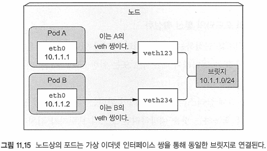

# Kubernetes in Action

---
---
## 11장 쿠버네티스 내부

---
---
### 11.1 아키텍처 이해
* 클러스터는 두 부분으로 나뉨
	- 쿠버네티스 컨트롤 플레인
	- 워커노드

---
##### 컨트롤 플레인 컴포넌트
* API 서버 : 중앙 컴포넌트
* etcd 분산 스토어
* Controller Manger
* Scheduler

##### 워커노드를 실행하는 컴포넌트

##### 컴포넌트의 실행 방법
* Kubelet은 정규 시스템 컴포넌트이다.
	- 포드로서 모든 컨포넌트를 실행함
	- 포드로서 컨트롤 플레인을 실행시키 위해 마스터에도 배포됨

---
#### 11.1.2 쿠버네티스가 etcd를 사용하는 방법


###### 낙관적 동시성 제어(낙관적 잠금)에 관하여
* 데이터를 잠금고 읽지 못하게 하는 대신, 
	- 잠금이 필요한 위치에서 데이터의 업데이트가 필요하면, 
	- 해당 데이터 조각에 버전 번호를 포함하는 것
* 매번 데이터가 업데이트되면 버전 번호도 증가
* 데이터가 업데이트됬을 때, 클라이언트가 데이터를 읽는 시간과 업데이트 요청 시간 사이에 버전 번호가 증가하였는지 확인
	- 버전 정보가 증가하였으면, 업데이트 거절
	- 클라이언트는 새로운 데이터를 다시 읽고 업데이트를 다시 시도
* 그 결과 두 클라이언트가 같은 데이터를 업데이트를 시도시 오직 하나의 클라이언트만 성공하게 됨
```
모든 쿠버네티스 리소스에는 metadata.resourceVersion 필드가 있다．클라이언트는 오브젝트를
 업데이트할 때 API 서버로 다시 전달해야 한다．버전이 etcd에 저장된 것과 일치하는 것이 없다면 
 API 서버는 갱신을 거절한다，
```

Ex) 포드를 나타내는 etcd 엔트리
```
$ sudo ETCDCTL_API=3 ./etcdctl --endpoints 127.0.0.1:2379 --cacert /etc/kubernetes/pki/etcd/ca.crt --cert /etc/kubernetes/pki/etcd/server.crt --key /etc/kubernetes/pki/etcd/server.key get /registry/pods/default/ngins-5f5678c9d8-5z8wv --prefix
```
* API 서버는 포드 및 전체 정보를 etcd에 JSON형식의 리소스로 저장함
	- etcd는 계층적 키 스토리지

##### 저장된 오브젝트의 일관성과 유효성 보장
* 구글의 오메가(Omega)
	- 중앙 집중식 스토리지 사용
	- 여러 컨트롤 플레인 컨포넌트가 스토리지에 직적 액세스함(쿠버네티스와 반대)
		+ 모든 컴포넌트 충돌을 올바르게 처리하기 위해 낙관적 잠금 메커니즘을 준수해야함
		+ 메커니즘을 완전히 준수하지 않으면 일관적인지 않는 데이터가 발생할 수 있음
* 쿠버네티스는 모든 컨트롤 플레인 컴포넌트가 API서버를 통과하도록 요구함으로써 낙관적 잠금 준수를 향상시킴
* API 서버는 스토리지에 기록된 데이터가 항상 유효하고 데이터의 변경 사항이 인증된 클라이언트에서만 수행되도록 함

##### etcd가 클러스터가 될 때 일관성 보장
* RAFT 합의 알고리즘을 사용

---
#### 11.1.3 API 서버가 하는 일


##### 인증 플러그인을 사용한 클라이언트 인증
* API서버는 요청을 보낸 클라이언트를 확인/결정할 때까지 차례로 플러그인를 호출함(인증)

##### 권한 승인 플러그인을 통한 클라이언트 승인
* 인증 플러그인과 마찬가지로 API 서버는 하나 혹은 그 이상의 '권한' 승인 플러그인을 사용할 수 있도록 설정 가능
* API 서버의 역할
	- 인증된 사용자가 요청된 '액션'을 요청된 리소스에 대해 수행할 수 있는지 결정하는 것
	- Ex) 포드를 생성할 때 API 서버는 모든 권한 승인 플러그인에게 차례대로 물어보고 사용자가 요청된 네임스페이스에 포드를 생성할 수 있는지 결정

##### 승인 제어 플러그인을 통해 요청 받은 리소스를 확인／수정
* 요청이 리소스를 생성, 수정, 삭제한다면, 요청은 '승인' 제어 플러그인으로 보내지게 됨

* Ex) 숭인 제어 플러그인
* AlwaysPulllmages: 포드를 배포될 때마다 이미지가 풀(pull)되도록 포드의 imagePullPolicy를 Always로 오버라이드함
* ServerAcoount: 명시적으로 설정하지 않은 포드로 기본 서비스 계정을 적용함
* NamespaceLifeCycle: 존재하지 않는 네임스페이스뿐만 아니라 삭제될 네임스페이스상의 포드 생성을 방지
* ResourceQuota: 특정 네임스페이스의 포드가 네임스페이스에 할당된 만큼의 CPU 및 메모리만사 용하는지 확인(14장 참고)

##### 리소스 검증 및 영구 저장
* 요청이 모든 승인 제어 플러그인을 통과하면,
	- API 서버는 오브젝트의 유효성을 검사하고, 
	- 이를 etcd에 저장한 다음 클라이언트에 응답함

---
#### 11.1.4 API 서버가 클라이언트의 리소스 변화를 감지하는 방법
* API 서버가 추가로 하는 일
	- 리소스 변화를 감지하기위해 컨트롤러와 다른 컴포넌트를 활성화하는 일을 함
	- 변화가 있을 때 통지하도록 요청함


Ex) kubectl로 리소스 감시
```
kubectl get pods --watch
NAME                     READY   STATUS    RESTARTS   AGE
ngins-5f5678c9d8-5z8wv   1/1     Running   0          147m
...
```
* 감시 이벤트의 전체 YAML을 출력 가능
	- `kubectl get pods --watch -o yaml`

---
#### 11.1.5 스케줄러 이해
* 스케줄러가 하는 일
	- API 서버를 통해 포드의 정의를 업데이트
	-> 그 후, API 서버는 포드가 스케줄됐다고 Kubelet에게 통지
	-> 대상 노드의 Kubelet이 포드가 해당 노드에 스케줄됐음을 확인하자마자 포드의 컨테이너를 생성하고 실행함

##### 기본 스케줄러 알고리즘

1. 노드의 필터링
    * 포드에 NodSelector의 설정 확인
    * 포드에 설정된 '리소스 요구'와 현재 사용 가능한 '실제 리소스' 등 확인
        - 여러가지 확인 후 할당할 노드를 필터링함
        - Ex) 해당 노드에 라벨을 설정하여 포드의 매니페스트에서 명시적으로 고사양 노드에 스케줄링되도록 설정
2. 노드의 우선 순위
    * 우선 순위(0~10)를 바탕으로 배치할 노드를 정함
		- 다수의 노드가 가장 높은 점수를 갖는다면, '라운드 로빈'이 사용됨

##### 수용 가능한 노드 찾기
* 포드를 수용 가능한 노드인지 결정하기 위해 __스케줄러__는 구성된 각 술어 함수 목록을 통해 각 노드로 전달
	- 노드가 포드의 하드웨어 리소스 요청을 이행할 수 있을까? (14장 참고)
	- 노드에 리소스가부족한가? (메모리나 디스크의 부족상태를 보고하는가?)
	- 포드가 이름으로 특정 노드에 스케줄되도록 요청하는 경우, 이것은 노드인가?
	- 노드가 포드 스펙의 노드 셀렉터에 맞는 라벨을 가질 수 있을까? (하나라도 정의돼 있다면）
	- 포드가 특정 호스트 포트에 바인딩을 요청하는 경우(13장 참고）해당 노드에 포트가 이미 사용되고 있는가?
	- 포드가 특정 볼륨 유형을 요청하는 경우, 이 볼륨을 노드의 포드에 마운트할 수 있는가? 아니면 노드의 다른 포드에서 이미 동일한 볼륨을 사용하고 있는가?
	- 포드는 노드의 테인트(taints)를 허용하는가? (테인트와 톨러레이션은 16장 참고)
	- 포드가 노드나 포드의 친화성과 비친화성 규칙을 설정할 수 있을까？ 그렇다면 이 규칙을 어길 수 있는 노드로 포드가 스케줄돼야 한다. (16장 참고)
* 노드가 포드를 호스트할 수 있으려면 이런 모든 사항을 통과해야함
	- 이런 체크를 통과한 이후, 스케줄러는 노드의 서브세트를 끝냄


##### 포드를 위한 최적의 노드 선택
* 포드가 다수 실행된 노드보다 적게 실행된 노드를 선호
* 클라우드 인프라스트럭처에 의해 제공한다면, 비용절약을 위해 다수 실행된 노드를 선택할 수도 있음

##### 고급 포드 스케줄링
* 기본적으로 포드는 여러 개의 노드에 분산되어 동작함
	- 하지만 항상 그렇게 구성된다는 보장은 없음
* 포드가 클러스터에 분산되도록 강제하거나 포드 친화성 규칙을 정의함으로써 선로 인접하게 할 수는 있음
	- 16장 참고

##### 다중 스케줄러 사용
* 다중 스케줄러를 실행할 수 있음
	- 각 포드들의 포드 스펙에 schedulerName 속성을 설정해 특정 포드가 스케줄되도록 스케줄러를 지정 가능
	- 속성 설정이 없다면 기본 스케줄러 사용(schedulerName이 default-shceduler로 설정됨)


---
##### 쿠버네티스 오브젝트
* 클러스터의 상태를 나타내기 위해 이용하는 것(개체)
* 쿠버네티스에 바라는 상태(desired state)
* 구체적으로 다음을 기술할 수 있음
	- 어떤 컨테이너화된 애플리케이션이 동작 중인지(그리고 어느 노드에서 동작 중인지)
	- 그 애플리케이션이 이용할 수 있는 리소스
	- 그 애플리케이션이 어떻게 재구동 정책, 업그레이드, 그리고 내고장성과 같은 것에 동작해야 하는지에 대한 정책

##### 쿠버네티스 리소스
* 클러스터를 구성하는 요소/부품


---
#### 11.1.6 컨트롤러 매니저에서 실행되고 있는 컨트롤러 소개
* 레플리케이션 매니저（레플리케이션컨트롤러 리소스의 컨트롤러）
* 레플리카셋, 데몬셋, 잡 컨트롤러
* 디플로이먼트 컨트롤러
* 스테이트풀셋 컨트롤러
* 노드 컨트롤러
* 서비스 컨트롤러
* 엔드포인트 컨트롤러
* 네임스페이스 컨트롤러
* 영구볼륨 컨트롤러
* 그밖의 컨트롤러

##### 컨트롤러가 하는 일과 동작 방식
* 모든 API 서버는 리소스의 변경을 감시하고 새로운 오브젝트를 생성하거나 갱신, 삭제 등의 변경을 위한 동작을 수행함

###### 컨트롤러의 소스 코드를 살펴보는 몇 가지 방법
참고 : https://github.com/kubernetes/kubernetes/tree/master/pkg/controller
```
각 컨트롤러는 일반적으로 Informer라는 컨스트럭터를 갖는다．이는 기본적으로 API 객체가 갱신되는
순간마다 불리는 리스너다．일 상적으로 Informer는 특정 타입의 리소스에 대한 변화를 대기한다．
생성자를 보면 컨트롤러가 보고 있는 리소스가 표시된다．
다음엔 worker( ) 메소드를 살펴보라．내부를 들여다 보면 컨트롤러가 무엇인가 원할 때마다 호출되는
메소드를 찾을 수 있다．통상적으로，실제 함수는 syncHandler나 이름이 유사한 필드에 저장이 된다．
이 필드는 생성자에서도 초기화되므로，여기서 호출되는 함수의 이름을 찾을 수 있다．그 함수는 모든
마법이 일어나는 장소다．
```

---
##### 쿠버네티스 오브젝트
* 클러스터의 상태를 나타내기 위해 이용하는 것(개체)
* 쿠버네티스에 바라는 상태(desired state)
* 구체적으로 다음을 기술할 수 있음
	- 어떤 컨테이너화된 애플리케이션이 동작 중인지(그리고 어느 노드에서 동작 중인지)
	- 그 애플리케이션이 이용할 수 있는 리소스
	- 그 애플리케이션이 어떻게 재구동 정책, 업그레이드, 그리고 내고장성과 같은 것에 동작해야 하는지에 대한 정책

##### 쿠버네티스 리소스
* 클러스터를 구성하는 요소/부품

##### 레플리케이션 매니저
* 레플리케이션 매니저
	- 레플리케이션 컨트롤러 리소스를 움직이게 하는 컨트롤러
	- 실제 작업하는 것은 레플리케이션컨트롤러가 아니라 레플리케이션 매니저
	
	
* 레플리케이션 매니저는 API 서버에서 '포드 API' 오브젝트를 조작해 작업을 수행함

##### 레플리카셋, 데몬셋, 잡 컨트롤러
* 레플리케이션 메니저와 달리 포드를 실행하지 않음
* 포드 정의를 API 서버로 포스트하여 Kubelet이 컨테이너를 생성하고 실행하게 만듦

##### 디플로이먼트 컨트롤러
* 디플로이먼트 오브젝트가 수정될 때마다 새로운 버전으로 롤아웃함(수정이 배포된 포드에 영향을 주는 경우)
* 레플리카셋을 생성하여 롤아웃함


##### 스테이트풀셋 컨트롤러
* 다른 컨트롤러가 포드만 관리하는 동안
	- 각 포드 인스턴스의 PersistentVolumeClaim을 인스턴스화하고 관리함

##### 노드 컨트롤러
* 클러스터의 워커노드를 작성하는 노드 리소스를 관리
* 클러스터에서 실행중인 실제 시스템 목록과 노드 오브젝트 목록을 동기화 상태로 유지
* 각 노드의 상태를 모니터링하고 연결할 수 없는 노드의 포드를 제거

##### 서비스 컨트롤러
* 외부에서 서비스를 사용할 수 있게 인프라스트럭처로부터 로드 밸런스를 요청
* 인프라스트럭처로부터 로드 밸런서를 요청하고 릴리스하는 역할을 유일하게 수행

##### 엔드포인트 컨트롤러
* 라벨 셀렉터와 매칭되는 IP와 포트를 끊임없이 갱신해 엔드포인트 목록을 유지하는 활성 컴포넌트

* 컨트롤러는 서비스와 포드를 모두 감시함
* 서비스가 추가/갱신 또는 포드 추가/갱신/삭제될 때 서비스의 포드 셀렉터와 매칭되는 포드를 선택하고 해당 IP와 포트를 엔드포인트 리소스에 추가함
* 엔드포인트 객체는 독립 실행형 객체이므로 필요한 경우 컨트롤러가 해당 객체를 생성
	- 서비스가 지워질 때 엔드포인트 객체를 삭제함

##### 네임스페이스 컨트롤러
* 네임스페이스 오브젝트의 삭제를 통지할 때
	- API 서버를 통해 네임스페이스에 속한 모든 리소스를 삭제함


##### PersistentVolume 컨트롤러
* 사용자가 만든 PersistentVolumeClaim과 적절한 PersistentVolume을 바인드하는 일을 함
	- PersistentVolumeClaim이 나타나면 컨트롤러는
		+ 요청한 용량과 일치하는 액세스 모드와
		+ 요청한 용량 이상의 선언 용량을 가진 최소 영구 볼륨
	- 을 선택해 클레임과 가장 일치하는 영구 볼륨을 찾아,
	- 용량을 오름차순하고 목록의 첫 번째 볼륨을 반환해, 각 액세스 모드의 영구 볼륨 목록을 순서대로 유지함
	- 사용자가 PersistentVolumeClaim을 삭제하면
		+ 볼륨은 바인딩되지 않고, 회수 정책에 따라 회수됨

##### 컨트롤러 정리
* 모든 컨트롤러들은 API 서버를 통해 API 오브젝트를 가지고 동작함
* 컨트롤러는 Kubelets와 직접 통신하거나 어떤 종류의 명령도 내리지 않음
* Kubelets와 쿠버네티스 서비스 프록시는 컨트롤러의 존재를 알지 못함

---
#### 11.1.7 Kubelet이 하는 일

##### Kublet
* 워커노드에서 실행되는 모든 것에 책임을 가지는 컴포넌트
* kubelet 초기 작업
	- API 서버에서 노드 리소스를 생성해, 실행하고 있는 노드를 등록
	- 그러고 나서 노드에 스케줄됐던 포드에 대해 API 서버를 모니터링
	- 그리고는 포드의 컨테이너를 시작
		+ 설정된 컨테이너 런타임(도커, 코어OS의 rkt 등)에 특정 컨테이너 이미지에서 컨테이너를 실행하도록 지시함
	- 그런 후에 Kubelet은 지속적으로 실행 중인 컨테이너를 모니터링하고 상태와 이벤트, 리소스의 소모를 API 서버에게 보고
* Kubelet도 컨테이너 라이브니스 프로브를 실행하는 컴포넌트이며 프로브가 오류가 발생했을 때 컨테이너를 다시 시작함
* 포드가 API 서버에서 삭제됐을 때, 컨테이너를 정지하고 포드가 정지됐을 때 서버에게 통지

##### API 서버 없이 정적 포드 실행
* Kubelet이 쿠버네티스 API 서버와 통신하고 그곳에서 포드 매니페스트를 얻더라도
	- 아래 그림과 같이 특정 로컬 디렉터리에 위치한 포드 매니페스트 파일에 기반해 포드를 실행할 수 있음
* 쿠버네티스 시스템 컴포넌트를 원시적으로 실행하는 대신,
	- 포드 매니페스트를 Kubelet의 매니페스트 디렉터리에 넣을 수 있고,
	- Kubelet이 실행되고 관리되도록 할 수 있음
	

* 사용자 정의 시스템 컨테이너도 이와 같은 방법으로 실행할 수 있음
	- 하지만 데몬셋을 사용하는 방식을 추천

---
#### 11.1.8 쿠버네티스 서비스 프록시의 역할
* 쿠버네티스 API를 통해 정의한 __서비스__에 클라이언트가 연결할 수 있도록 하는 것이 목적
* kube-proxy는 서비스 IP 및 포트 연결을 보장
* 서비스가 둘 이상의 포드로 백업되면 프록시는 해당 포드에서 '로드 밸런싱'을 수행

##### 프록시로 불리는 이유
* kube-proxy의 초기 구현은 유저스페이스 프록시(userspace proxy)였음
* 서버 프로세스가 연결을 수락하고 이를 포드로 전달


* 서비스 IP로 향하는 연결을 가로채기 위하여 프록시는 iptables 규칙을 그림과 같이 구성함


* 현재는 훨씬 더 나은 성능 구현을 위해 iptables 규칙을 사용해 패킷을 실제 프록시 서버를 통과 시키지 않고 무작위로 선택한 백엔드 포드로 리다이렉션함

* 두 가지 모드의 주요 차이점은 패킷을 쿠버 프로시를 거쳐 유저스페이스에서 처리하느냐 또는 오직 커널에서만 처리하느냐의 차이
	- 성능상의 주요 쟁점이 됨
* userspace 프록시 모드는 단순 '라운드 로빈' 방식을 사용
* iptables 프록시 모드는 포드를 랜덤하게 선택

---
#### 11.1.9 쿠버네티스 애드온 소개
* 쿠버네티스 서비스의 DNS 룩업, 단일 외부 IP 주소를 통한 다중 HTTP 서비스를 노출, 쿠버네티스 웹 대시보드 등의 기능을 활성화

##### 애드온(컴포넌트) 배포 방식
* YAML 매니페스트를 API 서버로 제출하여 포드처럼 배포됨
* 컴포넌트의 일부는 디플로이먼트 리소스, 레플리케이션 리소스, 그리고 일부는 데몬 세트를 배포됨

##### DNS 서버의 동작 원리
* 기본적으로 클러스터의 모든 포드는 클러스터 내부 DNS서버를 사용하도록 구성
* DNS 서버 포드는 kube-dns(coredns) 서비스를 통해 익스포트하고 다른 포드들처럼 포드가 클러스터상에서 이동할 수 있게 함 
	- 서비스의 IP 주소는 클러스터에 배포되는 매 컨테이너 내부의 /etc/resolv.conf 파일의 nameserver에 지정됨
* kube-dns 포드는 API 서버의 __서비스__와 __엔드포인트__의 변화를 관찰하기 위한 감시 매커니즘을 사용
	- 변화가 있으시 마다 DNS 레코드를 갱신함 -> 클라이언트가 항상 최신의 DNS 정보를 얻울 수 있게 함

##### 대다수 인그레스 컨트롤러의 동작 방식
* 인그레스 컨트롤러
	- Nginx와 같은 역프록시 서버를 실행하고 클러스터의 인그레스, 서비스 엔드포인트 리소스에 따라 구성을 유지
	- 리소스를 모니터링함 -> 변경될 때마다 프록시 서버의 구성도 변경
	- 트래픽을 서버 IP를 통해 가는 것 대신에 서비스의 포드로 직접 전달함

###### 프록시
* Forward Proxy
	- 클라이언트가 example.com에 연결하려고 하면 사용자PC(클라이언트)가 직접 연결하는게 아니라 포워드 프록시 서버가 요청을 받아서 example.com에 연결하여 그 결과를 클라이언트에 전달(forward) 함
* Reverse Proxy
	- 클라이언트가 example.com 웹 서비스에 데이타를 요청하면 Reverse Proxy는 이 요청을 받아서 내부 서버에서 데이타를 받은후에 이 데이타를 클라이언트에 전달함
	- 보안의 이유로 사용


---
---
### 11.2 컨트롤러의 상호 협력 방식

---
#### 11.2.1 관련된 컴포넌트의 이해

* 전쳬 프로세스를 시작하기 전에도 컨트롤러, 스케줄러, Kubelet은 각 리소스 유형의 변경 사항을 API 서버에서 감시하고 있음
* etcd는 API 서버 뒤에 숨겨져 있기 때문에 표현하지 않음

---
#### 11.2.2 이벤트 체인
* 배포 매니페스트가 포함하는 YAML 파일을 준비 -> 이를 kubectl을 통해서 쿠버네티스에 제출
	- kubectl 쿠버네티스 API 서버로 HTTP POST 요청으로 매니페스트를 보냄
	- API 서버틑 배포 명세를 확인하고 etcd에 저장
	- kubectl에 응답


##### 레플리카셋을 생성하는 배포 컨트롤러
* 디플로이먼트 객체의 현재 스펙을 위한 레플리카셋을 생성

##### 포드 리소스를 생성하는 레플리카셋 컨트롤러
* 레플리카셋에 정의된 레플리카 개수와 포드 셀렉터를 고려해 셀렉터에 맞는 포드가 충분한지 확인 후
* 레플리카셋의 포드 템플릿에 따라 포드 리소스를 생성
	- 디플로이먼트 컨트롤러가 레플리키셋을 생성했을 때, 디플로이먼트에서 포드 템플릿을 복사

##### 새롭게 생성된 포드를 노드에 할당하는 스케줄러
* 포드를 위한 최적의 노드를 선택하고 포드를 노드에 할당

##### 포드의 컨테이너를 실행하는 Kubelet
* kubelet은 API서버에서 포드의 변화를 감시, 노드로 스케줄되는 새로운 포드를 확인
	- 포드의 정의 조사 후, 컨테이너 런타임(도커 등)에 알림
	- 컨테이너 런타임은 컨테이너를 실행

---
#### 11.2.3 클러스터 이벤트 관찰
* 컨트롤 플레인 컴포넌트와 Kubelet 모두 자기 액션을 수행하면서 API 서버로 이벤트를 보냄
	- 이벤트 리소스를 생성하여 보냄
* `kubectl get events`로 이벤트를 직접 검색 가능
	- 이벤트가 여러번 발생하면, 한 번만 표시
	- `--watch` 옵션을 사용해 이벤트 흐름 확인 가능

---
---
### 11.3 실행 중인 포드의 이해
Ex) 단일 컨테이너 실행
```
$ kubectl run nginx --image-nginx
```

Ex) 도커 컨테이너 목록 조회
```
docker ps
CONTAINER ID        IMAGE                  COMMAND                  CREATED             STATUS              PORTS               NAMES
c00bc0f0a7f9        nginx                  "/docker-entrypoint.…"   22 seconds ago      Up 21 seconds                           k8s_nginx_nginx_default_0be84a08-00f6-4dea-9fa8-22646870dcb0_0
79ec12978e0b        k8s.gcr.io/pause:3.2   "/pause"                 45 seconds ago      Up 41 seconds
```
* 일시 정지(pause)된 컨테이너는 포드의 모든 컨테이너를 함께 담고 있는 컨테이너임
* 일시 정지(pause)된 컨테이너는 '인프라스트럭처 컨테이너'로서 모든 네임스페이스를 보유하는 것이 고유한 목적
	- 포드의 모든 사용자 정의 컨테이너는 포드 인프라스트럭처 컨테이너의 네임스페이스를 사용함


##### 포드 인프라 컨테이너(Pod infrastructure container)[^출처2]
* pause는 "포드 인프라 컨테이너(Pod infrastructure container)"라고 하는데 포드에서 필요한 기본 네트워크를 가지고 실행됨
* 포드내에서 PID 1을 가지고 실행되서 다른컨테이너에 대한 부모 컨테이너 역할
* 포드내의 다른 컨테이너들은 pause 컨테이너가 제공해주는 네트워크를 공유해서 사용
* 포드내의 다른 컨테이너들이 재실행됐을때는 포드의 IP가 변경되지 않고 유지되지만, 
	- pause컨테이너가 재실행되게 되면 포드내의 모든 컨테이너들이 재시작하게 됨
* kubelet의 옵션을 살펴보면 `--pod-infra-container-image`이 있어서 pause가 아닌 다른 컨테이너를 포드 인프라 컨테이너로 지정할수도 있음


---
---
### 11.4 인터－포드 네트워킹
* 네트워크는 시스템 관리자나 컨테이너 네트워크플러그인에 의해 설정됨
	- 쿠버네티스사 자체적으로 수행하는 것이 아님

---
#### 11.4.1 네트워크는 어떤 모습이어야 하는가
* 동일한 워커노드에 위치하는지 여부에 관계없이 다른 포드(컨테이너들)들과 커뮤니케이션할 수 있어야 함

---
#### 11.4.2 네트워크의 동작 원리 깊이 알아보기


##### 동일한 노드상의 포드 간의 통신 활성화

* 가상 이너넷 쌍(veth 쌍)은 컨테이너를 위해 생성됨
	- 쌍 중 하나는 호스트의 네임스페이스에 존재
* 호스트의 네트워크 네임스페이스의 인터페이스는 컨테이너 런타임에서 사용하도록 구성된 네트워크 브릿지에 연결됨

##### 서로 다른 노드상의 포드와의 통신 활성화

* 여러 노드의 포드가 동일한 IP를 획득하는 것을 예방하려면 노드의 브릿지가 겹치지 않는 주소 범위를 사용해야 함
* 겹치지 않는 주소 범위로 통신을 할 수 있게 라우팅 테이블을 구성함
* 노드가 동일한 네트워크 스위치에 연결돼 있고 중간에 라우터가 없는 경우에만 동작(다른말로 모든 노드는 하나의 라우터로 연결)

###### 네트워크 통신 참고
* 이해하기 쉽게 설명됨
	- https://coffeewhale.com/k8s/network/2019/04/19/k8s-network-01/

---
#### 11.4.3 컨테이너 네트워크 인터페이스 소개
* 컨테이너를 네트워크에 쉽게 연결하기 위해 CNI(container Network Interface)라는 프로젝트가 시작됐음
* CNI는 쿠버네티스가 외부에 있는 CNI 플러그인을 사용하도록 구성할 수 있음
* 플러그인 종류
	- 캘리코(Calico)
	- 프라넬(Flannel)
	- 로마나(Romana)
	- 위브넷(Weave Net)
	- 그 밖의 것
* 네트워크 플러그인은 데몬셋과 몇 가지 다른 지원 리소스를 포함하는 YAML만 배포하면 설치 가능
* 데몬셋은 모든 클러스터 노드에 네트워크 에이전트를 배포하는 데 사용
* CNI를 사용하려면 Kubelet 명령에 `--network-plugin = cnl` 옵션을 넣어야 함
	+ 플러그인 종류에 따라 다름

###### 플러그인 참고
https://kubernetes.io/docs/concepts/cluster-administration/addons

---
---	
###	11.5 서비스의 구현 방식

---
#### 11.5.1 kube-proxy 소개
* 초기에 kube-proxy는 연결을 기다리는 실제 프폭시였음
	- userspace 프록시 모드
* 나중에 성능이 더 우수한 iptables 프록시 모드로 교체됨
	
---
#### 11.5.2 kube-proxy가 iptables를 사용하는 방식
1. API 서버에서 서비스를 만들면 가상 IP 주소가 즉시 할당됨
2. 그 후 API 서버는 워커노드에서 실행 중인 모든 kube-proxy 에이전트에 새로운 서비스가 생성됨을 알림
3. 각 kube-proxy는 노드에서 실행 중인 해당 서비스에 주소를 지정할 수 있게 함
	- 이 작업은 iptables 규칙을 몇 가지 설정해 서비스 IP/포트 쌍을 대상으로 하는 각 패킷을 가로채고,
	- 목적지 주소를 수정해 패킷을 서비스를 지원하는 포드 중 하나에 __리다이렉션__하도록 함
* kube-proxy는
	- API 서버를 보면서 __서비스__ 및 __엔드포인트 객체__의 변경 사항을 감시
* 엔드포인트 객쳬는
	- 서비스를 백업하는 모든 포드의 IP/포트 쌍을 보유
	- 새 백업 포드를 '생성'하거나 '삭제'할 때마다 엔드포인트 객쳬가 변경되고
		+ 포드의 '준비 상태가 변경'되거나 포드의 '레이블이 변경'돼 서비스 범위를 벗어나는 경우에도 엔드포인트 객쳬가 변경됨


* 네트워크로 보내지기 전에 패킷은 먼저 노드에 설정된 iptables 규칙에 따라 노드A의 커널에 의해 처음 처리됨
	1. 커널은 패킷이 iptables 규칙 중 하나와 일치하는지 확인
	2. 목적지 IP가 172.30.0.1이고 목적지 포트가 80인 경우, 
		2.1 패킷의 목적지 IP와 포트는 무작위로 선택된 포드의 IP와 포트 대체돼야 한다고 명령함
	3. 그림에선 포드 B2는 랜덤으로 선택됐고 패킷의 대상 IP는 10.1.2.1로 변경, 포트는 8080으로 변경됨
	4. 서비스를 통하는 대신포드가 직접 포드 B로 패킷을 보낸 것과 같음

###### Service 네트워크 통신 참고
https://coffeewhale.com/k8s/network/2019/05/11/k8s-network-02/


##### NodePort
* 쿠버네티스가 NodePort 타입의 서비스를 생성하면
	- __kube-proxy가 각 노드의 eth0 네트워크 interface에 30000–32767 포트 사이의 임의의 포트를 할당__
	- 할당된 포트로 요청이 오게 되면 이것을 매핑된 ClusterIP로 전달
		+ 실제로 따져보자면 ClusterIP로 전달하는 것이 아니라 ClusterIP를 통해 포워딩되는 netfilter 체인 룰로 NAT가 적용

##### Ingress
* 한개의 로드 밸런서를 이용하여 여러 서비스에 연결을 하는 것이 불가능 -> Ingress 서비스 타입이 등장
* Ingress란 리버스 프록시를 통해 클러스터 내부 Service로 어떻게 패킷을 포워딩 시킬 것인지 명시한 쿠버네티스 리소스
	- Ingress는 Ingress Controller와 짝지어짐
* Ingress Controller는 다양하게 있음
	- 대중적으로 많이 사용하는 Ingress Controller는 nginx-ingress
* nginx ingress controller는 ingress 리소스를 읽어서 그에 맞는 리버스 프록시를 구성

---
---
### 11.6 고가용성 클러스터 실행
* 중단 없이 서비스를 실행하려면 애플리케이션뿐 아니라 쿠버네티스 컨트롤 플레인 컴포넌트도 항상 작동해야 함

---
#### 11.6.1 앱의 가용성 높이기
* 어플리케이션의 가용성을 높이려면 배포 리소스를 통해 애플리케이션을 실행하고 '적절한 수의 복제본을 구성'하기만 하면 됨

##### 가동 중단 시간을 줄이는 여러 가지 실행 방법
* 가동 중단 시간을 줄이려면 애플리케이션을 수평 스케일업을 해야함
* 그렇지 못할 경우에도 복제본 수가 1로 설정된 디플로이먼트를 사용
	- 빠르게 복제본으로 대쳬 가능하게 함
	- 포드 컨테이너를 재시작하는 짤은 기간의 다운타임은 불가피함

##### 수평 확장이 불가능한 어플리케이션을 위한 리더 선출 메커니즘 사용하기
* 다운타임을 회피하려면 활성 복제본과 함께 추가 비활성 복제본을 실행하고,
	- 빠른 실행리스 또는 리더 선출 메커니즘을 사용해 하나만 활성 상태인지 확인해야 함

---
#### 11.6.2 쿠버네티스 컨트롤 플레인 컴포넌트의 가용성 높이기
* 다음 컴포넌트의 여러 인스턴스를 실행하는 여러 마스터 노드를 실행함
	- 모든 API 객쳬가 보관되는 분산 데이터 스토리지인 etcd	
	- API 서버
	- 모든 컨트롤러가 실행되는 프로세스인 컨트롤러 매니저
	- 스케줄러
	


##### etcd 클러스터 실행
* etcd는 분산 시스템으로 설계됐으므로, 여러 개의 etcd 인스턴스를 실행함
	- Ex) 인스턴스를 시작할 때, 다른 etcd 인스턴스에 연결할 수 있는 IP 및 포트를 지정
	- 내결함성을 높일려면 2~3개, 노드 장애 처리를 위해선 5~7개 권장

##### API 서버의 여러 인스턴스 실행
* API 서버
	- 모든 데이터는 etcd에 저장하지만, API 서버는 이를 캐시함
* 필요한 만큼 API 서버를 실행함

##### 컨트롤러와 스케줄러의 고가용성 확보
* 서로 경쟁하고 있기에, 한 번에 하나의 인스턴스만 활성화시킴
	- 컴포넌트 자체에서 활성화되고 처리됨
		+ `--leader-elect` 읍션으로 제어됨 (기본값: true)
	- 개별 컴포넌트는 선출된 리더일 때만 활정화

##### 컨트롤 플레인 컴포넌트에 사용된 리더 선출 메커니즘 이해
* 리더 선출 메커니즘은 API 서버에서 리소스를 생성함으로써 순수하게 동작함
	- 엔드포인트 리소스가 이를 획득하는 데 사용함

Ex) 리더 선출에 사용된 kube-scheduler 엔트포인트 리소스
```
$ kubectl get endpoints kube-scheduler -n kube-system -o yaml
apiVersion: v1
kind: Endpoints
metadata:
  annotations:
    control-plane.alpha.kubernetes.io/leader: '{"holderIdentity":"Ubuntu_33f34b85-f7c4-4665-8cf4-f8d03b819a13","leaseDurationSeconds":15,"acquireTime":"2020-06-09T23:59:33Z","renewTime":"2020-06-10T08:31:11Z","leaderTransitions":10}'
  creationTimestamp: "2020-06-08T23:39:15Z"
  managedFields:
  - apiVersion: v1
    fieldsType: FieldsV1
    fieldsV1:
      f:metadata:
        f:annotations:
          .: {}
          f:control-plane.alpha.kubernetes.io/leader: {}
    manager: kube-scheduler
    operation: Update
    time: "2020-06-10T08:31:11Z"
  name: kube-scheduler
  namespace: kube-system
  resourceVersion: "156978"
  selfLink: /api/v1/namespaces/kube-system/endpoints/kube-scheduler
  uid: bfa0e8a4-0b06-438b-8e48-57b4a7a6ed14
```
* 스케줄러의 모든 인스턴스는 kube-scheduler라는 엔드포인트 리소스를 만듦
* holderldentity 필드 : 리더의 이름을 보유

---
---
### 11.7 요약
* 쿠버네티스 클러스터를 구성하는 컴포넌트와 각 컴포넌트가 책임지는 컴포넌트
* API 서버, 스케줄러, 컨트롤러 매니저에서 실행 중인 다양한 컨트롤러와 Kubelet이 함께 작동해 포드를 생생하게 유지하는 방법
* 인프라 컨테이너가 포드의 모든 컨테이너를 묶는 방법
* 포드가 네트워크 브릿지를 통해 같은 노드에서 실행 중인 다른 포드와 통신하는 방법과
	- 다른 노드의 브릿지끼리 서로 다른 노드에서 실행되는 포드가 서로 통신할 수있는 방법
* kube-proxy가 노드에서 iptabLes 규칙을 구성해 동일한 서비스의 포드 간에 로드밸런싱을 수행하는 방법
* 컨트롤 플레인의 각 컴포넌트를 여러 인스턴스로 실행해 클러스터의 가용성을 높이는 방법

---
## 출처
[^출처]: Kubernetes in Action-마르코 룩샤-에이콘
[^출처2]: https://arisu1000.tistory.com/27829 [아리수]


<!--  -->