# Kubernetes in Action

---
---
## 12장 쿠버네티스 API 서버 보안

---
---
### 12.1 인증
* API 서버는 하나 이상의 인증 플러그인으로 구성될 수 있음
* 첫번째 플러그인은 사용자 이름, 사용자 ID, 클라이언트가 속한 그룹을 API 서버 코어에 반환함
	- API 서버는 나머지 인증 플러그인을 중지하고 '승인' 단계로 넘어감
* 여러 인증 플러그인
	- 클라이언트 인증서
	- HTTP 헤더로 전달된 인증 토큰
	- 기본 HTTP 인증
	- 기타

---
##### 12.1.1 사용자와 그룹
* 인증 플러그인은 인증된 사용자의 사용자 이름과 그룹을 반환
	- 해당 정보를 저장하지 않음
	- 사용자가 작업 수행 권한이 있는지 여부를 확인하는데 사용

##### 사용자
* 쿠버네티스는 API서버에 접속하는 두 가지 유형의 클라이언트를 구분
	- 실제 사람(즉, 사용자)
	- 포드(구체적으로, 포드 내부에서 실행하는 어플리케이션)
* 인증 플러그인을 통해 구별함
* 사용자는 SSO(Single Sign On) 시스템과 같은 외부 시스템을 통해 관리
	- 사용자 계정을 나타내는 어떤 리소스도 없음(API서버를 통해 사용자 생성/업데이트/삭제할 수 없음)
* 포드는 Service Accounts라는 매커니즘을 사용
	- 클러스터 내에 서비스어카운트 리소스로 생성되고 저장됨

##### 그룹
* 사용자 및 서비스어카운트는 모두 하나 이상의 그룹에 속할 수 있음
* 그룹은 그룹에 속한 사용자에게 한 번에 사용 권한을 부여하는데 사용
* 시스템에서 제공하는 기본 그룹
	- System: unauthenticated 그룹은 인증 플러그인이 어느 클라이언트도 인증할 수 없을 때 이 요청을 사용함
	- system: authenticated 그룹은 성공적으로 인증된 사용자에게 자동으로 할당함
	- system: serviceaccounts 그룹은 시스템의 모든 서비스어카운트를 포함함
	- system: serviceaccounts:<namespace>는 특정 네임스페이스의 모든 서비스어카운트를 포함함

---
#### 12.1.2 서비스어카운트 소개
* 서비스어카운트는 포드 내에서 실행되는 애플리케이션이 API 서버 자제와 인증하기 위한 방법
* 어플리케이션은 요청에 서비스어카운트의 토큰을 전달
	- 각 컨테이너는 /var/run/secrets/kubernetes.io/serviceaccount/token 에 '서비스어카운트의 인증 토큰'를 마운트함
	- 토큰을 사용해 API 서버에 연결하면
		+ 인증 플러그인이 서비스어키운트를 인증하고
		+ 서비스어카운트의 사용자 이름을 API 서버 코어로 다시 전달
* 서비스어카운트 사용자 이름 형식
`system:serviceaccount:<namespace>:<service account name>`
* API 서버는 구성된 사용자 승인 플러그인에게 이 '사용자 이름'을 전달
* 어플리케이션이 수행하려고 하는 동작이 서비스어카운트에 의해 허가되는지 여부를 결정
	
##### 서비스어카운트 리소스
* 서비스어카운트는 포드, 시크릿, ConfigMap 등과 같은 리소스이며 개별 네임스페이스로 범위가 지정됨
	- 각 네임스페이스의 디폴트 서비스어키운트는 자동으로 만들어짐(즉, 포드에 맞게 모두 생성됨)

Ex) 서비스어카운트 확인
```bash
$ kubectl get sa
NAME      SECRETS   AGE
default   1         2d2
```

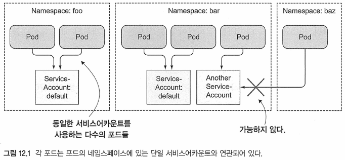
* 필요한 경우 서비스어카운트를 추가 가능
* 여러 포드에서 같은 서비스어카운트를 사용할 수 있음
	- 포드는 동일한 네임스페이스의 서비스어카운트만 사용 가능

##### 서비스어카운트가 인증과 어떻게 밀접하게 연관되어 있는지 이해하기
* 포드 매니페시트에서 계정 이름을 지정해 포드에 서비스어카운트를 할당 가능
	- 명시적으로 지정하지 않으면 네임스페이스의 디폴트 서비스어카운트를 사용
* 포드에 각기 다른 서비스어카운트를 할당하면 각 포드에 접근할 수 있는 리소스 제어 가능  
* 인증 토큰이 있는 요청이 API 서버에 수신 ->  서버는 토큰을 사용해 클라이언트를 인증 -> 관련 서비스어카운트가 요청된 작업을 수행할 수 있는지 여부를 결정
	- API서버는 클러스터 관리자가 구성한 시스템 전체 권한 플러스인에서 확인함
	- 사용 가능한 승인 플러그중 하나는 RBAC(역할 기반 접근 제어) 플러그인임

---
#### 12.1.3 서비스어카운트 생성
* 클러스터 보안 때문에 디폴트 서비스어카운트를 사용하지 않고 필요한 경우 서비스어카운트를 생성(추가)하여 사용
	- Ex) 클러스터 메타 데이터를 읽을 필요가 없는 포드는, 클러스터 리소스를 검색/수정할 수 없는 제한된 계정에서 실행해야 함 등

##### 서비스어카운트 생성
* `kubectL create serviceaccount` 사용
```bash
$ kubectl create serviceaccount foo
serviceaccount/foo created
```

Ex) kubectl describe로 서비스어카운트 확인하기
```bash
$ kubectl describe sa foo
Name:                foo
Namespace:           default
Labels:              <none>
Annotations:         <none>
Image pull secrets:  <none>				# 이 서비스어카운트를 사용해 모든 포드에 자동으로 추가함
Mountable secrets:   foo-token-pqnfs	# 이 서비스어카운트를 사용하는 포드는 mountable secrets가 수행됬을 때, 이런 secret을 마운트 할 수 있음
Tokens:              foo-token-pqnfs	# 인증 토큰, 첫 번째 토큰이 컨테이너 내부에서 마운트됨	
Events:              <none>
```
* 사용자 지정 토큰 시크릿이 만들어지고 서비스어카운트와 연결됐음을 확인

Ex) 사용자 기반 수정된 서비스어카운트의 시크릿 확인
```bash
$ kubectl describe secret foo-token-pqnfs
Name:         foo-token-pqnfs
Namespace:    default
...
Data
====
ca.crt:     1025 bytes
namespace:  7 bytes
token:      eyJhbGciOiJSUzI1NiIsImtpZ...
```
* 기본 서비스어카운트의 토큰과 동일한 항목(CA 인증서, 네임스페이스, 토큰)이 포함돼 있음을 알 수 있음
	- 기본 서비스어카운트와 토큰 자체는 다름
* 서비스어카운트에서 사용되는 인증 토큰은 JWT(JSON Web Token)

##### 서비스어카운트의 마운트할 수 있는 시크릿
* Mountable secrets
	- 포드의 서비스어카운트는 서비스 계정상의 Moutable Secrets에 나열된 시크릿만이 포드에 마운트되도록 허용함
	- 기능을 사용하려면 서비스어카운트는 다음과 같은 주석을 포함해야 함
		+ `kubernetes.io/enforce-mountable-secrets="true"`
		+ 주석을 사용하는 모든 포드는 서비스어카운트의 마운트 가능한 시크릿만 만들 수 있음(다른 시크릿은 사용 못함)

##### 서비스어카운트의 이미지가 시크릿을 가져오는 방식
* image pull Secrets
	- 개인용 이미지 스토리지에서 컨테이너 이미지를 가져오는 데 필요한 자격 증명을 가지고 있는 시크릿
Ex)image pull Secret이 포함된 서비스어카운트
```bash
$ cat sa-image-pull-secrets.yaml                                                20-06-12 - 11:33:10
apiVersion: v1
kind: ServiceAccount
metadata:
  name: my-service-account
imagePullSecrets:
- name: my-dockerhub-secret
```
* 서비스어카운트의 이미지 풀 Secrets는 마운트 가능한 시크릿과 약간 다르게 동작함
	- __서비스어카운트를 사용해 모든 포드에 자동으로 추가될 수 있는지를 결정__
	- 서비스어카운트에 이미지 풀 Secrets를 추가하면 각 포드에 개별적으로 추가할 필요가 없음

---
#### 12.1.4 포드에 서비스어카운트 할당
* 추가 서비스어카운트를 생성한 후에는 이를 포드에 지정해야 함
	- 포드 정의의 spec.serviceAccountName 필드에 서비스어카운트의 이름을 설정
```
참고 : 서비스어카운트는 포드가 생성될 때 반드시 지정돼야 한다. 그 이후에는 변경할 수 없다．
```

##### 사용자 지정 서비스어카운트를 사용하는 포드 생성
Ex) 사용자 지정 서비스어카운트를 사용한 포드(curl-custom-sa.yaml)
```yaml
apiVersion: v1
kind: Pod
metadata:
  name: curl-custom-sa
spec:
  serviceAccountName: foo	# 이 포드는 default 대신에 foo 서비스어카운트를 사용함
  containers:
  - name: main
    image: tutum/curl
    command: ["sleep", "9999999"]
  - name: ambassador
    image: luksa/kubectl-proxy:1.6.2
```
* 앰베서더 컨테이너는 포드의 서비스어카운트의 토큰을 사용해 API 서버로 인증하기 위해 kubectl proxy 프로세스를 실행함

Ex) 포드의 컨테이너에 마운트된 토큰 확인하기
```bash
kubectl exec -it curl-custom-sa -c main -- \
  cat /var/run/secrets/kubernetes.io/serviceaccount/token
eyJhbGciOiJSUzI1NiIsImtpZCI6IjBFeVNkN2x...
```

##### API 서버와 통신하기 위해 서비스어카운트의 사용자 토큰 사용
* 앰배서더 컨테이너는 서버와 통신할 때 토큰을 사용
	- localhost:8001을 사용하는 앰베서더 컨테이너를 통해 토큰을 테스트 가능
	
Ex) 사용자 지정 서비스어카운트가 포함된 API 서버와 통신하기
```bash
$ kubectl exec -it curl-custom-sa -c main -- curl localhost:8001/api/v1/pods
{
  "kind": "PodList",
  "apiVersion": "v1",
  "metadata": {
    "selfLink": "/api/v1/pods",
    "resourceVersion": "307842"
  },
  "items": [
    {
      "metadata": {
...
```
* 서버에서 적절한 응답을 받았으므로 사용자 지정 서비스어카운트가 포드를 나열할 수 있음
	- 클러스터 RBAC 인증 플러그인을 사용하지 않거나
	- 모든 서비스어카운트에 전체 권한을 부여했기 때문에 응답을 받음
* 위의 경우 서비스어카운트를 사용하는 유일한 이유
	- 마운트 가능한 시크릿을 적용하거나 서비스어카운트를 통해 이미지 풀 시크릿을 제공하는 것임
* 그러나 RBAC 인증 플러그인을 사용할 때는 추가 서비스어카운트를 만들어야 함

---
---
### 12.2 롤 기반 접근 제어 클러스터 보안
* 쿠버네티스 1.8.0 버전에서 RBAC 승인 플러그인은 GA(Generat Availability)로 승격히여 클러스터에서 기본적으로 활성화됨
	- 디폴트 서비스어카운트는 클러스터 상태를 볼 수 없으며 추가 권한을 부여히지 않는 한 어떤 식으로든 클러스터를 수정할 수 없음
```
참고 : RBAC 외에도 쿠버네티스에는 ABAC(Attribute-based Access Contr히）플러그인, 웹훅 플러그인, 
사용자 정의 플러그인 구현 같은 그 밖의 인증 플러그인이 포함돼 있다. 하지만 RBAC이 표준이다．
```

---
#### 12.2.1 RBAC 인증 플러그인 소개
* 쿠버네티스 API 서버를 설정하여 사용자가 요청한 작업이 수행할 수 있는지 승인 플러그인을 사용하여 확인 가능
	- API 서버는 REST 인터페이스를 노출하므로 사용자는 HTTP 요청을 서버로 전송해 작업을 수행
	- 사용자는 요청에 자격증명(인증 토큰, 사용자 이름 및 암호 또는 클라이언트 인증서)을 포함해 인증함

##### 액션
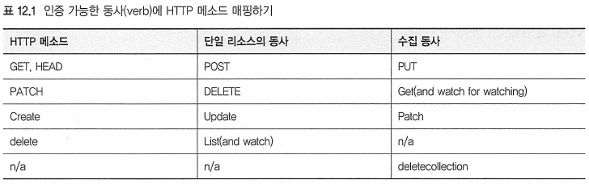
* 전체 리소스 유형에 보안 권한 적용 가능
* RBAC 규칙은 리소스의 특정 인스턴스(Ex: myservice라는 서비스)에도 적용 가능
* URL 경로에도 권한을 줄 수 있음
```
참고 : 추가 동샤의 사용은 다음 장에서 설명하는 PodSecurityPolicy 리소스에 사용된다．
```

##### RBAC 플러그인
* 사용자의 역할을 보고 사용자가 액션을 수행할 수 있는지 여부를 결정할 때 핵심 요소로 사용함
* 주쳬는 하나 이상의 역할과 연관되며, 각 역할은 특정 리소스에서 특정 동사(verbs)를 수행할 수 있음
	- 주체 : 사람, 서비스어카운트 또는 사용자 또는 서비스어카운트의 그룹
* RBAC 플러그인을 통한 인증 과정
	- 네 가지 RBAC 관련 쿠버네티스 리소스를 만들어서 모든 인증을 수행할 수 있게 함

---
#### 12.2.2 RBAC 리소스 소개
* RBAC 인증 규칙은 네 가지 리조스로 구성되며 두 가지 그룹으로 그룹화 가능
	- 리소스에서 수행할 수 있는 동사를 지정하는 롤 및 클러스터롤
	- 위의 롤을 특정 사용자, 그룹 또는 서비스어카운트에 바인딩하는 롤바인딩 및 클러스터롤바인딩

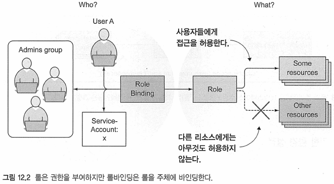  

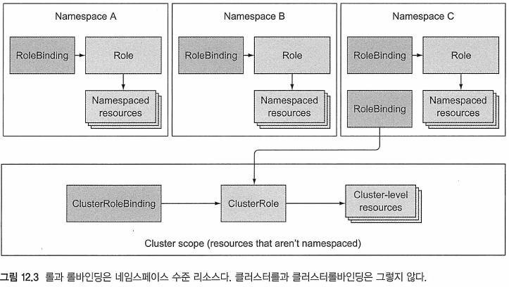
* 네임스페이스 수준 리소스 : 롤과 롤바인딩
	- 단일 네임스페이스 공간에 롤과 롤바인딩이 여러 개 존재 가능
	- 롤바인딩이 네임스페이스 수준 리소스임에도 클러스터롤을 참조 가능
* 클러스터 수준의 리소스(넴임스페이스가 아닌) : 클러스터롤과 클러스터롤바인딩

##### 연습을 위한 환경 설정
* 쿠버네티스 버전 1.6 이상
* RBAC 플러스인 활성화
```
참고 : GKE 1.6 또는 1.7을 사용하는 경우 클러스터를 생성할 때 --no-enable-legacyauthorization
옵션을 사용해 레거시 승인을 명시적으로 비활성화해야 한다. 미니큐브를 사용하는 경우 미니큐브를 시작할 때
 --extra-config=apiserver.Authorization.Mode=RBAC 옵션을 줘서 RBAC을 활성화해야 할 수도 있다，
```
* 8장에서 RBAC를 비활성했으면, 활성화 하기
	- `$ kubectl delete clusterrolebinding permissive-binding`
* 네임스페이스 보안이 어떻게 작동하는지 확인하기 위해 다른 이름 공간에서 두 개의 포드를 실행
	- 단일 컨테이너 실행(kubectl-proxy 이미지 기반)
		+ 프록시는 인증 및 HTTPS를 처리하므로 API 서버 보안의 인증 측면에 집중 가능
	- curl 실행(kubectl exec를 사용)


##### 네임스페이스 생성 및 포드 실행
Ex) 다른 네임스페이스에서 테스트 포드 수행하기
```
$ kubectl create ns foo
namespace/foo created
$ kubectl run test --image=luksa/kubectl-proxy -n foo
pod/test created
$ kubectl create ns bar
namespace/bar created
$ kubectl run test --image=luksa/kubectl-proxy -n bar
pod/test created
``` 

Ex) 각 포드 내부에 쉘을 실행
```
$ kubectl get pod -n foo
NAME   READY   STATUS    RESTARTS   AGE
test   1/1     Running   0          106s

$ kubectl exec -it test -n foo -- sh
/ # 
``` 
* bar 네임스페이스의 포드도 다른 터미널에서 동일하게 수행

##### 포드에서 서비스 목록 나열
Ex) RBAC가 활성화 확인
```
/ # curl localhost:8001/apt/vl/namespaces/foo/services
...
  "status": "Failure",
  "message": "forbidden: User \"system:serviceaccount:bar:default\" cannot get path \"/apt/vl/namespaces/foo/services\"",
  "reason": "Forbidden",
  "details": {
  },
  "code": 403
```
* kubectl 프록시 프로세스가 리스닝하고 있는 localhost:8001에 연결 중
* 서비스어카운트의 디폴트 사용 권한으로 어떤 리소스든 리스트하거나 수정하는 것을 허용할 수 없음

---
#### 롤과 롤바인딩 사용
* 롤 리소스는 어떤 리소스에서 수행할 수 있는 액션을 정의함
	- 또는 RESTful 리소스에 수행할 수 있는 HTTP요청 유형

Ex) 룰의 정의(service-reader.yaml)
```yaml
apiVersion: rbac.authorization.k8s.io/v1
kind: Role
metadata:
  namespace: foo			# 룰은 네임스페이스가 됨(생략되면, 현재 네임스페이스로 설정)
  name: service-reader
rules:
- apiGroups: [""]			# 서비스는 이름이 없는 core apiGroup의 리소스, ""로 표기함
  verbs: ["get", "list"]	# 개별 서비스를 가져오고, 모든 항목이 허용됨. 개별 서비스를 이름으로 get하고, 모든 항목을 list하는 것이 허용
  resources: ["services"]	# 이 룰/규칙은 서비스와 관련 있음(복수명을 사용해야함)
```
* 리소스를 지정할 때 복수형을 사용해야 함!
* 각 리소스 유형이 리소스 매니페스트의 apiVersion 필드(버전과 함께)데 지정하는 API 그룹에 속함
	- 롤 정의에서 정의에 포함된 각 규칙에 나열된 리소스에 apiGroup을 지정해야 함
	- 여러 API 그룹에 속한 리소스에 접근을 허용하는 경우 여러 규칙을 사용
```
참고 : 예를 들어 모든 서비스 리소스에 대한 접근을 허용하지만 추가 resourceNames 필드를 통해
이름을 지정해 특정 서비스 인스턴스에만 접근을 제한할 수도 있다．
```

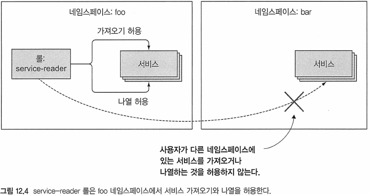


##### 롤 생성
* `$kubectl create -f service-reader.yaml -n foo`
	- GKE를 사용하는 경우 클러스터 관리 권한이 없기에 명령을 실패할 수 있음
	- GKE에서 사용 `$ kubectl create clusterrolebinding cluster-admin-binding --clusterrole=cluster-admin --user=user.email@address.com`
* YAML 파일로 롤읗 만드는 대신 `kubectl create role`이라는 명령어를 사용해 롤 생성 가능
	- `$ kubectl create role service-reader --verb=get --verb=list --resource=service -n bar`

##### 서비스어카운트에 롤을 바인딩
* 롤을 사용자, 서비스어카운트 또는 그룹(사용자 또는 서비스어카운트)이 될 수 있는 주제에 바인딩해야 의미 있음
* `kubectl create rolebinding test --role=service-reader --serviceaccount=foo:default -n foo`
```
참고 : 서비스어카운트 대신 사용자에게 롤을 바인딩하려면 --user 인수를 사용해 사용자 이름을 
지정하라. 그룹에 바인딩하려면 --group을 사용하라．
```

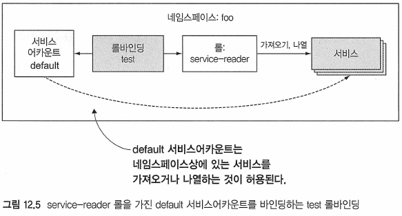

Ex) 롤을 참조하는 롤바인딩
```bash
$ kubectl get rolebinding test -n foo -o yaml
apiVersion: rbac.authorization.k8s.io/v1
kind: RoleBinding
metadata:
...
  name: test
  namespace: foo
  resourceVersion: "376206"
  selfLink: /apis/rbac.authorization.k8s.io/v1/namespaces/foo/rolebindings/test
  uid: 9195605c-f01e-4fcb-b7ca-c16e2b94d9cb
roleRef:
  apiGroup: rbac.authorization.k8s.io
  kind: Role				# 롤바이딩은 service-reader 롤을 참조함
  name: service-reader
subjects:
- kind: ServiceAccount		# foo 네임스페이스상에서 기본 서비스어카운트에 바인드함
  name: default
  namespace: foo
```
* 롤바인딩은 항상 하나의 롤을 참조하지만, 롤을 여러 subjects에 바인딩할 수 있음


Ex) API 서버에서 서비스 가져오기
```bash
$ curl localhost:8001/api/v1/namespaces/foo/services
{
  "kind": "ServiceList",
  "apiVersion": "v1",
  "metadata": {
    "selfLink": "/api/v1/namespaces/foo/services",
    "resourceVersion": "385370"
  },
  "items": []			# 아무 서비스도 없기 때문에 항목의 리스트는 비워져있음
}
```

##### 롤바인딩에서 다른 네임스페이스의 서비스어카운트 포함하기
* 롤바인딩 편집으로, 다른 네임스페이스에 있더라도 다른 포드의 서비스어카운트를 추가할 수 있음
* `$ kubectl edit rolebinding test -n foo`
Ex) 네임스페이스가 다른 서비스어카운트 참조하기
```yaml
...
subjects:
- kind: ServiceAccount
  name: default
  namespace: foo
- kind: ServiceAccount
  name: default
  namespace: bar
```
* subjects 리스트에 'bar'내용 추가
* bar 네임스페이스에서 실행 중인 포드 내부에서 foo 네임스페이스의 서비스를 리스트 가능

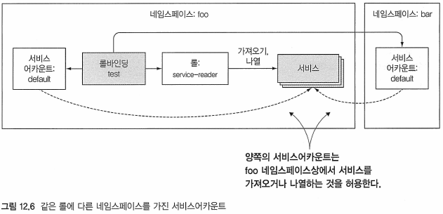
* foo 네임스페이스에 롤바인딩이 있는데, 이는 foo 네임스페이스의 service-reader 롤을 참조하며, foo와 bar 네임스페이스의 기본 서비스어카운트를 바인딩함

---
#### 12.2.4 클러스터롤과 클러스터롤바인딩 사용
* 롤과 롤바인딩은 네임스페이스 내에서 사용할 수 있는 리소스
	- 단일 네임스페이스의 리소스에 상주하고 적용됨
	- 또한 롤바인딩은 다른 네임스페이스의 서비스어카운트도 참조 가능
* 클러스터롤은 클러스터 수준의 리소스
	- 클러스터롤은 네임스페이스와 연관 없는 리소스
	- 또는 리소스가 아닌 URL,
	- 또는 개별 네임스페이스 내부에 바인딩되는 공통된 rule로 사용

##### 클러스터 레벨 리소스에 접근 허용
* 클러스터롤을 사용해 클러스터 수준 리소스에 접근 가능
* 클러스터에서 포드가 PersistentVolume을 나열하도록 허용하는 방법 실습
```bash
$ kubectl create clusterrole pv-reader --verb=get,list --resource=persistentvolumes
clusterrole.rbac.authorization.k8s.io/pv-reader created
```

Ex) 클러스터롤의 정의
```bash
$ kubectl get clusterrole pv-reader -o yaml
apiVersion: rbac.authorization.k8s.io/v1
kind: ClusterRole							# 클러스터룰은 네임스페이스가 아님, 그래서 네임스페이스 필드가 없음
metadata:
...
  name: pv-reader
  resourceVersion: "552390"
  selfLink: /apis/rbac.authorization.k8s.io/v1/clusterroles/pv-reader
  uid: d1b7ce98-9ee5-4d80-97cb-c6c82f6d25b2
rules:										# 룰은 일반 룰의 규칙과 동일
- apiGroups:
  - ""
  resources:
  - persistentvolumes
  verbs:
  - get
  - list
```
* 포드의 서비스어카운트에 바인딩하기 전에 포드가 PersistentVolume을 리스트할 수 있는지 확인

Ex) 리스트 가능 확인
```bash
/ # curl localhost:8001/api/v1/persistentvolumes
...
  "status": "Failure",
  "message": "persistentvolumes is forbidden: User \"system:serviceaccount:foo:default\" cannot list resource \"persistentvolumes\" in API group \"\" at the cluster scope",
  "reason": "Forbidden",
  "details": {
    "kind": "persistentvolumes"
...
```
* 디폴트 서비스어카운트는 PersistentVolume을 나열할 수 없음
```
참고 : PersistentVolume은 네임스페이스가 없기 때문에 URL에 네임스페이스가 없다．
```

Ex) 클러스터롤을 서비스어카운트에 바인딩(일반적인 롤바인딩)
```bash
$ kubectl create rolebinding pv-test --clusterrole=pv-reader --serviceaccount=foo:default -n foo
rolebinding.rbac.authorization.k8s.io/pv-test created
```
* 바인딩 후 'Ex) 리스트 가능 확인'과 같이 재확인
	- 리스트를 나열하지 못함

Ex) 롤클러스터 참조하는 롤 바인딩
```bash
$ kubectl get rolebinding pv-test -o yaml -n foo                                             1 ↵
apiVersion: rbac.authorization.k8s.io/v1
kind: RoleBinding
...
  name: pv-test
  namespace: foo
...
roleRef:
  apiGroup: rbac.authorization.k8s.io
  kind: ClusterRole						# 이 바인딩은 pv-reader 클러스터롤을 참조함
  name: pv-reader
subjects:								# foo 네임스페이스의 디폴트 서비스어카운트를 subjects에 바인드하고 있음
- kind: ServiceAccount
  name: default
  namespace: foo
```
* 겉보기에는 YAML이 완벽해 보임

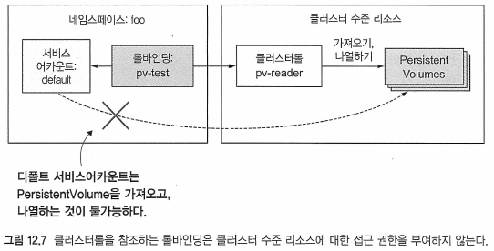
* 클러스터 수준 리소스에 대한 접근 권한을 부여하려면 항상 클러스터롤바인딩을 사용해야 함

Ex) 바인딩 삭제 후, 클러스터롤바인딩 생성
```
$ kubectl delete rolebinding pv-test -n foo
rolebinding.rbac.authorization.k8s.io "pv-test" deleted

$ kubectl create clusterrolebinding pv-test --clusterrole=pv-reader --serviceaccount=foo:default
clusterrolebinding.rbac.authorization.k8s.io/pv-test created
```

Ex) 리스트 가능 재확인
```bash
/ # curl localhost:8001/api/v1/persistentvolumes
{
  "kind": "PersistentVolumeList",
  "apiVersion": "v1",
  "metadata": {
    "selfLink": "/api/v1/persistentvolumes",
    "resourceVersion": "560897"
  },
  "items": []
}
```
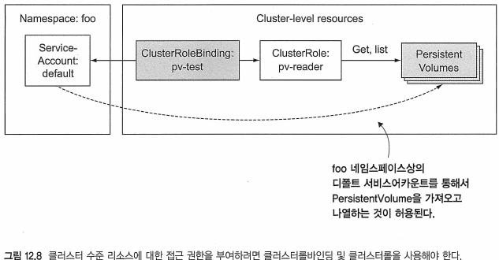
```
팁 : 롤바인딩은 클러스터롤바인딩을 참조하더라도 클러스터 수준 리소스에 대한 접근 권한을 부여할 수 없다．
```

##### 비 리소스 URL에 접근 허용
* API 서버는 비 리소스 URL도 노출함
	- 이런 URL에는 명시적으로 접근 권한을 부여해야 함
	- 그렇지 않으면 API 서버가 클라이언트의 요청을 거부
	- 일반적으로 system:discovery 클러스터롤과 이름이 같은 클러스터롤바인딩을 통해 자동으로 수행됨
Ex) 기본 system:discovery 클러스터롤
```bash
$ kubectl get clusterrole system:discovery -o yaml
apiVersion: rbac.authorization.k8s.io/v1
kind: ClusterRole
metadata:
  annotations:
...
  name: system:discovery
...
rules:
- nonResourceURLs:		# 리소스를 참조하는 대신에, 이 룰은 비 리소스 URL을 참조함
  - /api
  - /api/*
  - /apis
  - /apis/*
  - /healthz
  - /livez
  - /openapi
  - /openapi/*
  - /readyz
  - /version
  - /version/
  verbs:				# 이런 URL은 HTTP GET 메소드만이 허용됨
  - get
```
* 이 클러스터롤은 리소스 대신 URL을 참조함
	- resources 필드 대신에 nonResourceURL 필드가 사용됨
* 클러스터 수준 리소스와 마찬가지로 비 리소스 URL의 클러스터롤은 클러스터바인팅으로 바인딩해야함

```
참고 : 비 리소스 URL의 경우 create 또는 update 대신 post, put, patch와 같은 평문의 HTTP 동사
(verbs가 사용된다. 동사는 소문자로 지정해야 한다．
```

* system:discovery 클러스터롤은 그에 상응하는 system:discovery 클러스터롤바인딩이 존재
Ex) 디폴트 system:discovery 클러스터롤바인딩
```bash
$ kubectl get clusterrolebinding system:discovery -o yaml
apiVersion: rbac.authorization.k8s.io/v1
kind: ClusterRoleBinding
metadata:
  annotations:
...
  name: system:discovery
...
roleRef:								# 클러스터롤바인딩 system:discovery 클러스터롤을 참조
  apiGroup: rbac.authorization.k8s.io
  kind: ClusterRole
  name: system:discovery
subjects:								
- apiGroup: rbac.authorization.k8s.io	# 인증된 사용자와 클러스터롤을 바인드함
  kind: Group
  name: system:authenticated
```

```
참고 : 그룹이 인증 플러그인의 도메인에 있다. API 서버가 요청을 수신하면 인증 플러그인을 호출해
사용자가 속한 그룹 목록을 가져온다. 이 정보는 인증에 사용된다，
```

Ex) /api URL에 접근
```
$ curl -H "Authorization: Bearer $TOKEN1" https://192.168.10.200:6443/api -k
{
  "kind": "APIVersions",
  "versions": [
    "v1"
  ],
  "serverAddressByClientCIDRs": [
    {
      "clientCIDR": "0.0.0.0/0",
      "serverAddress": "192.168.10.200:6443"
    }
  ]
}   
```
* 인증된 사용된 사용자만 접근을 허락하기 때문에, 서비스어카운트 토큰을 사용
* 'kubectl config view' 또는 'kubectl cluster-info'로 api server 주소 확인

##### 특정 네임스페이스의 리소스에 대한 접근 권한을 위한 클러스터를 사용
Ex) 디폴트 뷰 클러스터롤
```
$ kubectl get clusterrole view -o yaml
...
apiVersion: rbac.authorization.k8s.io/v1
kind: ClusterRole
metadata:
  annotations:
...
  name: view
...
rules:
- apiGroups:
  - ""
  resources:						# 룰은 여기에 있는 리소스에 적용됨(참고: 이들은 모두 네임스페이스 리소스)
  - configmaps
  - endpoints
  - persistentvolumeclaims
  - persistentvolumeclaims/status
  - pods
  - replicationcontrollers
  - replicationcontrollers/scale
  - serviceaccounts
  - services
  - services/status
  verbs:							# 클러스터룰의 이름에서 알 수 있듯이 나열된 리소스에 쓸 수는 없고 읽기만 허용
  - get
  - list
  - watch
...
```
* 클러스터롤바인딩에 바인딩된 경우, 나열된 주체는 모든 네임스페이스에서 지정된 리소스를 볼 수 있음
* 롤바인딩에 바인딩된 경우. 나열된 주체는 롤바인딩의 네임스페이스에 있는 리소스만 볼 수 있음

Ex) 바인딩 전 리소스 확인
```
/ # curl localhost:8001/api/v1/pods
...
"status": "Failure",
...
/ # curl localhost:8001/api/v1/namespaces/foo/pods
...
  "status": "Failure",
...
```
* 둘다 실패로, 리소스 확인 불가

Ex) 클러스터롤바인딩 생성
```
$ kubectl create clusterrolebinding view-test --clusterrole=view --serviceaccount=foo:default
clusterrolebinding.rbac.authorization.k8s.io/view-test created
```

Ex) 클러스터롤바인딩 확인
```
/ # curl localhost:8001/api/v1/namespaces/foo/pods
...
  "kind": "PodList",
  "apiVersion": "v1",
...
/ # curl localhost:8001/api/v1/namespaces/bar/pods
...
  "kind": "PodList",
  "apiVersion": "v1",
...
/ # curl localhost:8001/api/v1/pods
...
  "kind": "PodList",
  "apiVersion": "v1",
...
```
* 모든 네임스페이스에 적용
	- /api/v1/pods URL 경로뿐 아니라 모든 네임스페이스에 있는 포드 조회 가능

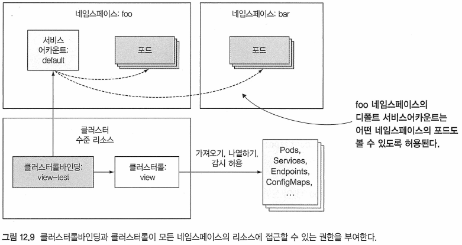

Ex) 클러스터롤바인딩 삭제후, 롤바인딩으로 대체
```
$ kubectl delete clusterrolebinding view-test
clusterrolebinding.rbac.authorization.k8s.io "view-test" deleted
$ kubectl create rolebinding view-test --clusterrole=view --serviceaccount=foo:default -n foo
rolebinding.rbac.authorization.k8s.io/view-test created
```

Ex) 롤바인딩 리스트 나열 확인
```
/ # curl localhost:8001/api/v1/namespaces/foo/pods
...
  "kind": "PodList",
  "apiVersion": "v1",
...
/ # curl localhost:8001/api/v1/pods
...
"status": "Failure",
...
/ # curl localhost:8001/api/v1/namespaces/foo/pods
...
  "status": "Failure",
...
```
* foo 네임스페이스에 포드 나열 가능
	- 모든 및 다른 네임스페이스에선 나열 불가

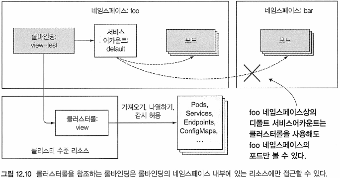

##### 롤, 클러스터를, 롤바인딩, 클러스터롤바인딩 조합 요약
* 특정 사용 사례별로 분류
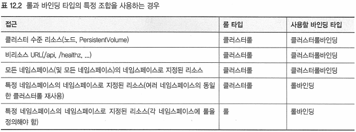
* 룰에 클러스터룰바인딩은 안됨

---
#### 12.2.5 디폴트 클러스터롤과 클러스터롤바인딩 이해
* 쿠버네티스는 API 서버가 시작될 때마다 업데이트되는 클러스터를 및 클러스터롤바인딩의 기본 세트를 제공함
Ex) 모든 클러스터롤바인딩과 클러스터롤 나열하기
```
$ kubectl get clusterrolebindings
NAME                                                   ROLE
cluster-admin                                          ClusterRole/cluster-admin
kubeadm:get-nodes                                      ClusterRole/kubeadm:get-nodes
kubeadm:kubelet-bootstrap                              ClusterRole/system:node-bootstrapper
kubeadm:node-autoapprove-bootstrap                     ClusterRole/system:certificates.k8s.io:certificatesigningreq
kubeadm:node-autoapprove-certificate-rotation          ClusterRole/system:certificates.k8s.io:certificatesigningreq
kubeadm:node-proxier                                   ClusterRole/system:node-proxier
pv-test                                                ClusterRole/pv-reader
...
system:coredns                                         ClusterRole/system:coredns
system:discovery                                       ClusterRole/system:discovery
system:kube-controller-manager                         ClusterRole/system:kube-controller-manager
system:kube-dns                                        ClusterRole/system:kube-dns
system:kube-scheduler                                  ClusterRole/system:kube-scheduler
system:node                                            ClusterRole/system:node
system:node-proxier                                    ClusterRole/system:node-proxier
system:public-info-viewer                              ClusterRole/system:public-info-viewer
system:volume-scheduler                                ClusterRole/system:volume-scheduler
weave-net                                              ClusterRole/weave-net

$ kubectl get clusterroles
NAME                                                                   CREATED AT
admin                                                                  2020-06-08T23:39:12Z
cluster-admin                                                          2020-06-08T23:39:12Z
edit                                                                   2020-06-08T23:39:12Z
kubeadm:get-nodes                                                      2020-06-08T23:39:21Z
pv-reader                                                              2020-06-16T10:20:46Z
...
system:controller:ttl-controller                                       2020-06-08T23:39:13Z
system:coredns                                                         2020-06-08T23:39:24Z
system:discovery                                                       2020-06-08T23:39:12Z
system:heapster                                                        2020-06-08T23:39:12Z
system:kube-aggregator                                                 2020-06-08T23:39:12Z
system:kube-controller-manager                                         2020-06-08T23:39:12Z
system:kube-dns                                                        2020-06-08T23:39:12Z
system:kube-scheduler                                                  2020-06-08T23:39:12Z
system:kubelet-api-admin                                               2020-06-08T23:39:12Z
system:node                                                            2020-06-08T23:39:12Z
system:node-bootstrapper                                               2020-06-08T23:39:12Z
system:node-problem-detector                                           2020-06-08T23:39:12Z
system:node-proxier                                                    2020-06-08T23:39:12Z
system:persistent-volume-provisioner                                   2020-06-08T23:39:12Z
system:public-info-viewer                                              2020-06-08T23:39:12Z
system:volume-scheduler                                                2020-06-08T23:39:12Z
view                                                                   2020-06-08T23:39:12Z
weave-net                                                              2020-06-08T23:44:42Z
```
* 가장 중요한 룰은 view, edit, admin, cluster-admin 클러스터롤임
	- 사용자 정의의 포드를 사용하는 서비스어카운트에 바운딩되기 위해 존재

##### view 클러스터롤을 통한 리소스 읽기 전용 접근 허용
* 롤, 롤바인딩, 시크릿을 제외한 네임스페이스내의 대부분 리소스를 읽기 가능
	- 시크릿에는 인증 토큰이 존재해 위험
	
##### edit 클러스터롤을 통한 리소스 수정 허용
* 네임스페이스의 리소스를 수정 가능
* 시크릿을 읽고, 수정 가능
* 롤, 롤바인딩을 보거나 수정 불가
	- 권한 상승 방지

##### admin 클러스터롤을 통한 네임스페이스 전체 통제 권한 허용
* 네임스페이스의 리소스를 완벽하게 제어히는 것은 admin 클러스터롤에서 허용
* ResourceQuotas(14장의 내용)와 네임스페이스 리소스 자체를 제외한 네임스페이스의 리소스를 읽고 수정할 수 있음
```
참고 : 권한 상승 문제를 방지하기 위해 API 서버는 사용자가 이미 해당 롤에 나열된 모든 권한(및 동일한 범위을 가지고 있는 경우에만 롤을 만들고 업데이트할 수 있다．
```

##### cIuster-admin 클러스터롤을 통한 완전한 통제 허용
* 쿠버네티스 클러스터를 완벽하게 제어하려면 cluster-admin 클러스터롤을 주체에 할당함

##### 그 밖의 디폴트 클러스터롤
* system：가 접두사로 시작하는 많은 수의 클러스터가 존재

---
#### 12.2.6 인증 권한을 현명하게 부여하기
* 기본적으로 네임스페이스의 디폴트 서비스어카운트에는 인증되지 않은 사용자의 권한 이외에는 권한 설정이 없음
	- 따라서 기본적으로 포드는 클러스터 상태를 볼 수 없음
* 업무를 수행하는데 필요한 권한만 제공(최소 권한 원칙)

##### 각 포드에 특정한 서비스어카운트 생성
* 각 포드(또는 복제본 세트)의 특정 서비스어카운트를 작성한 다음 롤비인딩을 통해 맞춤형 롤(또는 클러스터롤)과 연관시키는 것이 좋음
* 하나의 포드가 포드를 읽을 필요가 있는 반면 다른 포드도 포드를 수정해야 하는 경우, 
	- 두 개의 서비스어카운트를 작성하고 포드 스펙에서 servtceAccountName 특성을 지정해 해당 포드가 사용하게 함
	- 두 포드에 필요한 모든 권한을 네임스페이스의 디폴트 서비스어카운트에 추가하지 말 것

##### 어플리케이션 취약점 예상하기
* 침입자가 클러스터를 점유할 가능성을 줄이는 것을 목적
	- 다른 누군가가 인증 토큰을 손에 넣읗 수 있으므로, 서비스어카운트에 항상 제약을 두어야함


---
---
### 12.3 요약
* API 서버의 클라이언트에는 사용자와 포드에서 실행 중인 어플리케이션이 모두 포함됨
* 포드의 어플리케이션은 서비스어카운트와 연관돼 있음
* 사용자와 서비스어카운트는 모두 그룹과 관련돼 있음
* 기본적으로 포드는 각 네임스페이스에 자동으로 생성되는 기본 서비스어카운트에서 실행됨
* 수동으로 추가 서비스 계정을 만들고 포드와 연결할 수 있음
* 특정 포드에 제한된 시크릿 목록만 마운트할 수 있도록 서비스어카운트를 구성할 수 있음
* 서비스어카운트를 사용해 이미지 끌어오기 시크릿을 포드에 첨부할 수 있으므포 모든 포드에서 시크릿을 지정할 필요가 없음
* 롤 및 클러스터롤은 어떤 리소스에서 수행할 수 있는 작업을 정의함
* 롤바인딩 및 클러스터롤바인딩은 사용자의 롤과 클러스터롤, 그룹 및 서비스어카운트에 바인딩함
* 각 클러스터에는 기본 클러스터를 및 클러스터롤바인딩이 존재


---
## 출처
[^출처]: Kubernetes in Action-마르코 룩샤-에이콘


<!--  -->
