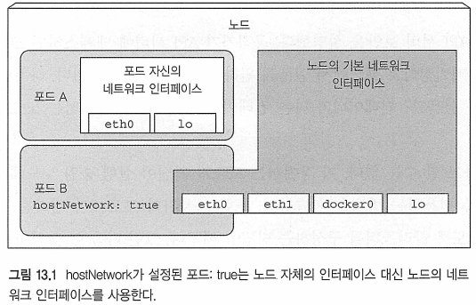

# Kubernetes in Action

---
---
## 13장 클러스터 노드와 네트워크의 보안

---
---
### 13.1 포드 내에서 호스트 노드의 네임스페이스 사용하기
* 각 포드에는 고유한 PID 네임스페이스가 존재
	- 때문에 고유한 프로세스 트리가 있으며
	- IPC 네임스페이스도 사용되므로 동일한 포드의 프로세스 사이에만 프로세스 간 통신 메커니즘(IPC)을 통해 서로 통신 가능

---
#### 13.1.1 포드에서 노드의 네트워크 네임스페이스 사용하기
* 특정 포드(일반적으로 시스템 포드)는 호스트의 기본 네임스페이스에서 동작해야 노드 레벨 리소스와 장치를 살펴보고 조작할 수 있음
	- Ex) 포드는 자체 가상 네트워크 어댑터 대신 노드의 네트워크 어댑터의 사용이 필요해 질 수 있음
	- 해당 설정은 포드 스팩의 hostNetwork 속성을 true로 설정하여 사용
	

* 포드 네트워크 인터페이스를 갖는 대신 노드의 네트워크 인터페이스를 사용함
	- 포드가 자체 IP주소를 갖지 않으며, 가동된 프로세스는 노드 포트에 바인드 될 것임

Ex) 노드의 네트워크 네임스페이스인 pod-with-host-network.yaml을 사용하는 포드
```bash
$ cat pod-with-host-network.yaml
apiVersion: v1
kind: Pod
metadata:
  name: pod-with-host-network
spec:
  hostNetwork: true
  containers:				# 호스트 노드의 네트워크 네임스페이스 사용
  - name: main
    image: alpine
    command: ["/bin/sleep", "999999"]
```
* 포드를 실행한 후 다음 명령을 사용해 실제로 호스트의 네트워크 네임스페이스를 사용하는지 확인 가능
	- 모든 호스트의 네트워크 어댑터를 볼 수 있음

Ex) 호스트의 네트워크 네임스페이스를 사용하는 포드의 네트워크 인터페이스
```bash
$ kubectl exec pod-with-host-network ifconfig
...
docker0   Link encap:Ethernet  HWaddr 02:42:ED:5C:C8:C6
          inet addr:172.17.0.1  Bcast:0.0.0.0  Mask:255.255.0.0
...
ens33     Link encap:Ethernet  HWaddr 00:0C:29:C1:98:56
          inet addr:192.168.10.153  Bcast:192.168.10.255  Mask:255.255.255.0
...
vethwe-bridge Link encap:Ethernet  HWaddr BA:3E:9A:5F:FB:AE
          inet6 addr: fe80::b83e:9aff:fe5f:fbae/64 Scope:Link
          UP BROADCAST RUNNING MULTICAST  MTU:1376  Metric:1
...
```
* 해당 포드는 hostNetwork 옵션을 사용해 노드에서 동작하는 것처럼 보임

---
#### 13.1.2 호스트 네임스페이스를 사용하지 않고 호스트 포트에 바인딩
554

---
##### 12.1.1 사용자와 그룹

---
---
### 13.5 요약
*


---
## 출처
[^출처]: Kubernetes in Action-마르코 룩샤-에이콘


<!--  -->