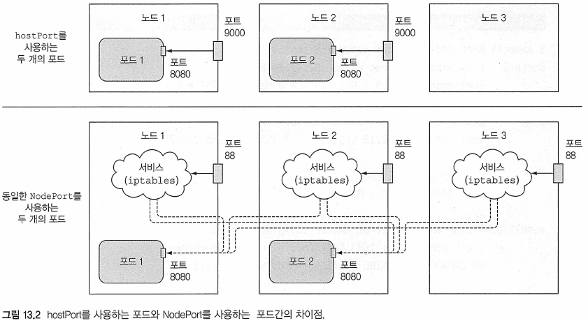
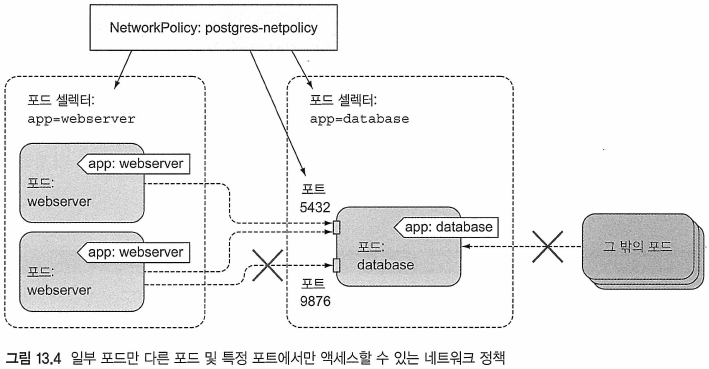
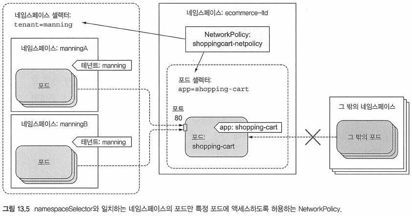

# Kubernetes in Action

---
---
## 13장 클러스터 노드와 네트워크의 보안

---
---
### 13.1 포드 내에서 호스트 노드의 네임스페이스 사용하기
* 각 포드에는 고유한 PID 네임스페이스가 존재
	- 때문에 고유한 프로세스 트리가 있으며
	- IPC 네임스페이스도 사용되므로 동일한 포드의 프로세스 사이에만 프로세스 간 통신 메커니즘(IPC)을 통해 서로 통신 가능

---
#### 13.1.1 포드에서 노드의 네트워크 네임스페이스 사용하기
* 특정 포드(일반적으로 시스템 포드)는 호스트의 기본 네임스페이스에서 동작해야 노드 레벨 리소스와 장치를 살펴보고 조작할 수 있음
	- Ex) 포드는 자체 가상 네트워크 어댑터 대신 노드의 네트워크 어댑터의 사용이 필요해 질 수 있음
	- 해당 설정은 포드 스팩의 hostNetwork 속성을 true로 설정하여 사용
	

* 포드 네트워크 인터페이스를 갖는 대신 노드의 네트워크 인터페이스를 사용함
	- 포드가 자체 IP주소를 갖지 않으며, 가동된 프로세스는 노드 포트에 바인드 될 것임

Ex) 노드의 네트워크 네임스페이스인 pod-with-host-network.yaml을 사용하는 포드
```bash
$ cat pod-with-host-network.yaml
apiVersion: v1
kind: Pod
metadata:
  name: pod-with-host-network
spec:
  hostNetwork: true
  containers:				# 호스트 노드의 네트워크 네임스페이스 사용
  - name: main
    image: alpine
    command: ["/bin/sleep", "999999"]
```
* 포드를 실행한 후 다음 명령을 사용해 실제로 호스트의 네트워크 네임스페이스를 사용하는지 확인 가능
	- 모든 호스트의 네트워크 어댑터를 볼 수 있음

Ex) 호스트의 네트워크 네임스페이스를 사용하는 포드의 네트워크 인터페이스
```bash
$ kubectl exec pod-with-host-network ifconfig
...
docker0   Link encap:Ethernet  HWaddr 02:42:ED:5C:C8:C6
          inet addr:172.17.0.1  Bcast:0.0.0.0  Mask:255.255.0.0
...
ens33     Link encap:Ethernet  HWaddr 00:0C:29:C1:98:56
          inet addr:192.168.10.153  Bcast:192.168.10.255  Mask:255.255.255.0
...
vethwe-bridge Link encap:Ethernet  HWaddr BA:3E:9A:5F:FB:AE
          inet6 addr: fe80::b83e:9aff:fe5f:fbae/64 Scope:Link
          UP BROADCAST RUNNING MULTICAST  MTU:1376  Metric:1
...
```
* 해당 포드는 hostNetwork 옵션을 사용해 노드에서 동작하는 것처럼 보임

---
#### 13.1.2 호스트 네임스페이스를 사용하지 않고 호스트 포트에 바인딩
* hostNetwork 기능을 통해 포드는 노드의 기본 네임스페이스에 있는 포트에 바인딩 가능
	- 하지만 여전히 고유한 네임스페이스를 가짐
	- spec.containers.port 필드에 정의된 컨테이너 포트 중 하나에서 hostPort 속성을 사용해 처리

* hostPort를 사용하는 포드와 NodePort 서비스의 차이 

* hostPort는 실해중인 포드로 직접 연결/전달
	- NodePort는 무작위로 선택된 포드로 연결/전달
* hostPort는 포드를 실행하는 노드만 바인딩 됨
	- 모든 노드에서 포트 바인딩함


* 두 개의 프로세스가 동일한 호스트 포트에 바인드할 수 없음
	- 스케줄러는 포드를 스케줄링할 때 이를 고려해, 동일한 노드에 여러 개의 포드를 스케줄하지 않음
	- 남는 복제본 포드는 보류 상태로 유지

Ex) 노드의 포트 공간에 있는 포트에 포드 바인딩하기(kubia-hostport.yaml)
```yaml
apiVersion: v1
kind: Pod
metadata:
  name: kubia-hostport
spec:
  containers:
  - image: luksa/kubia
    name: kubia
    ports:
    - containerPort: 8080		# 컨테이너는 포트 IP의 8080 포트에 연결됨
      hostPort: 9000			# 배포되는 노드의 9000포트에도 연결이 됨
      protocol: TCP
```
* 이 포드를 생성후에는 스케줄된 노드의 포트 9000을 통해 액세스 가능
* hostPort 기능은 데몬셋을 사용해 모든 노드로 배포하는 시스템 서비스를 노출하는데 주로 사용됨

```
참고 : 이것을 GKE에서 시도한다면, 5장에서 했던 것처럼 gcloud compute firewall-rules를 사용해 방화벽을 올바르게 구성해야 한다．
```

---
#### 13.1.3 노드의 PID와 IPC 네임스페이스 사용
* hostNetwork 옵션과 유사한 hostPlD와 hostlPC 포드 스펙 속성이 있음
	- 속성들을 true로 설정하면 포드의 컨테이너는 노드의 PID 및 IPC 네임스페이스를 사용 가능
		+ 실행 중인 프로세스가 노드의 모든 프로세스를 보거나 IPC를 통해 노드와 통신 가능

Ex) 호스트의 PID 및 IPC 네임스페이스 사용(pod-with-pid-and-ipc.yaml)
```yaml
apiVersion: v1
kind: Pod
metadata:
  name: pod-with-host-pid-and-ipc
spec:
  hostPID: true						# 호스트 PID 네임스페이스를 사용하는 포드를 원함
  hostIPC: true						# 호스트의 IPC 네임스페이스를 사용하는 포드도 원함
  containers:
  - name: main
    image: alpine
    command: ["/bin/sleep", "999999"]
```
* 포드는 일반적으로 자체 프로세스만 볼 수 있지만,
	- 이 포드를 실행하고 해당 컨테이너내에서 프로세스를 나열하면,
	- 컨테이너에서 실행 중인 프로세스뿐 아니라 호스트 노드에서 실행 중인 모든 프로세스 확인 가능

Ex) 호스트의 PID를 true로 설정한 포드에서 볼 수 있는 프로세스
```bash
$ kubectl exec pod-with-host-pid-and-ipc ps aux
kubectl exec [POD] [COMMAND] is DEPRECATED and will be removed in a future version. Use kubectl kubectl exec [POD] -- [COMMAND] instead.
PID   USER     TIME  COMMAND
    1 root      0:11 /usr/lib/systemd/systemd --switched-root --system --deserialize 22
    2 root      0:00 [kthreadd]
    3 root      0:10 [ksoftirqd/0]
    5 root      0:00 [kworker/0:0H]
    7 root      0:04 [migration/0]
    8 root      0:00 [rcu_bh]
    9 root      5:24 [rcu_sched]
...
```
* hostlPC 속성을 true로 설정하면 포드 컨테이너의 프로세스가 프로세스 간 통신을 통해 노드에서 실행 중인 다른 모든 프로세스와 통신할 수 있음

---
---
### 13.2 컨테이너 보안 컨텍스트 설정
* securityContext 속성을 통해 포드와 컨테이너에 보안 관련 기능을 설정할 수 있음	
	- 포드 스펙에 직접 지정 또는 개별 컨테이너의 스팩내에서 지정

##### 보안 컨텍스트에서 설정 가능한 것
* 컨테이너의 프로세스에서 실행할 수 있는 사용자(사용자 ID) 지정하기
* 컨테이너가 루트로 실행되는 것을 방지하기
	- (일반적으로 컨테이너가 컨테이너 이미지에서 정의된 대로 실행한다면 기본 사용자이므로 컨테이너가 루트로 실행되지 않도록 할수 있음)
* 컨테이너를 권한 모드로 실행해 노드의 커널에 대한 모든 액세스 권한을 부여하기
* 권한 모드로 실행해 컨테이너에 가능한 모든 권한을 주는 것과는 대조적으로 기능을 추가히거나 삭제해 세부적으로 권한 구성하기
* 컨테이너를 강력하게 잠그기 위해 SELinux(Security Enhanced Linux)옵션을 설정하기
* 프로세스가 컨테이너의 파일 시스템에 쓰지 못히게 하기

##### 보안 컨텍스트를 지정하지 않고 포드 실행하기
* 기본 보안 컨텍스트를 옵션을 사용해 포드를 실행
	- 사용자 정의 보안 컨텍스트가 설정된 포드의 동작 방식을 비교/확인
```
$ kubectl run pod-with-defaults --image alpine --restart Never -- /bin/sleep 999999
pod/pod-with-defaults created
```

Ex) 컨테이너가 실행 중인 사용자 및 그룹 ID와 속한 그룹 확인
```
$ kubectl exec pod-with-defaults id
kubectl exec [POD] [COMMAND] is DEPRECATED and will be removed in a future version. Use kubectl kubectl exec [POD] -- [COMMAND] instead.
uid=0(root) gid=0(root) groups=0(root),1(bin),2(daemon),3(sys),4(adm),6(disk),10(wheel),11(floppy),20(dialout),26(tape),27(video)
```
* 컨테이너는 사용자 ID(uid) 0(루트) 및 그룹 ID(gtd) 0(루트)로 실행 중
	- 또한 여러 다른 그룹의 구성원이기도 함

```
참고 : 컨테이너를 실행하는 사용자는 컨테이너 이미지에 지정된다. 도커 파일에서 이것은 USER 지시어를 사용해 수행된다. 생략햐면 컨테이너는 루트로 실행된다．
```

---
#### 13.2.1 특정 사용자로 컨테이너 실행
* 컨테이너 이미지에 내장된 ID와 사용자 ID로 포드를 실행하려면 포드의 securityContext.runAsUser 속성을 설정해야 함
Ex) 특정 사용자로 컨테이너 실행하기(pod-as-user-guest.yaml)
```yaml
apiVersion: v1
kind: Pod
metadata:
  name: pod-as-user-guest
spec:
  containers:
  - name: main
    image: alpine
    command: ["/bin/sleep", "999999"]
    securityContext:
      runAsUser: 405				# 사용자 이름이 아닌 사용자 ID를 설정함, 사용자 ID 405는 게스트 사용자를 뜻함
```
Ex) runAsUser 속성 확인
```bash
kubectl exec pod-as-user-guest -- id
uid=405(guest) gid=100(users)
```
* 컨테이너가 게스트 사용자로 실행 중임을 확인

---
#### 13.2.2 컨테이너가 루트로 실행하는 것을 방지하기
* 컨테이너 공격 시나리오
	- 컨테이너를 데몬 사용자로 실행하도록 도커 파일에 USER 데몬 지시문을 사용해 빌드된 컨테이너 이미지를 배포한 포드를 가정
	- 공격자가 이미지 레지스트리에 액세스하여 동일한 태그 아래 다른 이미지를 푸시
	- 공격자의 이미지는 루트 사용자로 실행되도록 설정
	- 쿠버네티스가 포드의 새로운 인스턴스를 스케줄할 때
    - Kubelet은 공격자의 이미지를 다운로드하고, 그들이 삽입한 코드를 실행
* 공격 시나리오를 방지하려면 포드의 컨테이너를 루트가 아닌 사용자로 실행하라고 지정
Ex) 컨테이너가 루트로 실행되는 것을 방지하기(pod-run-as-non-root.yaml)
```yaml
apiVersion: v1
kind: Pod
metadata:
  name: pod-run-as-non-root
spec:
  containers:
  - name: main
    image: alpine
    command: ["/bin/sleep", "999999"]
    securityContext:
      runAsNonRoot: true			# 이 컨테이너는 루트로 사용자로 실행하는 것을 허용하지 않음
```
* 이 포드를 배포하면 스케줄되더라고 실행할 수 없음

Ex) 컨테이너가 루트로 실행되는 것을 방지하기(pod-run-as-non-root.yaml)
```yaml
apiVersion: v1
kind: Pod
metadata:
  name: pod-run-as-non-root
spec:
  containers:
  - name: main
    image: alpine
    command: ["/bin/sleep", "999999"]
    securityContext:
      runAsNonRoot: true			# 이 컨테이너는 루트로 사용자로 실행하는 것을 허용하지 않음
```

Ex) 컨테이너 확인(pod-run-as-non-root.yaml)
```bash
$ kubectl get po pod-run-as-non-root                                     
NAME                  READY   STATUS                       RESTARTS   AGE
pod-run-as-non-root   0/1     CreateContainerConfigError   0          24s

$ kubectl get po pod-run-as-non-root -o yaml
...
    state:
      waiting:
        message: container has runAsNonRoot and image will run as root
        reason: CreateContainerConfigError
...
```
* 컨테이너 이미지를 누군가 조작한다 해도 공격이 통하지 않음

---
#### 13.2.3 권한 모드에서 포드 실행
* 노드의 커널에 대한 모든 액세스 권한을 얻기 위해 포드의 컨테이너는 권한 모드로 실행함
	- 컨테이너의 securityContext 속성에 있는 privileged 속성을 true로 설정하면 됨
	- Ex) 'kube-proxy 포드' 

Ex) 권한 있는 컨테이너에 속한 포드(pod-run-as-non-root.yaml)
```yaml
apiVersion: v1
kind: Pod
metadata:
  name: pod-privileged
spec:
  containers:
  - name: main
    image: alpine
    command: ["/bin/sleep", "999999"]
    securityContext:
      privileged: true 				# 이 컨테이너는 권한 모드로 실행될 것임
```

Ex) 권한이 없는 포드에서 사용 가능한 장치 목록
```bash
$ kubectl exec -it pod-with-defaults -- ls /dev
core             null             shm              termination-log
fd               ptmx             stderr           tty
full             pts              stdin            urandom
mqueue           random           stdout           zero
```

Ex) 권한 포드에서 사용 가능한 장치 목록
```bash
$ kubectl exec -it pod-privileged -- ls /dev
agpgart             stdout              tty5
autofs              termination-log     tty50
bsg                 tty                 tty51
btrfs-control       tty0                tty52
core                tty1                tty53
cpu                 tty10               tty54
cpu_dma_latency     tty11               tty55
crash               tty12               tty56
dm-0                tty13               tty57
...
```
* 권한을 얻은 컨테이너는 호스트 노드의 모든 장치를 볼 수 있음
	- 즉, 모든 장치를 자유롭게 사용 사능
* Ex) 라즈베리 파이에서 이에 부착된 LED를 제어할 수 있는 포드를 원할 때 이와 같은 권한 모드를 사용함

---
#### 13.2.4 컨테이너에 개별 커널 기능 추가
* 실제로 필요한 커널 기능에만 액세스 권한을 별도로 부여하는 것이 보안 관점에서 안전

Ex) 시간 변경
```bash
$ kubectl exec -it pod-with-defaults2 -- date +%T -s "12:00:00"                            [13:19:05]
date: can't set date: Operation not permitted
12:00:00
```
* 컨테이너가 시스템 시간(하드웨어 시계의 시간)을 변경하는 것은 일반적으로 허용되지 않음

Ex) CAP_SYS_TIME 기능 추가(pod-add-settime-capability.yaml)
```yaml
apiVersion: v1
kind: Pod
metadata:
  name: pod-add-settime-capability
spec:
  containers:
  - name: main
    image: alpine
    command: ["/bin/sleep", "999999"]
    securityContext:					# 기능은 securityContext 속성 아래에 추가하거나 삭제할 수 있음
      capabilities:
        add:							# SYS_TIME 기능을 추가
        - SYS_TIME
```
* CAP_SYS_TIME이라는 기능을 추가해 시스템 시간을 변경할 수 있음
```
참고 : 리눅스 커널 기능에는 일반적으로 CAP- 접두어가 붙는다. 그러나 포드 스펙에서 지정할 때 접두어를 생략해야 한다．
```
Ex) 시스템 시간 변경 확인(pod-add-settime-capability.yaml)
```bash
$ kubectl exec -it pod-add-settime-capability -- date +%T -s "12:00:00"                    
12:00:00

$ kubectl exec -it pod-add-settime-capability -- date                                     
Tue Jun 23 12:00:09 UTC 2020

$ ssh 192.168.10.157 date                                                                 
2020. 06. 23. (화) 21:04:42 KST
```
* 개별 기능을 추가하는 것이, pribileged: true로 모든 권한늘 부여하는 것보다 훨씬 좋은 방법임 
* UTC 12시는 KST 20시임

```
경고 : 이 작업을 직접해보면 워커노드를 사용할 수 없게 될 수 있다. 미니큐브에서는 시스템 시간이 NTP(Network Time Protocol) 
데몬에 의해 자동으로 다시 설정됐지만 새 포드를 스케줄하기 위해 VM을 다시 부팅했었다．
```
```
팁 : 리눅스 man 페이지에서 리눅스 커널 기능 목록을 찾을 수 있다．
```

---
#### 13.2.5 컨테이너에서 기능 제거
* 컨테이너에서 사용할수 있는 기본 기능을 제거할 수 있음
	- Ex) 프로세스가 파일 시스템의 파일 소유권을 변겨할 수 있는 CAP_CHOWN 기능

Ex) pod-with-defaults 포드에서 /tmp 디렉터리 소유권 변경
```bash
$ kubectl exec pod-with-defaults -- chown guest /tmp                                       

$ kubectl exec pod-with-defaults -- ls -la / | grep tmp                                    
drwxrwxrwt    1 guest    root             6 May 29 14:20 tmp
```

Ex) 컨테이너에서 기능 삭제(pod-drop-chown-capability.yaml)
```bash
apiVersion: v1
kind: Pod
metadata:
  name: pod-drop-chown-capability
spec:
  containers:
  - name: main
    image: alpine
    command: ["/bin/sleep", "999999"]
    securityContext:
      capabilities:
        drop:						# 이 컨테이너가 파일의 소유권을 변경하지 못하도록 함
        - CHOWN
```
* securityContext.Capabilities.drop 속성 아래에 있는 기능을 제거해야, 소유자 변경 못함

Ex) 기능 삭제 확인(pod-drop-chown-capability.yaml) 
```bash
$ kubectl exec pod-drop-chown-capability -- chown guest /tmp
chown: /tmp: Operation not permitte
```

---
#### 13.2.6 프로세스가 컨테이너의 파일 시스템에 쓰는 것 방지
* 컨테이너 공격 시나리오
	- 파일 시스템에 쓰기를 가능하게 하는 숨겨진 취약점을 가진 PHP 어플리케이션이 실행중임
	- PHP 파일은 빌드할 때 컨테이너 이미지에 추가되며 컨테이너의 파일 시스템에서 제공됨
	- 취약점을 통해 공격자는 이런 파일을 수정해 악의적인 코드를 삽입
* 위의 상황으로 컨테이너의 파일 시스템에 쓰지 못하게 하고 마운트된 볼륨에만 쓰기가 허용되도록 원할 수 있음
	- 컨테이너의 securityContext.readOn1yRootFilesystem 속성을 true로 설정해 방어
	
Ex) 읽기 전용 파일 시스템을 가진 컨테이너(pod-with-readonly-filesystem.yaml) 
```yaml
apiVersion: v1
kind: Pod
metadata:
  name: pod-with-readonly-filesystem
spec:
  containers:
  - name: main
    image: alpine
    command: ["/bin/sleep", "999999"]
    securityContext:					
      readOnlyRootFilesystem: true		# 이 컨테이너의 파일 시스템은 쓰여질 수 없음
    volumeMounts:
    - name: my-volume
      mountPath: /volume				# 그러나 /volume으로 쓰는 것은 허용됨, 볼륨이 그곳에 마운트되기 때문
      readOnly: false		
  volumes:
  - name: my-volume
    emptyDir:
```	

Ex) 쓰기 권한 확인(pod-with-readonly-filesystem.yaml) 
```yaml
$ kubectl exec pod-with-readonly-filesystem -- touch /new-file
touch: /new-file: Read-only file system

$ kubectl exec -it pod-with-readonly-filesystem -- touch /volume/newfile
$ kubectl exec -it pod-with-readonly-filesystem -- ls -la /volume/newfile
-rw-r--r--    1 root     root             0 Jun 23 07:22 /volume/newfile
```
* 컨테이너는 루트로 실행되고 '/' 디렉터리에 대한 쓰기 권한이 있지만 파일을 쓰려고 할 때 실패함
* 반면에 마운트된 볼륨에는 쓰기가 허용됨
```
팁 : 프로덕션 환경에서 포드를 실행할 때 보안을 강화하려면 컨테이너의 readOnlyRootFilesystem 속성을 true로 설정한다，
```

##### 포드 수준의 보안 컨텍스트 옵션 설정
* 위의 예제에서 개별 컨테이너마다 보안 컨텍스트를 설정함
	- 몇몇은 포드 수준에서 설정 가능(pod.spec.securityContext)
	- 이 옵션들은 모든 포드의 컨테이너에서 기본 값으로 사용되지만, 컨테이너 수준에서 재정의 가능
* 포드 수준 보안 컨텍스트를 사용하면 추가 속성을 설정 가능


---
#### 13.2.7 컨테이너가 다른 사용자로 실행될 때 볼륨 공유
* 6장에서 하나의 컨테이너에 파일을 쓰고 다른 컨테이너에서 파일을 읽는 데 아무런 문제가 없었음
	- 두 컨테이너가 루트 사용자로 실행돼 볼륨의 모든 파일에 모든 액세스 권한을 부여하기 때문에 가능했음
	- runAsUser 옵션을 사용해, 두 명의 사용자로 2개의 컨테이너를 실행시, 
		+ 두 컨테이너가 볼륨을 사용해 파일을 공유하면 서로 파일을 읽거나 쓰지 못할 수도 있음
* suppiementaiGroups 속성을 지정해 실행 중인 사용자 ID와 상관없이 파일을 공유할 수 있게 할 수 있음
* 아래의 2가지 속성을 사용해 수행함
	- fsGroup
	- supplementalGroups

Ex) fsGroup & supplementalGroups(pod-with-shared-volume-fsgroup.yaml) 
```yaml
apiVersion: v1
kind: Pod
metadata:
  name: pod-with-shared-volume-fsgroup
spec:
  securityContext:						# fsGroup과 supplementalGroups는 포드 수준에서 보안 컨텍스트에 정의되어 있음
    fsGroup: 555
    supplementalGroups: [666, 777]
  containers:
  - name: first
    image: alpine
    command: ["/bin/sleep", "999999"]
    securityContext:					# 첫번째 컨테이너는 사용자 ID 1111로 실행됨
      runAsUser: 1111
    volumeMounts:
    - name: shared-volume				# 두 컨테이너 모두 동일한 볼륨읗 사용함
      mountPath: /volume
      readOnly: false
  - name: second
    image: alpine
    command: ["/bin/sleep", "999999"]
    securityContext:					# 두번째 컨테이너는 사용자 ID 2222로 실행됨
      runAsUser: 2222
    volumeMounts:
    - name: shared-volume				# 두 컨테이너 모두 동일한 볼륨읗 사용함
      mountPath: /volume
      readOnly: false
  volumes:
  - name: shared-volume
    emptyDir:
```

Ex) first 컨테이너 id 및 volume 확인(pod-with-shared-volume-fsgroup.yaml) 
```sh
$ kubectl exec -it pod-with-shared-volume-fsgroup -c first -- sh
/ $ id
uid=1111 gid=0(root) groups=555,666,777
/ $ ls -l / | grep volume
drwxrwsrwx    2 root     555              6 Jun 23 15:36 volume
```
* 컨테이너가 사용자 id 1111 확인 가능
* 유효 그룹 ID는 0(루트)이지만 그룹 ID 555, 666, 777도 사용자와 연관됨
* 포드 정의에서 fsGroup을 555로 설정했기 때문에, 마운트된 볼륨은 그룹 ID 555에 소유됨

Ex) 파일 쓰기 확인
```sh
/ $ echo foo > /volume/foo
/ $ ls -l /volume
total 4
-rw-r--r--    1 1111     555              4 Jun 23 15:47 foo

/ $ ls -l /tmp
total 4
-rw-r--r--    1 1111     root             4 Jun 23 15:49 foo
```
* volume 디렉터리에 생성한 파일은 사용자 ID 1111 및 그룹 ID 555에 소유자로 생성됨
* 일반적으로 사용자의 유효한 그룹 ID는 사용자가 파일을 만들 때 사용됨
	- fsGroup 보안 컨텍스트 속성은 프로세스가 볼륨에 파일을 만들 때 사용되만, 볼륨 플러그인에 따라 다를 수 있음
* supplementalGroups 속성은 사용자와 연관된 추가 그룹 ID 목록을 정의함

---
---
### 13.3 포드의 보안 관련 기능 사용 제한하기
* 컨테이너 보안 컨텍스트를 사용해, 포드 및 컨테이너 실행에 제한 및 확장(노드 권한 확보)이 가능하였음
* 클러스터 관리자는 하나 이상의 PodSecurityPolicy 리소스를 작성해,
	- 위에 설명된 보안 관련 기능의 사용을 제한할 수 있음
	
---
#### 13.3.1 PodSecurityPolicy 리소스의 소개
* 사용자가 포드에서 사용할 수 있거나 사용할 수 없는 보안 관련 기능이 무엇인지 정의하는 클러스터 수준(비네임스페이스) 리소스
* PodSecurityPolicy 리소스에 구성된 정책을 유지하는 작업은 
	- API 서버에서 실행하는 PodSecurityPolicy 승인제어 플러그인(admission control plugin)에 의해 수행됨
* 누군가가 API 서버로 포드 리소스를 게시하면,
	- PodSecurityPolicy 승인 제어 플러그인은 구성된 PodSecurityPolicies를 기반해,
	- 포드 정의의 유효성을 검사함
		+ 포드가 클러스터의 정책을 준수하면 받아 들여지고 etcd에 저장됨
		+ 정책에 준수하지 않으면 즉시 거부됨
* 플러그인은 정책에 구성된 기본 값을 바탕으로 포드 리소스를 수정할 수 있음

```
참고 : 클러스터에서 PodSecurityPolicy 승인 제어 플러그인이 활성화가 안 됐을 수 있다. 다음 예제를 
실행하기 전에 활성화돼 있는지 확인하자. 미니큐브를 사용한다면 아래 'RabbitMQ와 원자 트랜잭션'을 참고하자．
```
```
- RabbitMQ와 원자 트랜잭션
미니큐브에서 RBAC 및 PodSecurityPolicy 허용 제어(admission control)활성화하기

이 예제는 미니큐브 버전 v0.19.0을 사용해 실행한다. 이 버전에서는 예제의 일부에서 필요한
PodSecurityPolicy 승인 제어 플러그인 또는 RBAC 인증을 사용할 수 없다. 한 가지 예제에서는 다른
사용자로 인증해야 하기 때문에 사용자가 파일에 정의된 기본 인증 플러그인을 활성화해야 한다.

이런 모든 플러그인을 활성화한 상태에서 미니큐브를 실행하려면 사용 중인 버전에 따라 다음 명령을
사용해야 한다.

$ minikube start --extra-config apiserver.Authentication.PasswordFile.BasicAuthFile=/etc/kubernetes/passwd \
--extra-config=apiserver.Authorization.Mode=RBAC \
--extra-config=apiserver.GenericServerRunOptions.AdmissionControl=NamespaceLifecycle,LimitRanger,Service,Account,PersistentVolumeLabe1,DefaultStorageC1ass,ResourceQuota,DefaultTo1erationSeconds,PodSecurityPolicy

명령행 옵션에서 지정한 패스워드 파일을 쟉성하기 전까지 API 서버가 시작되지 않는다．다음은 패스
워드 파일을 만드는 방법이다．

$ cat <<EOF | minikube ssh sudo tee /etc/kubernetes/passwd
password,alice,1000,basic-user
password,bob,2000,privileged-user
EOF

이 책의 코드 아카이브에서 Chapter13/minikube-with-rbac-and-psp-enabled.sh의 두 명령을
실행하는 셸 스크립트를 찾을 수 있다，
```

###### PodSecurityPolicy 활성화 참고
* https://kubernetes.io/ko/docs/concepts/policy/pod-security-policy/
	- PodSecurityPolicy를 특정 사용자 또는 그룹에 사용하기 위해선 클러스터롤과 클러스터롤바인딩 구성이 필요
	- __클러스터롤과 클러스터롤바인딩을 설정하지 않을 경우, 상반된 PodSecurityPolicy 정책은 '허용'하는 쪽으로 작동하는 것으보 보임__
Ex) PodSecurityPolicy 승인 제어 플러그인(admission control plugin) 활성화
```bash
$ cat /etc/kubernetes/manifests/kube-apiserver.yaml
apiVersion: v1
kind: Pod
...
spec:
  containers:
  - command:
    - kube-apiserver
    - --advertise-address=192.168.10.200
    - --allow-privileged=true
    - --authorization-mode=Node,RBAC
    - --client-ca-file=/etc/kubernetes/pki/ca.crt
    - --enable-admission-plugins=NodeRestriction,PodSecurityPolicy		# PodSecurityPolicy를 추가하여 활성화
	...
```


##### PodSecurityPolicy가 할 수 있는 일
* 포드가 호스트의 IPC, PID 또는 네트워크 네임스페이스를 사용할 수 있는지 여부
* 포드가 바인딩할 수 있는 호스트 포트의 지정
* 컨테이너가 실행할 수 있는 사용자 ID의 설정
* 특권 컨테이너 내에 포드를 생성할 수 있는지 여부
* 기본적으로 추가돼야 하고 항상 제거돼야 할 커널 기능의 설정
* 컨테이너가 사용할 수 있는 SELinux 레이블
* 컨테이너가 쓰기 가능한 루트 파일 시스템을 사용할 수 있는지 여부
* 컨테이너가 실행할 수 있는 파일 시스템 그룹
* 포드가 사용할 수 있는 볼륨 유형

##### 샘플 PodSecurityPolicy 살펴보기
* 포드가 호스트의 IPC, PID 및 네트워크 네임스페이스를 사용하지 못히도록 하는 샘플 사용
* 특권 컨테이너 및 대부분의 호스트 포트의 사용 제한
* 컨테이너가 실행할 수 있는 사용자, 그룹 또는 SELinux 그룹에 제약을 설정하지 않음

Ex) 샘플 PodSecurityPolicy(pod-security-policy.yaml)
```yaml
apiVersion: policy/v1beta1			# 버전업 되면서 extensions -> policy 로 변경됨
kind: PodSecurityPolicy
metadata:
  name: default
spec:
  hostIPC: false			# 컨테이너는 호스트의 IPC, PID, 네트워크 네임스페이스를 사용하지 못하도록 함
  hostPID: false			#
  hostNetwork: false		#
  hostPorts:
  - min: 10000				# 컨테이너는 10000~11000이나 13000~14000 범위의 호스트 포트에만 바인드할 수 있음
    max: 11000				#
  - min: 13000				#
    max: 14000				#
  privileged: false				# 컨테이너는 특권(권한) 모드에서 실행할 수 없음
  readOnlyRootFilesystem: true	# 컨테이너는 읽기 전용 루트 파일 시스템에서만 실행돼야 함
  runAsUser:				# 컨테이너는 어떤 유저나 그룹이든 실행할 수 있음
    rule: RunAsAny			#
  fsGroup:					#
    rule: RunAsAny			#
  supplementalGroups:		#
    rule: RunAsAny			#
  seLinux:						# 원한다면 어떤 SELinux 그룹을 이용할 수 있음
    rule: RunAsAny				#
  volumes:					# 모든 볼륨의 유형이 포드에서 사용될 수 있음
  - '*'						#
```
* PodSecurityPolicy 리소스가 클러스터에 게시되면 API 서버는 더 이상 이전에 사용된 특권 포드를 배포할 수 없게 될 것임

Ex) 작동 확인(pod-security-policy.yaml)
```bash
kubectl create -f pod-privileged.yaml
Error from server (Forbidden): error when creating "pod-privileged.yaml": pods "pod-privileged" is forbidden: unable to validate against any pod security policy: [spec.containers[0].securityContext.privileged: Invalid value: true: Privileged containers are not allowed]
```
* 마찬가지로 호스트의 PID, IPC 또는 네트워크 네임스페이스를 사용하려는 포드를 더 이상 배포할 수 없음
* 또한 정책에서 readOnlyRootFilesystem을 true로 설정하기 때문에 모든 포드의 컨테이너 파일 시스템은 읽기 전용
	- 컨테이너는 볼륨에만 쓸 수 있음
	
---
#### 13.3.2 runAsUser, fsGroup, supplementaiGroups 정책
* runAsUser, fsGroup, supplementaiGroups 필드에 RunAsAny 규칙을 사용했기에 컨테이너 실행에 제한이 없음
* 규칙을 MustRunAs로 변경하면 허용된 ID 범위를 지정 가능

###### MustRunAs 규칙 사용
* PodSecurityPolicy 리소스를 사용
	- 사용자 ID 2로만 실행하고 기본 파일 시스템 그룹 및 보조 그룹 ID를 2-10 또는 20-30으로 제한

Ex) 컨테이너가 실행할 수 있는 ID들을 설정하기(psp-must-run-as.yaml)
```yaml
apiVersion: extensions/v1beta1
kind: PodSecurityPolicy
metadata:
  name: default
spec:
  hostIPC: false
  hostPID: false
  hostNetwork: false
  hostPorts:
  - min: 10000
    max: 11000
  - min: 13000
    max: 14000
  privileged: false
  readOnlyRootFilesystem: true
  runAsUser:
    rule: MustRunAs
    ranges:
    - min: 2				# 하나의 ID만 지정하도록 min과 max를 동일하게 설정한 하나의 범위를 추가함
      max: 2				#
  fsGroup:
    rule: MustRunAs
    ranges:
    - min: 2					# 다수의 범위도 설정할 수 있음
      max: 10					# 여기서 그룹 ID가 2-10과 20-30을 포함해 설정하고 있음
    - min: 20					#
      max: 30					#
  supplementalGroups:
    rule: MustRunAs
    ranges:
    - min: 2					#
      max: 10					#
    - min: 20					#
      max: 30					#
  seLinux:
    rule: RunAsAny
  volumes:
  - '*'
```
* 포드 스펙(spec)이 해당 입력란 중 하나를 이 범위를 벗어나는 값으로 설정하려고 하면 API 서버에서 포드를 승인하지 않을 것임
	- 이전 PodSecurityPolic를 삭제하고 위의 코드로 새로운 PodSecurityPolic를 많듬
```
참고 : PodSecurityPolicies는 포드를 생성하거나 업데이트할 때만 반영되기 때문에 정책을 변경해도
기존 포드에는 아무런 영향을 미치지 않는다，
```

##### 정책의 범위를 벗어나는 runAsUser 포드 배포
Ex) 컨테이너 사용자 ID 405로 실행 확인
```
kubectl create -f pod-as-user-guest.yaml
Error from server (Forbidden): error when creating "pod-as-user-guest.yaml": pods "pod-as-user-guest" is forbidden: unable to validate against any pod security policy: [spec.containers[0].securityContext.runAsUser: Invalid value: 405: must be in the ranges: [{2 2}]]
```
* API 서버는 포드의 실행을 거부

##### 범위를 벗어난 사용자 ID로 설정된 컨테이너 이미지가 있는 포드를 배포
Ex) USER 지시문을 갖는 도커 파일(kubia-run-as-user-5/Dockerfile)
```
FROM node:7
ADD app.js /app.js
USER 5
ENTRYPOINT ["node", "app.js"]
```
* runAsUser 속성을 설정하지 않고 포드를 배포하면 사용자 ID가 컨테이너 이미지에 설정됨
	- 도커 파일의 USER 지시문 사용

Ex) 이미지 배포/실행 및 사용자 ID 확인
```bash
$ kubectl run run-as-5 --image luksa/kubia-run-as-user-5 --restart Never
pod/run-as-5 created

$ kubectl exec run-as-5 -- id
uid=2(bin) gid=2(bin) groups=2(bin)
```
* 컨테이너는 PodSecurityPolicy에서 지정한 ID인 사용자 ID 2로 실행됨 
* 하드코딩된 사용자 ID를 PodSecurityPolicy에 지정한 ID로 오버라이드하는 데 사용할 수 있음

##### runAsUser 필드에서 MustRunAsNonRoot 사용
* runAsUser 필드의 경우 MustRunAsNonRoot라는 추가 규칙을 사용할 수 있음
	- 사용자가 루트로 실행하는 컨테이너를 배포할 수 없음
	- 컨테이너의 스펙은 runAsUser 필드를 지정해야 하며, 이 필드는 '0'이 될 수 없음(루트 사용자 ID: 0)
	- 컨테이너 이미지는 자체는 '0'이 아닌 사용자 ID로 실행돼야 함
	- Ex)
	```
	  runAsUser:
		# 루트 권한없이 컨테이너를 실행해야 한다.
        rule: 'MustRunAsNonRoot'
	```

---
#### 13.3.3 허용, 기본 값, 허용하지 않음 설정
* 컨테이너는 권한(특권) 모드로 실행될 수도 있고, 그렇지 않을 수도 있음
* 각 컨테이너에 리눅스 커널 기능을 추가하거나 삭제해, 좀 더 세부적인 권한 구성을 정의할 수 있음
* 컨테이너의 기능에 영향을 주는 세 가지 필드
	- allowedCapabilities
	- defaultAddCapabilities
	- requiredDropCapabflittes

Ex) PodSecurityPolicy에 기능(capabilities) 설정하기(psp-capabilities.yaml)
```yaml
apiVersion: policy/v1beta1
kind: PodSecurityPolicy
metadata:
  name: default
spec:
  allowedCapabilities:		# 컨테이너가 SYS_TIME 기능을 사용하는 것을 허용함
  - SYS_TIME
  defaultAddCapabilities:	# 모든 컨테이너에 자동으로 CHOWN 기능을 추가함
  - CHOWN
  requiredDropCapabilities:	# SYS_ADMIN과 SYS_MODULE 기능을 제거할 것을 컨테이너에게 요구함
  - SYS_ADMIN
  - SYS_MODULE
...
```	
```
참고 : SYS_ADMIN 기능은 다양한 관리 작업을 허용하고 SYS_MODULE 기능은 리눅스 커널 모듈의 로드 및 언로드를 허용한다，
```	

##### 컨테이너에 추가할 수 있는 기능 지정
* allowedCapabilities 필드는 컨테이너 작성자가 컨테이너 스펙의 securityContext.capabilities 필드에 추가할 수 있는 기능을 지정하는 데 사용됨
	- PodSecurityPolicy 승인 제어 플러그인이 활성화된 경우, PodSecurityPolicy에 지정되지 않은 한 기능을 추가할 수 없음

##### 모든 컨테이너에 기능 추가
* defaultAddCapabilities 필드 아래에 나열된 모든 기능은 배포된 모든 포드의 컨테이너에 추가됨
	- 사용자가 특정 컨테이너에 이런 기능을 갖기를 원하지 않으면 명시적으로 해당 컨테이너의 스펙에 기능 제거 설정을 해야 함

##### 컨네이너에서 기능 사용 못하게 하기
* requiredDropCapabilities 필드에 나열된 기능은 모든 컨테이너에서 자동으로 삭제됨
	- 사용자가 정책의 requiredDropCapabilities 필드에 나열된 기능 중 하나를 명시적으로 추가하는 포드를 생성하려고 한다면 포드의 실행은 거부됨

Ex) 기능 확인
```bash
$ kubectl create -f pod-add-sysadmin-capability.yaml
Error from server (Forbidden): error when creating "pod-add-sysadmin-capability.yaml": pods "pod-add-sysadmin-capability" is forbidden: unable to validate against any pod security policy: [spec.containers[0].securityContext.capabilities.add: Invalid value: "SYS_ADMIN": capability may not be added]
```
* allowedCapabilities에 설정되지 않음 기능을 사용하려고해도 포드의 실행은 거부됨

---
#### 13.3.4 포드가 사용할 수 있는 볼륨의 유형 제한
* PodSecurityPolicy 리소스는 사용자가 포드에 추가할 수 있는 볼륨 유형을 정의를 할 수 있음

Ex) PSP 스니펫은 오직 특정 유형의 볼륨만 허용함(psp-volumes.yaml)
```yaml
apiVersion: policy/v1beta1
kind: PodSecurityPolicy
metadata:
  name: default
spec:
  runAsUser:
    rule: RunAsAny
  fsGroup:
    rule: RunAsAny
  supplementalGroups:
    rule: RunAsAny
  seLinux:
    rule: RunAsAny
  volumes:
  - emptyDir
  - configMap
  - secret
  - downwardAPI
  - persistentVolumeClaim
```
* __PodSecurityPolicy는 최소한 emptyDir, configMap, secret, downwardAPl, persistentVolumeClaim 볼륨을 허용해야 함__
* 여러 PodSecurityPolicy 리소스가 있는 경우 포드는 모든 정책에 정의된 모든 볼륨 유형을 사용할 수 있음(모든 볼륨 목록의 통합이 사용됨)

---
#### 13.3.5 다른 사용자 및 그룹에 다른 PodSecurityPolicies 할당
* PodSecurityPolicy는 클러스터 수준의 리소스이므로 특정 네임스페이스에 저장하거나 적용할 수 없음
	- __클러스터롤과 클러스터롤바인딩을 설정하지 않을 경우, 상반된 PodSecurityPolicy 정책은 '허용'하는 쪽으로 작동하는 것으보 보임__
* 다른 사용자에게 다른 정책을 할당하려면, RBAC 메커니즘을 사용해야 함
	- 필요한 만큼 정책들을 생성하고 클러스터를 리소스를 만들어, 이름별로 개별 정책을 지정해 개별 사용자 또는 그룹에 정책을 할당할 수 있도록 함
* 실습 시나리오
	- 클러스터를 사용하는 앨리스와 밥이라는 2명의 사용자 추가
	- 앨리스는 제한된(권한이 없는) 포드만 배포 가능 (디폴트 PodSecurityPolicy만 사용하도록 설정)
	- 밥은 특권 포드도 배포할 수 있도록 허용 ( 두가지 PodSecurityPolicy 사용할 수 있도록 설정)


##### 특권 컨테이너를 배포할 수 있는 PodSecurityPolicy 생성하기
* 권한이 있는 사용자가 특권 컨테이너로 포드를 만들 수 있게 해주는 특별한 PodSecurityPolicy 정의(생성)

Ex) 특권 사용자를 위한 PodSecuriyPolicy(psp-privileged.yaml)
```yaml
apiVersion: policy/v1beta1
kind: PodSecurityPolicy
metadata:
  name: privileged		# 이 정책의 이름은 privileged임
spec:
  privileged: true		# 특권 컨테이너 실행을 허용함
  runAsUser:
    rule: RunAsAny
  fsGroup:
    rule: RunAsAny
  supplementalGroups:
    rule: RunAsAny
  seLinux:
    rule: RunAsAny
  volumes:
  - '*'
```

Ex) PodSecurityPolicy 확인
```bash
$ kubectl get psp
NAME         PRIV    CAPS       SELINUX    RUNASUSER   FSGROUP    SUPGROUP   READONLYROOTFS   VOLUMES
default      false   SYS_TIME   RunAsAny   RunAsAny    RunAsAny   RunAsAny   true             *
privileged   true               RunAsAny   RunAsAny    RunAsAny   RunAsAny   false            *
```
* psp-privileged.yaml를 실행시켜, PodSecurityPolicy 목록 확인
	- 클러스터에 API 서버에 포스트된 2개의 정책 확인

##### 여러 사용자에게 다른 PodSecurityPolicey 할당하기 위해 RBAC 사용
* 두 개의 클러스터롤을 만들고 각각 하나의 정책을 사용할 수 있도록 함

Ex) clusterrole 생성(psp-default)
```bash
$ kubectl create clusterrole psp-deault --verb=use --resource=podsecuritypolicies --resource-name=default
clusterrole.rbac.authorization.k8s.io/psp-deault created
```
```
참고 : get, list, watch 또는 이와 유사한 use라는 특별한 동사 구문을 사용하고 있다，
```

Ex) clusterrole 생성(psp-prtvtleged)
```bash
$ kubectl create clusterrole psp-privileged --verb=use --resource=podsecuritypolicies --resource-name=pribileged
clusterrole.rbac.authorization.k8s.io/psp-privileged created
```

Ex) clusterrolebinding(authenticated)
```bash
$ kubectl create clusterrolebinding psp-all-users --clusterrole=psp-default --group=system:authenticated
clusterrolebinding.rbac.authorization.k8s.io/psp-all-users createdd
```
* 앨리스뿐만 아니라 모든 인증된 사용자에게 psp-default 클러스터롤을 바인드
	- 승인 제어 플러그인이 아무 정책도 없으면, 아무도 포드를 생성할 수 없음

Ex) clusterrolebinding(bob)
```bash
$ kubectl create clusterrolebinding psp-bob --clusterrole=psp-privileged --user=bob
clusterrolebinding.rbac.authorization.k8s.io/psp-bob created
```
* psp-prtvtleged된 클러스터롤만 밥에 바인딩
* 인증된 사용자인 앨리스는 이제 디폴트 PodSecurityPolicy에 접근할 수 있어야 함
* 밥은 default PodSecurityPolicies와 previledged PodSecurityPolicies에 모두 접근할 수 있어야 함
	- 앨리스는 특권 포드를 만들 수 없지만 밥은 만들 수 있어야 함
	
##### kubecti을 위한 추가 사용자 생성
* 책의 부록 A에서는 kubectl을 여러 클러스터와 함께 사용할 수 있는 방법과 여러컨텍스트를 사용하는 방법을 설명함
	- 컨텍스트에는 클러스터와 통신하는 데 사용되는 사용자 자격증명이 포함함

Ex) 2명의 사용자 추가
```bash
$ kubectl config set-credentials alice --username=alice --password=password
User "alice" set.
$ kubectl config set-credentials bob --username=bob --password=password
User "bob" set.
```
* 사용자 이름과 함호 자격증명을 설정, 기본 HTTP 인증을 사용함
	- 다른 인증 방법으로는 토큰, 클라이언트 인증서 등이 있음

###### API 서버 Basic Auth 설정
참고 : https://coffeewhale.com/kubernetes/authentication/http-auth/2020/05/03/auth02/
참고 : https://kubernetes.io/docs/reference/access-authn-authz/authentication/
```bash
$ echo "password,alice,alice,system:authenticated" > /etc/kubernetes/pki/basic-auth
# API 서버 설정 파일
$ sudo vi /etc/kubernetes/manifests/kube-apiserver.yaml
# -----[kube-apiserver.yaml]------
    - kube-apiserver
    - --allow-privileged=true
    - --authorization-mode=Node,RBAC
    # .....
    - --basic-auth-file=/etc/kubernetes/pki/basic-auth
```

##### 다른 사용자로 포드 생성
```bash
$ kubectl --user alice create -f pod-privileged.yaml
Error from server (Forbidden): error when creating "pod-privileged.yaml": pods is forbidden: User "alice" cannot create resource "pods" in API group "" in the namespace "default": RBAC: clusterrole.rbac.authorization.k8s.io "psp-default" not found
```
<!-- p583, 실습이 재대로 진행되지 않음, 테스트 필요!!! -->


---
---
### 13.4 포드 네트워크 분리
* 포드 네트워크의 격리에 대한 구성 가능 여부는 클러스터에서 사용되는 컨테이너 네트워킹 플러그인에 달려있음
	- 네트워킹 플러그인이 이를 지원하면 NetworkPolicy 리소스를 작성해 네트워크 격리를 구성할 수 있음
* NetworkPolicy는 라벨 셀렉터와 매치되는 포드와 매치된 포드에 액세스할 수 있는 소스나 매치된 포드에 액세스할 수 있는 대상에 적용함
	- 각각 인그레스 및 Egress 규칙을 통해 구성됨
```
참고 : NetworkPolicy의 수신 규칙은 5장에서 논의된 인그레스 리소스와 아무 관련이 없다．
```

---
#### 13.4.1 네임스페이스에서 네트워크 격리 사용
* 포드는 기본적으로 누구든지 액세스할 수 있음
	- 기본 설정 변경이 필요
* default-deny NetworkPolicy를 만들어 모든 포드에 연결할 수 없도록 함
Ex) default-deny NetworkPolicy(network-policy-default-deny.yaml)
```yaml
apiVersion: networking.k8s.io/v1
kind: NetworkPolicy
metadata:
  name: default-deny
spec:
  podSelector:			# 포드 셀렉터를 비우면 동일한 네임스페이스의 모든 포드와 매치됨
```
* 원하는 네임스페이스에서 이 NetworkPolicy를 만들면 아무도 네임스페이스의 모든 포드에 연결할 수 없음

```
참고 : 클러스터에서 사용되는 CNI 플러그인 또는 다른 유형의 네트워킹 솔루션은 NetworkPolicy를
지원해야 하며, 그렇지 않으면 포드 간의 연결에 아무런 영향을 미치지 않을 것이다.
```

---
#### 13.4.2 네임스페이스의 일부 포드만 서버 포드에 연결하도록 허용
* 클라이언트가 네임스페이스의 포드에 연결할 수 있게 하려면 포드에 연결할 수 있는 사람을 명시해야 함

Ex) Postgress 포드를 위한 NetworkPolicy(network-policy-postgres.yaml)
```yaml
network-policy-postgres.yaml
apiVersion: networking.k8s.io/v1
kind: NetworkPolicy
metadata:
  name: postgres-netpolicy
spec:
  podSelector:				# 이 정책은 app=database 라벨을 갖는 포드의 접근을 보호함
    matchLabels:			#
      app: database			#
  ingress:						#
  - from:						# app=webserver 라벨을 갖는 포드만 연결을 허용함
    - podSelector:				#
        matchLabels:			#
          app: webserver		#
    ports:					# 허용할 포트는 5432
    - port: 5432			#
```
* app=webserver 레이블이 있는 포드가 app=database 레이블이 있고 포트가 5432인 포드에 연결하도록 허용
	- 다른 포드는 데이터베이스 포드에 연결할 수 없음



---
#### 13.4.3 쿠버네티스 네임스페이스 간 네트워크 격리
* 네임스페이스 중 하나에서 실행 중인 모든 포드에서 사용할 수 있어야 하는 Shopping Cart 마이크로서비스를 실행
	- 다른 테넌트가 마이크로서비스에 액세스하지 않게 보호 필요

Ex) 장바구니 포드의 NetworkPolivy(network-policy-cart.yaml)
```yaml
apiVersion: networking.k8s.io/v1
kind: NetworkPolicy
metadata:
  name: shoppingcart-netpolicy
spec:
  podSelector:					# Microservice=shopping-cart 라벨의 포드에만 적용되는 정책
    matchLabels:				#
      app: shopping-cart		#
  ingress:
  - from:
    - namespaceSelector:		# Tenant=mannig 라벨을 갖는 네임스페이스에서 실행 중인 포드만이 마이크로서비스에 접근 가능함
        matchLabels:			#
          tenant: manning		#
    ports:
    - port: 80
```


* Shopping Cart 공급자가 다른 테넌트(예: 파트너 회사 중 하나)에 액세스 권한을 부여하려면,
	- 추가 NetworkPolicy 리소스를 만들거나,
	- 기존 NetworkPolicy에 인그레스 규칙을 추가해야 함
```
참고 : 다중 테넌트 쿠버네티스 클러스터에서는 일반적으로 테넌트가 네임스페이스에 라벨(또는 주석)을 추가할 수 없다. 
namespaceSelector 기반의 인그레스 규칙을 우회할 수 있다．
```

---
#### 13.4.4 CIDR 표기법을 사용한 격리
* 포드 또는 네임스페이스 셀렉터를 지정해 NetworkPolicy에서 대상 포드에 액세스할 수있는 사용자를 정의하는 대신,
	- CIDR 표기법으로 IP블록을 지정할 수도 있음
	
Ex) 인그레스 규칙에 IP블록 설정하기(network-policy-cidr.yaml)
```yaml
apiVersion: networking.k8s.io/v1
kind: NetworkPolicy
metadata:
  name: ipblock-netpolicy
spec:
  podSelector:
    matchLabels:
      app: shopping-cart
  ingress:
  - from:
    - ipBlock:					# 이 인그레스 규칙은 오직 192.168.1.0/24 IP 블록의 클라이언트에서 발생한 트래픽만 허용함
        cidr: 192.168.1.0/24
```

---
#### 13.4.5 포드 세트의 아웃바운드 트래픽 제한
* 입력 규칙을 사용해 NetworkPolicy의 포드 셀렉터와 일치하는 포드의 인바운드 트래픽을 제한했지만, 
	- 출력 규칙을 통해 아웃바운드 트래픽을 제한할 수도 있음
	
Ex) NetworkPolicy에서 아웃바운드 규칙 사용하기(network-policy-egress.yaml)
```yaml
apiVersion: networking.k8s.io/v1
kind: NetworkPolicy
metadata:
  name: egress-net-policy
spec:
  podSelector:
    matchLabels:
      app: webserver		# 이 정책은 app=webserver 라벨을 갖는 포드에만 적용됨
  egress:				# 포드의 아웃바운드 트래픽을 제한함
  - to:
    - podSelector:			
        matchLabels:
          app: database		# 웹 서버 포드는 오직 app=database 라벨을 갖는 포드에만 연결할 수 있음
    ports:
    - port: 5432
```
* NetworkPolicy는 app=webserver 라벨이 있는 포드가 데이터베이스 라벨이 app=database 포드만 액세스할 수 있음


---
---
### 13.5 요약
* 포드는 자체 네임스페이스 대신 노드의 리눅스 네임스페이스를 사용할 수 있음
* 컨테이너는 컨테이너 이미지에 정의된 것 대신에 사용자나 그룹으로 실행되도록 구성할 수 있음
* 컨테이너는 특권 모드 실행될 수 있기 때문에 포드에 노출되지 않은 노드의 장치에 액세스 가능하도록 허용할 수 있음
* 컨테이너는 읽기 전용으로 실행돼 프로세스가 컨테이너의 파일 시스템에 쓰지 못 하도록 한다
	- 마운트된 볼륨에만 쓸 수 있음
* 클러스터 수준의 PodSecurityPolicy 리소스를 생성해 사용자가 노드를 손상시킬 수 있는 포드를 만들지 못하게 할 수 있음
* PodSecurityPolicy 리소스는 RBAC의 클러스터를 및 클러스터롤바인딩을 사용해 특정 사용자와 연관 지을 수 있음
* Networkpolicy 리소스는 포드의 인바운드나 아웃바운드 트래픽을 제한하는 데 사용됨


---
## 출처
[^출처]: Kubernetes in Action-마르코 룩샤-에이콘


<!--  -->