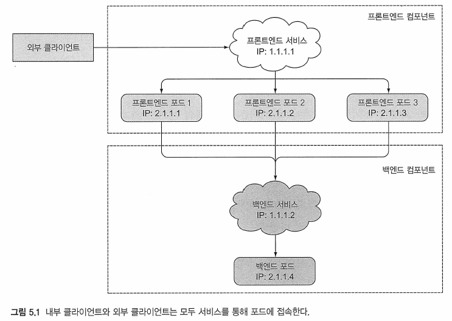
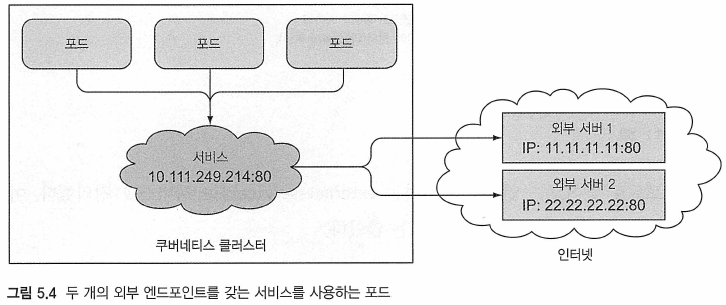
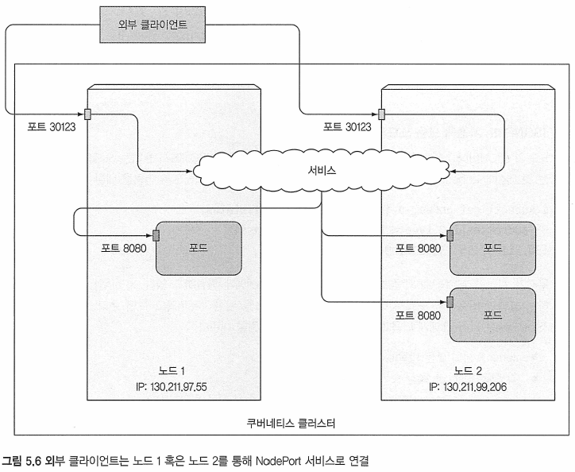
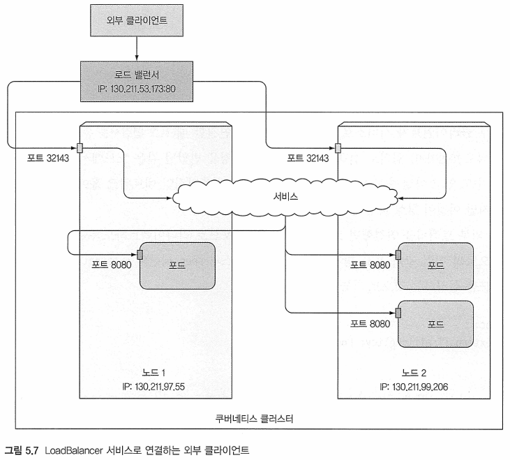
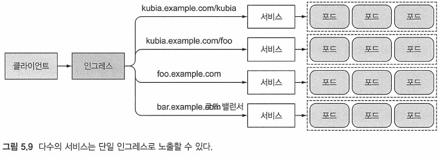
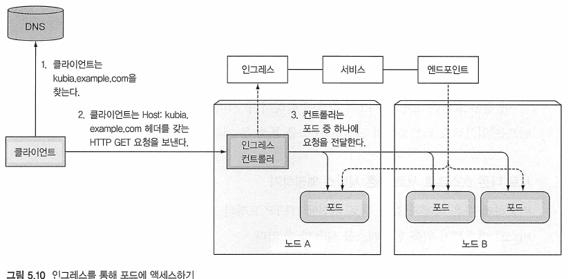
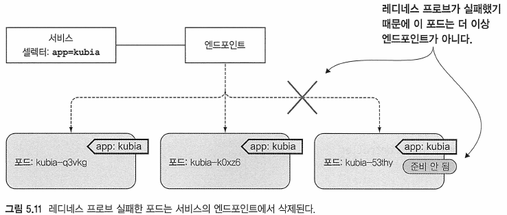

# Kubernetes in Action

---
## 5장 볼륨：클라이언트가 포드를 검색하고 통신을 가능하게 함

---
### 5.1 서비스 소개


#### 5.1.1 서비스 생성

##### kubecti expose를 통한 서비스 생성
Ex) kubia-svc.yaml
```bash
kubectl expose deployment hello-world --type=LoadBalancer --name=my-service
```

##### YAML 디스크립터를 통한 서비스 생성

Ex) 서비스의 정의(kubia-svc.yaml)
```yaml
apiVersion: v1
kind: Service
metadata:
  name: kubia

spec:
  ports:
    - port: 80 			# 서비스가 사용할 포트
      targetPort: 8080	# 서비스가 포워드할 컨테이너 포트
  selector:				# 라벨이 app=kubia인 모든 포드는 이 서비스에 속한다.
    app: kubia
```
* 80 port로 들어오는 연결을 허용하고 각 연결을 대상으로 app=kubta 라벨 셀렉(label selector)에 매칭되는 포드 중 하나를 8080 포트로 라우팅함

##### 클러스터 안에서 서비스 테스트
* 확실한 방법은 서비스의 클러스터 IP주소로 요청을 보내고 응답을 로그로 남기는 포드를 생성하는 것
* 노드 중 하나로 ssh 접속을 수행 하고 curl 명령을 사용
* Kubectl exec 명령어를 통해 이미 존재하는 포드들 중 하나에서 curl 명령을 수행

##### 원격으로 실행 중인 컨테이너에 명령에 실행
```bash
$ kubectl exec kubia-7nog1 -- curl -s http://10.11.249.153
```

#### 동일한 서비스에서 여러 개의 포트 노출
Ex) 서비스의 정의(다중 포트 설정하기)
```yaml
apiVersion: v1
kind: Service
metadata:
  name: kubia

spec:
  ports:
    - name: http
	  port: 80 			# 서비스가 사용할 포트
      targetPort: 8080	# 서비스가 포워드할 컨테이너 포트
    - name: https
	  port: 443
	  targetPort: 8443
  selector:				# 라벨이 app=kubia인 모든 포드는 이 서비스에 속한다.
    app: kubia
```

#### 이름이 지정된 포트 사용
Ex) 포드 정의에 포트 이름 설정하기
```yaml
kind: pod
spec:
  containers:
    - name: kubia
	  ports:
	    - name: http			# 컨테이너 포트 8080은 http 이름으로 설정한다.
		  containerPort: 8080
		- name: https
		  containerPort: 8443
```

Ex) 서비스에 이름 지정된 포트 참조하기
```yaml
apiVersion: v1
kind: Service

spec:
  ports:
    - name: http
	  port: 80 			# 포트 80은 http라 불리는 컨테이너 port에 매핑된다.
      targetPort: http
    - name: https
	  port: 443
	  targetPort: https
```
* 포트 이름을 지정하는 것의 가장 큰 이점은 서비스 스펙의 변경 없이 포트 번호를 변경할 수 있음
	- 포트가 현재 http라는 이름으로 8080 포트를 사용하더라도 후에 필요에 의해 포트를 80으로 변경하는 것이 가능


#### 5.1.2 서비스 검색

##### 환경 변수를 이용한 서비스 검색
Ex) 컨테이너 내의 서비스와 연관된 환경 변수
```
$ kubectl exec kubta-3tn1y env
PATH=/usr/local/sbin:/usr/local/bin:/usr/sbin:/usr/bin:/sbin:/bin
HOSTNAME=kubia-3in1v
KUBERNETES_SERVICE_HOST=10.111.240.1
KUBERNETES_SERVICE_PORT=443
...
KUBIA_SERVICE_HOST=10.111.249.153 	# 서비스의 클러스터 IP
KUBIA_SERVICE_PORT=80				# 서비스가 사용 가능한 포트
...
```

##### DNS를 이용한 서비스 검색
* kube-dns가 DNS 서버를 실행함
	- 이 DNS서버는 클러스터에서 실행하는 다른 모든 포드가 자동적으로 사용하도록 구성됨
* 각 서비스는 내부 DNS 서버에서 DNS 항목을 가져옴
	- 서비스 이름을 알고 있는 클라이언트 포드는 환경 변수를 사용하는 대신 FQDN(정규화된 도메인 이름)을 통해 액세스할 수 있음

##### FQDN을 이용한 서비스 연결
아래의 FQDN을 통해 백엔드 데이터베이스 서비스에 연결할 수 있음
```bash
backend-database.default.svc.cluster.local
```
* backend-database : 서비스 이름 
* default : 서비스가 정의된 네임스페이스
* svc.cluster.local : 모든 클러스터의 로컬 서비스 이름
* 서비스로 연결할 경우
	- 생략이 가능해
	- `backend-database`만으로 서비스를 지칭 가능
* __기존 포드 내두에서 이를 수행해야 함__

##### 포드 컨테이너의 셸 실행
* 이 작업을 하려면 셀 바이너리 실행 파일이 컨테이너 이미지에 있어야 함
```bash
$ kubectl exec -it kubia-3tn1y bash
root@kubia-3in1y:/#
```

Ex) 서비스에 액세스
```
root@kubia-3tnly:/# curl http://kubia.default.svc.cluster.local
You've hit kubia-5asi2

root@kubia-3tnly:/# curl http://kubia.default
You've hit kubia-3inly

root@kubia-3tnly:/# curl http://kubia
You've hit kubia-8awf3
```

Ex) 작동 원리(이유)
```
root@kubia-3tnly:/# cat /etc/resolv.conf
nameserver 10.96.0.10
search default.svc.cluster.local svc.cluster.local cluster.local localdomain
options ndots:5
```

---
### 5.2 클러스터 외부 서비스에 연결

#### 5.2.1 서비스 엔드포인트 소개 
* 서비스는 포드를 직접 링크(link)하지 않음
	- 대신 엔드포린트라 불리는 리소스가 포드와 서비스 사이에 위치
```
클라이언트 -> 서비스 -> 포드				(X)
클라이언트 -> 서비스 -> 엔드포인트 -> 포드	(O)
```
* 셀렉터는 IP와 포트의 목록을 만드는 데 사용되고 엔드포인트 리소스에 저장됨

Ex) 엔드포인트 확인
```bash
$ kubecti get endpotnts kubta
NAME    ENDPOINTS                                      AGE
kubia   10.36.0.1:8080,10.44.0.1:8080,10.47.0.1:8080   100m
```

#### 5.2.2 수동으로 서비스 엔드포인트 설정
* 서비스의 엔드포인트를 서비스와 분리하면 엔드포인트를 수동으로 구성하고 업데이트할 수 있음
* 포드 셀렉터 없이 서비스를 만들었다면 쿠버네티스는 엔드포인트 리소스조차 만들지 못함

##### 셀렉터 없이 서비스 생성
Ex) 포드 셀렉터 없는 서비스(external-service.yaml)
```
apiVersion: v1
kind: Service
metadata:
  name: external-service	# 엔드포인트 객체의 이름과 매칭되야 함
spec:						# 서비스는 셀렉터를 따로 정의하고 있지 않음
  ports:
    - port: 80
```
* 80 포트로 들어오는 연결을 처리하는 'external-service'라는 서비스를 정의
	- 이 서비스를 위해 포드 셀렉터를 정의하지는 않음

##### 셀렉터 없이 서비스를 위한 엔드포인트 리소스 생성
* 엔드포인트는 분리된 리소스지만 서비스의 속성은 아님
Ex) 직접 생성한 엔드포인트 리소스(external-service-endpoints.yaml)
```
apiVersion: v1
kind: Endpoints
metadata:
  name: external-service	# 엔드포인트 객체의 이름, 서비스의 이름과 매칭돼야 함
subset:						
  - addresses
    - ip: 11.11.11.11		# 서비스가 연결을 포워딩할 엔드포인트의 IP들
	- ip: 22.22.22.22
	port:
	  - port:80				# 엔드포인트 대상 포트
```
* 서비스를 위한 IP와 포트 정보 필요



#### 5.2.3 외부 서비스를 위한 별칭 생성

##### ExternalName 서비스 생성
Ex) ExternalName 타입의 서비스(external-service-externalname.yml
```
apiVersion: v1
kind: Service
metadata:
  name: external-service	
spec:						
  type: ExternalName
  externalName: someapi.somecompany.com	# 실제 서비스의 전체 도메인 주소(FQDN, Fully Qualified Domain Name)
  port:
    - port:80				
```
* Exte rnalNarne 서비스는 DNS 레벨에서만 구현됨
	- 간단히 CNAME DNS 레코드는 서비스를 위해 생성
	- 서비스로 연결하는 클라이언트는 서비스 프록시를 완전히 통하지 않고 직접 외부서비스로 연결
	- 이런 이유로 서비스를 위한 이런 타입은 클러스터 IP를 얻지 못함

###### 참고
* CNAME 레코드는 숫자 형식의 IP 주소 대신에 FQDN(fully qualified domain name）을 지칭함

---
### 5.3 외부 서비스에서 외부 클라이언트로
* 서비스가 외부에서 액세스 가능한 방법
	- NodePort 서비스 탸입으로 설정하기
		
	+ NodePort 서비스의 각 클러스터 노드는 노드 자체의 이름을 통해 포트를 열고 포트에서 발생한 트래픽을 서비스로 리다이렉트 함
		
	- LoadBalancer 서비스 타입으로 설정하기（NodePort 타입의 확장형）
		+ 쿠버네티스가 실행 중인 클라우드 인프라스트럭처에 프로비전(provision)된 지정된 LoadBalancer를 통해 서비스 액세스가능하게 됨
		+ LoadBalancer는 발생한 트래픽을 모든 노드에서 노드포트로 리다이렉트 함
		+ 클라이언트는 로드 밸런서 IP를 통해 서비스에 접속함
		
	- 하나의 IP주소를 통해 여러 서비스를 제공하는 근본적으로 다른 매커니즘인 인그레스 리소스 생성하기
		+ HTTP 레벨（네트워크 7계층）수준에서 동작하기 때문에 4계층 서비스보다 좀 더 기능을 제공함
		
		
		
#### 5.3.1 NodePort 서비스 사용
* NodePort
	- 서비스를 생성해 쿠버네티스가 모든 노드를 대상으로 포트를 예약함
	- 모든 노드에 걸쳐 동일한 포트 번호를 사용하게 됨

##### NodePort 서비스 생성
Ex) NodePort 서비스 정의(kubia-svc-nodeport.yaml)
```
apiVersion: v1
kind: Service
metadata:
  name: kubta-nodeport
spec:
  type: NodePort
  ports:
    - port: 80
      targetPort: 8080
      nodePort: 30123
  selector:
    app: kubia		
```



#### 5.3.2 외부 로드 밸런서를 이용한 서비스 노출
* 로드 밸런서는 자신만의 고유하면서 외부에서 액세스가 가능한 IP 주소를 갖고 모든 연결을 서비스로 리다이렉트함
* 로드 밸런서의 IP 주소를 통해 서비스에 액세스할 수 있음
* LoadBalancer 서비스를 지원하지 않는 환경에서 실행하면
	- 밸런서는 프로비전되지 않을 것임
	- LoadBalancer 서비스는 NodePort 서비스의 확장이기 때문에 서비스는 NodePort 서비스처럼 동작할 것임

##### LoadBalancer 서비스 생성
Ex) LoadBalancer 타입 서비스 정의(kubia-svc-.yaml)
```yaml
apiVersion: v1
kind: Service
metadata:
  name: kubia-loadbalancer
spec:
  type: LoadBalancer
  ports:
  - port: 80
    targetPort: 8080
  selector:
    app: kubia		
```


#### 5.3.3 외부 연결의 특성
* 외부에서 발생한 연결이 서비스로 들어올 때 염두에 둘 사항 몇가지가 존재

##### 불필요한 네트워크 홉의 이해와 방지
Ex) 외부 트래픽을 연결했던 노드에서 실행하는 포드로 리다이렉트하도록 서비스 설정
```yaml
spec:
  externalTrafficPolicy: Local
```
* 서비스 정의에 이런 설정을 포함한다면
	- 외부 연결은 서비스의 노드 포트를 통해 연결되고 서비스 프록시는 로컬 내에서 실행되고 있는 포드를 선택할 것임
	- 로컬 포드가 없다면 hang(대기) 상태가 됨
	- 단점 : Local 외부 트래픽 정책을 사용하는 서비스는 포드들의 부하를 고르게 분배하지 못함

##### 클라이언트 IP가 보존되지 않음을 인식
* 서비스 뒷단의 포드는 클라이언트의 IP 주소를 얻을 수가 없음
	- 특정 애플리케이션이 클라이언트 IP를 일 필요가 있는 경우 문제가 됨
	- Ex) 웹서버의 경우 액세스 로그에 브라우저의 IP를 보여주지 못하는 문제가 생김

---
### 5.4 인그레스 리소스를 이용해 외부로 서비스 노출하기

###### 정의: Ingress(명사）- 가거나 들어가는 행위; 들어갈 수 있는 권리；（어떤 장소에) 들어감; 입장권

##### 인그레스가 필요한 이유
1. LoadBalancer 서비스는 그 자신만의 외부 IP를갖는 자쳬 로드 밸런서를 요구하기 때문

* 클라이언트가 HTTP 요청을 인그레스에 보냈을 때 호스트와 요청상의 경로는 요청이 포워드될 서비스를 결정함
* 네트워크 스택(HTTP)의 애플리케이션 레이어에서 동작함
* 서비스가 할 수 없는 쿠키 기반 세션 친화성 기능을 제공

```
세션 친화성과 웹브라우저
서비스를 외부로 노출했기 때문에 웹브라우저를 통해 접속을 시도해볼지 모른다．이상한 무엇인가를
볼 수 있을 것이다．브라우저는 항상 정확히 동일한 포드를 선택할 것이다．그 동안 서비스의 세션 친화
성은 변화했는가? Kubectl explain 명령을 통해 서비스의 세션 친화성이 None으로 설정된 것을 다시
한번 확인할 수 있다．그렇다면 왜 서로 다른 브라우저의 요청을 curl을 사용했을 때처럼 다른 포드로
연결하지 않는가？
왜 그런지 설명해보겠다．브라우저는 keep-alive 연결을 사용하고 있고 모든 요청들은 하나의 연결을
통해 보내진다．반면 Curl은 매번 새로 연결을 연다．서비스는 연결 수준에서 동작한다 그래서 서비스
로의 연결이 처음 열렸을 때 임의의 포드가 선택되고，그러고 나서 그 연결에 속하는 모든 네트워크 패
킷은 단일 포드로 모두 전송된다．심지어 세션 친화성이 None으로 설정돼 있더라도 사용자는 항상 같
은 포드로 연결될 것이다（연결이 종료될 때까지)
```

##### 인그레스 컨트롤러가 요구되는 경우
* 인그레스 리소스를 작동시키려면 클러스터에서 인그레스 컨트롤러를 실행해야 함
	- 구글 쿠버네티스 엔진은 구글 클라우드 플랫폼 자쳬의 HTTP 로드 밸런싱기능을 사용해 인그레스 기능을 제공함
	- 미니큐브는 컨트롤러를 기본적으로 제공하지 않았지만 인그레스 기능을 사용할 수 있음
	```
	$ mtnikube addons list
	- default-storageclass: enabled
	- kube-dns: enabled
	- heapster: disabled
	- ingaress : disabled		# 활성화 필요
	- reaistrv-creds: disabled
	- addon-manager: enabled
	- dashboard: enabled
	
	$ mtnikube addons enable tngress
	
	$ kubectl get po --all-namespaces
	```

#### 5.4.1 인그레스 리소스 생성
* 클러스터상에서 실행 중인 인그레스 컨트롤러가 있다는 것을 확인 후

Ex) 인그레스 리소스 정의(kubia-ingress.yaml)
```yaml
apiVersion: extensions/v1beta1
kind: Ingress
metadata:
  name: kubia
spec:
  rules:
    - host: kubia.example.com 	# 이 인그레스는 kubia.example.com 도메인 이름을 서비스로 매핑함
	  http:
	    paths:
	      - path: /				# 모든 요청은 kubia-nodeport 서비스의 80번 포트로 전달됨
            backend:
              serviceName: kubia-nodeport
              servicePort: 80
```
* kubia.example.com으로 요청은 80 포트의 kubia-nodeport 서비스로 보내짐
	- 그러한 모든 HTTP 요청이 인그레스 컨트롤러를 통해 수신되도록 하는 하나의 규칙을 갖는 인그레스를 정의함
	

#### 5.4.2 인그레스를 이용한 서비스 액세스

##### 인그레스의 IP주소 얻기
```bash
$ kubectl get ingresses
NAME  HOSTS				  ADDRESS		 PORTS	AGE
kubia kubia.example.com 192.168.99.100 80 	29rn
```
* 클라우드상에서 기동한다면 인그레스 컨트롤러는 백그라운드에서 로드 밸런서를 제공하기 때문에 IP주소가 보여지는 데 시간이 걸림

##### 호스트의 진입점으로 인그레스의 IP 주소를 가리키게 하기
* IP주소를 알고 나면 DNS 서버가 kubia.example.corn에 해당 IP 주소를 반환하도록 환경 설정함
	- /etc/hsots 파일에 구성
	- C:\window\system32\drivers\etc\hosts 파일에 구성
	- `192.168.99.100 kubia.example.com`

##### 인그레스를 통한 포드 액세스
```bash
$ curl http://kubia.example.com
$ curl --resolve kubia.example.com:80:x.x.x.x http://kubia.example.com
```
* host:port:address

##### 인그레스의 동작 방식

1. 클라이언트는 처음으로 kubia.eample.com에 대해서 DNS 룩업을 실행
2. DNS서버(또는 현재 OS)는 인그레스 컨트롤러의 IP를 반환
3. 클라이언트는 HTTP 요청을 인그레스 컨트롤러로 보냄(Host 헤더에 kubia.example.com을 지정)
4. 헤더에서 컨트롤러는 클라이언트가 액세스하려고 하는 서비스를 결정
5. 요청을 포드 중 하나로 전달
* 인그레스 컨트롤러는 요청을 서비스로 전달하지 않음


#### 5.4.3 하나의 인그레스로 다수의 서비스 노출

##### 동일한 호스트의 서로 다른 서비스를 다른 경로로 매핑하기
Ex) path는 서로 다르자만 동일한 호스트에 다수의 서비스를 노출하는 인그레스
```yaml
apiVersion: extensions/v1beta1
kind: Ingress
metadata:
  name: kubia
spec:
  rules:
    - host: kubia.example.com 	# 이 인그레스는 kubia.example.com 도메인 이름을 서비스로 매핑함
	  http:
	    paths:
	      - path: /kubia				# kubia.example.com/kubia으로의 요청은 /kubia 서비스의 80번 포트로 라우팅됨
            backend:
              serviceName: kubia
              servicePort: 80
		  - path: /bar				# kubia.example.com/bar의 요청은 /bar 서비스의 80번 포트로 라우팅됨
            backend:
              serviceName: bar
              servicePort: 80
```
* 요청된 URL의 경로에 따라서 두 서비스로 보내짐
	- 클라이언트는 인그레스 컨트롤러의 단일 IP 주소를 통해 두개의 서비스에 도달할 수 있게 됨
	
##### 서로 다른 호스트로 서로 다른 서비스 매핑하기
Ex) 서로 다른 호스트로 다수의 서비스를 노출하는 인그레스
```yaml
apiVersion: extensions/v1beta1
kind: Ingress
metadata:
  name: kubia
spec:
  rules:
    - host: foo.example.com 	# foo.example.com 의 요청은 kubia 서비스로 라우팅 될 것임
	  http:
	    paths:
	      - path: /				
            backend:
              serviceName: foo
              servicePort: 80
    -  host: bar.example.com 	# bar.example.com 의 요청은 bar 서비스로 라우팅 될 것임
	   http:
	     paths:
	       - path: /				
             backend:
               serviceName: bar
               servicePort: 80
```
* 컨트롤러가 보낸 요청은 요청 호스트 헤더에 따라서 foo 혹은 bar 서비스로 전달됨
* DNS는 foo.example.com와 bar.example.com 도메인 이름을 인그레스 컨트롤러의 IP 주소를 가리키게 해야 함

#### 5.4.4 TLS 트래픽을 처리하기’ 위한 인그레스 설정

##### 인그레스를 위한 TLS 인증서 생성
* 인그레스 컨트롤러가 TLS의 모든 것에 관여함
	- 포드에서 실행 중인 어플리케이션은 TLS를 지원할 필요는 없음
	- 컨트롤러에는 TLS의 인증서와 개인 키를 덧붙여아 함(Secret이라는 쿠버네티스 리소스에 저장됨)

Ex) 개인 키와 인증서 생성
```bash
$ openssl genrsa -out tls.key 2048
$ openssl req -new -x509 -key tls.key -out tls.cert -days 360 -subj
/CN=kubta.example.com
```

Ex) 시크릿 생성
```bash
$ kubectl create secret tls tls-secret --cert
```

###### 참고
```
CertificateSigningRequest 리소스를 통한 인증서 서명
인증서를 직접 서명하기보다 CertificateSigningRequest(CSR)리소스를 생성해 생성된 인증서를 획득 
할 수 있다, 사용자나 애플리케이션은 정규 인증서 요청을 생성할 수 있고 CSR에 넣어서 운영자나 자동화 
프로세스가 다음과 같이 요청을 승인할 수 있다，

$ kubectl certiftcate approve <name of the CSR>

서명된 인증서는 CSR의 status.certificate 필드에서 추출할 수 있다．
인증서 서명 컴포넌트는 클러스터에서 반드시 실행돼야 함을 기억햐라. 그렇지 않으면
CertificateSigningRequest를 생성하고 승인햐거나 거부햐는 것이 전혀 동작햐지 않는다．
```

Ex) TLS 트래픽을 핸들링하는 인그레스(kubia-ingress-tls.yaml)
```yaml
apiVersion: extensions/v1beta1
kind: Ingress
metadata:
  name: kubia
spec:
  tls:							# 전체 TLS 구성은 이 속성 이하에 위치한다.
    - host: 					
	    - kubia.example.com		# kubia.example.com 호스트 이름에 대한 TLS 연결을 수락됨
	  secretName: tls-secret	# 비밀키와 인증서는 이전에 생성한 tls-secret으로부터 구할 수 있음
  rules:
    - host: foo.example.com 	
	  http:
	    paths:
	      - path: /				
            backend:
              serviceName: kubia-nodeport
              servicePort: 80
```
* HTTPS로 연결
```bash
$ curl -k -v https://kubia.example.com/kubia
$ curl --resolve kubia.example.com:443:x.x.x.x -k -v http://kubia.example.com/kubia
```

---
### 5.5 포드가 연결을 수락할 준비가 됐을 때 신호 보내기
* 포드가 생성되면 서비스의 일부가 되고 요청이 포드로 리다이렉트되기 시작함
	- 그러나 포드가 요청을 처리할 준비가 되어 있지 않을 수 있음

#### 5.5.1 레디네스 프로브 소개
* 레디네스 프로브는 주기적으로 호출되고 특정 포드가 클라이언트 요청의 수락 여부를 결정함
	- 컨테이너의 레디네스 프로브가 성공을 반환한다면 컨테이너가 요청을 받아들일 준비가 됐다는 신호임
	- 레디네스 프로브는 어플리케이션이 간단한 GET/ 요청에 응답 또는 특정 URL 경로에 도달할 수 있는지 정도만 확인함
		+ 어플리케이션의 세부 사항까지 고려한 정교한 레디네스 프로브의 제공은 어플리케이션의 개발자의 책임

##### 레디네스 프로브의 타입
* 프로세스를 실행시키는 Exec 프로브
	- 컨테이너의 상태는 프로세스의 종료 상태 코드에 의해 결정됨
* HTTP GET 프로브
	- HTTP GET 요청을 컨테이너에게 보내고 응답의 HTTP 상태 코드를 통해 컨테이너가 준비된 상태인지 아닌지 판별
* TCP 소켓 프로브
	- 컨테이너의 지정된 포트로 TCP를 연결하는 TCP 소켓 프로브가 있음, 연결되면 컨테이너는 준비로 간주됨

##### 레디네스 프로브의 동작 이해
1. 준비 확인을 수행하기 전, 구성 가능한 기간이 경과할 때까지 대기(하도록 구성 가능)
2. 주기적으로 프로브를 호출, 레디네스 프로브의 결과를 기반으로 수행
	2-1 포드가 준비돼 있지 않으면, 서비스를 삭제
	2-2 포드가 다시 준비가 되면, 서비스에 다시 추가
* __라이브니스 프로브와 달리 컨테이너가 준비 확인에 실패한다면 종료되거나 다시 시작하지 않음__


* 레디네스 프로브가 실패한다면 포드는 엔드포인트 오브젝트에서 제거됨
* 포드가 서비스의 라벨 셀렉터와 전혀 매칭되지 않아도 작동

##### 레디네스 프로브가 중요한 이유
* 포드 그룹(Ex： 어플리케이션 서버를 실행하는 포드)이 다른 포드(Ex: 백엔드 데이터베이스)에서 제공히는 서비스에 의존하는 경우
	- 프론트엔드 포드 중 하나에 문제가 발생하여, 데이터베이스에 연결할 수 없는 경우
		+ 레디네스 프로브가 쿠버네티스에 알려주는 것이 현명한 방법임
* 레디네스 프로브 클라이언트가 정상 상태인 포드하고만 통신하게 하고 시스템에 문제가 있다는 것을 알아차리지 못하게 할 수 있음

#### 5.5.2 포드로 레디네스 프로브 추가

##### 포드 템플릿으로 레디네스 프로브 추가
* 기존 레플리케이션컨트롤러의 포드 템플릿에 프로브를 추가하려면 `kubectl edit` 명령을 사용
```bash
$ kubectl edit rc kubia
```

Ex) 레디네스 프로브와 포드를 생성하는 RC(kubia-rc-readinessprobe.yaml)
```yaml
apiVersion: apps/v1
kind: ReplicaSet
metadata:
  name: kubia

spec:
  replicas: 3
  selector:
    matchLabels:
      app: kubia

  template:
   metadata:
     labels:
       app: kubia

   spec:
     containers:
       - name: kubia
         image: luksa/kubia
		 readinessProbe:
		   exec:
		     command:
			   - ls
			   - /var/ready
         ports:
           - containerPort: 8080
```
* 여건상 레플리케이션컨트롤러 대신 레플리카셋으로 대체
* 레디네스 프로브는 주기적으로 컨테이너 안에서 is /var/ready 명령을 실행함
	- 파일이 있으면 0의 종료 코드 반환
	- 파일이 없으면 0이 아닌 값을 반환
	- 파일이 있으면 레디네스 프로브는 성공, 않으면 실패

##### 포드의 준비 상태를 관찰하고 수정
Ex) check1
```bash
$ kubectl get pods
NAME          READY   STATUS    RESTARTS   AGE
kubia-cqp6n   0/1     Running   0          99s
kubia-x4pcn   0/1     Running   0          99s
kubia-zwsft   0/1     Running   0          99s
```
* READY 칼럼을 보면 준비된 컨테이너가 하나도 없음

Ex) 파일 생성
```	bash
$ kubectl exec kubia-cqp6n -- touch /var/ready
```
* 파일을 생성하면, 포드의 레디네스 프로브 명령이 상테 코드 0으로 종료되야 함
 - 즉, 프로브가 성공하고 포드가 준비 상태로 표시돼야 함


Ex) check2
```bash
$ kubectl get pods
NAME          READY   STATUS    RESTARTS   AGE
kubia-cqp6n   1/1     Running   0          9m50s
kubia-x4pcn   0/1     Running   0          9m50s
kubia-zwsft   0/1     Running   0          9m50s
```


Ex) check3
```bash
$ kubectl describe pod kubia-cqp6n
...
Readiness:      exec [ls /var/ready] delay=0s timeout=1s period=10s #success=1 #failure=3
...
```
* 레디네스 프로브는 디폴트로 10초마다 체크함
	- 아직 레디네스 프로브가 실행되지 않았을 경우 포드의 상태가 'READY'가 아닐 수 있음


#### 5.5.3 실제 환경에서 레디네스 프로브의 역할
* 서비스에서 수동으로 포드를 제거하려면 프로브에서 스위치를 수동으로 전환하는 대신 포드를 삭제하거나 포드의 라벨을 변경해야 함
```
팁 수동으로 서비스에서 포드를 추가하거나 제거하려면 enabled=true를 포드의 라벨과 라벨 셀렉터에 추가하라.
  서비스에서 포드를 삭제하고 싶을 땐 라벨을 지워라．
```

###### 1. 레디네스 프로브를 항상 정의하기
* __포드에 레디네스 프로브를 추가하지 않았다면 거의 즉시 서비스 엔드포인트가 될 것임__
	- 그러면 클라이언트는 'Connection refused' 라는 유형의 에러를 보게게 될 것임
	- 간단한 HTTP요청이라도 레디네스 프로브를 항상 정의 권장
	
###### 2. 레디네스 프로브에 포드의 종료 로직을 포함시키지 말자．
* 쿠버네티스는 포드를 삭제하자마자 모든 서비스에서 포드를 제거하기 때문에,
	- 포드의 라이프사이클 마지막 단계(포드 종료)에서 고려해야 필요는 없음

---
### 5.6 헤드리스 서비스 사용해 개별 포드 찾기
* 개별 포드 IP 알기
	- 클라이언트가 쿠버네티스 API 서버를 호출하고, API 호출을 통해, 포드 및 IP 주소 목록을 얻는 방법
		+ 애플리케이션을 항상 Kubernetes-agnostic으로 유지하기 위해 노력해야 하므로 API 서버를 사용하는 것은 바람직하지 않음
	- 클라이언트가 DNS 룩업을 통해 포드의 IP를 찾는 방법
		+ 일반적으로 서비스로 DNS 룩업을 실행할 때 DNS 서버는 단일 IP를 반환(서비스의 클러스터 IP)
		+ 쿠버네티스에게 서비스에 클러스터 IP가 필요 없다고 말하면(서비스 spec의 clusterlP 필드를 None으로 설정 DNS 서버는 단일 서비스 IP대신 포드의 IP 목록을 알려줌
* 서비스에 포함된 모든 포드의 IP를 가져와, 클라이언트는 다수 또는 모두를 연결 가능	
	
#### 5.6.1 헤드리스 서비스의 생성
Ex) headless service(kubia-svc-headless.ymal)
```yaml
apiVersion: v1
kind: Service
metadata:
  name: kubia-headless

spec:
  clusterIP: None        	# 이 부분이 서비스를 헤드리스로 만듦
  ports:
    - port: 80              # 서비스가 사용할 포트
      targetPort: 8080  	# 서비스가 포워드할 컨테이너 포트
  selector:                 # 라벨이 app=kubia인 모든 포드는 이 서비스에 속한다.
    app: kubia
```
* kubectI create 명령으로 서비스를 생성한 후에 kubectl get과 kubectl describe를 통해 설정
* `kubectl exec <pod name> -- touch /var/ready`

#### 5.6.2 DNS를 통해 포드 찾기
* DNS와 연관된 액션을 수행하기 위해 도커 허브에 nslookup과 dig 바이너리가 포함된 tutum/dnsutils 컨테이너 이미지를 사용

##### YAML 매니페스트 작성 없이 포드 실행
```bash
$ kubectl run dnsutils --image=tutum/dnsutils --generator=run-pod/vl --command -- sleep infinity
```
* --generator=run-pod/vl 옵션
	- 레플리케이션컨트롤러와 같은 유형에 관계 없이 혹은 비슷한 것들 뒤에 포드를 직접 생성하라고 명령

##### 헤드리스 서비스를 위해 리턴된 DNS 레코드
```bash
$ kubectl exec dnsutils nslookup kubia-headless
kubectl exec [POD] [COMMAND] is DEPRECATED and will be removed in a future version. Use kubectl kubectl exec [POD] -- [COMMAND] instead.
Server:         10.96.0.10
Address:        10.96.0.10#53

Name:   kubia-headless.default.svc.cluster.local
Address: 10.36.0.1
Name:   kubia-headless.default.svc.cluster.local
Address: 10.47.0.1
Name:   kubia-headless.default.svc.cluster.local
Address: 10.44.0.1
```
* 포드의 IP를 보여주는 kubectl get pods -o wtde 명령으로 포드를 나열해 재확인 가능
* kubia 서비스와 같이 정규 서비스(비헤드리스)를 위한 DNS 반환과는 다름
	- 정규 서비스(비헤드리스)는 서비스의 클러스터 IP를 반환함
* 정규 서비스(비헤드리스)와 마찬가지로 서비스의 DNS 이름으로 연결을 통해 포드에 접속할 수 있음

```
참고 : 헤드리스 서비스는 포드들 사이에 로드 밸런싱을 제공하지만 서비스 프록시가 아닌 DNS 라운드 로빈 메커니즘을 통해 제고함
```

#### 5.6.3 모든 포드 찾기(준비되지 않은 포드까지)
* 쿠버네티스 API서버에 쿼리히지 않고, DNS 조회 메커니즘을 사용해 아직 준비가 안 된 포드를 찾을 수 있음

---
### 5.7 서비스의 문제 해결
* 서비스를 통해 포드에 접속하지 못할 때 다음 내용을 확인
	1. 외부가 아닌 클러스터 안에서 클러스터 IP를 대상으로 연결하고 있음
	2. 서비스의 클러스터 IP는 가상 IP이고 핑을 보내도 응답이 없을
		- 포드 IP에 직접 핑을 보내는 것은 가능 
	3. 레디네스 프로브를 정의했다면 성공 여부를 확실히 확인
	4. 포드가 서비스의 일부분인지 확인하려면 kubectl get endpoints 명령으로 그에 상응하는 엔드포인트를 조사
	5. FQDN이나 그것의 일부로서 서비스에 액세스를 시도하고 있으나 정상 동작하지 않고 않으면
		- FQDN 대신에 클러스터 IP를 통해 액세스하고 있는지 확인
	6. 대상 포트가 아닌 서비스에 의해 노출된 포트에 연결하고 있는지를 확인
	7. 포드 IP에 직접 연결을 시도해 포드가 정확한 포트의 연결을 수락하고 있는지 확인
	8. 포드의 IP로도 애플리케이션에 직접 액세스할 수 없다면 애플리케이션이 locaihost에만 바인드하고 있지는 않은지 확실히 확인 필요

---
### 5.8 요약
* 안정된 단일 IP주소 및 포트로 특정 레이블 셀렉터와 일치하는 여러 포트를 노출 가능
* 기본적으로 클러스터 내부에서 서비스에 접근 가능
	- NodePort 또는 LoadBalancer로 설정해 클러스터 외부에서 서비스에 접근 가능하게 가능
* 포드가 환경 변수를 검색해 IP주소 및 포트를 알아내 서비스를 검색할 수 있게 함
* 셀렉터 설정 없이 서비스 리소스를 생성하는 대신 관련된 엔드포인트 리소스도 생성해 클러스터 외부에 존재하는 서비스를 찾아 통신할 수 있음
* ExternalName 서비스 유형의 외부 서비스를 위한 DNS CNAME 별칭을 제공함
* 단일 인그레스를 통해(단일 IP를 사용해) 다수의 HTTP 서비스를 노출 가능
* 포드를 서비스 엔드포인트에 포함시킬지 여부를 결정하기 위해 포드 컨테이너의 레디네스 프로브를 사용
* 헤드리스 서비스를 생성할 때 DNS를 통해 포드 IP를 검색 가능

```
[클라이언트]
|
외부 : NodePort 또는 LoadBalancer로 설정 / 노드 IP로 접근
|
[노드]
|
[인그레스]/[서비스]	: 해드리스(None) 서비스 생성시 룩업을 통해 포드 IP 노출 가능
|
[엔드포인트] 
|
연결 확인: '레디네스 프로브'를 사용함
|
[포드] 
```

---
## 출처
[^출처]: Kubernetes in Action-마르코 룩샤-에이콘


<!--  -->