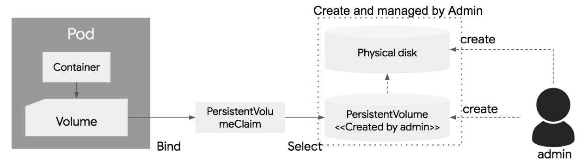
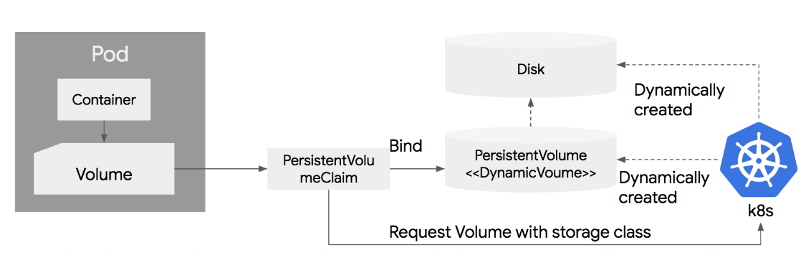

# Kubernetes in Action

---
## 6장 볼륨： 컨테이너에 디스크 스토리지 연결

---
### 6.1 볼륨 소개

#### 6.1.1 예제에서 볼륨 설명

#### 6.1.2 사용 가능한 볼륨 유형 소개
* emptyDir
	- 일시적인 데이터를 저장하는데 사용되는 비어있는 단순한 디렉터리
* hostPath
	- 워커노드의 파일 시스템에서 포드로 디렉터리를 마운트하는 데 사용
* gitRepo
	- 깃 스토리지의 내용을 쳬크아웃해 초기화된 볼륨
* nfs
	- 포드에 마운트된 NFS 공유
* gcePersistentDisk(구글 컴퓨트 엔진 영구 디스크, awsElastic-BlockStore(AWS 탄력적 블록 스토리지 볼륨, azureDisk(마이크로소프트 애저 디스크 볼륨)
	- 클라우드 제공자에 따라 전용 스토리지를 마운트하는 데 사용됨
* cinder, cephfs, iscsi, flocker, glusterfs, quobyte, rbd, flexVolume, vsphere-Volume, photonPersistentDisk, scaleIO
	- 다른 유형의 네트워크 스토리지를 마운트하는 데 사용됨
* configMap, secret, downwardAPl
	- 특정 쿠버네티스 리소스 및 클러스터 정보를 포드에 노출하는 데 사용되는 특수한 유형의 볼륨
* persistentVoLumeClatm
	- 사전 또는 동적으로 프로비저닝된 영구 스토리지를 사용하는 방법

###### 특수한 유형의 볼륨(secret, downwardAPl, configMap)은 데이터를 정렬하는 데 사용되지 않고 쿠버네티스 메타 데이터를 실행하는 데 사용된다.

##### 볼륨 종류
Temp | Local | Network
---|---|---
emptyDir | hostPath | GlusterFS, gitRepo, NFS, iSCSI, gcePersistentDisk, AWS EBS, azureDisk, Fiber Channel, Secret, VshereVolume

---
### 6.2 볼륨을 사용한 컨테이너 사이의 데이터 공유(emptyDir 볼륨)

---
### 6.3 워커노드 파일 시스템에 액세스하기(hostPath 볼륨)

---
### 6.4 영구 스토리지 사용

#### 6.4.1 포드 볼륨에서 GCE 영구 디스크 사용

##### GCE 영구 디스크 생성
Ex) 존(ZONE) 확인
```bash
$ gcloud contatner clusters ltst
NAME 	ZONE 			MASTER _VERSION 	MASTER_IP . . .
kubia 	europe-westl-b 	1.2.5 				104.155.84.137 . . .
```
* 'europe-west 1-b'구역에서 클러스터를 생성 확인

Ex) GCE 영구 디스크 생성
```bash
$ gcloud compute disks create --stze=1GiB --zone=europe-westl-b mongodb
~생략~
NAME 	ZONE 			SIZE_GB TYPE 		STATUS
mongodb europe-westl-b 	1 		pd-standard READY
```
* 몽고DB라고 하는 1GiB의 큰 GCE 영구 디스크를 만듦
* 실행하려는 테스트의 디스크 성능은 상관이 없으므로 디스크 크기 경고는 무시함

Ex) gcePersistentDisk 볼륨을 이용한 포드(mongodb-pod-gcepd.yaml)
```yaml
apiversion: v1
kind: Pod
metadata:
  name: mongodb

spec :
  volumes:
    - name: mongodb-data
      gcpPersistenDisk:		# 볼륨 유형: GCE 영구 디스크
       pdName: mongodb		# 영구 디스크의 이름은 이전에 만든 실제 PD와 일치해야 함
       fsType: ext4
  contatners:
    - image: mongo
      name: mongodb
      volumeMounts:
        - name: mongodb-data
          mountPath: /data/db	# 몽고DB가 데이터를 저장하는 경로
   ports :
     - containerPort: 27017
       protocol: TCP
```

###### 참고
* 미니큐브를 사용하는 경우 GCE PersistentDisk는 사용할 수 없지만 mongodb-pod-hostpath.xml은 GCE PersistentDisk 대신 hostPath 볼륨을 사용함

##### 몽고DB 데이터베이스에 문서를 추가해 영구 스토리지에 데이터 쓰기
Ex) 새 JSON 문서를 삽입
```
$ kubectl exec -it mongodb mongo
> use mystore
> db.foo.insert({name: 'foo'})
> db.foo.ftnd()
```
* 단일 속성(이름： 'foo')이 포함된 단순 JSON 문서를 삽입
* find( )명령을 사용해 삽입한 문서를 확인
* 문서는 지금 GCE 영구 디스크에 저장돼야 함

##### 포드를 다시 생성하고 이전 포드가 저장한 데이터를 읽을 수 있는지 확인
* 몽고DB 포드를 삭제후, 다시 실행함

Ex) 다시 실행한 몽고DB의 문서 확인
```
$ kubectl exec -it mongodb mongo
> use mystore
> db.foo.ftnd()
```
* 이전에 만든 foo를 확인

#### 6.4.2 기본 영구 스토리지에서 다른 볼륨의 유형 사용

##### awsElasticBlockStore 볼륨 사용
Ex) awsElasticBlockStore 볼륨을 이용한 포드(mongodb-pod-aws.yaml)
```yaml
apiversion: v1
kind: Pod
metadata:
  name: mongodb

spec :
  volumes:
    - name: mongodb-data
      awsElasticBlockStore:			# 볼륨 유형: ElasticBlockStore 사용
       volumeId: my-volume			# 생성한 EBS 볼륨의 ID 지정
       fsType: ext4
  contatners:
    - image: mongo
      name: mongodb
      volumeMounts:
        - name: mongodb-data
          mountPath: /data/db	# 몽고DB가 데이터를 저장하는 경로
   ports :
     - containerPort: 27017
       protocol: TCP
```

##### NFS 볼륨 사용
Ex) nfs 볼륨을 이용한 포드(mongodb-pod-aws.yaml)
```yaml
apiversion: v1
kind: Pod
metadata:
  name: mongodb

spec :
  volumes:
    - name: mongodb-data
      nfs:						# 볼륨 유형: NFS 공유 지원됨
       server: 1.2.3.4			# 생성한 EBS 볼륨의 ID 지정
       path: /some/path			# NFS 서버의 IP
  contatners:
    - image: mongo
      name: mongodb
      volumeMounts:
        - name: mongodb-data
          mountPath: /data/db	# 몽고DB가 데이터를 저장하는 경로
   ports :
     - containerPort: 27017
       protocol: TCP
```

---
### 6.5 기본 스토리지 기술에시 포드 분리

#### 6.5.1 PersistentVolume과 PersistentVolumeClaim 소개

* 바인딩된 PersistentVolumeClaim을 삭제해 릴리스될 때까지, 다른 사용자는 동일한 PersistentVolume을 사용할 수 없음

#### 6.5.2 PersistentVolume 생성
* 6.4.1절에서는 GCE 영구 디스크를 프로비저닝하여 물리적 스토리지를 설정하므로 다시 설치할 필요가 없음

Ex) gcePersistentDisk 영구 볼륨(mongodb-pv-gcepd.yaml)
```yaml
apiversion: v1
kind: PersistentVolume
metadata:
  name: mongodb-pv

spec:
  capacity:				# PersistentVolume의 크기 정의
    storage: 1Gi		
  accessModes:			# 단일 클라이언트가 읽기/쓰기용으로 마운트하거나, 여러 클라이언트가 읽기 전용으로 마운트 가능
    - ReadWriteOnce
	- ReadOnlyMany		
  persistentVolumeReclaimPolicy: Retain			# Retain/Delte
  gcePersistentDisk:	# PersistentVolume은 이전에 생성한 GCE 영구 디스크에서 지원됨
    pdName: monfodb
	fsType: ext4
```
* PersistentVolume을 생성할 때 관리자는 쿠버네티스에게 용량이 얼마나 되는지, 단일 노드 또는 여러 노드에서 동시에 읽거나 쓸 수 있는지 여부를 알려야 함
	- 또한 쿠버네티스에게 PersistentVolume이 릴리스되면 어떻게 할지 알려줘야 함(PersistentVolumeClaim이 삭제될 경우)
* `$ kubectl get pv` 생성된 PV확인

###### 참고
* 미니큐브를 사용하는 경우 mongodb-pv hostpath.yaml경로를 사용해 Pv를 생성한다．

###### 참고
* PersistentVolume과 클러스트 노드는 포드，PersistentVolumeClaim과 달리 특정 네임스페이스에 속하지 않는다
네임스페이스에 속함 | 속하지 않음
:-:|:-:
포드，PVC | 노드, PV

#### 6.5.3 PersistentVolumeClaim을 생성해 PersistentVolume 할당

##### PersistentVolumeClaim 생성
Ex) PersistentVolumeClaim(mongodb-pvc.yaml)
```yaml
apiVersion: v1
kind: PersistentVolumeClaim
metadata:
  name: mongodb-pvc			# 클레임의 이름(클레임을 포드의 볼륨으로 사용할 때 필요)

spec:
  resources:
    requests:
	 storage: 1Gi			# 스토리지의 1Gib 요청
  accessModes:
    - ReadWriteOnce			# 스토리지가 단일 클라이언트를 지원(읽기/쓰기)
  storageClassName: ""		# 동적 프로비저닝
```
* PersistentVolume의 용량은 클레임 요청을 수용할 수 있을 만큼 커야됨
* `$ kubectl get pvc` 생성된 PV확인
* accessModes
	- RWO-ReadWriteOnce: 단일 노드만 읽기／쓰기를 위해 볼륨을 마운트할 수 있음
	- ROX-ReadOn1yMany: 여러 노드가 읽기 위해 볼륨을 마운트할 수 있음
	- RWX-ReadWriteMany: 여러 노드가 읽기 및 쓰기를 위해 볼륨을 마운트할 수 있음

#### 6.5.4 포드에서 PersistentVolumeClaim 사용
Ex) PersistentVolumeClaim 볼륨을 사용하는 포드(mongodb-pod-pvc.yaml)
```yaml
apiVersion: v1
kind: Pod
metadata:
  name: mongodb

spec:
  containers:
    - name: mongodb
	  image: mongo
	  ports:
	    - containerPort: 27017
		  protocol: TCP
	  
      volumeMounts:
        - name: mongodb-data
		  mountPath: /data/db

  volumes:
    - name : mongodb-data
      persistentVolumeClaim:
        claimName: mongodb-pvc		# 포드 볼륨에서 이름으로 PersistentVolumeClaim 참고
```		

Ex) PVC와 PV를 사용해 포드에서 몽고DB의 문서 확인
```
$ kubectl exec -it mongodb mongo
> use mystore
> db.foo.ftnd()
```	

---
### 6.6 PersistentVolume의 동적 프로비저닝
* PersistentVolume를 만드는 대신 클러스터 관리자는 PersistentVolume 공급자를 배포하고 사용자가 원하는 PersistentVolume 유형을 선택할 수 있도록 하나 이상의 스토리지클래스오브젝트를 정의할 수 있음

#### 6.6.1 StorageClass 리소스를 통해 사용 가능한 스토리지 유형 정의
* 사용자가 PersistentVolumeClaim을 생성해 새로운 영구 볼륨을 프로비저닝하려면 관리자가 하나 이상의 스토리지 할당 리소스를 생성해야 함
	
Ex) PersistentVolumeClaim 볼륨을 사용하는 포드(mongodb-pod-pvc.yaml)
```yaml
apiVersion: v1
kind: Pod
metadata:
  name: mongodb

spec:
  containers:
    - name: mongodb
	  image: mongo
	  ports:
	    - containerPort: 27017
		  protocol: TCP
	  
      volumeMounts:
        - name: mongodb-data
		  mountPath: /data/db

  volumes:
    - name : mongodb-data
      persistentVolumeClaim:
        claimName: mongodb-pvc		# 포드 볼륨에서 이름으로 PersistentVolumeClaim 참고
```		
	
	
---
### 6.7 PersistentVolume and PersistentVolumeClaim[^조대협의 블로그]
* 일반적으로 디스크 볼륨을 설정하려면 물리적 디스크를 생성해야 함
* 쿠버네티스는 인프라에 대한 복잡성을 추상화를 통해서 간단하게 하고, 개발자들이 손쉽게 필요한 인프라(컨테이너,디스크, 네트워크)를 설정할 수 있도록 하는 개념을 가지고 있음
* 인프라에 종속적인 부분은 시스템 관리자가 설정하도록 하고, 개발자는 이에 대한 이해 없이 간단하게 사용할 수 있도록 구현함
	- 디스크 볼륨 부분에 PersistentVolumeClaim(이하 PVC)와 PersistentVolume(이하 PV)라는 개념을 도입

* 시스템 관리자가 실제 물리 디스크를 생성한 후
	- 이 디스크를 PersistentVolume이라는 이름으로 쿠버네티스에 등록
* 개발자는 Pod를 생성할때, 볼륨을 정의하고
	- 이 볼륨 정의 부분에 물리적 디스크에 대한 특성을 정의하는 것이 아니라 __PVC__를 지정
	- 지정한 PVC를 관리자가 생성한 PV와 연결


* __주의할점__
	- 볼륨은 생성된후에, 직접 삭제하지 않으면 삭제되지 않음
	- PV의 생명 주기는 쿠버네티스 클러스터에 의해서 관리되면 Pod의 생성 또는 삭제에 상관없이 별도로 관리됨
		+ Pod와 상관없이 직접 생성하고 삭제해야 함

#### PersistentVolume
Ex) NFS 파일 시스템 5G를 pv0003이라는 이름으로 정의
```yaml
apiVersion: v1
kind: PersistentVolume
metadata:
  name: pv0003

spec:
  capacity:
    storage: 5Gi
  volumeMode: Filesystem
  persistentVolumeReclaimPolicy: Recycle
  accessModes:
    - ReadWriteOnce
  storageClassName: slow
  mountOptions:
    - hard
	- nfsvers=4.1
  nfs:
    path: /tmp
	server: 172.17.0.2
```
* Capacity
	- 볼륨의 용량을 정의
	- 현재는 storage 항목을 통해서 용량만을 지정하는데, 향후에는 필요한 IOPS나 Throughput등을 지원할 예정임 
* VolumeMode 
	- VolumeMode는 Filesystem(default) 또는 raw를 설정할 수 있음
	- 볼륨이 일반 파일 시스템인데, raw 볼륨인지를 정의
* Reclaim Policy
	- PV는 연결된 PVC가 삭제된 후, 다시 다른 PVC에 의해서 재사용이 가능
	- 재사용시에 디스크의 내용을 지울지 유지할지에 대한 정책을 Reclaim Policy를 이용하여 설정이 가능
		+ Retain : 삭제하지 않고 PV의 내용을 유지함
		+ Recycle : 재사용이 가능하며, 재사용시에는 데이타의 내용을 자동으로 rm -rf 로 삭제한 후 재사용함
		+ Delete : 볼륨의 사용이 끝나면, 해당 볼륨은 삭제함. AWS EBS, GCE PD,Azure Disk등이 이에 해당함
	- __Reclaim Policy은 모든 디스크에 적용이 가능한것이 아니라, 디스크의 특성에 따라서 적용이 가능한 Policy가 있고, 적용이 불가능한 Policy가 있음__
* AccessMode
	- AccessMode는 PV에 대한 동시에 Pod에서 접근할 수 있는 정책을 정의함 
		+ ReadWriteOnce(RWO) : 해당 PV는 하나의 Pod에만 마운트되고 하나의 Pod에서만 읽고 쓰기가 가능함
		+ ReadOnlyMany(ROX) : 여러개의 Pod에 마운트가 가능하며, 여러개의 Pod에서 동시에 읽기가 가능함. 쓰기는 불가능
		+ ReadWriteMany(RWX) : 여러개의 Pod에 마운트가 가능하고, 동시에 여러개의 Pod에서 읽기와 쓰기가 가능
	- __위와 같이 여러개의 모드가 있지만, 모든 디스크에 사용이 가능한것은 아니고 디스크의 특성에 따라서 선택적으로 지원됨__

##### PV의 라이프싸이클
* PV는 생성이 되면, Available 상태가 됨
* 이 상태에서 PVC에 바인딩이 되면 Bound 상태로 바뀌고 사용이 되며,
	- 바인딩된 PVC가 삭제 되면, PV가 삭제되는 것이 아니라  Released 상태가 됨
	- Available이 아니면 사용은 불가능하고 보관 상태가 됨

##### PV 생성 (Provisioning)
* PV의 생성은 앞에서 봤던것 처럼 yaml 파일 등을 이용하여, 수동으로 생성을 할수도 있음
* 또는 설정에 따라서 필요시마다 자동으로 생성할 수 있게 할 수 있음
	- 이를 Dynamic Provisioning(동적 생성)이라고 함 

#### PersistentVolumeClaim
*PVC는 Pod의 볼륨과 PVC를 연결(바인딩/Bind)하는 관계 선언

Ex)PVC의 예제
```yaml
apiVersion: v1
kind: PersistentVolumeClaim
metadata:
  name: myclaim

spec:
  volumeMode: Filesystem
  accessModes:
    - ReadWriteOnce
  resources:
    requests:
	 storage: 8Gi
  storageClassName: slow
  selector:
    matchLabels:
	  release: "stable"
	matchExpressions:
	  - {key: environment, operator: In, values: [dev]}
```
* accessMode, VolumeMode는 PV와 동일함
* resources는 PV와 같이, 필요한 볼륨의 사이즈를 정의
* selector를 통해서 볼륨을 선택할 수 있음
	- label selector 방식으로 이미 생성되어 있는 PV 중에, label이 매칭되는 볼륨을 찾아서 연결함 

#### 정적 설정
<!-- 외부 스토리지 서버 필요! -->

#### 동적 설정(Dynamic Provisioning)
* 정적 설정으로 PV를 수동으로 생성한후 PVC에 바인딩 한 후에, Pod에서 사용할 수 있지만, 
	- 쿠버네티스 1.6에서 부터 Dynamic Provisioning(동적 생성) 기능을 지원함
* 동적 생성 기능은 시스템 관리자가 별도로 디스크를 생성하고 PV를 생성할 필요 없이 PVC만 정의하면 이에 맞는 물리 디스크 생성 및 PV 생성을 자동화해주는 기능


* PVC를 정의하면, PVC의 내용에 따라서 쿠버네티스 클러스터가 물리 Disk를 생성하고, 이에 연결된 PV를 생성함 
* 실제 환경에서는 성능에 따라 다양한 디스크(nVME, SSD, HDD, NFS 등)를 사용할 수 있음
	- 그래서 디스크를 생성할때, 필요한 디스크의 타입을 정의할 수 있는데,
	- 이를 storageClass라고 함
		+ PVC에서 storage class를 지정하면, 이에 맞는 디스크를 생성하게 됨 
	- Storage class를 지정하지 않으면, 디폴트로 설정된 storage class 값을 사용 

Ex) dynamic-pvc.yaml
```yaml
apiVersion: v1
kind: PersistentVolumeClaim
metadata:
  name: mydisk
  
spec:
  accessModes:
    - ReadWriteOnce
  resources:
    requests:
      storage: 30Gi
```
* 작성 후 실행
* 'StorageClass'가 없으면 'Pending'상태로 존재

Ex) dynamic-pvc를 사용할 포드 설정
```yaml
apiVersion: v1
kind: Pod
metadata:
  name: redis

spec:
  containers:
    - name: redis
	  image: redis
      volumeMounts:
      - name: terrypath
		mountPath: /data/shared

  volumes:
    - name : terrypath
      persistentVolumeClaim:
        claimName: mydisk
```
* PV(StorageClass)가 없어 실행에 오류 발생

##### Storage Class 
* 정의한 스토리지 클래스는 PVC 정의시에, storageClassName에 적으면 PVC에 연결이 되고, 스토리지 클래스에 정해진 스펙에 따라서 물리 디스크와 PV를 생성하게 됨

Ex) AWS EBS 디스크에 대한 스토리지 클래스 지정한 예
```yaml
apiVersion: storage.k8s.io/v1
kind: StorageClass
metadata:
  name: slow
provisioner: kubernetes.io/aws-ebs
parameters:
  type: io1
  zones: us-east-1d, us-east-1c
  iopsPerGB: "10"
```
* slow라는 이름으로 스토리지 클래스를 지정
* EBS 타입은 io1을 사용
	- GB당 IOPS는 10을 할당
	- 존은 us-east-1d와 us-east-1c에 디스크를 생성하도록 함

Ex) GCP의 Persistent Disk(pd)의 예
```yaml
apiVersion: storage.k8s.io/v1
kind: StorageClass
metadata:
  name: slow
provisioner: kubernetes.io/gce-pd
parameters:
  type: pd-standard
  zones: us-central1-a, us-central1-b
```
* slow라는 이름으로 스토리지 클래스를 지정
* pd-standard(HDD)타입으로 디스크를 생성
	- GB당 IOPS는 10을 할당
	- 존은 us-central1-a와 us-central1-b에 디스크를 생성하도록 함 
  
---
## 출처
[^조대협의 블로그]: https://bcho.tistory.com/1259 