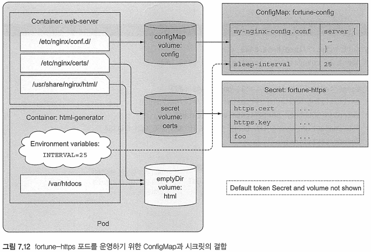

# Kubernetes in Action

---
---
## 7장 ConfigMap과 시크릿: 애플리케이션 설정

---
---
### 7.1 컨테이너화된 애플리케이션 설정


---
---
### 7.2 컨테이너에 명령행 인자 전달

---
---
### 7.3 컨테이너의 환경 변수 설정


---
---
### 7.4 ConfigMap을 통한 설정 분리

---
#### 7.4.6 ConfigMap 엔트리를 파일로 노출하기 위해 ConfigMap 볼륨 사용

##### ConfigMap 생성
* Nginx 서버가 클라이언트에게 보내는 응답에 대해 압축이 필요하다고 생각할 경우
Ex) gzip 압축이 가능한 Nginx 설정(my-nginx-config.conf)
```
server {
    listen              80;
    server_name         www.kubia-example.com;

    gzip on;									# 평문과 XML 파일의 gzip 압축 활성화하기
    gzip_types text/plain application/xml;		#

    location / {
        root   /usr/share/nginx/html;
        index  index.html index.htm;
    }
}
```
* 기존 'fortune-config' ConfigMap을 삭제 후, Nginx 설정 파일을 포함 새로운 ConfigMap을 생성
	- 삭제 : `kubectl delete configmap fortune-config`
	- 생성 : `kubectl create configmap fortune-conftg --from-file=conftgmap-files`


Ex) 파일로부터 생성된 ComfigMap의 YAML 정의
```
$ kubectl get configmap fortune-config -o yaml
apiVersion: v1
data:
  my-nginx-config.conf: |
    server {
        listen              80;
        server_name         www.kubia-example.com;

        gzip on;
        gzip_types text/plain application/xml;

        location / {
            root   /usr/share/nginx/html;
            index  index.html index.htm;
        }

    }
  sleep-interval: |
    25
kind: ConfigMap
...
```
```
참고 : 두 항목의 첫 행의 콜론 다음에 나오는 파이프라인 문자는 리터럴 다중 행 값이 뒤 따른다는 기호이다，
```


---
---
### 7.5 시크릿으로 컨테이너에 민감한 데이터 전달하기

---
#### 7.5.1 시크릿 소개
* 중요한 정보를 저장하고 분류하기 위해 쿠버네티스는 시크릿이라고 하는 별도의 객쳬를 제공
	- 환경 변수로 시크릿 엔트리를 컨테이너에 전달할 수 있음
	- 볼륨의 파일로서 시크릿 엔트리를 노출할 수 있음
* 시크릿에 액세스해야 하는 포드를 실행하는 노드에만 배포
	- 시크릿은 항상 메모리에 저장되고 실제 스토리지에는 기록되지 않음
* 쿠버네티스 버전 1.7부터 etcd에 시크릿을 암호화된 형태로 저장
* 민감한 데이터를 저장할 때는 시크릿을 사용
	- 중요한 데이터와 중요하지 않은 데이터가 모두 포함돼 있으면 시크릿으로 저장

---
#### 7.5.2 기본 토큰 시크릿 소개
* 시크릿에는 세 개의 항목(ca.crt, namespace, token)이 존재
```bash
참고 : 기본적으로 default-token 시크릿은 모든 컨테이너에 탑재되지만 포드 사양의
automountService-AccountToken 필드를 false로 설정하거나 포드가 사용하는 서비스 계정에서
false로 설정해 각 포드에서 토큰 시크릿 키를 비활성화할 수 있다(뒤에서 이 책의 서비스 계정에 대
해 배운다).
```


---
#### 7.5.3 시크릿 생성하기
* HTTPS 트래픽을 제공하도록 설정
* 인증서와 개인키을 만듦
	- 인증서는 시크릿에 보관

Ex) 인증서와 개인키 생성
```
$ openssl genrsa -out https.key  2048
$ openssl req -new -x509 -key https.key -out https.cert -days 3650 -subj /CN=www.kubta-example.com
```

Ex) foo라는 더미 파일을 만들고 문자열 bar를 포함
```
$ echo bar > foo
```

Ex) 3개 파일의 시크릿을 생성
```
$ kubectl create secret generic fortune-https --from-file=https.key --from-file=https.cert --from-file=foo
```
* fortune-https라고 하는 일반 시크릿 생성
	- 두 개의 엔트리를 포함시킴
* `--from-file=fortune-https`를 사용하여 전체 디렉터리 포함도 가능
```
참고 : 일반적인 시크릿을 만들고 있지만 5장에서 했던 것처럼 kubectl create secret tls 명령으로 tls
시크릿을 만들 수도 있다. 그러나 이것은 서로 다른 엔트리 이름을 가진 시크릿을 생성한다
```

---
#### 7.5.4 ConfigMap과 시크릿 비교하기
* 시크릿은 내용은 Base64로 인코딩된 문자열로 표시
	- 인코딩 및 디코딩하기 때문에 YAML고 JSON 형태로 시크릿을 작성하는 것이 좀 더 어려움

##### 바이너리 데이터에 시크릿 사용
* 시크릿 항목에는 일반 텍스트뿐만 아니라 이진 값이 포함될 수 있음
	- Base64 인코딩을 사용하면 바이너리 데이터를 일반 텍스트 형식인 YAML 또는JSON에 포함 가능
```
팁 : 민감하지 않은 바이너리 데이터에도 시크릿을 사용할 수 있지만 시크릿의 최대 크기는 1MB로 제한된다．
```

##### STRINGDATA 필드 소개
* 모든 중요한 데이터가 이진 형식이 아니기 때문에 쿠버네티스는 STRINGDATA 필드를 통해 시크릿의 값을 설정할 수도 있음
Ex) stringData 필드를 사용해 Secret에 일반 데스트 항목 추가
```
kind : Secret
apiVersion: v1
stringData: 		# stringData는 비바이너리 형태의 시크릿 데이터일 때 사용
  foo: plain text	# plain text는 Base64 인코딩된 형태가 아님
data:
  https.cert: LS@tLS1CRUdJTiBDRVJUSUZJQOFURS@tLS@tCk1JSURCekNDQ...
  https.key: LS@tLS1CRUdJTiBSU@EgUFJJVkFURSBLRVktLS@tLQpNSU1FcE...
```
* stringData 필드는 쓰기 전용
	- 값을 설정하는 데만 사용 가능
	- `kubectl get -o yaml`을 사용해 시크릿의 YAML을 검색하면 stringData 필드가 표시되지 않음
* 대신 stringData 필드에 지정한 모든 필드가 data 아래에 표시
	- 다른 모든 엔트리와 마찬가지로 Base64로 인코딩됨

##### 포드의 시크릿 엔트리 읽기
* scecret 볼륨을 통해 컨테이너에 시크릿을 노출하면 시크릿 엔트리의 값은 디코딩돼 실제 형식의 파일에 기록됨
	- 환경변수를 통해 시크릿 항목을 노출할 때도 마찬가지
 
---
#### 7.5.5 포드에서 시크릿 사용
* fortune-https 시크릿을 사용히려면, Nginx가 이를 사용하도록 설정해야 함

##### HTTPS를 적용하기 위해 fortune-config ConfigMap 수정
* `kubectl edtt conftgmap fortune-conftg` 사용
Ex) fortune-config ConfigMap의 데이터를 수정하기
```
...
data:
  my-nginx-config.conf: |
    server {
      listen              80;
	  listen              443 ssl;
      server_name         www.kubia-example.com;
    ssl_certificate       certs/https.cert;			# 경로는 /etc/nginx에 상대적임 
      ssl_certifiate_key  certs/https.key;			#
      ssl_protocols       TLSv1 TLSv1.1 TLSv1.2;
      ssl_ciphers         HIGH:!aNULL:!MD5;
      location / {
        root   /usr/share/nginx/html;
        index  index.html index.htm;
        }
     }
  sleep-interval: |
...
```
* 이렇게 하면 /etc/nginx/certs에서 인증서와 키 파일을 읽도록 서버가 설정되므로 secret 볼륨을 마운트해야 함

##### 포드에서 fortune-https 시크릿 마운트하기
* 새로운 fortune-https 포드를 생성하고 인증서 및 키를 보유한 secret 볼륨을 웹 서버 컨테이너의 적절한 위치에 마운트
Ex) fortune-https YAML 정의(fortune-pod-https.yaml)
```
apiVersion: v1
kind: Pod
metadata:
  name: fortune-https
spec:
  containers:
  - image: luksa/fortune:env
    name: html-generator
    env:
    - name: INTERVAL
      valueFrom:
        configMapKeyRef:
          name: fortune-config
          key: sleep-interval
    volumeMounts:
    - name: html
      mountPath: /var/htdocs
  - image: nginx:alpine
    name: web-server
    volumeMounts:
    - name: html
      mountPath: /usr/share/nginx/html
      readOnly: true
    - name: config
      mountPath: /etc/nginx/conf.d
      readOnly: true
    - name: certs						# /etc/nginx/certs에서 인증서와 키 파일을 읽도록 nginx를 설정했으므로 secret 볼륨을 마운트해야 함
      mountPath: /etc/nginx/certs/		#
      readOnly: true					#
    ports:
    - containerPort: 80
    - containerPort: 443
  volumes:
  - name: html
    emptyDir: {}
  - name: config
    configMap:
      name: fortune-config
      items:
      - key: my-nginx-config.conf
        path: https.conf
  - name: certs							# 여기서 fortune-https 시크릿을 참조해 secret 볼륨을 정의함
    secret:								#
      secretName: fortune-https			#
```


* YAML에 속하지 않지만 자동으로 포드에 추가되는 default-token 시크릿, 볼륨, 볼륨 마운트는 생략
```
참고 : configMap 볼륨과 마찬가지로, secret 볼륨은 defaultMode 속성을 통해 볼륨에 노출된 파일에
대한 권한을 지정하는 기능도 지원한다．
```

##### nginx가 시크릿에서 cert와 key 사용 여부 테스트
* 포드의 포트 443에 대한 포트 포워드 터널을 열고 이를 통해 curl을 사용해 서버에 요청을 보내 포드가 HTTPS 트래픽을 제공하는지 확인
```
$ kubectl port-forward fortune-https 8443:443&

$ curl https://localhost:8443 -k
```

##### 메모리에 저장된 secret 볼륨
* secret 볼륨은 시크릿 파일을 위하여 인메모리 파일 시스템(tmpfs)을 사용함
Ex) 마운트 확인
```
# kubectl exec fortune-https -c web-server -- mount | grep certs
tmpfs on /etc/nginx/certs type tmpfs (ro,seclabel,relatime)
```

##### 환경 변수로 시크릿의 엔트리 노출
* 볼륨을 사용하는 대신 환경 변수로 시크릿 엔트리의 개별 엔트리를 노출할 수도 있음
Ex) 환경 변수로서 시크릿 노출하기
```bash
$ cat fortune-pod-https.yaml                                            
...
spec:
  containers:
...
    env:
    - name: INTERVAL
      valueFrom:
        configMapKeyRef:
          name: fortune-config
          key: sleep-interval
    - name: FOO_SECRET				# 항목 추가
      valueFrom:					
        secretKeyRef:
          name: fortune-https		# 키를 보유하고 있는 시크릿 이름
          key: foo					# 노출해야 할 시크릿 키
    volumeMounts:
...
```
* 환경 변수를 통해 시크릿을 노출할 수 있지만 이 기능을 사용하는 것이 가장 좋은 방법은 아님
	- 어플리케이션 로그에 남겨 의도하지 않게 이를 노출시킬 수 있음
	- 자식 프로세스는 부모 프로세스의 모든 환경 변수를 상속함
```
팁 : 환경 변수를 사용해 시크릿을 컨테이너에 전달하는 방법은 , 의도치 않게 시크릿이 노출될 수 있으므로 
사용하기 전 한 번 더 생각하기 바란다. 안전을 기하기 위해 항상 시크릿 노출을 위해 secret 볼륨을 사용해라．
```


---
#### 7.5.6 이미지 풀 시크릿
* 개인 레지스트리에 있는 컨테이너 이미지를 가져오는 데 자격 증명이 필요

##### 도커 허브에서 개인 이미지 레포지터리 사용
* 도커 허브는 공용 이미지 레포지터리 외에도 개인 레포지터리를 만들 수 있음
* 개인 스토리지의 이미지를 사용하는 포드를 실행하려면 2가지 작업이 필요
	- 도커 레지스트리에 대한 자격 증명이 있는 시크릿을 만듦
	- 포드 매니페스트의 imagePullSecrets 필드에서 시크릿을 참조

##### 도커 레지스트리 인증을 위한 시크릿 생성
* `kubectl create secret` 명령을 사용하지만 7.5.3절과 다른 유형과 읍션을 사용
```bash
$ kubectl create secret docker-registry mydockerhubsecret \
 --docker-username=myusernarne --docker-password=mypassword \
 --docker-email=my.email@provider.com
```
* generic 시크릿을 작성하는 대신, mydockerhubsecret이라는 docker-registry 시크릿을 작성
	- 도커 호브 사용자 이름, 비밀 번호, 이메일을 지정
* `kubectl describe`로 새로 생성된 시크릿의 내용을 검사하면, .dockercfigjson라는 단일 항목이 포함돼 있음을 알 수 있음
	 
##### 포드 정의에서 도커 레지스트리 시크릿 사용
Ex) 이미지 풀 시크릿을 이용한 포드 정의(pod-with-private-image.yaml)
```yanl
apiVersion: v1
kind: Pod
metadata:
  name: private-pod
spec:
  imagePullSecrets:					# 개인 이미지 스토리지에서 이미지를 가져오는 것을 가능하게 함
  - name: mydockerhubsecret
  containers:
  - image: username/private:tag
    name: main
```

##### 모든 포드에 이미지 풀 시크릿을 지정할 필요가 없다
* 시크릿을 ServiceAccount에 추가하면 이미지 풀 시크릿이 모든 포드에 자동으로 추가됨
	- 12장 참고(p517)

---
---
### 7.6 요약
* 


---
## 출처
[^출처]: Kubernetes in Action-마르코 룩샤-에이콘


<!--  -->