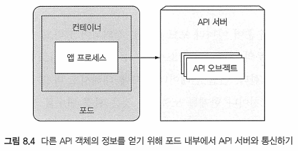
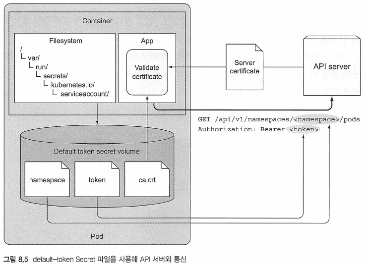
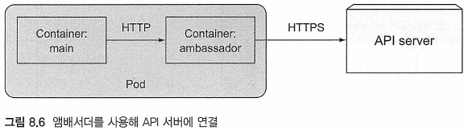
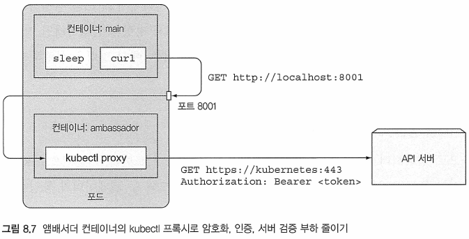

# Kubernetes in Action

---
---
## 8장 어플리케이션에서 포드 메타 데이터와 그 외의 리소스에 접근하기

---
### 8.1 Dwonward API를 통한 메타 데이터 전달


---
#### 8.1.1 사용 가능한 메타 데이터

---
#### 8.1.2 환경 변수를 통한 메타 데이터 노출

---
#### 8.1.3 Downward API 볼륨 내의 파일을 통한 메타 데이터 전달


---
---
### 10.2 쿠버네티스 API 서버와 통신하기
* 서비스 및 포드에 대한 정보는 서비스 관련 환경 변수 또는 DNS를 통해 얻을 수 있음
* 그러나 어플리케이션이 다른 리소스에 대한 데이터를 필요로 하거나 가능한 한 최신 정보에 접근이 필요한 경우
	+ AFT 서버와 직접 통신해야 함




---
#### 10.2.1 쿠버네티스 REST API 탐색
* kubectl cluster-info를 실행해 API서버 URL을 얻을 수 있음
```bash
$ kubectl cluster-info
Kubernetes master is running at https://192.168.10.200:6443
KubeDNS is running at https://192.168.10.200:6443/api/v1/namespaces/kube-system/services/kube-dns:dns/proxy

To further debug and diagnose cluster problems, use 'kubectl cluster-info dump'.
```

* 서버는 HTTPS를 사용하고 인증이 필요하기 때문에 직접 통신하기가 쉽지 않음
```bash
$ curl -k https://192.168.10.200:6443
{
  "kind": "Status",
  "apiVersion": "v1",
  "metadata": {

  },
  "status": "Failure",
  "message": "forbidden: User \"system:anonymous\" cannot get path \"/\"",
  "reason": "Forbidden",
  "details": {

  },
  "code": 403
}#  
```
* __인증을 직접 처리하는 대신 'kubectl proxy' 명령을 실행해 프록시를 통해 서버와 통신할 수가 있음__

##### KUBECTL PROXY를 통한 API 서버 접근
* KUBECTL PROXY 명령
	- 로컬 시스템에서 HTTP 연결을 허용하고 인증을 처리하는 동안 API 서버로 프록시히는 프록시 서버를 실행함
		+ 요청할 때마다 인증 토큰을 전달할 필요가 없음
		+ 또한 중간에 있는 사람이 아닌 실제 API 서버와 통신하고 있는지 확인함

Ex) 프록시 사용
```bash
$ kubectl proxy
Starting to serve on 127.0.0.1:8001
```
* __kubectl은 필요한 모든 것을 이미 알고 있기 때문에(API 서버 URL, 인증 토큰 등）다른 인자를 전달할 필요가 없음__
	- ~/.kube/config

Ex) 동작 확인
```bash
$ curl localhost:8001
{
"paths": [
"/apt",
"/api/vl",
...
```
* 프록시를 동작시킨 상태에서 접속

##### kubectl proxy를 통한 쿠버네티스 API 탐험
Ex) API 서버의 REST 엔트포인트 예저 보기
```bash
$ curl http://localhost:8001
{
  "paths": [
    "/api",
    "/api/v1",				# 더 많은 리소스 파일을 찾을 수 있음
    "/apis",
...
    "/apis/apps",
    "/apis/apps/v1",
...
    "/apis/batch",			# 배치 API 그룹과 그룹의 두 버전
    "/apis/batch/v1",		# 
    "/apis/batch/v1beta1",
...   
```

##### 배치 API 그룹의 REST 엔드포인트 탐험
Ex) /apis/batch 하위에 엔드포인트 나열하기
```bash
$ curl http://localhost:8001/apis/batch
{
  "kind": "APIGroup",
  "apiVersion": "v1",
  "name": "batch",
  "versions": [
    {
      "groupVersion": "batch/v1",			# 배치 API그룹에는 두 가지 버전이 있음
      "version": "v1"						#
    },										#
    {										#
      "groupVersion": "batch/v1beta1",		#
      "version": "v1beta1"					#
    }
  ],
  "preferredVersion": {						# 클라이언트는 v1beta1 대신 v1버전읗 사용해야 함
    "groupVersion": "batch/v1",				#
    "version": "v1"							#
  }
}#           
```
* 사용 가능한 버전 및 클라이언트가 사용해야 하는 기본 버전을 포함해 배치 API 그룹에 대한 설명이 표시됨

Ex) /apis/batch/v1의 리소스 유형
```bash
$ curl http://localhost:8001/apis/batch/v1
{
  "kind": "APIResourceList",		# batch/v1 API 그룹의 API 리소스 예제
  "apiVersion": "v1",
  "groupVersion": "batch/v1",
  "resources": [					# 이 그룹은 모든 리소스 유형을 포함하는 배열이 존재
    {
      "name": "jobs",				# namespace인 잡 리소스를 설명함
      "singularName": "",
      "namespaced": true,
      "kind": "Job",
      "verbs": [					# 이 리소스와 함께 사용할 수 있는 동사
        "create",					# 사용자 작업을 생성/삭제/검색/감시/업데이트 할 수 있음
        "delete",
        "deletecollection",
        "get",
        "list",
        "patch",
        "update",
        "watch"
      ],
      "categories": [
        "all"
      ],
      "storageVersionHash": "mudhfqk/qZY="
    },
    {
      "name": "jobs/status",		# 상태를 수정하기 위한 특별한 REST 엔드포인트가 있음
      "singularName": "",
      "namespaced": true,
      "kind": "Job",
      "verbs": [					# 상태를 검색/패치/업데이트 할 수 있음
        "get",
        "patch",
        "update"
      ]
    }
  ]
```
* "name": "jobs "행
	- API에 /apis/batch/v1/jobs 엔드포인트가 있음을 알려줌
* "verbs" 배열
	- 해당 엔드포인트를 통해 작업 리소스를 검색, 업데이트, 삭제할 수 있음을 알려줌
* 특정 리소스의 경우 추가 API 엔드포인트도 노출됨


##### 클러스터에 있는 모든 잡 인스턴스 목록
* 클러스터의 잡 목록을 얻으려면 /apis/batch/vi/jobs 경로에서 GET 요청을 수행
Ex) 잡 목록
```bash
$ curl http://localhost:8001/apis/batch/v1/jobs
{
  "kind": "JobList",
  "apiVersion": "batch/v1",
  "metadata": {
    "selfLink": "/apis/batch/v1/jobs",
    "resourceVersion": "110887"
  },
  "items": []
}#  
```
* 클러스터에 잡 리소스가 배치되어 있지 않기 때문에 항목 배열이 비어있음

##### 이름으로 특정한 잡 인스턴스 가져오기
* 하나의 특정한 잡을 되돌리려면 URL에 이름과 네임스페이스를 지정해야 함

Ex) 이름으로 특정한 네임스페이스의 리소스 가져오기
```bash
$ curl http://localhost:8001/apts/batch/vl/namespaces/default/jobs/my-job
{
"kind": "Job".
"aoiVers ion": "batch/vi".
"metadata": {
  "name": "mv-lob",
  "namesoace": "default".
...
```
* 실행하면 my-job 잡의 리소스의 완전한 JSON 정의가 반환됨
	- my-job이라는 잡 리소스를 생성해야 반환됨
* `$ kubectl get job my-job -o json`

---
#### 8.2.2 포드 내에서 API 서버와 통신
* kubectl을 가지고 있지 않은 보통의 포드 내에서 API 서버와 통신하는 방법을 살펴보기
* 포드 내부에서 API 서버와 통신하기 위한 3가지
	- API 서버의 위치를 찾아야 함
	- API 서버를 가장하지 않고 API서버에게 이야기해야 함
	- 서버와 인증함
		+ 인증하디 않으면 아무것도 볼 수도 실행도 안됨

##### API 서버와의 통신을 시도해서 포드 실행하기
* 실습 준비/절차
	- API 서버와 통신할 수 있는 아무것도 하지 않는 포드 준비
		(컨테이너에서 sleep 명령읗 실행)
	- kubectl exec로 컨테이너에서 셀들 실행
	- curl을 사용해 해당 셀 내에서 API서버에 액세스 시도
		+ curl바이너리를 포함하는 컨테이너 이미지 필요(tutum/curl)

Ex) API 서버와 통신을 시도하는 포드(curl.yaml)
```bash
apiVersion: v1
kind: Pod
metadata:
  name: curl
spec:
  containers:
  - name: main
    image: tutum/curl				# 컨테이너에서 사용할 수 있는 curl이 필요하기 때문에 tutum/curl 이미지 사용
    command: ["sleep", "9999999"]	# 컨테이너를 계속 실행하려면 sleep 명령을 오래 실행해야 함
```	
* 포드를 생성한 후 kubectl exec를 실행해 컨테이너 내부에 bash 셸을 실행함

##### API 서버 주소 찾기
* 먼저, 쿠버네티스 API 서버의 IP와 포트를 찾아야 함
	- `kubectl get svc`사용
	- ```
	  root@curl:/# env | grep KUBERNETES_SERVICE
	  KUBERNETES_SERVICE_PORT=443
	  KUBERNETES_SERVICE_HOST=10.96.0.1
	  KUBERNETES_SERVICE_PORT_HTTPS=443
	  ```
#### 서버의 신원 검증
* 자동 생성 시크릿은 각 컨테이너의 /var/run/secrets/kubernetes.io/serviceaccount/에 마운트 됨
	- 토큰, 네임스페이스, 인증서 정보를 가짐
```bash
root@curl:/# ls /var/run/secrets/kubernetes.io/serviceaccount/
ca.crt  namespace  token
```

Ex) 서버의 인증서가 CA에 의해 서명됐는지 확인
```bash
root@curl:/# curl --cacert /var/run/secrets/kubernetes.io/serviceaccount/ca.crt https://kubernetes
{
  "kind": "Status",
  "apiVersion": "v1",
  "metadata": {

  },
  "status": "Failure",
  "message": "forbidden: User \"system:anonymous\" cannot get path \"/\"",
  "reason": "Forbidden",
  "details": {

  },
  "code": 403
```
* --cacert 읍션을 사용해 CA 인증서를 지정
* 클라이언트(curl)는 API 서버를 신뢰하지만 자신이 누구인지 모르기 때문에 API 서버 자쳬에 액세스 권한이 없다고 표시됨

Ex) 서버의 인증서가 CA에 의해 서명됐는지 확인
```
root@curl:/# export CURL_CA_BUNDLE=/var/run/secrets/kubernetes.io/serviceaccount/ca.crt
```
* 'CURL_CA_BUNDLE' 환경변수를 설정하면 curl을 실행할 때마다 --cacert를 지정할 필요가 없음

##### API 서버로 인증
* 인증을 위해서는 인증 토큰이 필요
	- 기본 토큰은 시크릿을 통해 제공됨
	- 토큰 파일은 비밀 볼륨에 저장됨

Ex) 토큰을 환경 변수에 로드
```bash
root@curl:/# TOKEN=$(cat /var/run/secrets/kubernetes.io/serviceaccount/token)
```

Ex) API 서버로부터 적절한 응답 받기
```bash
root@curl:/# curl -H "Authorization: Bearer $TOKEN" https://kubernetes/
{
  "paths": [
    "/api",
    "/api/v1",
    "/apis",
    "/apis/",
    "/apis/admissionregistration.k8s.io",
    "/apis/admissionregistration.k8s.io/v1",
    "/apis/admissionregistration.k8s.io/v1beta1",
...
```
* 요청의 Authorization HTTP 헤더 안에 토큰을 전달

```
역할 기반 접근 제어（RBAC) 비활성화
$ kubectl create clusterrolebinding permissive-binding \
--clusterrole=cluster-admin \
--group=system:serviceaccounts
이렇게 하면 모든 서비스 계정(모든 포드라고 말할 수 있음)에 클러스터 관리자 권한이 부여되어 원하는
 대로할 수 있다. 명백히 이 작업은 위험성이 있기에 제품의 클러스터에서 절대로 수행해서는 안 된다.
 테스트 목적이라면 상관없다，
```
* 참고
	- https://kubernetes.io/docs/reference/access-authn-authz/rbac/

##### 실행 중인 포드의 네임스페이스 가져오기
* Downward API를 통해 네임스페이스를 포드로 전달할 수 있음
* 시크릿 볼륨에 네임스페이스라는 파일이 존재
* 파일의 내용을 NS 환경 변수로 로드한 후, 다음 예제에 표시된 대로 모든 포드를 나열해 보기

Ex) 포드 자신의 네임스페이스에 포드 나열하기
```bash
root@curl:/# NS=$(cat /var/run/secrets/kubernetes.io/serviceaccount/namespace)
root@curl:/# curl -H "Authorization: Bearer $TOKEN" https://kubernetes/api/v1/namespaces/$NS/pods
  % Total    % Received % Xferd  Average Speed   Time    Time     Time  Current
                                 Dload  Upload   Total   Spent    Left  Speed
  0     0    0     0    0     0      0      0 --:--:-- --:--:-- --:--:--     0{
  "kind": "PodList",
  "apiVersion": "v1",
  "metadata": {
    "selfLink": "/api/v1/namespaces/default/pods",
    "resourceVersion": "188084"
  },
...
```
* 같은 방식으로 다른 API 객쳬를 검색할 수도 있으며,
	- 간단한 GET 요청 대신 PUT 또는 PATCH를 보내 업데이트할 수도 있음

##### 포드가 쿠버네티스와 통신하는 방법 자세히 알아보기
* 어플리케이션이 쿠버네티스 API에 문제없이 액세스할 수 있는 방법
	- API 서버의 인증서가, ca.crt파일에 있는 certificate 기관에 의해 서명됐는지 여부를 확인 필요
	- 어플리케이션은 토큰 파일에서 무기명 토큰과 함께 권한 부여 헤더를 보내 자신을 인증해야 함
	- 네임스페이스 파일은 포드의 네임스페이스 안에 있는 API 객쳬에 대해 CRUD 작업을 수행할 때,
		+ 네임스페이스를 API 서버로 전달하는 데 사용해야 함

##### CRUD 정의
* Create, Read, Update, Delete를 뜻함
	- HTTP 메소드의 각각 POST, GET, PATCH/PUT 및 DELETE에 해당함


	
---
#### 8.2.3 앰배서더 컨테이너와 API 서버 통신 간소화
* 앰배서더 컨테이너
	- 포드 내부에서도, API 서버로 직접 보내지 않고 프록시로 보내 인증, 암호화 및 서버 확인을 처리하도록 만듦

##### 앰배서더 컨테이너 패턴 소개
* API 서버와 직접 통신하는 대신 메인 컨테이너 옆의 앰배서더 컨테이너에서 kubectl 프록시를 실행하고 kubectl 프록시를 통해 API 서버와 통신

* 어플리케이션은 HTTPS 대신 HTTP를 통해 앰버서더에 연결
* 보안 역할읗 하는 앰버서더 프록시가 API서버에 HTTPS 연결을 처리
	- 기본 토큰의 시크릿 볼륨에 있는 파일을 사용해 수행

##### 추가적인 앰배서더 컨테이너로 curl 포드 실행하기
* 다기능의 kubectl-proxy 컨테이너 이미지 만들기
	- '/Chapter08/kubectl-proxy/' 사용
	- https://github.com/luksa/kubernetes-in-action
* 포드의 모든 컨테이너는 동일한 루프백 네트워크 인터페이스를 공유함
	- 어플리케이션은 locaihost의 포트를 통해 프록시에 액세스 가능

Ex) 앰배서더 컨네이너가 있는 포드(curl-with-ambassador.yaml)
```yaml
apiVersion: v1
kind: Pod
metadata:
  name: curl-with-ambassador
spec:
  containers:
  - name: main
    image: tutum/curl
    command: ["sleep", "9999999"]
  - name: ambassador
    image: luksa/kubectl-proxy:1.6.2	# kubectl-proxy 이미지를 실행하는 앰배서더 컨테이너
```
* 포드에는 2개의 컨테이너가 존재
* 기본 컨테이너에서 bash를 실행하기 위해선 `-c main`옵션을 사용
	- 포드의 첫 번째 컨테이너에서 명령을 실행하려면 명시적으로 컨테이너를 지정하지 않아도 됨


Ex) 접속
```bash
$ kubectl exec -it curl-with-ambassador -c main bash
root@curl-with-ambassador: /#
```

##### 앰배서더를 통한 API 서버와의 통신
Ex) 앰버서더 컨네이너를 통해 API서버 액세스하기
```bash
$ root@curl-with-ambassador:/# curl localhost:8001
{
  "paths": [
    "/api",
    "/api/v1",
    "/apis",
    "/apis/",
    "/apis/admissionregistration.k8s.io",
    "/apis/admissionregistration.k8s.io/v1"
```
* 기본적으로 kubectl 프록시는 포트 8001에 바인딩함
* 두 컨테이너는 네트워크 인터페이스를 공유


* curl -> 앰배서더 컨테이너 내 실행되는 프록시 ==> HTTP요청을 함(인증 헤더 없음)
* 프록시 ==> HTTPS 요청 -> API 서버(토큰을 보내며, 클라이언트 인증을 처리) 


---
#### 8.2.4 클라이언트 라이브러리를 사용해 API 서버와 통신
* 간단한 API 요청 이상을 수행하려면 기존 쿠버네티스 API 클라이언트 라이브러리 중 하나를 사용하는 것이 좋음

##### 기존의 클라이언트 라이브러리 사용
* API Machinery SIG(special interest group)에서 지원하는 두 개의 쿠버네티스 API 클라이언트 라이브러리
	- 고랭 클라이언트(Golang Client): https://github.com/kubernetes/dient-go
	- 파이썬(Python): https://github.com/kubernetes-incubator/dient-python

```
참고 : 쿠버네티스 커뮤니티에는 쿠버네티스 생태계의 특정 부분에 초점을 맞춘 다양한 SIG(special
interest group) 및 워킹 그룹이 있다. 이 목록은 https://github.com/kubernetes/community/blob/
master/sig-list.md에서 찾을 수 있다．
```

* 사용자 제공 클라이언트 라이브러리 목록
	- Fabric8 자바 클라이언트： https://github.com/fabric8io/kubernetes-client
	- Amdatu 자바 클라이언트： https://bitbucket.org/amdatulabs/amdatu-kubernetes
	- Tenxcloud Node.js 클라이언트: https://github.com/tenxcloud/node-kubernetes-client
	- GoDaddy Node.js 클라이언트: https://github.com/godaddy/kubernetes-client
	- PHP: https://github.com/devstub/kubernetes-api-php-client
	- 다른 PHP 클라이언트： https://github.com/maclof/kubernetes-client
	- Ruby: https://github.com/Ch00k/kubr
	- 다른 Ruby 클라이언트： https://github.com/abonas/kubeclient
	- Clojure: https://github.com/yanatan16/clj-kubernetes-api
	- Scala: https://github.com/doriordan/skuber
	- Perl: https://metacpan.org/pod/Net::Kubernetes
	
* 이런 라이브러리는 대개 HTTPS를 지원하고 인증을 처리히므로 앰배서더 컨테이너를 사용할 필요가 없음	

##### FABRIC8 자바 클라이언트를 사용한 쿠버네티스와의 상호작용 예시
##### 스웨거와 OpenAPI를 사용해 자신만의 라이브러리 구축

---
---
### 8.3 요약
* 학습 도중
* 학습 도중
* 학습 도중
* kubectL 프록시를 통해 쿠버네티스REST API를 검색하는 방법
* 쿠버네티스에 정의된 다른 서비스와 마찬가지로 환경 변수 또는 DNS를 통해 포드가 API 서버의 위치를 찾는 방법
* 포드에서 실행 중인 애플리케이션이 API 서버와 통신하고 있으며 자신을 인증하는 방법을 확인할 수 있는 방법
* 앰버서더 컨테이너를 사용해서 애플리케이션 내에서 API 서버와 훨씬 더 간단하게 통신할 수 있는 방법
* 학습 도중


---
## 출처
[^출처]: Kubernetes in Action-마르코 룩샤-에이콘


<!--  -->