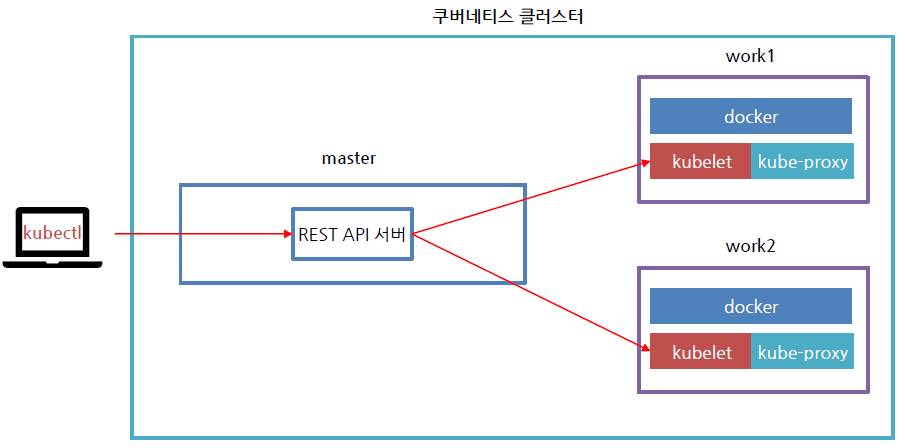
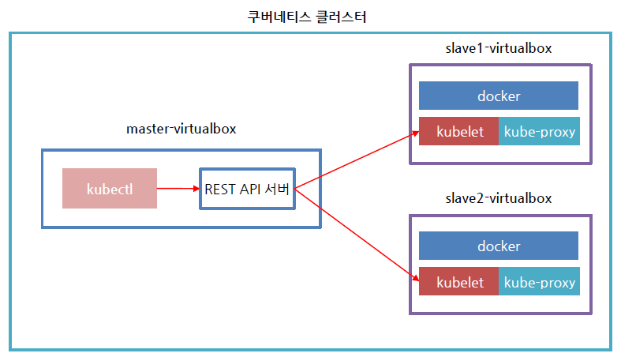
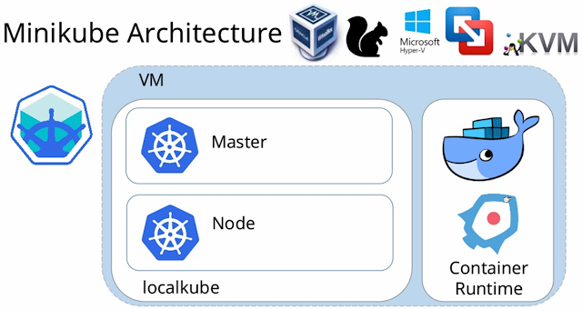
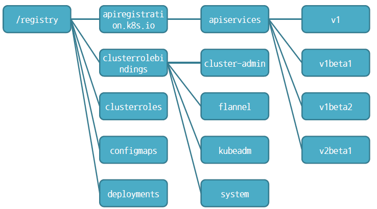
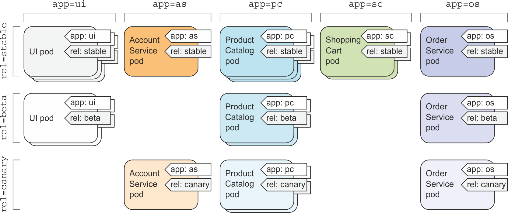

# 데브옵스(DevOps)를 위한 쿠버네티스 마스터

---
## 01. (쿠버네티스 들어가기 앞서) 왕초보도 따라하는 도커 기초

---
### 13.인프런 - 풀스택 워드프레스 컨테이너 이미지 만들기
* xampp 사용
	- apache, MariaDB, php가 설치되어 있음

Ex) xampp 설치
```zsh
$ docker run --name WP -p 80:80 -d tomsik68/xampp
Unable to find image 'tomsik68/xampp:latest' locally
~생략~
```
* tomsik68 이 만든 이미지
* `firefox http://127.0.0.1` 접속하여 확인 가능


Ex) 워드프레스 설치
```zsh
$ wget https://ko.wordpress.org/latest-ko_KR.tar.gz
$ tar xf latest-ko_KR.tar.gz
```
* 파일은 컨테이너에 넣어서 바로 실행하면 됨


Ex) 소유 권한 바꾸기 및 백업
```zsh
$ sudo docker exec -it WP bash
root@e9d20757fcfd:/# chown daemon. /opt/lampp/htdocs

root@e9d20757fcfd:/# cd /opt/lampp/htdocs
root@e9d20757fcfd:/opt/lampp/htdocs# mkdir backup
root@e9d20757fcfd:/opt/lampp/htdocs# mv * ./backup/
root@e9d20757fcfd:/opt/lampp/htdocs# exit
```
* 웹페이지에 쓰기가 가능해짐
* 웹 루트 : /opt/lampp/htdocs

Ex) 워드프레스 파일 복사
```zsh
$ docker cp wordpress WP:/opt/lampp/htdocs
$ sudo docker exec -it WP bash
root@e9d20757fcfd:/# chown daemon. /opt/lampp/htdocs
root@e9d20757fcfd:/# mv /opt/lampp/htdocs/wordpress/* /opt/lampp/htdocs/
root@e9d20757fcfd:/# exit
```
* `firefox http://127.0.0.1` 접속하여 확인 가능
	- 이후, 브라우저를 통해 진행함
	- `http://127.0.0.1/phpmyadmin/`로 접속
		+ `wordpress` DB 하나 만들기
* DB를 만들고, 설정해 계속 진행
	- 사이트 제목: wordpress_test
	- ID/PW: test/test1234

Ex) 재사용 및 백업
```zsh
$ sudo docker stop WP

$ docker commit WP kyj9724/wordpress
sha256:207a2dd75822dbef0fe22d517baab7074985f1cbbdd3828dbca014da195ed6df

$ docker login 

$ docker push kyj9724/wordpress
```

Ex) 확인
```zsh
$ docker rm `docker ps -a -q`
$ docker run -d -p 80:80 --rm kyj9724/wordpress
43cca2e197590623228449ee0445d4a3af5e09a67fad0fd34caab02bbadde74b
```
* `docker restart 43cca2e` 안되면 재시작

---
## 02.쿠버네티스 들어가기

---
### 0. 쿠버네티스 소개 


#### 쿠버네티스 시작
* 오랜 세월 동안 구글은 보그 (Borg)라는 내부 시스템을 개발
* 애플리케이션 개발자와 시스템 관리자가 수천 개의 애플리케이션과 서비스를 관리하는 데 도움
* 조직 규모가 클 때 엄청난 가치를 발휘
* 수십만 대의 시스템을 가동할 때 사용률이 조금만 향상돼도 수백만 달러의 비용 절감 효과
* 구글은 보그와 오메가를 15년 동안 비밀로 유지
* 2014 년 구글 시스템을 통해 얻은 경험을 바탕으로 한 오픈소스 시스템인 쿠버네티스를 출시
	- GO언어를 바탕으로 만듬

#### 인프라의 추상화
* 많은 노드(컴퓨터)들을 하나의 거대한 컴퓨터로 인식
	- 클러스터링
* 컨테이너 애플리케이션을 쉽게 배포 관리하도록 돕는 소프트웨어 시스템

#### 쿠버네티스의 장점
* 애플리케이션 배포 단순화
	- 특정 베어메탈을 필요로 하는 경우 (예:SSD/HDD)
	- 라벨링을 통한 쉬운 배포 가능

* 하드웨어 활용도 극대화
	- 클러스터의 주변에 자유롭게 이동하여 실행중인 다양한 애플리케이션 구성 요소를 클러스터 노드의 가용 리소스에 최대한 맞춰 서로
	섞고 매치
	- 노드의 하드웨어 리소스를 최상으로 활용
	
* 상태 확인 및 자가 치유
	- 애플리케이션 구성 요소와 실행되는 노드를 모니터링하고 노드 장애 발생시 다른 노드로 일정을 자동으로 재조정
	- 운영자는 정규 근무 시간에만 장애가 발생한 노드를 처리(일이 편해진다)
	
* 오토스케일링
	- 개별 애플리케이션의 부하를 지속적으로 모니터링할 필요 없이
	- 자동으로 리소스를 모니터링하고 각 애플리케이션에서 실행되는 인스턴스 수를 계속 조정하도록 지시 가능
	
* 애플리케이션 개발 단순화
	- 버그 발견 및 수정(완전히 개발환경과 같은 환경을 제공하기 때문)
	- 새로운 버전 출시 시 자동으로 테스트, 이상 발견 시 롤 아웃

#### 쿠버네티스의 궁극의 목적
* 개발자 돕기 : 핵심 애플리케이션 기능에 집중
	- 애플리케이션 개발자가 특정 인프라 관련 서비스를 애플리케이션에 구현하지 않아도 됨
		+ 쿠버네티스에 의존해 서비스 제공
	- 서비스 검색 확장 로드 밸런싱 자가 치유 리더 선출 등
	- 애플리케이션 개발자는 애플리케이션의 실제 기능을 구현하는 데 주력
	- 인프라와 인프라를 통합하는 방법을 파악하는데 시간을 낭비할 필요 없음
* 운영 팀 돕기 : 이 효과적으로 리소스를 활용
	- 실행을 유지하고 서로 통신할 수 있도록 컴포넌트에 정보를 제공
	- 애플리케이션이 어떤 노드에서 실행되는 상관 없음 (신경 쓰지 않아도 됨)
	- 언제든지 애플리케이션을 재배치 가능
	- 애플리케이션을 혼합하고 매칭시킴으로써 리소스를 매칭
* DevOps 극대화
		+ 컨테이너 -> 오케스트라 툴

---
### 1. 아키텍처 

#### 쿠버네티스 클러스터 아키텍처
* 쿠버네티스의 클러스터는 하드웨어 수준에서 많은 노드로 구성되며 두 가지 유형 나뉨
	- 마스터 노드: 전체 쿠버네티스 시스템을 관리하고 통제하는 쿠버네티스 컨트롤 플레인을 관장
	- 워커 노드: 실제 배포하고자 하는 애플리케이션의 실행을 담당

### 컨트롤 플레인(마스터)
* 컨트롤 플레인에서는 클러스터를 관리하는 기능
* 단일 마스터 노드에서 실행하거나 여러 노드로 분할되고 복제돼 고가용성을 보장
* 클러스터의 상태를 유지하고 제어하지만 애플리케이션을 실행하지 않음

---
### 2. 클러스터 설치 브리핑
* Master, Worker1, Worker2로 구성 실습
* 모두 docker 설치는 필수

#### 쿠버네티스 설치 필요 사항
* 버추얼박스에서 각 노드에서 복제하면서 반드시 변경해야 하는 설정
	- 호스트 이름 /etc/hostname
	- 네트워크 인터페이스 변경
	- NAT 네트워크 설정 (NAT랑 다름)
	- (호스트 이름 변경하려면 반드시 리붓)
* hostname으로 노드를 구별함(중요)
* MAC주소 및 NAT 설정
	- 통신이 되게 만듦

#### kubernetes를 관리하는 명령어
* kubeadm
	- 클러스터를 부트스트랩하는 명령
	- 인증성 관리, 마스터 노드를 만들 수 있도록 초기화 함, 쿠버네티스 설치
* kubelet
	- 클러스터의 각 노드에서 실행되는 에이전트
	- Kubelet은 포드에서 컨테이너가 확실하게 동작하도록 관리함
	- 클러스터의 모든 시스템에서 실행되는 구성 요소로 창 및 컨테이너 시작과 같은 작업을 수행
	- 쿠버네티스를 통해 생성되지 않는 컨테이너는 관리하지 않음
* kubectl
	- 커맨드 라인 util은 당신의 클러스터와 대화
	- 클라이언트 프로그램

###### 부트스크랩
* 일반적으로 한 번 시작되면 알아서 진행되는 일련의 과정을 의미

#### 쿠버네티스 우분투에 설치
* 다음 내용을 install.sh 파일에 작성하고 chmod로 권한을 주고 실행
* 쿠버네티스 설치 사이트 아래 스크립트 내용이 있음
	
- https://kubernetes.io/docs/setup/production-environment/tools/kubeadm/install-kubeadm/
	
* 신뢰할 수 있는 APT 키를 추가
	- apt-get update && apt get install -y apt-transport-https curl
	- curl -s https://packages.cloud.google.com/apt/doc/apt-key.gpg | apt-key add -

* 그리고 아래의 명령어로 Repository 를 추가하고 Kubernetes 를 설치
	```bash
	cat <<EOF> /etc/apt/sources.list.d/kubernetes.list
	deb https://apt.kubernetes.io/kubernetes-xenial main
	EOF
	apt-get update
	apt-get install -y kubelet kubeadm kubectl
	apt-mark hold kubelet kubeadm kubectl
	```

#### 쿠버네티스 centOS에 설치
* 쿠버네티스 설치 사이트 아래 스크립트 내용이 있음	
- https://kubernetes.io/docs/setup/production-environment/tools/kubeadm/install-kubeadm/

```bash
# Set SELinux in permissive mode (effectively disabling it)
setenforce 0
sed -i 's/^SELINUX=enforcing$/SELINUX=permissive/' /etc/selinux/config
```
* setenforce 0: 일시적으로 비활성화 / 1을 사용하면 활성화
	- 영구 적용을 원하면 '/etc/selinux/config' 파일 수정
* Permissive mode
	- rule 에 어긋나는 동작이 있을 경우 audit log 를 남기고 해당 operation은 허용
	- audit log : 리눅스 감사 시스템 데몬 로그
		+ 설정된 감사 룰에 따라 시스템 정보 기록


#### Master 노드 초기화(마스터 노드에서만 할 것)
* Master노드를 초기화를 가장 먼저 수행 (사용할 포드 네트워크 대역을 설정)
	- `sudo kubeadm init`
	- 오류/타임아웃 발생시 '신뢰할 수 있는 APT 키를 추가' 실시 
* 스왑 에러 발생 시 스왑 기능 제거
	- `free -m` : 스왑 파티션 확인
	- `swapon -s` : 스왑 파일 확인
	- `sudo swapoff -a` : 현재 커널에서 스왑 기능 끄기
	- `sudo sed -i '/swap / s/^\(.*\)$/#\1/g' /etc/fstab` : 리붓 후에도 스왑 기능 유지
	- __워커노드에서도 스왑 기능 제거 필요!!!__
	- 'kubelet'은 스왑이 있으면 작동안함

* Kubernetes에서 스왑을 비활성화하는 이유
	- Kubernetes 1.8 이후, 노드에서 스왑을 비활성화해야 함 (또는 fail swap on을 false 로 설정)
	- kubernetes의 아이디어는 인스턴스를 최대한 100에 가깝게 성능을 발휘하는 것
	- 모든 배포는 CPU/ 메모리 제한을 고정하는 것이 필요
	- 따라서 스케줄러가 포드를 머신에 보내면 스왑을 사용하지 않는 것이 필요
	- 스왑 발생시 속도가 느려지는 이슈 발생
	- 성능을 위한 것

[참고문헌] https://serverfault.com/questions/881517/why-disable-swap-on-kubernetes

#### 클러스터를 사용 초기 세팅(마스터 노드에서만 할 것)
* 다음을 일반 사용자 계정으로 실행 콘솔에 출력된 메시지를 복붙
	```
	mkdir -p $HOME/.kube
	sudo cp -i /etc/kubernetes/admin.conf $HOME/.kube/config
	sudo chown $(id -u):$(id -g) $HOME/.kube/config
	```

* Pod Network 추가 (Installing a Pod network add-on)
	`kubectl apply -f "https://cloud.weave.works/k8s/net?k8s-version=$(kubectl version | base64 | tr -d '\n')"`
	
	- Weave Net이라는 포드 네트워크 플러그인 설치
	- 이것을 잘해야 노드 추가 명령어가 잘 실행됨
	- root로 위에 명령어를 통해 'config'파일을 만들어야 실행됨
* 컨테이너 네트워크 인터페이스(CNI) 기반 Pod 네트워크 애드온으로 Pod가 서로 통신할 수 있음
	- 네트워크를 설치하기 전에 클러스터 DNS(CoreDNS)가 시작되지 않음
###### 참고 : https://kubernetes.io/docs/setup/production-environment/tools/kubeadm/create-cluster-kubeadm/


#### 슬레이브 노드 추가 (슬레이브 노드에서만 할 것)
* 앞서 설치한 대로 쿠버네티스 설치
* init 명령어 전까지만 수행 (init 명령어 실행하지 마세요)
* 이후 각 노드에서 관리자 권한으로 워커 노드를 참가 시킴 (콘솔에 출력된 메시지를 복붙)
	```
	sudo kubeadm join 10.0.2.15:6443 -token xwvbff.5xc67j8qc6ohl2it \
	   --discovery-token-ca-cert-hash sha256:e19e9263aeb2340a602c2057966b71551e01a5e287d3f23b05073c7b248932e1
	```
* --discovery-token-ca-cert-hash : root CA 공개키

---

#### Error 발생시

[참고] https://xoit.tistory.com/94

Ex) 오류
```bash
 [ERROR FileContent--proc-sys-net-bridge-bridge-nf-call-iptables]: /proc/sys/net/bridge/bridge-nf-call-iptables contents are not set to 1
```
* 해결
  - echo '1' > /proc/sys/net/bridge/bridge-nf-call-iptables
  - kubeadm init(마스터에서 발생시 사용)

Ex) 오류2

```bash
# echo '1' > /proc/sys/net/bridge/bridge-nf-call-iptables
-bash: /proc/sys/net/bridge/bridge-nf-call-iptables: no such file or directory
```

* 해결

  ```bash
  # modprobe br_netfilter
  # echo '1' > /proc/sys/net/bridge/bridge-nf-call-iptables
  ```

Ex) 오류3

```bash
[ERROR FileContent--proc-sys-net-ipv4-ip_forward]: /proc/sys/net/ipv4/ip_forward contents are not set to 1
```

* 해결

  ```bash
  # echo '1' > /proc/sys/net/ipv4/ip_forward
  ```

  

Ex) iptables 툴이 nftables 백엔드를 사용하지 않아야 함.
* nftables 백엔드는 현재 kubeadm 패키지와 호환되지 않는다.
* nftables 백엔드를 사용하면 방화벽 규칙이 중복되어 kube-proxy가 중단된다.
* 방화벽 확인

---

#### 마지막으로 연결된 노드들의 상태 확인

* kubectl get nodes
	- STATUS 값이 NotReady 상태인 경우, Pod Network 가 아직 deploy 되기 전일 수 있음
	- 장시간 기다려도 변경되지 않으면 앞에서 설정한 “Pod Network 추가” 과정이 잘못 됐을 수 있음
	- [참고] https://kubernetes.io/docs/setup/production-environment/tools/kubeadm/create-cluster-kubeadm/

##### 일반적인 사용자와 마스터 노드, 워커 노드 연결 관계


##### 우리가 설정한 환경에서 마스터 노드와 슬레이브 노드 연결 관계


#### 간단한 어플리케이션 실행 및 확인
```bash
$ kubectl create deploy nginx --image=nginx
$ kubectl get pod
$ kubectl port-forward nginx-5f5678c9d8-kfbnk 8080:80
$ kubectl delete deploy ngins
```
* 노드 쪽에 방화벽이 열려있는지 확인
	- `sudo firewall-cmd --zone=public --add-port=10250/tcp --permanent`


#### 재설치시 유의상황
* Kubeadm init 또는 join 명령을 실행할 때 중복된 실행으로 문제가 생기는 경우 kubeadm reset명령을 통해서 초기화한다

#### 노드 추가
* Token 생성(확인)
```bash
$ kubeadm token list
$ kubeadm token create
```

* Hash 확인
```bash
$ openssl x509 -pubkey -in /etc/kubernetes/pki/ca.crt | openssl rsa -pubin -outform der 2>/dev/null | openssl dgst -sha256 -hex | sed 's/^.* //'
```

* Join
```bash
$ kubeadm join <Kubernetes API Server:PORT> --token <Token 값> --discovery-token-ca-cert-hash sha256:<Hash 값>
```
###### 참고 : https://sarc.io/index.php/cloud/1383-join-token

---
#### 실습
* 가상머신을 하나만 놔두고 모든 노드를 삭제
* 모든 상태를 쿠버네티스를 설치한 뒤의 스냅샷으로 되돌림
* Master, Worker1, Worker2 의 가상머신을 각각 복제하여 생성하고 쿠버네티스를 설치하여 클러스터를 구성
* Kubeadm init 또는 join 명령을 실행할 때 중복된 실행으로 문제가 생기는 경우 kubeadm reset명령을 통해서 초기화

---
### 7. GKE를 활용한 쿠버네티스 사용

#### Google cloud 의 관리형 kubernetes 서비스인 Google Kubernetes Engine(GKE)
* GKE 는 Kubernetes 를 쉽게 사용자가 활용할 수 있도록 관리형으로 제공
* 규모에 맞춘 컨테이너식 애플리케이션 관리
* 다양한 애플리케이션 배포
* 고가용성을 통한 원활한 운영
* 수요에 맞게 간편하게 확장
* Google 네트워크에서의 안전한 실행
* 온프레미스 및 클라우드 간의 자유로운 이동

#### GCP 가입 및 가입오류 해결
1.회원 가입에서 다음이 눌리지 않는 경우 해결 방법
	- https://private-space-tistory.com/41에서 자세히 설명
	- 요약: https ://cloud.google.com/gcp/getting-started/?hl=ko를 접속해서 "콘솔"로 접속하면 가입 오류 없이 회원 가입 가능
2. 회원가입 시 카드 정보 오류가 발생하는 경우
	- 회원가입 시 카드 정보 오류가 발생하는 경우 모바일로 접속해서 등록하면 회원 가입 가능한 경우가 있음
	3 사용할 수 없는 결제 정보인 경우
	- 다른 ID 를 새로 생성하면 해결되는 경우가 있음

#### GCP 프로젝트 생성시 유의사항
* 프로젝트를 만들때 '위치:회사 조직'을 설정하면 권한이 넘어가 프로젝트 삭제를 못함, 기본값을 사용
* 기본적으로 기능을 사용할 때 설치됨, GKE를 선택하면 기능 활성화하는데 1분 정도 걸림
* 클러스터: 마스터 버전 선택시, 구글이 쿠버네티스를 커스텀마이즈하여 사용하기 때문에 업데이트에 시간이 걸림, 기본값 사용 권장
* GCP 장점: Azure와 다르게 인스턴스 비용 지불 없이, 클러스터에 접속 가능(Google Cloud Shell)

---
### 9. AWS EKS를 활용한 쿠버네티스 사용
* GCP와 다르게 프로젝트를 삭제해도, 다른 리소스들이 남음
	- 일일히 삭제가 필요
* 유로 서비스이기 때문에 실습없음, 프리티어에 12개월 동안 액세스 가능

#### Amazon Elastic Container Service for Kubernetes(Amazon EKS)
* AWS에서 Kubernetes를 손쉽게 실행하도록 하는 관리형 서비스
* 여러 가용 영역에서 Kubernetes 제어 플레인 인스터스를 실행하여 고가용성을 보장
* 비정상 제어 플레인 인스턴스를 자동으로 감지하고 교체
* 자동화된 버전 업그레이드를 제공
* 여러 AWS 서비스와 통합되어 다음을 포함한 애플리케이션에 대한 확장성과 보안을 제공
	- 컨테이너 이미지용 Amazon ECR
	- 로드 배포용 Elastic Load Balancing
	- 인증용 IAM
	- 격리용 Amazon VPC
	
#### 아마존 EKS 시작하기
* https://docs.aws.amazon.com/ko_kr/eks/latest/userguide/getting-started.html
* AWS 에서는 EKS 를 시작하는 두 가지 방법을 제공
	- eksctl 로 시작하기
		+ Amazon EKS 를 시작하는 가장 빠르고 쉬운 방법
		+ 클러스터를 생성 및 관리하기 위한 간단한 명령줄 유틸리티인 eksctl 제공
		+ 필요한 모든 리소스를 설치
		+ kubectl 명령 줄 유틸리티
		+ 자격증명이 먼저 필요, Windows에선 에러 발생 가능있음
	- AWS Management
		+ AWS Management 콘솔 사용
		+ Amazon EKS를 시작할 때 필요한 모든 리소스를 생성 가능
		+ Amazon EKS 또는 AWS CloudFormation 콘솔을 사용하여 각 리소스를 수동으로 생성
		+ 각 리소스의 생성 방법 및 리소스 간의 상호 작용을 완벽하게 파악 가능
		+ Amazon EKS를 시작하는 방법으로는 더 복잡하고 시간도 많이 걸림

---
### 10. 쿠버네티스에서 앱 실행해보기

Ex) main.go
```go
package main

import(
        "fmt"
        "github.com/julienschmidt/httprouter"
        "net/http"
        "log"
        "os"
)

func Index(w http.ResponseWriter, r *http.Request, _ httprouter.Params) {
        hostname, err := os.Hostname()
        if err == nil {
                fmt.Fprint(w, "Welcome! " + hostname +"\n")
        } else {
                fmt.Fprint(w, "Welcome! ERROR\n")
        }
}

func main() {
        router := httprouter.New()
        router.GET("/", Index)

        log.Fatal(http.ListenAndServe(":8080", router))
}
```
* Google Cloud Shell 또는 로컬 가상 머신에서 실습

#### Go 언어 설치 및 프로그램 빌드
* apt install golnag 를 사용해서 고 랭기지를 설치
* go get 명령을 사용해 외부 라이브러리 임포트
* go build 명령으로 main go 를 빌드하여 main 파일 생성
* main 명령 실행 후 정상 동작하는 지 테스트

```bash
apt install golang
go get github.com/julienschmidt/httprouter
go build main.go
main
```
#### dockerfile 작성
* FROM golang 1.11 버전의 컨테이너 이미지를 사용
* 로컬 디렉터리의 main 파일을 이미지의 /usr/src/app 디렉터리에 동일한 이름으로 추가
* 이미지를 실행할 때 /usr/src/app/main 실행

Ex) Dockerfile
```zsh
Ubuntu :: ~/http_go # cat Dockerffile
FROM golang:1.11
WORKDIR /usr/src/app
COPY main /usr/src/app
CMD ["/usr/src/app/main"]
```
* 작성 후, 빌드 : docker build -t http-go .
* 실행 후, 확인 : docker run -d -p 8080:8080 --rm http-go

### 컨테이너 푸시하기
```bash
docker tag http-go gasbugs/http-go
(docker login)
docker push gasbugs/http-go
```

---
#### 처음으로 만드는 쿠버네티스 앱
* 보통 배포하려는 모든 컴포넌트의 설명이 기술된 JSON 또는 YAML 매니페스트를 준비 필요
* 이를 위해서는 쿠버네티스에서 사용되는 컴포넌트 유형을 잘 알아야 함
* 여기서는 명령어에 몇 가지 옵션으로 디스크립션을 간단히 전달하여 한 줄로 앱을 실행
`$ kubectl create deploy http-go --image=gasbugs/http-go`
`kubectl expose  deployment http-go --name http-go-svc --port=8080`
`kubectl get svc -w`

---
#### 포드란?
* 포드 하나에는 프로세스(컨테이너)하나를 권장

#### 웹 애플리케이션 만들어보기
* 실행 중인 포드는 클러스터의 가상 네트워크에 포함돼 있음
* 어떻게 액세스 할 수 있을까
* 외부에서 액세스하려면 서비스 객체를 통해 IP 를 노출하는 것이 필요
* LoadBalancer 라는 서비스를 작성하면 외부 로드 밸런서가 생성
* 로드 밸런서의 공인 IP를 통해 포드에 연결 가능
	- 하지만 로컬 쿠버네티스에서는 동작하지 않으며 externalDNS 가 필요함,
	- 이 기능은 GKE, EKS 같은 클라우드에서 사용 가능(구글 , AWS 계정 필요)

#### 디플로이먼트의 역할
* 디플로이먼트는 레플리카셋을 생성
* 레플리카셋은 수를 지정하여 알려주면 그 수만큼 포드를 유지
* 어떤 이유로든 포드가 사라지면 레플리카셋은 누락된 포드를 대체할 새로운 포드를 생성

#### 서비스의 역할
* 포드는 일시적이므로 언제든지 사라질 가능성 존재
* 포드가 다시 시작되는 경우에는 언제든 IP와 ID 변경됨
* 서비스는 변화하는 포드 IP 주소의 문제를 해결하고 단일 IP 및 포트 쌍에서 여러 개의 포드 노출
* 서비스가 생성되면 정적 IP 를 얻게 되고 서비스의 수명 내에서는 변하지 않음
* 클라이언트는 포드에 직접 연결하는 대신 IP 주소를 통해 서비스에 연결
* 서비스는 포드 중 하나로 연결을 포워딩

#### 서비스 상세
* 포드의 통신을 관리
	- 기본적으로 서비스는 로드밸런스 기능을 가짐
	- 내부통신(web->db: 코드에 링크로 연결(도커), 이름으로 통신(IP가 가변적이라 사용)), 외부 통신 가능
	- 외부 : '노드'들의 ip:port 통신
	- 내부 : '포드' 내 통신
	- 로드밸러서와 노드ip 대역은 같음
* 서비스없이 포드끼리 IP통신은 가능하나, IP는 가변적이라 서비스가 관리
* 서비스는 포드와 연결

### !!쿠버네티스 네트워크를 나누는 이유!!
* '트래픽'을 나누기(분산하기) 위해
	- pod끼리 통신, 노드끼리 통신, 서비스끼리 통신

#### 애플리케이션의 수평 스케일링
* 쿠버네티스를 사용해 얻을 수 있는 큰 이점 중 하나는 간단하게 컨테이너의 확장이 가능하다는 점
* 포드의 개수를 늘리는 것도 쉽게 가능
* 포드는 디플로이먼트가 관리
`$ kubectl scale deploy http-go --replicas=3`

#### 직접 앱에 접근하기
* curl 명령어로 요청
* external IP 를 할당 받지 못했기 때문에 포드의 힘을 빌려 요청
`$ kubectl exec http-go-XXXXXX-bt4xq -- curl -s http://10.109.140.155:8080`
* '--' : kubectl의 명령행 옵션의 끝을 의미
	- 더블 대시를 쓰지 않는다면 -S 옵션은 kubectl exec의 옵션으로 해석돼서 다음과 같이 이상한 오류가 발생할

---
## 03. 가벼운 환경을 위한 미니큐브 설치
[참조] https://blog.naver.com/isc0304/221879359568
* 미니큐브에 MiniKube를 설치
	- 하나의 머신으로 쿠버네티스 구성 가능
	- 적은 리소스로 작동 가능
	- 많은 리소스를 사용하는 어플리케이션 사용은 힘듦
	- 쿠버네티스 환경설정이 일부 누락되어 있을 수 있음
* 미니큐브는 sudo 명령어가 잘 안됨
	- `sudo chmod 666 /var/run/docker.sock`
	- 미리 관리자 권한 없이 사용할 수 있게 만듦
	

[^출처1]

### Minikube에서 어플리케이션 배포
Ex) 에코용 서버 디플로이먼트
```bash
$ kubectl create deploy hello-minikube --image=k8s.gcr.io/echoserver:1.10

$ kubectl expose deploy hello-minikube --type=NodePort --port=8080
$ kubectl get svc
NAME             TYPE        CLUSTER-IP      EXTERNAL-IP   PORT(S)          AGE
hello-minikube   NodePort    10.107.124.18   <none>        8080:30403/TCP   5s
kubernetes       ClusterIP   10.96.0.1       <none>        443/TCP          19m
```
* 'NodePort' : 일종의 포트 포워드

Ex) 주소 확인
```bash
$ kubectl get svc,node -o=wide
NAME                     TYPE        CLUSTER-IP      EXTERNAL-IP   PORT(S)          AGE   SELECTOR
service/hello-minikube   NodePort    10.107.124.18   <none>        8080:30403/TCP   15m   app=hello-minikube
service/kubernetes       ClusterIP   10.96.0.1       <none>        443/TCP          35m   <none>

NAME            STATUS   ROLES    AGE   VERSION   INTERNAL-IP   EXTERNAL-IP   OS-IMAGE       KERNEL-VERSION      CONTAINER-RUNTIME
node/minikube   Ready    master   35m   v1.18.0   172.17.0.2    <none>        Ubuntu 19.10   4.18.0-20-generic   docker://19.3.2
```
* `$ curl 172.17.0.2:30403`로 접속 확인

---
## 04. 쿠버네티스 핵심 개념

---
### 1. 큐브시스템 컴포넌트 살펴보기

#### 큐브 API 서버
⚫ 쿠버네티스 시스템 컴포넌트는 오직 API 서버와 통신
⚫ 컴포넌트끼리 서로 직접 통신 X
⚫ 때문에 etcd와 통신하는 유일한 컴포넌트 API 서버
⚫ RESTful API를 통해 클러스터 상태를 쿼리,수정할 수 있는 기능 제공

* API 서버의 구체적인 역할
	➢ 인증 플러그인을 사용한 클라이언트 인증
	➢ 권한 승인 플러그인을 통한 클라이언트 인증
	➢ 승인 제어 플러그인을 통해 요청 받은 리소스를 확인/수정
	➢ 리소스 검증 및 영구 저장

#### 큐브 컨트롤러 매니저
⚫ API 궁극적으로 아무 역할을 하지 않음
⚫ 컨트롤러에는 다양한 컨트롤러가 존재
⚫ 이 컨트롤러는 API에 의해 받아진 요청을 처리하는 역할
	➢ 레플리케이션 매니저(레플리케이션컨트롤러)
	➢ 레플리카셋, 데몬셋, 잡 컨트롤러
	➢ 디플로이먼트 컨트롤러
	➢ 스테이트풀셋 컨트롤러,
	➢ 노드 컨트롤러
	➢ 서비스 컨트롤러
	➢ 엔드포인트 컨트롤러
	➢ 네임스페이스 컨트롤러
	➢ 영구 볼륨 컨트롤러
	➢ etc

#### 큐브 스케줄러
⚫ 일반적으로 실행할 노드를 직접 정해주지 않음
⚫ 요청 받은 리소스를 어느 노드에 실행할지 결정하는 역할
⚫ 현재 노드의 상태를 점검하고 최상의 노드를 찾아 배치
⚫ 다수의 포드를 배치하는 경우에는 라운드로빈을 사용하여 분산

### Kube system Component

#### 쿠버네티스 설정 파일 확인하기
* 일반적으로 리눅스에 설치하면 /etc/kubernetes/manifest 에 설정 파일 존재
* GCP의 경우에는 /home/Kubernetes/kube-manifests/Kubernetes/gci-trusty에 설정 파일 존재
	- 개발자들에 의해 배치가 달라질 수도 있음!!

---
### 2. etcd 데이터베이스 살펴보기
* 멀티 Key-Value 데이터 셋 가능

#### etcdctl 다운로드
* https://github.com/etcd-io/etcd/releases
	- 자기 환경에 맞는 버전을 다운로드(wget 사용)
	- 당시 버전 'etcd-v3.4.7-linux-amd64.tar.gz'

Ex) etcd 데이터 확인
```bash
$ sudo ETCDCTL_API=3 ./etcdctl --endpoints 127.0.0.1:2379 --cacert /etc/kubernetes/pki/etcd/ca.crt --cert /etc/kubernetes/pki/etcd/server.crt --key /etc/kubernetes/pki/etcd/server.key get / --prefix --keys-only
```
* API 버전을 환경변수에 등록
* SSL 기반으로 통신하기 때문에, certificate, 개인키, 공개키가 필요
* get을 사용해 '키'만 확인

Ex) etcd 데이터 입력 및 확인
```bash
$ sudo ETCDCTL_API=3 ./etcdctl --endpoints 127.0.0.1:2379 \
--cacert /etc/kubernetes/pki/etcd/ca.crt --cert /etc/kubernetes/pki/etcd/server.crt --key /etc/kubernetes/pki/etcd/server.key \
put key1 value1

$ sudo ETCDCTL_API=3 ./etcdctl --endpoints 127.0.0.1:2379 \
--cacert /etc/kubernetes/pki/etcd/ca.crt --cert /etc/kubernetes/pki/etcd/server.crt --key /etc/kubernetes/pki/etcd/server.key \
get key1
```

#### 쿠버네티스 ETCD 데이터베이스 키 구조
* ETCD 안에 쿠버네티스의 전체 설정 정보를 저장


---
### 3. 포드 소개

#### 포드의 관리
* 두 가지 장점
	- 포드는 밀접하게 연관된 프로세스를 함께 실행하고 마치 하나의 환경에서 동작하는 것처럼 보임
	- 그러나 동일한 환경을 제공하면서 다소 격리된 상태로 유지

#### 플랫 인터 포드 네트워크 구조
* 쿠버네티스 클러스터의 모든 포드는 공유된 단일 플랫 네트워크 주소 공간에 위치
* 포드 사이에는 NAT 게이트웨이가 존재하지 않음

#### 컨테이너를 포드 전체에 적절하게 구성하는 방법
⚫ 다수의 포드로 멀티티어 애플리케이션 분할하기
⚫ 각각 스케일링이 가능한 포드로 분할하기
* 극단적으로 빠른 네트워크 통신을 위해, 사이드카, 파일시스템 공유, 로그 백업 등으로 사용할 때만 같은 포드 내에 컨테이너 구성

#### 포드 정의
* apiVersion kind 메타 데이터 스펙 스테이터스 로 구성
* 포드 정의 구성 요소
	- apiVersion : 쿠버네티스 api의 버전을 가리킴
	- kind : 어떤 리소스 유형인지 결정(포드 레플리카컨트롤러 서비스 등)
	- 메타데이터 : 포드와 관련된 이름, 네임스페이스, 레이블, 그 밖의 정보 존재
	- 스펙 :  컨테이너, 볼륨 등의 정보
	- 상태 : 포드의 상태, 각 컨테이너의 설명 및 상태, 포드 내부의 IP 및 그 밖의 기본 정보 등
		+ '상태'는 쿠버네티스가 작성함

###### 모든 API에 대한 내용
참고: http://kubernetes.io/docs/reference/

#### YAML 작성 및 추가 팁
* 'http://kubernetes.io'에서 검색
* `kubectl explain pod`에서 링크로 작성방법 확인 가능
* `kubectl annotate pod http-go test1234=test1234`
	- 주석을 넣기 가능, yaml파일로도 가능
	- `kubectl get pod  -o yaml`으로 확인 가능
* `kubectl delete pod --all` : 모든 pod 삭제
* `kubectl logs http-go`
	- 포드의 로그 가져오기

##### 컨테이너에서 호스트로 포트 포워딩
* 디버깅 혹은 다른 이유로 서비스를 거치지 않고 특정 포드와 통신하고 싶을 때 사용
	```bash
	kubectl port forward http go 8080 :8080
	$ bg
	$ curl 127.0.0.1:8888
	```

---
### 4. 라이브니스 레디네스 프로브 구성
* Liveness, Readiness and Startup Probes
	- Liveness Probe
		+ 컨테이너 살았는지 판단하고 다시 시작하는 기능
		+ 컨테이너의 상태를 스스로 판단하여 교착 상태에 빠진 컨테이너를 재시작
		+ 버그가 생겨도 높은 가용성을 보임
		
	- Readiness Probe
		+ 포드가 준비된 상태에 있는지 확인하고 정상 서비스를 시작하는 기능
		+ 포드가 적절하게 준비되지 않은 경우 로드밸런싱을 하지 않음
				- Startup Probe
					+ 애플리케이션의 시작시기 확인하여 가용성을 높이는 기능
					+ Liveness와 Readiness의 기능을 비활성화
			- 컨테이너가 시작하는데, 위의 기능들이 활성화되어 있으면, 시작이 늦어질 것임 또는 부팅이 오래 걸리는 컨테이너를 위해 사용

#### 라이브니스 레디네스 프로브 구성
* Liveness 커맨드 설정 파일 존재 여부 확인
	- 성공: 0 / 실패: 그 외 값
	Ex) pods/probe/exec-liveness.yaml 
```yaml
apiVersion: v1
kind: Pod
metadata:
  labels:
    test: liveness
  name: liveness-exec
spec:
  containers:
  - name: liveness
    image: k8s.gcr.io/busybox
    args:
    - /bin/sh
    - -c
    - touch /tmp/healthy; sleep 30; rm -rf /tmp/healthy; sleep 600
    livenessProbe:
      exec:
        command:
        - cat
        - /tmp/healthy
      initialDelaySeconds: 5
      periodSeconds: 5
```

* Liveness 웹 설정 http 요청 확인
	- 성공: 200이상 400미만 / 실패: 그 외 값
	Ex) pods/probe/http-liveness.yaml 
```yaml
apiVersion: v1
kind: Pod
metadata:
  labels:
    test: liveness
  name: liveness-http
spec:
  containers:
  - name: liveness
    image: k8s.gcr.io/liveness
    args:
    - /server
    livenessProbe:
      httpGet:
        path: /healthz
        port: 8080
        httpHeaders:
        - name: Custom-Header
          value: Awesome
      initialDelaySeconds: 3
      periodSeconds: 3

```

* Readiness TCP 설정
* Liveness TCP 설정
Ex) pods/probe/tcp-liveness-readiness.yaml 
```yaml
apiVersion: v1
kind: Pod
metadata:
  name: goproxy
  labels:
    app: goproxy
spec:
  containers:
  - name: goproxy
    image: k8s.gcr.io/goproxy:0.1
    ports:
    - containerPort: 8080
    readinessProbe:					# 준비 프로브는 8080 포트를 검사 -> 통신이 되면: 서비스를 시작해도 된다.
      tcpSocket:
        port: 8080
      initialDelaySeconds: 5
      periodSeconds: 10
    livenessProbe:					# 통신이 되면: 컨테이너를 재시작하지 않아도 된다
      tcpSocket:
        port: 8080
      initialDelaySeconds: 15
      periodSeconds: 20
```

* Statup Probe
	- 시작할 때까지 검사를 수행
	- http 요청을 통해 검사
	- 30 번을 검사하며 10 초 간격으로 수행
	- 300 30 10 초 후에도 포드가 정상 동작하지 않는 경우 종료
	- 300 초 동안 포드가 정상 실행되는 시간을 벌어줌
	Ex) Startup Probe 예제 
```yaml
~생략~
    ports:
	  - name: libeness-port
        containerPort: 8080
		hostPort: 8080

    livenessProbe:
      httpGet:
	    path: /healthz
        port: liveness-port
      failureThreshold: 1
      periodSeconds: 10
	
	startupProbe:
	  httpGet:
	    path: /healthz
		port: liveness-port
      failureThreshold: 30   # 30번을 실패해야, 실패한 것으로 간주
	  periodSenconds: 10
```

---
### 5. 레이블과 셀렉터

#### 레이블을 이용한 포드 구성
⚫ 레이블이란?
	➢ 모든 리소스를 구성하는 매우 간단하면서도 강력한 쿠버네티스 기능
	➢ 리소스에 첨부하는 임의의 키/값 쌍(예 app: test)
	➢ 레이블 셀렉터를 사용하면 각종 리소스를 필터링하여 선택할 수 있음
	➢ 리소스는 한 개 이상의 레이블을 가질 수 있음
	➢ 리소스를 만드는 시점에 레이블을 첨부
	➢ 기존 리소스에도 레이블의 값을 수정 및 추가 가능
	➢ 모든 사람이 쉽게 이해할 수 있는 체계적인 시스템을 구축 가능
		✓ app: 애플리케이션 구성요소, 마이크로서비스 유형 지정
		✓ rel: 애플리케이션의 버전 지정


#### 레이블을 추가 및 수정하는 방법
* 새로운 레이블을 추가할 때는 label 명령어를 사용
	```bash
	$ kubectl label pod http-go-v2 test=foo`
	pod/http-go-v2 labeled
	```
	
* 기존의 레이블을 수정할 때는 --overwrite 옵션을 주어서 실행
	```bash
	$ kubectl label pod-http-go v2 rel=beta
	error: 'rel' already has a value (canary), and --overwrite is false
	
	$ kubectl label pod http-go-v2 rel=beta --overwrite
	pod/http-go-v2 labeled
	```

* 레이블 삭제
	`$ kubectl label pod http-go-v2 rel-`
	
	- 레이블 키 이름에 '-'를 붙임

#### 레이블 확인하기
* 레이블 보여주기
	`$ kubectl get pod --show-labels`

* 특정 레이블 컬럼으로 확인
	`$ kubectl get pod -L app,rel`

* 레이블로 필터링하여 검색
	```bash
	$ kubectl get pod --show-labels -l 'env'
	$ kubectl get pod --show-labels -l '!env'
	$ kubectl get pod --show-labels -l 'env!=test'
	$ kubectl get pod --show-labels -l 'env!=test,rel=beta'
	```
#### 레이블 배치 전략
* 확장 가능한 쿠버네티스 레이블 예제

레이블 키|설명|레이블 값
:-:|:-:|:-:
Application ID/Application-name| 응용 프로그램 이름 또는 ID| my-awesome-app/app-nr-2345
Version-nr| 버전 번호| ver-0.9
Owner| 개체가 속한 팀 또는 개인| Team-kube/Josh
Stage/Phase| 개발 단계 또는 위치| Dev, staging, QA, Canary, Production
Release-nr| 릴리즈 번호| release-nr-2.0.1
Tier| 앱이 속한 계층| front-end/back-end
Customer-facing| 고객에게 직접 서비스 하는 앱 여부| Yes/No
App-role| 앱의 역할| Cache/Web/Database/Auth
Project-ID| 연관된 프로젝트 ID| my-project-276
Customer-ID| 자원을 할당한 고객 ID| customer-id-29


---
[^출처]:  Minikube 설치 및 사용 방법|작성자 일선스
[^출처1]: https://blog.codonomics.com/2019/02/loadbalancer-support-with-minikube-for-k8s.html