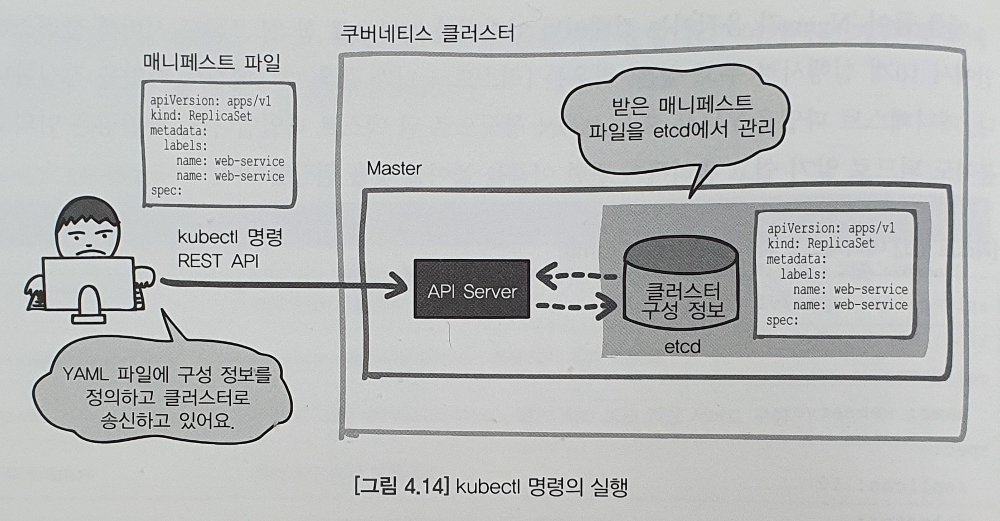

# 04. 쿠버네티스의 요점

### 샘플 어플리케이션 다운로드
```zsh
$ git clone https://github.com/ToruMakabe/Understanding-K8s
$ cd Understanding-K8s/chap04
```

---
## 4.1 쿠너네티스의 개념
* 쿠버네티스의 지향점
	- 시스템 구축을 위한 수작업 줄이기
	- 시스템을 셀프 서비스로 운용

---
#### 1. Immutable Infrastructure 
[^출처]
* 기존의 온프레미스 환경의 인프라는 유지보수 및 퍼포먼스 튜닝 등 관리 운용 하였음 -> 인프라의 구성 관리 부하가 큼
* 클라우드 시스템의 등장 및 분산 기술은 인프라 구축의 물리적이 제약이나 작업을 줄임
	- 한번 구축한 인프라 변경할 필요 없이 파기 후, 새로 구축 가능 -> 부하가 컸던 '인프라 변경 이력 관리'가 필요 없어짐
	- 현재 움직이고 있는 인프라의 상태를 관리하면 되도록 바뀜
---
#### 2. 선언적 설정
[^출처]
* 절차나 변경 이력을 관리하는 것이 아니라 시스템의 상태를 관리하는 방식을 취하는 것이 '선언적 설정'
* 선언적 설정
	- 시스템이 본래 되어 있어야 할 모습을 정의(정의 파일에 씀)
	- 쿠버네티스 클러스터는 정의 파일을 보고 그 모습이 되도록 자율적으로 움직임

---
#### 3. 자기 복구 기능
[^출처]
* 쿠버네티스가 항상 감시하여 이상이 있으면 미리 '시스템 본래의 모습'으로 설정된 상태가 되도록 작동 
	- 자동으로  API를 사용하여 재시작 및 클러스터에서 장애를 제거하여 시스템 복구
* 수작업이 아니라, 신뢰성 및 효율성 상승

---
## 4.2 쿠버네티스의 구조 

---
#### 1. 스케줄링과 디스커버리
* 스케줄링과 디스커버리는 쿠버네티스의 기능이 수행
* 기존의 어플리케이션 시스템
	- 어플리케이션 개발자와 인프라 관리자는 둘 다 '어디에서 어떤 어플리케이션이 룸직이고 있는지' 앎
* 쿠버네티스를 사용한 컨테이너 어플리케이션
	- 어플리케이션이 디플로이되는 위치는 쿠버네티스에 의해 정해짐
	- 사람이 하던 작업을 쿠버네티스가 함(자동 배치)

##### 스케줄링
[^출처]
* 어플리케이션을 적절한 곳에 디플로이 하는 장치, Scheduling
* 쿠버네티스에서는 매니페스트 파일로 정의하여, 적절한 위치에 어플리케이션 자동 배치

##### 서비스 디스커버리
[^출처]
* 필요한 디플로이된 어플리케이션이 어디있는지 찾아내는 장치
	Ex) 리퀘스트를 받은 프론트엔드 어플리케이션이 사용자의 트랜잭션을 처리하기 위해 백엔드 서비스를 호출
* 쿠버네티스는 클러스트 안에 구성 레지스트리를 갖고 있어, 이를 바탕으로 서비스 디스커버리를 동적으로 수행함

* 일반적인 서비스 디스커버리
종류 | 기능 | 설명
---|---|---|
고정 IP주소 | 서비스의 고정 IP주소를 결정 | 서버의 IP 주소를 자동으로 설정하는 경우에는 이용할 수 없음, 변경이 어려워 유연성이 떨어짐
호스트 파일 엔트리 | 파일을 사용하여 서버명과 IP주소를 매핑 | 서비스가 변경되었을 때 호스트 파일의 변경이 필요
DNS | 서버를 사용하여 도메인명과 IP주소를 매핑 | 널리 이용되고 있지만 실시간으로 변뎡하는 것은 힘듦
구성 레지스트리 | 인프라스트럭처와 서비스를 연결하여 일원 관리 | 동적으로 구성을 생성하여 인프라스트럭처 안의 리소스에 관한 상세한 정보를 제공

---
#### 2. 쿠버네티스의 서버 구성

##### 마스터(Master)
* 쿠버네티스의 클러스터 전체를 관리하는 역할
* 마스터는 etcd라는 분산 키 벨류 스토어(KVS)를 사용하여 클러스터의 구성 정보를 관리
* 마스터 API가 클러스터 전체를 제어

##### 노드(Node)
* 컨테이너 어플리케이션을 작동하는 서버
* 대 수가 늘어나면 가용성이 향상

---
#### 3. 쿠버네티스의 컴포넌트
* 각 컴포넌트는 자율적으로 움직임
* 각 컴포넌트는 API를 통해 호출

##### 마스터(Master)

###### API 서버(API Server)
* Kubernetes의 __리소스 정보를 관리__하기 위한 프론트엔드 REST API
    - 각 컴포턴트로부터 리소스 정보를 받아 데이터 스토어(etcd)에 저장
* Kubernetes의 모든 기능들을 REST API로 제공하고 그에 대한 명령을 처리
* 다른 컴포넌트는 API Server를 통해 'etcd'의 정보에 액세스 함
    - 웹 GUI 툴, kubectl 명령 사용으로 'API Server 액세스' 및 어플리케이션 안에서 'API Server 호출' 가능
    - API Server에는 '인증 및 인가' 기능 존재

###### 스케쥴러(Scheduler)
* Pod, 서비스 등 각 리소스들을 적절한 노드에 할당하는 역할
* __Pod__를 어떤 노드에서 작동시킬지 제어하는 백엔드 컨포넌트
    - 노드에 할당되지 않은 Pod에 대해 Kubernetes 클러스터의 상태를 확인하고, 빈 영역을 가진 노드를 찾아서 Pod를 실행

###### 컨트롤러 매니저(Controller Manger)
* 컨트롤러(Replica controller, Service controller, Volume Controller, Node controller 등)를 생성하고 이를 각 노드에 배포하며 이를 관리하는 역할
* Kubernetes 클러스터의 __상태를 항상 감시__하고, 본래 되어야 할 상태를 유지하는 백엔드 컨포넌트
	- 정의 파일에서 정의한 것과 실제 노드나 컨테이너에서 작동하고 있는 상태를 모아 관리

###### 데이터 스토어(etcd)
* Kubernetes 클러스터 구성을 유지 관리하는 분산 KVS
    - Key-Value 형태로 데이터를 관리
    - 어떤 Pod를 어떻게 배치할지와 같은 구성 정보를 가짐
    - API Server가 참조
	- 매니페스트 내용이 저장되어 있다고 볼 수 있음
	- 마스터 서버에서 분리 가능

[^출처2]
	
---
#### 4. 클러스터에 액세스하기 위한 인증 정보
* kubectl 명령은 쿠버네티스 클러스터 API Server를 원격으로 호출하고 있음
* kubectl 명령이 쿠버네티스 클러스터 API Server와 안전하게 통신하기 위해서는 연결할 서버의 정보와 인증 정보 등이 필요

Ex) ~/.kube/config  
```zsh
apiVersion: v1
clusters:									## 1. 클러스터에 대한 연결 정보
- cluster:									
    certificate-authority-data: 생략									
    server: https://akscluster-akscluster-086837-d10dd118.hcp.koreacentral.azmk8s.io:443
  name: AKSCluster
contexts:									## 2. 클러스터와 사용자 정보의 클러스트
- context:
    cluster: AKSCluster
    user: clusterAdmin_AKSCluster_AKSCluster
  name: AKSCluster-admin
current-context: AKSCluster-admin
kind: Config
preferences: {}
users:										## 3. 액세스하는 사용자 정보
- name: clusterAdmin_AKSCluster_AKSCluster
  user:
    client-certificate-data: 생략
    client-key-data: 생략
    token: 생략
```
1. 클러스터에 대한 연결 정보: kubectl 명령을 실행했을 때의 연결 클러스터 정보 설정
2. 클러스터와 사용자 정보의 클러스트: 어떤 사용자가 어떤 클러스터에 연결할 수 있는지와 같은 매핑을 설정, 여러 사용자나 클러스터를 전환 가능
3. 액세스하는 사용자 정보: 쿠버네티스 클러스터에 액세스하는 사용자의 이름과 인증 키 등을 설정
* Azure Kubernetes Service(AKS)를 사용하여 클러스터를 구축했을 때는 'az aks get-credentials' 명령을 실행하면 자동 등록(~/.kube/config에 연결 정보 저장)

* Accessing Cluster - Kubernetes 참고 : https://kubernetes.io/docs/tasks/access-application-cluster/access-cluster

---
## 4.3 쿠버네티스의 리소스

---
#### 1. 어플리케이션 실행(Pod/ReplicaSet/Deployment)

##### Pod(포드)
* 여러 개의 컨테이너를 모아서 'Pod'로 관리
* Pod 단위로 어플리케이션 관리(웹 서버 컨테이너 + 프록시 서버 컨테이너)
* Pod 안의 여러 컨테이너 가상 NIC(프라이빗 IP)를 공유함
* 노드에는 여러 포드 배치 가능
	-포드가 여러 개의 노드에 걸칠 수는 없음
	
##### ReplicaSet(레플리카 셋)
* 지정한 수 만큼 Pod를 항상 실행시켜 유지하는 장치
* 실행중인 Pod 감시 -> 장애와 같은 이유로 정지 -> 해당 Pod 삭제 후, 새로운 Pod 실행
* Pod의 수를 동적으로 변경하여 오토스케일 구현 가능

##### Deployment(디플로이먼트, 전개)
* 어플리케이션의 배포 단위를 관리
* __ReplicaSet의 이력 관리__
* Deployment는 ReplicaSet의 템플릿을 가지고 ReplicaSet의 작성 또는 갱신함
* 이력 관리를 통해, Pod안의 컨테이너의 버전을 롤링 업데이트 및 롤백 가능

##### DaemonSet(데몬셋)
* 로그콜렉터나 감시 에이전트처럼 각각의 노드에 반드시 하나씩 작동시키고 싶을 때 사용
* 클러스터의 전체 노드에 포드를 하나 작성
* 레플리카셋과 마찬가지로 매니페스트 파일에서 정의한 대로 상태를 유지하도록 움직임(수 지정 불가)
* 'kube-proxy'도 데몬셋을 사용하여 움직임

##### StatefulSet(스테이트풀셋)
* 컨테이너 어플리케이션은 기본적으로 스테이트리스로, 상태를 갖지 않는 포드를 여러개 움직이게 함
* 레플리카셋은 랜덤으로 이름이나 IP주소 등을 할당
* 레플리카셋과 달리 포드의 고유성을 보증 -> 데이터베이스와 같은 영구 데이터 유지 가능

---
#### 2. 네트워크 관리(Service/Ingress)

##### Service(서비스)
* 쿠버네티스 네트워크 관리
	- 로드벨런서(LoadBalancer), 여러 포드에 대한 L4 부하분산을 수행
* Cluster IP : 클러스터 안의 포드끼리 통신(프라이빗 IP), 노드 상의 Proxy 데몬이 받아 수신처 포드로 전송
* External IP : 외부에 공개하는 IP 주소

##### Ingress(인그레스)
* 클러스터 외부의 네트워크로부터 액세스를 받기 위한 오브젝트
* L7의 기능 제공(로드밸런서, URL 경로에 대응하는 백엔드 서비스에 대한 라우팅, SSl 단말, 네임스페이스의 버추얼 호스팅 등)

---
#### 3. 어플리케이션 설정 정보 관리(ConfigMap/Secrets)
* 어플리케이션 설정 정보 일원 관리 가능
* 어플리케이션 안에서 환경에 의존하는 값을 컨테이너 밖에서 관리할 수 있음

##### ConfigMap(컨피그맵)
* 어플리케이션의 설정 정보, 구성파일, 명령 인수, 포트 번호, 어플리케이션 고유 식별 정보 등 포드에서 참조할 수 있도록 해 주는 장치
* Key-Value형힉으로 정보 관리
* 보통의 파일 또는 환경 변수로서 취급 가능

##### Secrets(시크릿)
* 컨피그맵 처럼 구성 정보를 컨테이너에 전달 + 기밀성 높은 정보를 관리(DB와 연결할 때의 비밀번호 비밀번호, OAuth 토큰 등)
* base64로 인코딩하여 등록함
* 메모리상(tmpfs)에 전개됨, 디스크에는 기록되지 않음
* 암호화되어 etcd로 관리됨
* 프라이빗한 컨테이너 이미지로부터 이미지를 다운로드 할 때의 인증 정보를 전달 가능

---
#### 4. 배치 잡 관리(Job/CronJob)
* 집계 등 배치 처리 또는 기계 학습, 수치 해석같은 시작부터 종료까지 완료되는 잡을 실행하기 위한 리소스
	- 포드는 정지=이상 정지
	- Job, CronJob은 정지=잡 종료

##### Job(잡)
* 하나 또는 여러 개의 포드에서 처리되는 배치 잡을 실행하기 위한 리소스
	- 데이터베이스 마이그레이션에 사용
	- 태스크를 병렬로 실행해 수치 해석이 파라메트릭 스터디 등에 사용 
* 어플리케이션 오류나 예외 등으로 실패시, 처리가 성공할 때까지 Job 컨트롤러가 포드를 다시 만듦

##### CronJob(크론잡)
* 정해진 타이밍에 반복할 Job 실행에 사용하는 리소스
	- 스토리지 백업이나 메일 송신 등에 사용
* 리눅스, 유닉스 시스템의 Cron과 사용 방법이 비슷

##### ETC(그 외 리소스)
리소스 | 설명
---|---
PersistentVolume | 일부 영구 볼륨을 제공하는 시스템과 연계하여 신규 Volume의 작성이나 기존 Volume의 삭제 등을 수행하는 리소스
PersisterVolumeClaim | PersisterVolume을 포드에서 이용하기 위한 리소스
Node | 쿠버네티스의 위커노드의 리소스, 물리 서버 또는 가상 서버로 구성
Namespace | 리소스가 속한 이름 공간
ResourceQuota | Namespace별로 사용하는 리소스 상한을 설정
NetworkPolicy | 포드끼리의 통신 가는 여부를 제어하는 리소스
ServiceAccount | 포드와 쿠버네티스의 인증을 위한 계정
Role/ClusterRole | 어떤 리소스에 어떤 조작을 허가할지를 정의하기 위한 리소스
RoleBinding/ClusterRoleBinding | 어떤 Role/ClusterRole을 어떤 사용자/그룹/ServiceAccount와 연결시키지를 정의하기 위한 리소스

---
## 4.4 매니페스트 파일
* 리소스의 구체적인 설정 정보를 파일로 관리하는 것, manifest file

---
#### 1. 매니페스트 파일의 기본

Ex) 매니페스트 파일(webserver.yaml)
```yaml
root@Ubuntu:/root/Understanding-K8s/chap04 git:(master*) # cat webserver.yaml
apiVersion: apps/v1
kind: ReplicaSet
metadata:
  name: webserver
spec:
  replicas: 10
  selector:
    matchLabels:
      app: webfront
  template:
    metadata:
      labels:
        app: webfront
    spec:
      containers:
      - image: nginx
        name: webfront-container
        ports:
          - containerPort: 80# 
```
* Nginx가 움직이는 컨테이너 이미지를 바탕으로 한 웹 프론트 서버를 클러스터 안에서 10개 실행 및 유지
* YAML 또는 JSON 형식으로 된 텍스트 파일

Ex) 매그페스트 파일 등록 및 삭제
```zsh
root@Ubuntu ~/Understanding-K8s/chap04
master* # kubectl apply -f webserver.yaml                                          [13:36:35]
replicaset.apps/webserver created

root@Ubuntu ~/Understanding-K8s/chap04
master* # kubectl delete -f webserver.yaml                                         [13:36:45]
replicaset.apps "webserver" deleted
```
* 명령을 통해 API에게 통신 후, 명령을 받은 쿠버네티스 마스터의 API Service는 파일 내용을 클러스터의 구성 정보인 etcㅇ에 저장
	- etcd에 기록된 정보를 바탕으로 리소스를 관리  
	

[^출처]

Ex) 매니페스트 파일의 구조  
```yaml
apiVersion: [1. API의 버전 정보]
kind: [2. 리소스 종류]
metadata: 
  name: [3. 리소스 이름]
spec:
[4. 리소스 상세 정보]
```
##### 1. API의 버전 정보
* alpha(알파)
	- 예고 없이 호환성이 없는 방법으로 변경될 가는성이 있는 버전
	- 검증 환경에서만 사용 권장, 기능 지원이 통지 없이 중단 가능
	- 'v1alpha1' 등으로 설정
* beta(베타)
	- 충분히 테스트를 거친 버전
	- 실제 환경 이외에서 사용 권장, 상세 내용 변경 가능
	- 'v2beta3' 등으로 설정
* 안정판
	- 안정된 버전은 'v1'과 같은 버전 번호가 붙음
	- 실제 환경에서 이용 가능 버전
	
##### 2. 리소스 종류
* 쿠버네티스의 리소스 지정
	- 어플리케이션 실행			: Pod/ReplicaSet/Deployment
	- 네트워크 관리				: Service/Ingress
	- 어플리케이션 설정 정보의 관리	: ConfigMap/Secrets
	- 배치 잡의 관리			: Job/CronJob
	
##### 3. 리소스 이름
* 리소스 이름 설정
	- kubectl 명령 등으로 조작할 때 식별용

##### 4. 리소스 상세 정보
* 리소스의 상세 정보를 설정
	- 리소스 종류에 따라 설정할 수 있는 값이 달라짐
	

Ex) 클러스터 안에서 컨테이너 어플리케이션의 실행을 정의하는 포드의 경우
```
* 컨테이너 이름
* 컨테이너 이미지의 저장 위치
* 컨테이너가 전송할 포트 번호
* 컨테이너가 내부에서 사용하는 환경변수에 대한 참조
```

###### Kubernetes API Overview - Kubernetes
참고 : https://kubernetes.io/docs/reference/using-api/api-overview

###### 매니페스트 파일이 동시에 갱신된면?
* 데이터가 갱신될 때마다 버전 정보가 추가됨
	- 확인 후 추가된 경우 갱신을 거부(처음 것만 성공)
* 클러스터의 구성 정보는 API Server를 통해서만 액세스 가능

---
#### 2. YAML의 문법

##### YAML의 세가지 특징
1. 인텐트(들여쓰기)로 데이터의 계층 구조를 나타냄
	* '탭'은 사용 불가
2. 종료 태그가 필요 없음
	* 이중 표기나 입력 실수 등이 줄어듬
3. 플로 스타일과 블록 스타일
	* 플로 스타일 : 인텍트로 데이어 구조를 나타냄
	* 블록 스타일 : [], {}등으로 데이터 구조를 나타냄
	* 둘을 섞어 표기 가능

* 데이터형
	- 정수
	- 부동소수점수
	- 진리값(ture/false, yes/no)
	- Null
	- 날짜(yyyy-mm-dd)
	- 타임스탬프(yyyy-mm-dd hh:mm:ss)
	- 이 외의 것은 문자열 취급("", ''로 강제적 문자열 취급 가능)

* 배열
	- '-'를 붙여 배열 나타냄, '-'뒤에 반드시 스페이스 필요
	Ex) 배열 내포도 가능  
	```yaml
	- "알기 쉬운 쿠버네티스"
	- 
	  - "재미있는 C# 초판"
	  - "재미있는 C# 제2판"
	- "고양이도 알 수 있는 클라우드 디자인 패턴"
	```
* 해시
	- Key와 Value를 ':'로 구분, ':'뒤에는 반드시 스페이스 필요
	Ex)   
	```yaml
	name: "알기 쉬운 쿠버네티스"
	author: "cat"
	price: 500
	```
	
###### YAML 공식 사이트
참고 : http:/yaml.org

---
## 4.5 라벨을 사용한 리소스 관리
* 쿠버네티스는 리소스를 관리할 때 라벨(Label)을 사용하여 식별함

---
#### 1. 라벨(Lebel)
* 다른 어플리케이션을 클러스터 상에서 관리하는 것은 힘듦
* 많이 생성된 포드는 동일한 그룹으로 모아 조작할 수 있다면 편리
	- 그래서 나온 것이 라벨이라는 개념
[^출처]

##### 포드에 라벨 설정
* 라벨은 Key-Value 형식으로 설정
	- Key명은 필수, 64자 이내로 지정, 맨 앞과 뒤는 알파벳 또는 숫자로 지정, "-, _, ." 사용 가능
	

Ex) chap04/Label/label-pod.yaml     
```yaml
apiVersion: v1
kind: Pod
metadata:
  name: nginx-pod-a
  labels:
    env: test
    app: photo-view
spec:
  containers:
  - image: nginx
    name: photoview-container
~생략~
```
* 'photoview-container'라는 컨테이너를 하나 갖고 있는 'nginx-pod-a'라는 이름의 포드 정의
*  Key='app', Value='photo-view'와 Key='env, Value=test'라는 두개의 라벨을 설정

Ex) 포드 작성 및 확인  
```zsh
root@Ubuntu ~/Understanding-K8s/chap04
master* # kubectl apply -f Label/label-pod.yaml                                    [14:53:27]
pod/nginx-pod-a created
pod/nginx-pod-b created
pod/nginx-pod-c created
pod/nginx-pod-d created
pod/nginx-pod-e created
pod/nginx-pod-f created

root@Ubuntu ~/Understanding-K8s/chap04
master* # kubectl get pods --show-labels                                           [14:54:06]
NAME          READY   STATUS    RESTARTS   AGE   LABELS
nginx-pod-a   1/1     Running   0          54s   app=photo-view,env=test
nginx-pod-b   1/1     Running   0          54s   app=imagetrain,env=test
nginx-pod-c   1/1     Running   0          54s   app=prediction,env=test
nginx-pod-d   1/1     Running   0          54s   app=photo-view,env=stage
nginx-pod-e   1/1     Running   0          54s   app=imagetrain,env=stage
nginx-pod-f   1/1     Running   0          54s   app=photo-view,env=prod
```
* `--show-labels`의 옵션 지정

##### 포드의 라벨 변경


Ex) 라벨 변경하기(Label/label-pod.yaml )  
```yaml
apiVersion: v1
kind: Pod
metadata:
  name: nginx-pod-a
  labels:
    env: stage
    app: photo-view
spec:
  containers:
  - image: nginx
    name: photoview-container
~생략~
```
* 'nginx-pod-a'의 env값을 변경(test -> stage) 

Ex) 포드 변경 확인   
```zsh
root@Ubuntu ~/Understanding-K8s/chap04
master* # kubectl apply -f Label/label-pod.yaml                                    [15:02:33]
pod/nginx-pod-a configured
pod/nginx-pod-b unchanged
pod/nginx-pod-c unchanged
pod/nginx-pod-d unchanged
pod/nginx-pod-e unchanged
pod/nginx-pod-f unchanged

root@Ubuntu ~/Understanding-K8s/chap04
master* # kubectl get pods --show-labels                                           [15:04:10]
NAME          READY   STATUS    RESTARTS   AGE   LABELS
nginx-pod-a   1/1     Running   0          10m   app=photo-view,env=stage
nginx-pod-b   1/1     Running   0          10m   app=imagetrain,env=test
nginx-pod-c   1/1     Running   0          10m   app=prediction,env=test
nginx-pod-d   1/1     Running   0          10m   app=photo-view,env=stage
nginx-pod-e   1/1     Running   0          10m   app=imagetrain,env=stage
nginx-pod-f   1/1     Running   0          10m   app=photo-view,env=prod
```
* 'kubectl label deployment' 명령을 실행하여 라벨을 덮어쓸 수 있음
	- 하지만, 구성 관리의 관점으로 볼때 매니페스트르 변경을 권장
* 노드나 레플리카셋 등 포드 이외의 리소스에도 라벨을 자유롭게 설정 가능

---
#### 2. LabelSelector를 사용한 리소스 검색
* 쿠버네티스의 리소스에 설정한 라벨은 LabelSelector를 사용해 필터링 가능

##### kubectl 명령으로 필터링할 때 이용
* kubectl 명령의 옵션으로 '-selecter' 옵션 사용

Ex) 'app=photo-view'라벨이 설정된 포드 목록 표시  
```zsh
root@Ubuntu ~/Understanding-K8s/chap04
master* #  kubectl get pod -l app=photo-view                                       [15:40:52]
NAME          READY   STATUS    RESTARTS   AGE
nginx-pod-a   1/1     Running   0          47m
nginx-pod-d   1/1     Running   0          47m
nginx-pod-f   1/1     Running   0          47m
```
* '-l' = --selector

Ex) 콤마(,)로 연결하면 AND 연산으로 결과 반환  
```zsh
root@Ubuntu ~/Understanding-K8s/chap04
master* # kubectl get pods -l app=photo-view,env=prod                              [15:44:19]
NAME          READY   STATUS    RESTARTS   AGE
nginx-pod-f   1/1     Running   0          50m
```

* LabelSelector에서 사용 가능 연산자
연산자 | 설명
---|---
Key = value	| Key = value이다.
key != value	| Key = value가 아니다.
Key in (value1, value2)	| Key는 value1 또는 value2
Key notin (value1, value2)	| Key는 value1도 value2도 아니다.
Key		| Key가 설정되어 있다.
!Key	| Key가 설정되어 있지 않다.


##### 다른 쿠버네티스 리소스와 연결할 때 이용
* 레플리카셋, 디플로이먼트, 서비스 등에서 쿠버네티스 리소스끼리 연결시킬 때 사용
* 매니페스트에서 정의한 라벨을 갖고 있는 포드에 액세스 가능
* 5장 이후 자세히 설명
* 라벨 외에도 쿠버네티스의 리소스를 관리할 수 있는 'Annotation'이 존재

---
## 4.6 쿠버네티스의 리소스 분리
* 네임스페이스(Namespace)
	- 쿠버네티스의 리소스를 모아서 가상적으로 분리
	- 여러 리소스를 모아서 넣은 __'폴더'__와 같은 것이라 할 수 있음
	- 롤베이스로 __권한 설정__ 가능
	- 동일한 네임스페이스 안에서는 리소스명은 고유해야 함
		+ 다른 네임스페이스의 경우 같은 이름의 리소스를 붙일 수 있음(노드 등은 동일한 리소스명 불가능)

[^출처]

Ex) 네임스페이스 목록을 확인  
```zsh
root@Ubuntu ~/Understanding-K8s/chap04
master* # kubectl get namespace                                                    [15:47:08]
NAME              STATUS   AGE
default           Active   28h
kube-node-lease   Active   28h
kube-public       Active   28h
kube-system       Active   28h
```
* 쿠버네티스의 네임스페이스
Namespace | 설명
---|---
default | 네임스페이스를 명시적으로 지정하지 않는 경우의 기본값
kube-public | 모든 사용자가 이용할 수 있는 컨피그맵과 같은 리소스
kube-system | 쿠버네티스 클러스터가 내부에서 이용하는 리소스

Ex) 'kube-system'이라는 이름의 네임스페이스 포드 목록 확인  
```zsh
root@Ubuntu ~/Understanding-K8s/chap04
master* # kubectl get pod --namespace kube-system                                  [16:03:20]
NAME                                    READY   STATUS    RESTARTS   AGE
coredns-698c77c5d7-6vvlc                1/1     Running   0          28h
coredns-698c77c5d7-rqc7m                1/1     Running   0          28h
coredns-autoscaler-79b778686c-8nvl4     1/1     Running   0          28h
kube-proxy-2czkz                        1/1     Running   0          28h
kube-proxy-cnvwm                        1/1     Running   0          28h
kube-proxy-qfm5z                        1/1     Running   0          28h
kubernetes-dashboard-74d8c675bc-lzgql   1/1     Running   2          28h
metrics-server-69df9f75bf-vg79x         1/1     Running   1          28h
tunnelfront-55f4f47877-n5xgn            1/1     Running   0          28h
```

Ex) 새로운 네임스페이스 작성(chap04/Namespace/namespace.yaml)  
```yaml
apiVersion: v1
kind: Namespace
metadata:
  name: trade-system
```

Ex) 네임스페이스 작성 및 확인  
```zsh
root@Ubuntu ~/Understanding-K8s/chap04
master* # kubectl create -f Namespace/namespace.yaml                               [16:09:04]
namespace/trade-system created

root@Ubuntu ~/Understanding-K8s/chap04
master* # kubectl get namespace                                                    [16:11:09]
NAME              STATUS   AGE
default           Active   28h
kube-node-lease   Active   28h
kube-public       Active   28h
kube-system       Active   28h
trade-system      Active   18s
```
* 'namespace' 옵션을 사용하여 명시적으로 지정하지 않을 때는 'default' 네임스페이스에 포함되는 리소스를 조작하게 됨

Ex)   
```zsh
root@Ubuntu ~/Understanding-K8s/chap04
master* # kubectl config set-context my-context --namespace=trade-system           [16:15:56]
Context "my-context" created.
```
* 네임스페이스가 'trad-system'인 'my-context'를 설정

Ex) 사용이 끝난 리소스 삭제  
```zsh
master* # kubectl delete -f Label/label-pod.yaml                                   [16:24:23]
pod "nginx-pod-a" deleted
pod "nginx-pod-b" deleted
pod "nginx-pod-c" deleted
pod "nginx-pod-d" deleted
pod "nginx-pod-e" deleted
pod "nginx-pod-f" deleted

root@Ubuntu ~/Understanding-K8s/chap04
master* # kubectl delete -f Namespace/namespace.yaml                               [16:25:05]
namespace "trade-system" deleted
```

---
## 4.7 정리
* 쿠버네티스의 핵심 개념
* 쿠버네티스 API의 개요
* 쿠버네티스가 제공하는 리소스 개요
* 라벨을 사용한 리소스 관리
* 네임스페이스를 사용한 리소스 분리

---
[^출처]: 완벽한 IT 인프라 구축의 자동화를 위한 Kubernetes-정보문화사
[^출처2]: https://m.post.naver.com/viewer/postView.nhn?volumeNo=25598511&memberNo=15488377