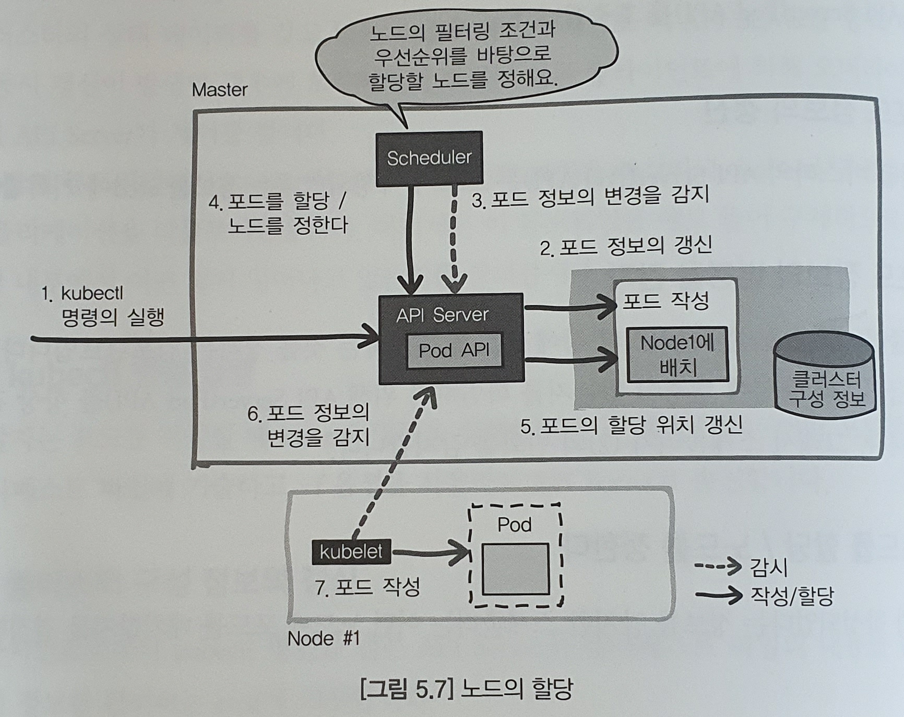

# 05. 컨테이너 어플리케이션의 실행

### 샘플 어플리케이션 다운로드
```zsh
$ git clone https://github.com/ToruMakabe/Understanding-K8s
$ cd Understanding-K8s/chap05
```

---
## 5.1 포드를 사용한 컨테이너 어플리케이셔의 관리

---
#### 1. 포드
* 컨테이너에서는 '1컨테이너 1프로세스'가 원칙
* 컨테이너의 집합체가 '포드(Pod)'
	- 웹서버, 프록시 서버, SSl 단말기, 인증 서버(OAuth) 등 메인이 되는 컨테이너와 함께 협조하며 움직임
	- 메인 컨테이너에 대한 보조하는 서브 컨테이너를 '사이트카'라고 부르기도 함
* 포드의 성질
	- 포드에는 하나 이상의 컨테이너가 존재
	- 포드 안의 컨테이너는 반드시 동일한 노드에 배치
	- 어플리케이션을 스케일아웃할 때는 포드 단위로 실행
	- 포드 안의 컨테이너는 네트워크와 스토리지를 공유
* 어플리케이션을 늘리는 경우 동일한 구성의 포드를 여러개 작성 - 레플리카(Replica)

##### 네트워크
* 각 포드는 고유한 IP 주소가 할당
* 동일한 포드는 네트워크 공간을 공유함(localhosst를 사용한 통신 가능)

##### 스토리지
* 포드 안의 컨테이너는 공유 볼륨에 액세스 가능
	- 컨테이너 사이에 데이터를 주고 받기 가능

---
#### 2. 매니페스트 파일

Ex) 포드의 매니페스트 파일  
```yaml
root@Ubuntu ~/Understanding-K8s/chap05
master* # cat Pod/pod.yaml                                                         [17:54:18]
# (1) 기본 항목
apiVersion: v1
kind: Pod
metadata:
  name: photoview-pod   # POd 이름 : 'photoview-pod '라는 이름의 포드를 정의
  labels:   # Pod 라벨 : 'app'와 'env'라는 라벨을 설정
    app: photo-view
    env: stage

# (2) Pod 스펙 :  움직일 컨테이너 어플리케이션의 스펙(컨테이너 이미지의 위치, 이름, 포트 번호 등
spec:

  # (3) 컨테이너 사양 : 'sampleacrregistry'는 '임의의 레지스트리명'임
  containers:
  - image: sampleacrregistry.azurecr.io/photo-view:v2.0
    name: photoview-container
    ports:
    - containerPort: 80
```
##### (1) 기본 항목
* API의 버전이나 포드명 같은 기본 항목 설정

필드| 데이터형 | 설명
---|---|---
apiVersion	| 문자열 | API의 버전(v1), 존재하니 않은 값을 설정하면 오류
kind 	| 문자열| 쿠버네티스 리소스 종류(Pod)
metadata	| Object | 포드의 이름이나 Label과 같은 메타데이터
spec	| PodSpec | 포드의 상세 정보 설정


##### (2) Pod 스펙
* [spec] 필드에는 포드의 내용을 설정
	- 포드 안에서 움직일 컨테이너 어플리케이션, 우선순위, 재시작 시의 규칙 등에 대해 정의

필드| 데이터형 | 설명
---|---|---
containers	| Container 배열 | 포드에 속하는 컨테이너 목록. 포드에는 하나 이상의 컨테이너가 필요
imagePullSecrets | LocalObjectReference 배열 | 컨테이너 이미지를 취득하기 위해 사용되는 인증 정보
initContainers | Container 배열 | 초기화 처리를 하는 컨테이너. 이 컨테이너에 장애가 발생한 경우 그 포드는 실패한 것으로 간주하여 restartPolicy에 따라 재시작함
nodeName	| 문자열	| 특정 노드에 포드를 배치할 때 지정
nodeSeleter | Object | 지정한 라벨을 갖고 있는 노드에 포드를 스케줄링하고 싶을 때 지정
priority | 정수	| 포드의 우선순위. 클수록 우선순위가 높음
restartPolicy	| 문자열 | 포드 안의 컨테이너의 재시작 폴리시. Always, OnFailure, Never 중 하나를 지정(기본값: Always)
volumes | Volume 배열 | 포드 안의 컨테이너가 마운트할 수 있는 볼륨의 목록
	
##### (3) 컨테이너 사양
* [container] 필드에는 포드 안에서 움직이는 컨테이너 어플리케이션의 상세 정보 설정
	- 컨테이너 이미지와 그 저장 레지스트리 정보, 컨테이너에서 이용하는 환경 변수 등
필드| 데이터형 | 설명
---|---|---
arge	| 문자 배열	| 컨테이너에 송신할 인수
env		| EnVar 배열	| 컨테이너에 설정할 환경변수
image	| 문자열 | 컨테이너 이미지와 그 저장 위치
imagePullPolicy	| 문자열	| 컨테이너 이미지를 취득할 때의 규칙. Always, Naver, IfNotPresent 중 하나를 지정(기본값:IfNotPresent - 만일 이미지가 있으면 새로 취득), 만일 이미지를 강제로 갱신하고 싶을 때는 Always로 설정
livenessProbe	| Porbe	| 컨테이너의 감시
name	| 문자열 | 컨테이너의 이름, 클러스터 내부에서 DNS_LABEL로서 사용
ports	| ContainerPort 배열	| 컨테이너가 공개할 포트 번호의 목록, HTTP공개는 80을 설정
readinessProbe	| Probe	| 컨테이너의 감시
resources	| ResourceRequirements | 컨테이너에 필요한 CPU나 메모리와 같은 컴퓨팅 리소스
volumeMounts	| VolumeMount 배열 | 컨테이너의 파일 시스템에 마춘트할 볼륨
workingDir	| 문자열 | 컨테이너의 작업 디렉터리


Ex) 포드 'www'를 정의한 매니페스트 파일  
```yaml
apiVersion: v1
kind: Pod
metadata:
  name: www
spec:
  containers:
  - name: nginx
    image: nginx
	VolumeMounts:
	- mountPath: /srv/www
      name: www-data
	  readOnly: ture
  - name: git-monitor
    image: kubernetes/git-moitor
	env:
	- name: GIT_REPO
		value: http://github.com/some/repo.git
	VolumeMounts:
	- mountPath: /data
	  name: www-data
  voumes:
  - name: www-data
  emptyDir: { }
```
* 'www'라고 포드의 이름의 정의
* 'nginx'와 'git-monitor'라는 이름의 컨테이너가 들어감
* 'www-data'라는 이름의 볼륨이 만들어져 각 컨테이너에서 마운트 됨

##### Pod v1 core - Kubernetes API Reference Docs
참고 : https://kubernetes.io/docs/reference/generated/kubernetes-api/v1.17/#pod-v1-core

---
#### 3. 포드의 작성, 변경, 삭제

##### 포드의 작성
Ex) chap05/Pod/pod.yaml  
```yaml
# (1) 基本項目
apiVersion: v1
kind: Pod
metadata:
  name: photoview-pod   # POdの名前
  labels:   # Podのラベル
    app: photo-view
    env: stage

# (2) Podのスペック
spec:

  # (3) コンテナの仕様
  containers:
  - image: sampleacr9988.azurecr.io/photo-view:v1.0
    name: photoview-container
    ports:
    - containerPort: 80
```
* `az acr list`로 'LOGIN SERVER'확인
* ACR 레지스트리 변경

Ex) 매니페스트 파일 작성 및 확인  
```zsh
root@Ubuntu:~/Understanding-K8s/chap05|master⚡
⇒  kubectl apply -f Pod/pod.yaml
pod/photoview-pod created
root@Ubuntu:~/Understanding-K8s/chap05|master⚡
⇒  kubectl get pods --show-labels
NAME            READY   STATUS    RESTARTS   AGE   LABELS
photoview-pod   1/1     Running   0          16s   app=photo-view,env=stage
```
* `--show-labels` 옵션은 포드에 설정된 라벨 표시

* 포드의 STATUS
값 | 설병
Pending | 포드의 적성을 기다리고 있는 상태.(컨테이너 이미지의 다운로드 등)
Running | 포드가 가동 중인 상태
Succeeded | 포드 안의 모든 컨테이너가 정상적으로 종료된 상태
Failed | 포드 안의 컨테이너 중 적어도 하나의 컨테이너가 실패하여 종료된 상태
Unknown	| 어떤 이유로 포드와 통신할 수 없는 상태

Ex) 포드의 상세정보 확인  
```zsh
root@Ubuntu:~/Understanding-K8s/chap05|master⚡
⇒  kubectl describe pods photoview-pod
Name:         photoview-pod
~생략~
Conditions:
  Type              Status
  Initialized       True
  Ready             True
  ContainersReady   True
  PodScheduled      True
~생략~
Events:
  Type    Reason     Age    From                                        Message
  ----    ------     ----   ----                                        -------
  Normal  Scheduled  8m10s  default-scheduler                           Successfully assigned default/photoview-pod to aks-nodepool1-25958820-vmss000000
  Normal  Pulled     8m9s   kubelet, aks-nodepool1-25958820-vmss000000  Container image "sampleacr9988.azurecr.io/photo-view:v1.0" already present on machine
  Normal  Created    8m9s   kubelet, aks-nodepool1-25958820-vmss000000  Created container photoview-container
  Normal  Started    8m9s   kubelet, aks-nodepool1-25958820-vmss000000  Started container photoview-container
```
* 오류 발생시 [Conditions:] 목로의 값이 'False'가 표시될 것이며, [Events:] 필드에서 오류 내용을 확일 할수 있음

##### 포드의 변경
x) chap05/Pod/pod.yaml의 변경  
```yaml
# (1) 基本項目
~생략~
  containers:
  - image: sampleacr9988.azurecr.io/photo-view:v2.0
    name: photoview-container
    ports:
    - containerPort: 80
```
* '/photo-view:v1.0'를 '/photo-view:v2.0'로 변경

Ex) 매니페스트 파일 작성 및 확인  
```zsh
root@Ubuntu:~/Understanding-K8s/chap05|master⚡
⇒  kubectl apply -f Pod/pod.yaml
pod/photoview-pod configured
root@Ubuntu:~/Understanding-K8s/chap05|master⚡
⇒  kubectl describe pods photoview-pod
Name:         photoview-pod
Namespace:    default
Priority:     0
Node:         aks-nodepool1-25958820-vmss000000/10.240.0.4
~생략~
Containers:
  photoview-container:
    Container ID:   docker://4c3db365cdec880e6748adef3119450a629f9259b8d84f1438579c8d210b19d2
    Image:          sampleacr9988.azurecr.io/photo-view:v2.0
    Image ID:       docker-pullable://sampleacr9988.azurecr.io/photo-view@sha256:3fd38d949942e6e35f106c3f2c8dc1c25d14f8d67e88734908704e7b707daa3c
~생략~
```
* 'apply' 명령은 변경이 없는 리소스에는 아무것도 안함
* [Image:]가 변경된 것을 확인


##### 포드의 삭제
Ex) 포드 삭제 및 확인  
```zsh
root@Ubuntu:~/Understanding-K8s/chap05|master⚡
⇒  kubectl delete -f Pod/pod.yaml
pod "photoview-pod" deleted
root@Ubuntu:~/Understanding-K8s/chap05|master⚡
⇒  kubectl get pods
No resources found in default namespace.
```

---
#### 4. 포드 디자인 패턴 
* 포드 작성 검토 포인트
	- 반드시 동일한 노드에서 실행할 필요가 있는지 없는지(프록시, OAuth인증)
	- 동일한 타이밍으로 스케줄링할 필요가 있는지 없는지(프론트엔드, 백엔드)

##### 프록시 역할을 하는 컨테이너
* HTTP만 지원하는 웹 어플리케이션을 HTTPS도 지원하기 위해서는 'SSL 프록시 컨테이너' 필요
* 'SSL 프록시 컨테이너'(사이드카)와 'HTTP 웹 어플리케이션 컨테이너'는 loalhost로 통신함
	- Ex) 외부 접속 'https://www.hoge.com' -> Pod[ 'SSL 프록시 컨테이너' ='http://localhost/'=> 'HTTP 웹 어플리케이션 컨테이너' ]
* 두 컨테이너는 같은 포드에 있어야 함

##### 인증 처리를 하는 컨테이너
* OAuth인증 같이 인증 처리하는 전용 포드를 배치하는 경우도 있음
	- Ex) 접속 '인증 정보' -> Pod[ 'OAuth 컨테이너'(리퀘스트의 인증 처리) ==> '웹 어플리케이션 컨테이너' ]

##### 권장 스케일
* 프론트엔드 서버 : 리퀘스트 처리(액세스 증가량 많음)
* 백엔드 서버 : 업무 로직을 식행(액세스 증가량 적음)
	- 액세스 증가량이 다름 -> 스케일 타이밍이 다름
* 서로 다른 포드로써 관리 권장
	- '프론트엔드 서버'의 포드를 많이 생성, '백엔드 서버'의 포드를 적게 생성

##### Desinging Distribute System
참고 : https://azure.microsoft.com/ko-kr/resources/designing-distributed-systems

---
## 5.2 포드의 스케줄링 구조

---
#### 1. 포드가 어떻게 배치되는가?
* 스케줄링 : 어떤 노드를 움직이게 할지, 알고리즘에 기초하여 배치
* API Server
	- 클러스터 안의 리소스를 작성, 참조, 갱신 삭제(Create, Read, Update, Delete)하기 위해 RESTful 인터페이스를 가짐
	- 클러스터의 상태데이터를 가진 etcd에 액세스 가능
	- 오버라이드 방지 제어

##### 스케줄링 흐름(기본 구조)
1. kubectl 명령 실행
	- 매니페스트 파일에 기술, '-f'옵션을 사용하여 API Server로 kubectl명령 송신(포드 작성 명령 송신)
2. 클러스터 구성 정보의 갱신
	- kubectl명령을 받은 API Server는 매니페스트 파일 내용을 구성 정보를 관리하는__'etcd'에 저장__
3. 클러스터 구성 변경의 통지
	- 클러스터의 구성 정보에 변경이 있으면 변경된 내용을 API Server에 통지(새로운 포드가 만들어진다는 것을 통지)
4. 포드의 작성
	- API Server는 클러스터 안에 움직이는 '워커노드'에 새로운 포드 명령을 송신
	- 포드(컨테이너 어플리케이션)를 실행하는 것은 API Server의 역할이 아님
	- __노드에서 움직이는 'kubelet'에 의해 포드 실행__
	
	
---
#### 2. 포드를 배치하는 노드는 어떻게 정하는가? 
* 마스터에서 움직이는 스케줄러(Scheduler)가 정함
* 스케줄러(Scheduler)
	- 클럿스터 상에서 포드를 배치하는 것을 정하는 컴포넌트

1. kubectl 명령 실행
	- API Server(Pod API) 호출
2. 포드 정보 갱신
	- API Server(Pod API)는 kubectl명령 정보(포드가 작성되었다는 정보)를 etcd에 기록
3. 포드 정보 변경을 감지
	- 스케줄러는 클러스터 구성에 변경이 없는지 확인하기 위해, API Server(Pod API)를 항상 감시
	- etcd의 구성 정보 변화를 감지
4. 포드를 할당 / 노드를 정함
	- 감지한 스케줄러는 어떤 노드에 포드를 배치할지 결정
5. 노드의 할당 위치 갱신
	- 스케줄러가 포드를 배치할 노드를 정하면, API Server(Pod API) 호출 -> etcd상의 포드 정보에 배치 노드를 갱신
	- 스케줄러의 역할 종료
6. 포드 정보의 변경을 감지
	- kubelet는 클러스터 구성에 변경이 없는지 확인하기 위해, API Server(Pod API)를 항상 감시
	- '자신의 노드 상태에 변경이 있음'을 감지
7. 포드 작성
	- 감지한 kubelet은 컨테이너 런타임(Docker)에 포드 작성을 지시

[^출처]
* 쿠버네티스는 각 컴포넌트가 자율적으로 움직이며 마스터의 API Server를 통해 서로 연계하며서 처리를 수행

##### 스케줄러의 노드를 결정하는 알고리즘(규칙)
1. 노드의 필터링
	* 포드에 NodSelector의 설정 확인
	* 포드에 설정된 '리소스 요구'와 현재 사용 가능한 '실제 리소스' 등 확인
		- 여러가지 확인 후 할당할 노드를 필터링함
		- Ex) 해당 노드에 라벨을 설정하여 포드의 매니페스트에서 명시적으로 고사양 노드에 스케줄링되도록 설정
	
2. 노드의 우선 순위
	* 우선 순위(0~10)를 바탕으로 배치할 노드를 정함

---
#### 3. 포드를 움직이는 노드를 명시적으로 설정하기
* 보통은 포드를 움직이는 노드의 할당은 클러스터가 맡음
* 포드를 움직이는 노드를 명시적으로 설정하고 싶을 땐 'NodSeletor'를 사용
* 노드에 라벨을 설정하여 논리적인 그룹을 만들 수 있음

Ex) 노드 확인  
```zsh
root@Ubuntu:~/Understanding-K8s/chap05|master⚡
⇒  kubectl get node
NAME                                STATUS   ROLES   AGE    VERSION
aks-nodepool1-25958820-vmss000000   Ready    agent   3d1h   v1.15.7
aks-nodepool1-25958820-vmss000001   Ready    agent   3d1h   v1.15.7
aks-nodepool1-25958820-vmss000002   Ready    agent   3d1h   v1.15.7
```

Ex) 노드에 라벨 설정 및 확인  
```zsh
root@Ubuntu:~/Understanding-K8s/chap05|master⚡
⇒  kubectl label node aks-nodepool1-25958820-vmss000002 server=webap
node/aks-nodepool1-25958820-vmss000002 labeled
root@Ubuntu:~/Understanding-K8s/chap05|master⚡
⇒  kubectl get node --show-labels
NAME                                STATUS   ROLES   AGE    VERSION   LABELS
aks-nodepool1-25958820-vmss000000   Ready    agent   3d1h   v1.15.7   agentpool=nodepool1, ...
aks-nodepool1-25958820-vmss000001   Ready    agent   3d1h   v1.15.7   agentpool=nodepool1, ...
aks-nodepool1-25958820-vmss000002   Ready    agent   3d1h   v1.15.7   agentpool=nodepool1, ...,server=webap, ...
```
* 'aks-nodepool1-25958820-vmss000002'에 'server=webap'라는 라벨을 붙임

Ex) Pod/labels-node.yaml  
```yaml
# (1) 基本項目
apiVersion: v1
kind: Pod
metadata:
  name: nginx
  labels:
    env: stage

# (2) Podのスペック
spec:

  # (3) コンテナの仕様
  containers:
  - name: nginx
    image: nginx
  nodeSelector:
    server: webap  # webap라는 라벨이 붙은 Node에서 실행  
```
* [nodeSelector]에 'server: webap'설정

Ex) 포드의 실행 및 확인  
```zsh
root@Ubuntu:~/Understanding-K8s/chap05|master⚡
⇒  kubectl create -f Pod/labels-node.yaml
pod/nginx created
root@Ubuntu:~/Understanding-K8s/chap05|master⚡
⇒  kubectl get pod --output=wide
NAME    READY   STATUS    RESTARTS   AGE   IP            NODE                                NOMINATED NODE   READINESS GATES
nginx   1/1     Running   0          25s   10.244.0.11   aks-nodepool1-25958820-vmss000002   <none>           <none>
```
* NODE의 값 'aks-nodepool1-25958820-vmss000002'를 확인

Ex) 포드 삭제   
```zsh
root@Ubuntu:~/Understanding-K8s/chap05|master⚡
⇒  kubectl delete -f Pod/labels-node.yaml
pod "nginx" deleted
```

##### 포드를 스케줄링하는 노드를 세세히 제어하려면
* 추가 피라미터 사용
	- Pod Affinity : 관련된 두 개의 포드를 가능한 한 같은 노드에 디플로이 시킴
	- Anti Agginity : 같은 노드 상에서 포드를 스케줄링하고 싶지 않을 때 사용
		+ 어떤 포드가 다른 포드의 포퍼먼스를 방해하는 경우 등
###### Assigning Pods to Nodes - Kubernetes
참고 : https://kubernetes.io/docs/concepts/configuration/assign-pod-node/#affinity-and-anti-affinity

* 특정 노드에 포드를 스케줄링되지 않도록 설정할 때, Taints와  Tolerations을 사용
	- 노드에 NoSchedule로 지정 -> 해당 노드에 포드를 스케줄링하지 않음
	- PerferNoSchedule로 지정 -> 미리 용인된 포드 외에는 스케줄하지 않도록 제어
	- Taints가 설정된 노드에 포드를 배치하고 싶을 때는 포드에 Tolerations를 설정
###### Taints and  Tolerations - Kubernetes
참고 : https://kubernetes.io/docs/concepts/configuration/taint-and-toleration/


---
## 5.3 포드를 효울적으로 움직이자

---
#### 1. 노드의 CPU와 메모리 리소스 확인하기

Ex) 노드의 상세 정보  
```zsh
root@Ubuntu:~/Understanding-K8s/chap05|master⚡
⇒  kubectl describe node aks-nodepool1-25958820-vmss000000

Name:               aks-nodepool1-25958820-vmss000000
Roles:              agent
~생략~
Capacity:
  attachable-volumes-azure-disk:  4
  cpu:                            1
  ephemeral-storage:              101445900Ki
  hugepages-1Gi:                  0
  hugepages-2Mi:                  0
  memory:                         3501128Ki
  pods:                           110
Allocatable:
  attachable-volumes-azure-disk:  4
  cpu:                            940m
  ephemeral-storage:              93492541286
  hugepages-1Gi:                  0
  hugepages-2Mi:                  0
  memory:                         1815624Ki
  pods:                           110
~생략~
```
* [Capacity:]:  노드가 사용 가능한 리소스
* [Allocatable:] : 'Capacity'의 리소스 중 포드가 이용 가능한 리소스의 총 양
* 1CPU(=1000m)는 다음과 같은 뜻을 가짐
	- AWS vCPU
	- GCP 코어
	- Azure vcore

---
#### 2. 포드에 필요한 메모리와 CPU를 할당하기
* Resoure Requests
	- CPU와 메모리를 어느 정도 사용하는 어플리케이션인지 클러스터에세 미리 선언하는 기능
	- 포드를 노드에 스케줄링할 때 사용

Ex) chap05/Pod/pod-request.yaml  
```yaml
# (1) 基本項目
apiVersion: v1
kind: Pod
metadata:
  name: requests-pod

# (2) Podのスペック
spec:

  # (3) 컨테이너 사양
  containers:
  - image: busybox
    command: ["dd", "if=/dev/zero", "of=/dev/null"]
    name: main
    resources:
      requests:
        cpu: 400m
        memory: 1Gi
```
* [resources:] - [requests:] 필드에 'cpu'와 'memory'지정
* 메모리의 단위
	- E, P, T, G, M, K (십진 접두어)
	- Ei, Pi, Ti, Gi, Mi, Ki (이진 접두어)

Ex) 포드의 실행 및 확인  
```zsh
root@Ubuntu:~/Understanding-K8s/chap05|master⚡
⇒  kubectl create -f Pod/pod-request.yaml
pod/requests-pod created
root@Ubuntu:~/Understanding-K8s/chap05|master⚡
⇒  kubectl get pods --output wide
NAME           READY   STATUS    RESTARTS   AGE   IP            NODE                                NOMINATED NODE   READINESS GATES
requests-pod   1/1     Running   0          19s   10.244.2.10   aks-nodepool1-25958820-vmss000001   <none>           <none>
```
* 동작 확인(Running)

Ex) 노드(포드)의 상세 정보 확인   
```zsh
root@Ubuntu:~/Understanding-K8s/chap05|master⚡
⇒  kubectl describe node aks-nodepool1-25958820-vmss000001

Name:               aks-nodepool1-25958820-vmss000001
~생략~
Allocatable:
  attachable-volumes-azure-disk:  4
  cpu:                            940m
  ephemeral-storage:              93492541286
  hugepages-1Gi:                  0
  hugepages-2Mi:                  0
  memory:                         1815624Ki
  pods:                           110
~생략~
Non-terminated Pods:          (3 in total)
  Namespace                   Name                        CPU Requests  CPU Limits  Memory Requests  Memory Limits  AGE
  ---------                   ----                        ------------  ----------  ---------------  -------------  ---
  default                     requests-pod                400m (42%)    0 (0%)      1Gi (57%)        0 (0%)         106s
  kube-system                 coredns-698c77c5d7-rqc7m    100m (10%)    0 (0%)      70Mi (3%)        170Mi (9%)     3d2h
  kube-system                 kube-proxy-9j444 		      100m (10%)    0 (0%)      0 (0%)           0 (0%)         8h
Allocated resources:
  (Total limits may be over 100 percent, i.e., overcommitted.)
  Resource                       Requests      Limits
  --------                       --------      ------
  cpu                            600m (63%)    0 (0%)
  memory                         1094Mi (61%)  170Mi (9%)
  ephemeral-storage              0 (0%)        0 (0%)
  attachable-volumes-azure-disk  0             0
Events:                          <none>
```
* 'requests-pod'에서 400m 코어 확보 확인	
	- 'coredns-698c77c5d7-rqc7m'에서 100m 코어, 'kube-proxy-9j444'에서 100m 코어 확보
	- 총 600m 코어 확보
* 'requests-pod'에서 1Gi(57%) 메모리 확보 확인
	- 'coredns-698c77c5d7-rqc7m'에서도 70Mi(3%) 메모리 확보 확인
	- 총 1094Mi 메모리 확보
* __실제 노드의 리소스 사용량을 체크하는 것은 아님__
	- 정의된 리소스만 확보 가능
	
Ex) 포드 삭제  
```zsh
oot@Ubuntu:~/Understanding-K8s/chap05|master⚡
⇒  kubectl delete -f Pod/pod-request.yaml
pod "requests-pod" deleted
```

##### 요구량 오버

Ex) chap05/Pod/pod-request.yaml  
```yaml
# (1) 基本項目
apiVersion: v1
kind: Pod
metadata:
  name: requests-pod

# (2) Podのスペック
spec:

  # (3) 컨테이너 사양
  containers:
  - image: busybox
    command: ["dd", "if=/dev/zero", "of=/dev/null"]
    name: main
    resources:
      requests:
        cpu: 400m
        memory: 2Gi
```
* 1Gi에서 2Gi로, Azure 가상 머신 한 대에 할당되어 있는 물리 메모리 용량보다는 적음
	- 하지만, 정의된 포드의 가용량보다는 넘는 크기

Ex) 포드 생성 및 확인  
```zsh
root@Ubuntu:~/Understanding-K8s/chap05|master⚡
⇒  kubectl apply -f Pod/pod-request.yaml
pod/requests-pod created
root@Ubuntu:~/Understanding-K8s/chap05|master⚡
⇒  kubectl get pod --output wide
NAME           READY   STATUS    RESTARTS   AGE   IP       NODE     NOMINATED NODE   READINESS GATES
requests-pod   0/1     Pending   0          17s   <none>   <none>   <none>           <none>
```
* 노드에 대한 할당이 <none>을 확인
* STATUS의 값 'Pending'을 확인

Ex) 포드의 상세 정보 확인  
```zsh
root@Ubuntu:~/Understanding-K8s/chap05|master⚡
⇒  kubectl describe pod requests-pod
Name:         requests-pod
Namespace:    default
Priority:     0
Node:         <none>
~생략~
Containers:
  main:
~생략~
    Requests:
      cpu:        400m
      memory:     2Gi
~생략~
Conditions:
  Type           Status
  PodScheduled   False
~생략~
Events:
  Type     Reason            Age                  From               Message
  ----     ------            ----                 ----               -------
  Warning  FailedScheduling  22s (x3 over 3m10s)  default-scheduler  0/3 nodes are available: 3 Insufficient memory.
```
* 노드에 대한 할당이 <none>으로 미할당 확인
* [Conditions:]-[PodScheduled]이 'False'
* [Events:]의 오류 로그 확인, '0/3 nodes are available: 3 Insufficient memory.'

Ex) 포드 삭제  
```zsh
root@Ubuntu:~/Understanding-K8s/chap05|master⚡
⇒  kubectl delete -f Pod/pod-request.yaml
pod "requests-pod" deleted
```
---
#### 3. 포드의 메모리와 CPU의 상한값 설정하기
* Resource Limits를 사용해 리소스 사용량에 상한값을 설정

Ex) chap05/Pod/pod-limits.yaml  
```yaml
# (1) 基本項目
apiVersion: v1
kind: Pod
metadata:
  name: limits-pod

# (2) Podのスペック
spec:
  #restartPolicy: OnFailure

  # (3) コンテナの仕様
  containers:
  - name: main
    image: polinux/stress
    resources:
      limits:
        cpu: 400m
        memory: 1Gi
    command: ["stress"]
    args: ["--vm", "1", "--vm-bytes", "500M", "--vm-hang", "1"]
```
* [resources:] - [limits:] 필드에 'cpu'와 'memory'의 상한값 지정

Ex) 포드 작성 및 확인  
```zsh
root@Ubuntu:~/Understanding-K8s/chap05|master⚡
⇒  kubectl create -f Pod/pod-limits.yaml
pod/limits-pod created
root@Ubuntu:~/Understanding-K8s/chap05|master⚡
⇒  kubectl get pod --output wide
NAME         READY   STATUS    RESTARTS   AGE   IP            NODE                                NOMINATED NODE   READINESS GATES
limits-pod   1/1     Running   0          10s   10.244.1.13   aks-nodepool1-25958820-vmss000000   <none>           <none>
```
* 동작 확인(Running)

Ex) 포드의 상세 정보 확인     
```zsh
root@Ubuntu:~/Understanding-K8s/chap05|master⚡
⇒  kubectl describe node aks-nodepool1-25958820-vmss000000
Name:               aks-nodepool1-25958820-vmss000000
Roles:              agent
Labels:             agentpool=nodepool1
~생략~
Non-terminated Pods:          (2 in total)
  Namespace                   Name                CPU Requests  CPU Limits  Memory Requests  Memory Limits  AGE
  ---------                   ----                ------------  ----------  ---------------  -------------  ---
  default                     limits-pod          400m (42%)    400m (42%)  1Gi (57%)        1Gi (57%)      109s
  kube-system                 kube-proxy-9z5l4    100m (10%)    0 (0%)      0 (0%)           0 (0%)         9h
Allocated resources:
  (Total limits may be over 100 percent, i.e., overcommitted.)
  Resource                       Requests    Limits
  --------                       --------    ------
  cpu                            500m (53%)  400m (42%)
  memory                         1Gi (57%)   1Gi (57%)
  ephemeral-storage              0 (0%)      0 (0%)
  attachable-volumes-azure-disk  0           0
Events:
```
* 'requests-pod'에서 [CPU Limits]가 400m 코어 설정 확인	
* 'requests-pod'에서 [Memory Limit]가 1Gi(57%) 메모리로 설정 확인
* 리소스가 상한값을 넘지 않으면 잘 작동
	

Ex) 포드삭제  
```zsh
root@Ubuntu:~/Understanding-K8s/chap05|master⚡
⇒  kubectl delete -f Pod/pod-limits.yaml
pod "limits-pod" deleted
```

##### 상한값 오버

Ex) chap05/Pod/pod-limits.yaml  
```yaml
# (1) 基本項目
apiVersion: v1
kind: Pod
metadata:
  name: limits-pod

# (2) Podのスペック
spec:
  #restartPolicy: OnFailure

  # (3) コンテナの仕様
  containers:
  - name: main
    image: polinux/stress
    resources:
      limits:
        cpu: 400m
        memory: 1Gi
    command: ["stress"]
    args: ["--vm", "1", "--vm-bytes", "2G", "--vm-hang", "1"]
```
* stress명령의 인수값을 500M에서 2G로 변경

Ex) 포즈 작성 및 확인  
```zsh
root@Ubuntu:~/Understanding-K8s/chap05|master⚡
⇒  kubectl create -f Pod/pod-limits.yaml
pod/limits-pod created
root@Ubuntu:~/Understanding-K8s/chap05|master⚡
⇒  kubectl get pod
NAME         READY   STATUS    RESTARTS   AGE
limits-pod   1/1     Running   1          10s
root@Ubuntu:~/Understanding-K8s/chap05|master⚡
⇒  kubectl get pod
NAME         READY   STATUS      RESTARTS   AGE
limits-pod   0/1     OOMKilled   3          60s
⇒  kubectl get pod
NAME         READY   STATUS             RESTARTS   AGE
limits-pod   0/1     CrashLoopBackOff   3          80s
```
* 정상 기동이 되는것 같지만 결국 기동이 안됨
	- Running -> OOMKilled -> CrashLoopBackOff

Ex) 포드 상세 정보 확인(로그 확인)   
```zsh
root@Ubuntu:~/Understanding-K8s/chap05|master⚡
⇒  kubectl describe pod limits-pod
Name:         limits-pod
Namespace:    default
Priority:     0
Node:         aks-nodepool1-25958820-vmss000000/10.240.0.4
~생략~
Containers:
  main:
~생략~
    State:          Waiting
      Reason:       CrashLoopBackOff
    Last State:     Terminated
      Reason:       OOMKilled
      Exit Code:    1
      Started:      Fri, 20 Mar 2020 14:37:27 +0900
      Finished:     Fri, 20 Mar 2020 14:37:28 +0900
    Ready:          False
    Restart Count:  4
    Limits:
      cpu:     400m
      memory:  1Gi
~생략~
Conditions:
  Type              Status
  Initialized       True
  Ready             False
  ContainersReady   False
  PodScheduled      True
~생략~
Events:
  Type     Reason     Age                    From                                        Message
  ----     ------     ----                   ----                                        -------
  Normal   Scheduled  3m14s                  default-scheduler                           Successfully assigned default/limits-pod to aks-nodepool1-25958820-vmss000000
  Normal   Created    2m19s (x4 over 3m11s)  kubelet, aks-nodepool1-25958820-vmss000000  Created container main
  Normal   Started    2m19s (x4 over 3m10s)  kubelet, aks-nodepool1-25958820-vmss000000  Started container main
  Warning  BackOff    103s (x7 over 3m4s)    kubelet, aks-nodepool1-25958820-vmss000000  Back-off restarting failed container
  Normal   Pulling    88s (x5 over 3m13s)    kubelet, aks-nodepool1-25958820-vmss000000  Pulling image "polinux/stress"
  Normal   Pulled     85s (x5 over 3m11s)    kubelet, aks-nodepool1-25958820-vmss000000  Successfully pulled image "polinux/stress"
```
* [State:]는 'CrashLoopBackOff'가 이유로 'Waiting' 상태
	- 'CrashLoopBackOff' : 컨테이너 안의 프로세스 종료를 감지하고 있다는 의미
* [Last State:]는 'OOMKilled'가 이유로 'Terminated'(종료) 상태
	- 'OOMKilled' : 컨테이너에 할당된 메모리를 다 사용하여, 컨테이너 안의 OOM Killer로 프로세스를 Kill 함
		+ stress라는 프로세스가 메모리를 많이 사용해, OOM Killer가 작동, stress를 Kill
* __리소스를 무제한으로 사용할 수 있으니 Resources Limits 사용 권장__
	- 네임스페이스 단위로 리소스 제한을 걸어두는 것도 필요

Ex) 포드 삭제  
```zsh
root@Ubuntu:~/Understanding-K8s/chap05|master⚡
⇒  kubectl delete -f Pod/pod-limits.yaml
pod "limits-pod" deleted
```

---
#### 4. 포드에 오류가 발생하면 어떻게 움직이는가?
* 쿠버네티스는 자기 복구 기능을 가짐, 오류 발생을 감지하면 기본적으로 재시작함
* [spec] - [restartPolicy]에서 설정
* 지정 가능한 값
	- Always	: 항상 제시작
	- OnFailure	: 오류인 경우만 재시작
	- Never		: 재시작하지 않음

Ex) chap05/Pod/pod-limits.yaml  
```yaml
# (1) 基本項目
apiVersion: v1
kind: Pod
metadata:
  name: limits-pod

# (2) Podのスペック
spec:
  restartPolicy: OnFailure

  # (3) コンテナの仕様
  containers:
  - name: main
    image: polinux/stress
    resources:
      limits:
        cpu: 400m
        memory: 1Gi
    command: ["stress"]
    args: ["--vm", "1", "--vm-bytes", "2G", "--vm-hang", "1"]
```
* [spec:]-[restartPolicy:]에 'OnFailure'값 추가

Ex) 포드 실행 및 로깅
```zsh
root@Ubuntu:~/Understanding-K8s/chap05|master⚡
⇒  kubectl apply -f Pod/pod-limits.yaml
pod/limits-pod created
root@Ubuntu:~/Understanding-K8s/chap05|master⚡
⇒  kubectl get pod -w
NAME         READY   STATUS    RESTARTS   AGE
limits-pod   1/1     Running   1          12s
limits-pod   0/1     OOMKilled   1          14s
limits-pod   0/1     CrashLoopBackOff   1          26s
limits-pod   1/1     Running            2          29s
limits-pod   0/1     OOMKilled          2          31s
limits-pod   0/1     CrashLoopBackOff   2          43s
limits-pod   1/1     Running            3          57s
limits-pod   0/1     OOMKilled          3          58s
limits-pod   0/1     CrashLoopBackOff   3          70s
limits-pod   1/1     Running            4          110s
limits-pod   0/1     OOMKilled          4          111s
limits-pod   0/1     CrashLoopBackOff   4          2m3s
limits-pod   1/1     Running            5          3m26s
limits-pod   0/1     OOMKilled          5          3m28s
limits-pod   0/1     CrashLoopBackOff   5          3m40s
limits-pod   1/1     Running            6          6m21s
limits-pod   0/1     OOMKilled          6          6m23s
limits-pod   0/1     CrashLoopBackOff   6          6m34s
~계속~
```
* 포드의 재시작 획수는 [RESTARTS]에서 확인
* 재시작 각격은 'Exponential Backoff'라는 알고리즘에 기초함
	- 지수상관적으로 처리의 리트라이 간격을 증가
##### Pod Lifecycle - Kubernetes
참고 : https://kubernetes.io/docs/concepts/workloads/pods/pod-lifecycle/#restart-policy


---
#### 5. 포드의 우선순위(QoS) 
* 3개의 Quality of Service(Qos)클래스를 제공
	- BestEffort : Resource Requests와 Resource Limits가 설정되어 있지 않을때
	- Burstable : BestEffort와 Guaranteed 이외의 경우
	- Guaranteed : Resource Requests와 Resource Limits가 설정되어 있는 경우, 포드 안의 각각의 컨테이너에 설정된 경우,  Resource Requests와 Resource Limits의 값이 각각 똑같은 경우

* CPU/메모리 설정과 QoS의 관계
CPU 설정 | 메모리 설정 | QoS class
:-:|:---:|:---:
-|-					| BestEffort
-| Requests < Limits | Burstable
-| Requests = Limits | Burstable
Requests = Limits| - | Burstable
Requests < Limits| - | Burstable
Requests < Limits| Requests < Limits| Burstable
Requests < Limits | Requests = Limits| Burstable
Requests = Limits | Requests < Limits |Burstable
Requests = Limits | Requests = Limits | Guaranteed


Ex) 포드에 설정된 QoS의 확인  
```zsh
⇒  kubectl describe pod limits-pod |grep QoS
QoS Class:       Guaranteed
```
* 리소스 부족할 시, QoS에 따라 우선순위가 가장 낮은 것부터 Kill됨
	- 낮음 -> BestEffort -> Burstable -> Guaranteed -> 높음
	- Guaranteed는 시스템이 메모리를 필요로 할 경우만 Kill됨
	- 동일한 QoS 클래스인 경우 'OutOfMemory score'에 따라 정해짐

Ex) 모든 포드 삭제  
```zsh
root@Ubuntu:~/Understanding-K8s/chap05|master⚡
⇒  kubectl delete -f Pod/
```

---
## 5.4 포드를 감시하자

---
#### 1. 컨테이너 어플리케이션의 감시
* Libeness Probe
	- 어플리케이션이 응답하는지 아닌지 체크
	- 포드의 매니페스트에 체크 조건을 추가하면 활성화됨
* 가동 상태 감시 방법
	1. HTTP 리퀘스트의 반환값을 체크
	3. TCP Socket으로 연결할 수 있는지를 체크
	4. 명령의 실행 결과를 체크
	
---
#### 2. HTTP 리퀘스트의 반환값을 체크하기 
Ex) chap05/Liveness/pod-liveness-http.yaml  
```zsh
# (1) 基本項目
apiVersion: v1
kind: Pod
metadata:
  labels:
    test: liveness
  name: liveness-http

# (2) Podのスペック
spec:

  # (3) 컨테이너 사양
  containers:
  - name: liveness
    image: k8s.gcr.io/liveness
    args:
    - /server
    livenessProbe:
      httpGet:  # HTTP 리퀘스트의 반환값에 따른 체크를 한다.
        path: /healthz
        port: 8080
        httpHeaders:
        - name: X-Custom-Header
          value: Awesome
      initialDelaySeconds: 10
      periodSeconds: 5
```
* HTTP GET 리퀘스트를 컨터이너 안에 실행되고 있는 '/healthz:8080'에 송신
	- 응답의 스테이터스 코드가 200~400인 뎡우 성공
	- 그 외에는 오류로 간주, kubelet이 컨테이너를 재시작
* [initialDelaySeconds:] : 포드가 시작된 이후, 처음으로 감시를 실행할 떄까지의 걸리는 시간을 설정(단위: 초)
* [periodSeconds] : Liveness Probe의 실행 간격(단위: 초)

Ex) 샘플구축  
```zsh

```
* 현재 존재하지 않는 것으로 보임

Ex) 포드 작성 및 포드 확인  
```zsh
root@Ubuntu:~/Understanding-K8s/chap05|master⚡
⇒  kubectl apply -f Liveness/pod-liveness-http.yaml
pod/liveness-http created
root@Ubuntu:~/Understanding-K8s/chap05|master⚡
⇒  kubectl describe pod liveness-http
~생략~
Events:
  Type     Reason     Age   From                                        Message
  ----     ------     ----  ----                                        -------
  Normal   Scheduled  16s   default-scheduler                           Successfully assigned default/liveness-http to aks-nodepool1-25958820-vmss000000
  Normal   Pulling    15s   kubelet, aks-nodepool1-25958820-vmss000000  Pulling image "k8s.gcr.io/liveness"
  Normal   Pulled     14s   kubelet, aks-nodepool1-25958820-vmss000000  Successfully pulled image "k8s.gcr.io/liveness"
  Normal   Created    14s   kubelet, aks-nodepool1-25958820-vmss000000  Created container liveness
  Normal   Started    14s   kubelet, aks-nodepool1-25958820-vmss000000  Started container liveness
  Warning  Unhealthy  2s    kubelet, aks-nodepool1-25958820-vmss000000  Liveness probe failed: HTTP probe failed with statuscode: 500
```
* 검사할 샘플(웹서버)이 없어 바로, 리턴 코드 500을 반환받고, HTTP probe가 'failed'이 됨
---
#### 3. TCP Socket으로 연결할 수 있는지 체크하기
* [livenessProbe] - [tcpSocket]을 설정

Ex) chap05/Liveness/pod-liveness-tcp.yaml  
```yaml
# (1) 基本項目
apiVersion: v1
kind: Pod
metadata:
  name: liveness-tcp

# (2) Podのスペック
spec:

  # (3) 컨테이너 사양
  containers:
  - name: goproxy
    image: k8s.gcr.io/goproxy:0.1
    livenessProbe:
      tcpSocket:  # TCP 소켓 통신에 의한 체크를 함
        port: 8080
      initialDelaySeconds: 15
      periodSeconds: 20
```
* 컨테이너 가동된지 15초 후부터 8080포트 감시, 감시 간격 20초

---
#### 4. 명령의 실행 결과를 체크하기

Ex) chap05/Liveness/pod-liveness-exec.yaml
   
```yaml
# (1) 基本項目
apiVersion: v1
kind: Pod
metadata:
  labels:
    test: liveness
  name: liveness-exec

# (2) Podのスペック
spec:

  # (3) 컨테이너 사양
  containers:
  - name: liveness
    image: busybox
    args:
    - /bin/sh
    - -c
    - touch /tmp/healthy; sleep 30; rm -rf /tmp/healthy; sleep 600
    livenessProbe:
      exec:   # 명령의 실행 결과에 의한 체크
        command:
        - cat
        - /tmp/healthy
      initialDelaySeconds: 10
      periodSeconds: 5#   
```
* 30초 후 '/tmp/healthy' 삭제
* 명령이 성공하면 0을 반환, 0이외의 값은 '어플리케이션이 가동되고 있지 않다'고 간주하여 kubelet이 컨테이너를 재시작함

Ex) 포드 실행  
```zsh
root@Ubuntu:~/Understanding-K8s/chap05|master⚡
⇒  kubectl apply -f Liveness/pod-liveness-exec.yaml
pod/liveness-exec created
```

Ex) 포드의 [Events] 확인  
```zsh
root@Ubuntu:~/Understanding-K8s/chap05|master⚡
⇒  kubectl describe pod liveness-exec
~생략~
Events:
  Type     Reason     Age   From                                        Message
  ----     ------     ----  ----                                        -------
  Normal   Scheduled  37s   default-scheduler                           Successfully assigned default/liveness-exec to aks-nodepool1-25958820-vmss000001
  Normal   Pulling    36s   kubelet, aks-nodepool1-25958820-vmss000001  Pulling image "busybox"
  Normal   Pulled     33s   kubelet, aks-nodepool1-25958820-vmss000001  Successfully pulled image "busybox"
  Normal   Created    33s   kubelet, aks-nodepool1-25958820-vmss000001  Created container liveness
  Normal   Started    33s   kubelet, aks-nodepool1-25958820-vmss000001  Started container liveness
  Warning  Unhealthy  1s    kubelet, aks-nodepool1-25958820-vmss000001  Liveness probe failed: cat: can't open '/tmp/healthy': No such file or directory
```
* 30초 후 '/tmp/healthy'가 삭제되어 오류가되어 포드가 재시작

Ex) 포드 모드 삭제
```
root@Ubuntu:~/Understanding-K8s/chap05|master⚡
⇒  kubectl delete -f Liveness
```

---
## 5.5 레플리카셋으로 여러 포드를 관리하자

---
#### 1. 레플리카셋(ReplicaSet)
* 클러스터 안에서 움직이는 포드의 수를 유지하는 장치
	- 라벨 셀렉터의 조건에 따라 포드를 검색

---
#### 2. 매니페스트 파일
Ex) 레플리카셋의 매니페스트 파일
```yaml
# (1) 基本項目
apiVersion: apps/v1
kind: ReplicaSet
metadata:
  name: photoview-rs		# 'photoview-rs'라는 리름의 레플리카셋을 정의

# (2) ReplicaSetのスペック
spec:
  replicas: 5   # Pod의 수		# 포드를 5개 기동
  selector:   # Pod 템플릿의 검색 조건
    matchLabels:
      app: photoview

  # (3) Pod 템플릿			# 어떤 포드를 가동시킬지 템플릿 지정
  template:
    metadata:
      labels:
        app: photoview
        env: prod

    # (4) Pod 스펙			# 움직일 컨테이너 어플리케이션의 스펙 : 컨테이너 이미지의 위치, 이름, 포트 번호 등
    spec:
      containers:
      - image: sampleacrregistry.azurecr.io/photo-view:v1.0
        name: photoview-container
        ports:
          - containerPort: 80#  
```

##### (1) 매니페스트 기본 항목
* API 버전이나 레플리카세의 이름 등 기본 항목 설정

필드| 데이터형 | 설명
---|---|---
apiVersion	| 문자열 | API의 버전(apps/v1), 존재하니 않은 값을 설정하면 오류
kind 	| 문자열| 쿠버네티스 리소스 종류(Pod)
metadata	| Object | 레플리카셋의 이름이나 Label과 같은 메타데이터
spec	| PodSpec | 레플리카셋의 상세 정보 설정

##### (2) 레플리카셋 스펙
* [spec]필드에는 레플리카셋의 내용을 설정

필드| 데이터형 | 설명
---|---|---
replicas	| 정수 | 클러스터 안에서 가동시킬 포드 수, 기본값 1
selector	| LavelSelector| 어떤 포드를 가동시킬지에 대한 셀렉터. 포드의 에 설정된 Template 라벨과 일치해햐 함
template	| PodTemplateSpec | 실제로 클러스터 안네서 움직이는 포드의 수가 replicas에 설정된 포드의 수를 만족시키지 않을 때 새로 작성되는 포드의 템플릿


##### (3) Pod 템플릿
* [template]필드에는 가동시키고 싶은 포드의 템플릿을 지정
* selector에서 지정한 조건과 맞는 것을 만들 필요가 있음

필드| 데이터형 | 설명
---|---|---
metadata	| Object | 템플릿의 이름이나 Label과 같은 메타테이터
spec	| PodSpec | pod의 상세 정보 설정

##### (4) Pod 스펙
* [spec] 필드에는 포드의 상세 정보를 설정
* 위의 '(2) Pod 스펙'과 같은 설정

---
#### 3. 레플리카셋의 작성, 변경, 삭제

##### 레프리카셋 작성
Ex) chap05/ReplicaSet/replicaset.yaml  
```zsh
# (1) 基本項目
apiVersion: apps/v1
~생략~

    # (4) Podのスペック
    spec:
      containers:
      - image: sampleacr9988.azurecr.io/photo-view:v1.0
        name: photoview-container
~생략~
```
* [image:]의 값을 자신의 'ACR 레지스트리'로 변경

Ex) 레플리카셋 작성 및 목록 확인  
```zsh
root@Ubuntu:~/Understanding-K8s/chap05|master⚡
⇒  kubectl create -f ReplicaSet/replicaset.yaml
replicaset.apps/photoview-rs created
root@Ubuntu:~/Understanding-K8s/chap05|master⚡
⇒  kubectl get pod --show-labels

NAME                 READY   STATUS    RESTARTS   AGE   LABELS
photoview-rs-4f2sd   1/1     Running   0          16s   app=photoview,env=prod
photoview-rs-jdqmj   1/1     Running   0          16s   app=photoview,env=prod
photoview-rs-kqk6t   1/1     Running   0          16s   app=photoview,env=prod
photoview-rs-mjhz5   1/1     Running   0          16s   app=photoview,env=prod
photoview-rs-z2n9r   1/1     Running   0          16s   app=photoview,env=prod
```
* 작동확인
* 랜덤한 문자열 및 숫자가 자동으로 붙어, 포드를 고유하게 만듦

Ex)   
```zsh
root@Ubuntu:~/Understanding-K8s/chap05|master⚡
⇒  kubectl describe rs photoview-rs
Name:         photoview-rs
Namespace:    default
Selector:     app=photoview
Labels:       <none>
Annotations:  <none>
Replicas:     5 current / 5 desired
Pods Status:  5 Running / 0 Waiting / 0 Succeeded / 0 Failed
Pod Template:
~생략~
Events:
  Type    Reason            Age   From                   Message
  ----    ------            ----  ----                   -------
  Normal  SuccessfulCreate  61s   replicaset-controller  Created pod: photoview-rs-jdqmj
  Normal  SuccessfulCreate  61s   replicaset-controller  Created pod: photoview-rs-mjhz5
  Normal  SuccessfulCreate  61s   replicaset-controller  Created pod: photoview-rs-4f2sd
  Normal  SuccessfulCreate  61s   replicaset-controller  Created pod: photoview-rs-kqk6t
  Normal  SuccessfulCreate  61s   replicaset-controller  Created pod: photoview-rs-z2n9r
```
* [Replicas:] 필드에서 포드가 3개 가동확인
* [Events:] 필드를 확인해, 포드가 만들어진 것을 확인 가능

##### 레프리카셋 변경

Ex) ReplicaSet/replicaset.yaml  
```yaml
~생략~
# (2) ReplicaSetのスペック
spec:
  replicas: 10   # Pod의 수
  selector:   # Pod 템플릿의 검색 조건
    matchLabels:
      app: photoview
~생략~
```
* [replicas:] 5 -> 10 변경

Ex) 리플리카셋 갱신 및 목록 확인  
```zsh
root@Ubuntu:~/Understanding-K8s/chap05|master⚡
⇒  kubectl apply -f ReplicaSet/replicaset.yaml
Warning: kubectl apply should be used on resource created by either kubectl create --save-config or kubectl apply
replicaset.apps/photoview-rs configured
root@Ubuntu:~/Understanding-K8s/chap05|master⚡
⇒  kubectl get pod
NAME                 READY   STATUS    RESTARTS   AGE
photoview-rs-2f5nm   1/1     Running   0          24s
photoview-rs-4f2sd   1/1     Running   0          9m56s
photoview-rs-4ghqn   1/1     Running   0          24s
photoview-rs-ddxcm   1/1     Running   0          24s
photoview-rs-fwwrq   1/1     Running   0          24s
photoview-rs-jdqmj   1/1     Running   0          9m56s
photoview-rs-kqk6t   1/1     Running   0          9m56s
photoview-rs-mjhz5   1/1     Running   0          9m56s
photoview-rs-rt9qg   1/1     Running   0          24s
photoview-rs-z2n9r   1/1     Running   0          9m56s
```
* 포드 증가 확인

##### 레프리카셋 삭제

Ex) 레플리카셋 삭제 및 확인 
```zsh
root@Ubuntu:~/Understanding-K8s/chap05|master⚡
⇒  kubectl delete -f ReplicaSet/replicaset.yaml
replicaset.apps "photoview-rs" deleted
root@Ubuntu:~/Understanding-K8s/chap05|master⚡
⇒  kubectl get pod
No resources found in default namespace.
```

Ex)   
```zsh

```

Ex)   
```zsh

```


---
#### 4. 클러스터 안의 상태를 어떻게 제어하는가?

---
#### 5. 포드 장애가 발생하면 어떻게 될까?

Ex)   
```zsh

```

Ex)   
```zsh

```

---
#### 6. 노드 장애가 발샐하면 포드는 어떻게 될까?

Ex)   
```zsh

```
---
## 5.6 부하에 따라 포드의 수를 바꿔 보자

---
#### 1. 스케일러빌리티

---
#### 2. 포드를 수동으로 수평 스케일하기

---
#### 3. 포드를 자동으로 수평 스케일하기

---
#### 4. HPA의 구조

---
## 5.7 정리


Ex)   
```bash

```

---
[^출처]: 완벽한 IT 인프라 구축의 자동화를 위한 Kubernetes-정보문화사