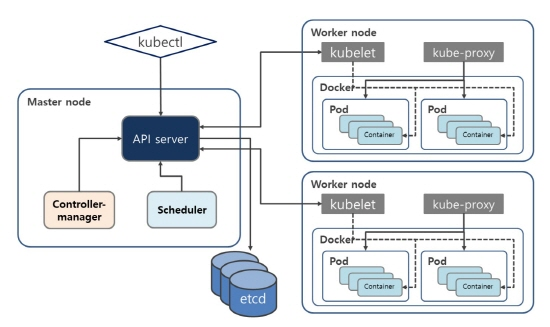
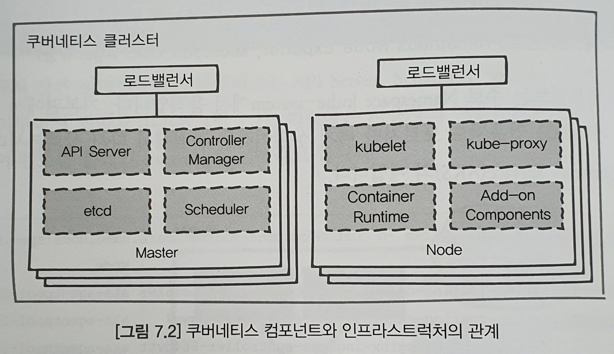
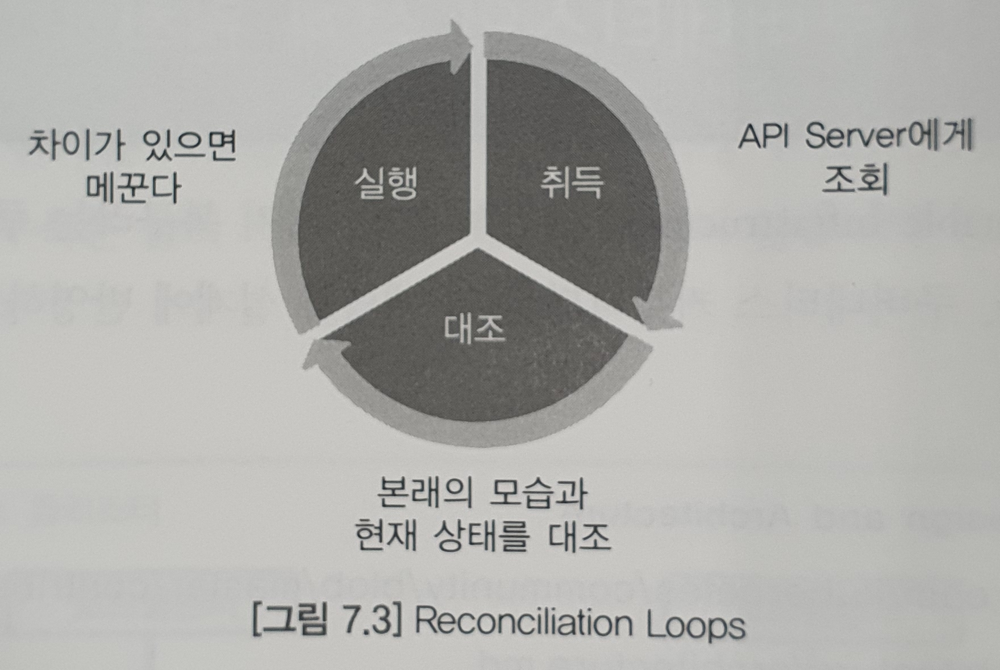
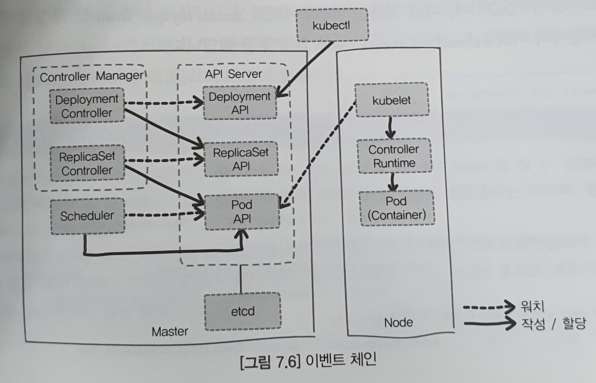
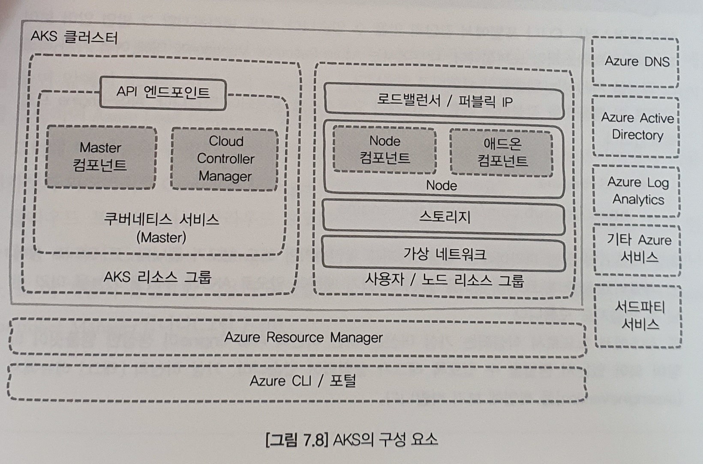
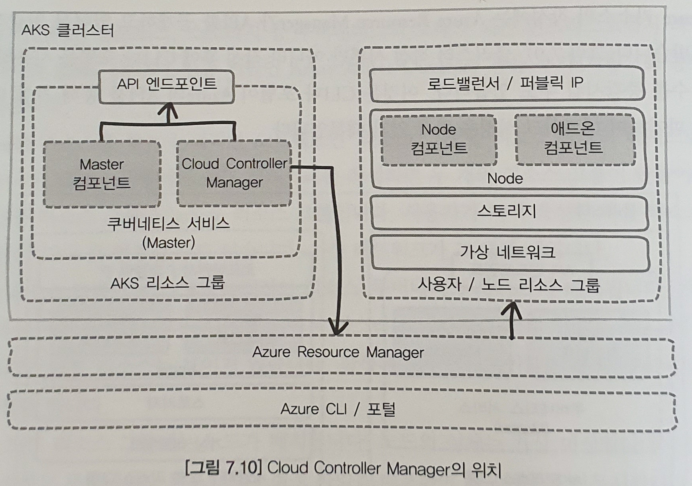

# 07. 아키텍처와 설계 원칙

---
## 7.1 쿠버네티스의 아키텍처
[^출처1]
* 쿠버네티스는 API Server, Scheduler, kublet 등 여러 개의 컴포넌트로 이루어진 집합체
	- 컨트롤 플레인(control plane)이라고 함

* 마스터에 위치 컴포넌트
	- API Server
	- Scheduler
	- Controller Manger
	- etcd (Master에서 분리 가능)
* 각 노드에서 포드나 네트워크 환경을 관리하는 컴포넌트
	- kublet
	- kube-proxy
	- 컨테이너 런타임(Docker, containerd, rkt 등)
* 포드에서 움직이는 애드온 컴포넌트
	- 대시보드
	- DNS
	- Ingress Controller
	- 감시용 에이전트(Prometheus Node Exporter, Microsoft OMS Agent 등)
* '애드온 컴포넌트'는 주로 Namespace kube-system에서 움직임

Ex) Azure Kubernetes Service(AKS) 
```zsh
root@Ubuntu ~/Understanding-K8s/chap05 % kubectl get pod -n kube-system --output wide
NAME                                    READY   STATUS    RESTARTS   AGE    IP           NODE                                NOMINATED NODE   READINESS GATES
coredns-698c77c5d7-6vvlc                1/1     Running   0          4d5h   10.244.0.5   aks-nodepool1-25958820-vmss000002   <none>           <none>
coredns-698c77c5d7-rqc7m                1/1     Running   0          4d5h   10.244.2.2   aks-nodepool1-25958820-vmss000001   <none>           <none>
coredns-autoscaler-79b778686c-8nvl4     1/1     Running   0          4d5h   10.244.0.6   aks-nodepool1-25958820-vmss000002   <none>           <none>
kube-proxy-9j444                        1/1     Running   0          35h    10.240.0.5   aks-nodepool1-25958820-vmss000001   <none>           <none>
kube-proxy-9z5l4                        1/1     Running   1          35h    10.240.0.4   aks-nodepool1-25958820-vmss000000   <none>           <none>
kube-proxy-bv784                        1/1     Running   0          35h    10.240.0.6   aks-nodepool1-25958820-vmss000002   <none>           <none>
kubernetes-dashboard-74d8c675bc-lzgql   1/1     Running   2          4d5h   10.244.0.4   aks-nodepool1-25958820-vmss000002   <none>           <none>
metrics-server-69df9f75bf-vg79x         1/1     Running   1          4d5h   10.244.0.3   aks-nodepool1-25958820-vmss000002   <none>           <none>
tunnelfront-55f4f47877-n5xgn            1/1     Running   0          4d5h   10.244.0.2   aks-nodepool1-25958820-vmss000002   <none>           <none>
```
* 애드온 컴포넌트의 포드는 마스터가 아니라 노드에 배치됨
	- 노드에는 자신이 디플로이한 어플리케이션 외에도 여러 포드들이 움직이고 있음
	
---
#### 1. 인프라스트럭처와 관계
[^출처2]
* 특성이 다른 '마스너'와 '노드'를 _분리_하여 여러 대의 서버로 구성
* 로드밸런서를 사용하여 가용성과 확장성을 향상
	- 마스터용 : API Server에 대한 액세스를 분산
---
## 7.2 쿠버네티스의 설계 원칙
* Immutable Infrastructure
* 선언적 설정
* 자기 복구

##### Kubernetes Design and Architecture
참고 : https://github.com/kubernetes/community/blob/master/contributors/design-proposals/architecture/architecture.md
 
##### Design Principles
참고 : https://github.com/kubernetes/community/blob/master/contributors/design-proposals/architecture/principles.md

* 요점
	- API Server만이 데이터스토어(etcd)를 다룬다
	- 부분적인 서버 장애가 클러스터 전체의 다운으로 이어지지 않도록 한다
	- 각 컴포넌트에 대한 지시를 잃어버려도 최근의 지시를 바탕으로 처리를 계속할 수 있도록 한다
	- 각 컴포넌트는 관련된 설정이나 상태를 메모리에 저장하지만, 영구화는 API Server를 통해 데이터스토어(etcd)에서 한다
	- 사용자난 다른 컴포넌트가 오브젝트를 변화시킨 것을 감지할 수 있도록 컴포넌트는 API Server를 워치한다.
	- API Server에서 폴링하는 것이 아니라 각 컴포넌트가 자율적으로 워치한다

---
#### 1. Reconciliation Loops와 레벨 트리거 로직
* Reconciliation Loops
	- API Server에 조회하여 현재 상태와의 차이를 체크하는 루프

[^출처2]

* 엣지 트리거 : 오브젝트의 변화를 이벤트로 푸시 및 폴링(변경 내용이 반영된는지 확인이 필요) 함
	- 문제점 : 네트워크 및 서버 문제로 응답이 되돌아오지 않을수도 있음 
* 레벨 트리거 : 변화시키고 싶은 어느 쪽의 레벨이나 상태를 유지하고 계속 확인함
	- 장점 : 언젠가는 변화를 알아차리게 됨
* 효율의 관점에서는 엣지 트리거 로직이 효율적인 경우도 있지만 쿠버네티스는 레벨 트리거를 채택

---
#### 2. API의 watch 옵션
* API Server에 대해 watch 옵션을 붙여 API를 호출하면 오브젝트의 변화를 취득 가능
	- 쿼리 파라미터 사용
`GET <API Server>/api/v1/<object>?watch=true`  

Ex) watch 옵션 사용 <!-- 실습은 안 함, 나중에 해보자 -->     
```zsh
$ kubectl get svc webserver -w
NAME         TYPE           CLUSTER-IP     EXTERNAL-IP   PORT(S)        AGE
webserver    LoadBalancer   10.0.168.143   <pending> 	 80:31395/TCP   14s
[대기]
webserver    LoadBalancer   10.0.168.143   52.141.30.204 80:31395/TCP   74s
[대기]
```
* '--watch(-w)' : 상태의 변화를 감지
* 서비스 작성 직후에는 'EXTERNAL-IP'가 <pending> 상태로 출력됨(그 후 대기 상태)
* 'EXTERNAL-IP'가 할당되면 이벤트를 감지하소 결과를 출력함(다시 대기 상태)


---
#### 3. 이벤트 체인
* 디플로이먼트는 레플리카셋과 그 실제인 포드와 의존 관계를 가짐
* Controller Manager
	- __다양항 컨트롤러의 집합체__
		- ReplicaSat controller
		- Deployment controller
		- Node controller
		- Service controller
		- etc 

[^출처2]
* 디플로이먼트 컨트롤러와 레플리카셋 컨트롤러는 각각 담당하는 오브젝트를 watch
* 스케줄러와 노드상의 kubelet은 _포드_의 상태를 watch
* __디플로이먼트 작성의 흐름__
	1. kubectl에서 디플로이먼트를 작성하는 매니페스트를 apply
	2. kubectl이 디플로이먼트 API를 호출
	3. 디플로이먼트 API가 디플로이먼트를 etcd에 저장
	4. 디플로이먼트 API를 watch하고 있는 Deployment controller가 변화를 감지
	5. Deployment controller가 레플리카셋 API를 호출
	6. 레플리카셋 API가 레플리카Deployment controller가 레플리카셋 API를 호출
	7. 레플리카셋 API가 레플리카셋을 etcd에 저장
	8. 레플리카셋 API를 watch하고 있는 ReplicaSat controller가 변화를 감지
	9. ReplicaSat controller가 포드 API를 호출
	10. 포드 API가 포드를 etcd에 저장
	11. 포드 API를 watch하고 있는 Scheduler가 변화를 감지
	12. Scheduler가 어떤 노드에 포드를 배치할지를 판단
	13. Scheduler가 포드 API를 호출하여 etcd 상의 포드 속성(배치 노드)을 갱신
	14. 포드 API를 watch하고 있는 배치 노드의 kubelet이 변화를 감지
	15. kubelet이 컨테이너 런타임(Docker)에 포드 작성을 지시
	16. 각 컴포넌트는 변화에 대비해 계속 watch
	
Ex) 이벤트 발생 순서 확인  
```zsh
$ kubectl get events -w
```
* 디플로이먼트를 작성할 때, 미리 별도의 터미널에서 `kubectl get events -w`를 실행
	- 발생한 이벤트들을 순서대로 확인 가능

### 쿠버네티스 설계 원칙
* API Server를 중심으로 '레벨 트리거' 로직을 바탕으로 한 Reconciliation Loops를 돌린다.

---
## 7.3 서비스 제품의 구축

---
#### 1. 쿠버네티스 Conformance Partner
* 쿠버네티스 세 개의 인증 프로그램
	- KCSP(Kubernetes Certified Service Providers)
		+ 쿠버네티스의 시스템 통합 능력이 있는 프로페셔널 서비스를 제공할 수 있다고 인증받은 업체
	- KTP(Kubernetes Training Partners)
		+ 인증 트레이닝을 제공할 수 있는 업체
	- Conformance Partner
		+ 설정 테스트를 통과한 서비스나 제품을 갖고 있는 업체
		+ 클라우드 프로바이더의 매니지드 서비스, 소프트웨어 업체의 디스트리뷰션 등

##### Kubernetes Partners
참고 : https://kubernetes.io/partners/

##### Certified Kubernetes
참고 : https://github.com/cncf/k8s-conformance

* 인프라스트럭러는 업체별로 차별화되 있음
	- 쿠버네티스 클러스터를 포털이나 툴로 편하게 작성 가능
	- 노드나 스토리지의 증감을 툴이나 API에서 동적으로 실행
	- 마스터나 노드 컴포넌트, OS를 쉽게 업데이트 가능
	- 쿠버네티스 클러스터 외부에 있는 로드밸런서나 DNS 등 추가 기능을 이용 가능
	- 버전업을 할 때나 바쁠 때에 인프라스트럭처 리소스를 일시적으로 도입 또는 폐기 가능

* AKS
	- 쿠버네티스를 포크하지 않고 커뮤니티에서 개발하고 업스트림을 따라간다는 방침을 갖고 있음 
	- 번잡한 구축이나 운용 직업의 부담을 경감기키고 싶어하는 사용자의 요구를 바탕으로 한 매니지드 서비스
	- 매니지드 서비스를 사용하는 경우의 가시/비가시의 경계선이 참고가 됨
	- 노드나 네트워크, 스토리지에 가시성이 있어 블랙박스가 아님
	
---
#### 2. 쿠버네티스 클러스터에 필요한 인프라스트럭처
* 클러스터에 필요한 인프라스트럭처 요소
	- 서버(마스터/노드)
	- 네트워크(노드간/포드간/로드밸런서)
	- 각종 증명서
	- 쿠버네티스 컴포넌트(바이너리)
	- 쿠버네티스 설정 파일
	- etcd 바이너리
	- etcd 설정 파일  


* 쿠버네티스 네트워크 사양 규정
	- 포드간은 NAT 없이 통신 가능
	- 노드와 포드간도 NAT없이 통신 가능
	- 포드 자신이 인식하고 있는 IP는 타른 포드에서 봐도 똑같음  

	

* Docker에서 사용하던 프라이빗 네트워크와 NAT, 포트 매핑을 사용할 수 없음
	- 포드에서 서버로 프라이빗 IP를 할당 못함

---
#### 3. 쿠버네티스 클러스터 구축에 필요한 작업
* 쿠버네티스 클러스터 작성 흐름
	- 노드간 네트워크 작성
	- 마스터 서버의 작성
	- 마스터 서버용 로드밸런서 작성
	- 노드 서버의 작성
	- 포드간 네트워크 작성
	- 증명서 작성과 배포
	- etcd 설정 파일의 작성과 배포
	- etcd 시작
	- 쿠버네티스 설정 파일의 작성과 배포
	- 쿠버네티스 컴포넌트(바이너리)의 배포
	- 쿠버네티스 컴포넌트의 시작
	- 쿠버네티스 애드온 컴포넌트의 작성
	
##### Kubernetes the hard way
* 수작업으로 클러스터 만들기
	- 구성 요소나 동작을 보다 더 깊이 이해 가능하게 됨

###### Kubernetes the hard way
* 참고 : https://github.com/kelseyhightower/kubernetes-the-hard-way

###### Kubernetes the hard way on Azure
* 참고 : https://github.com/ivanfioravanti/kubernetes-the-hard-way-on-azure


---
#### 4. AKS의 아키텍처와 Cloud Controller Manger
[^출처2]
* Azure는 리소스를 묶는 논리적인 오브젝트인 '리소스 그룹'을 리소스 관리의 베이스로 함
* [Azure CLI / 포탈]에서 AKS 클러스터를 작성하면 두 개의 리소스 그룹이 생성
	- [ASK 리소스 그룹] : ASK용 리소스 그룹
	- [사용자 / 노드 리소스 그룹] : 노드용 리소스 그룹과 사용자가 이미 작성한 다른 리소스 그룹(가상 네트워크)

* [ASK 리소스 그룹] -> '쿠버네티스 서비스'가 배치(가상의 Master)
	- Master : 매니지드 서비스, Azure에 의해 관리됨
	- 작성된 'API 엔드포인트'를 통해 쿠버네티스의 각종 조작을 함

* [사용자 / 노드 리소스 그룹] -> '노드'가 배치(가상 머신)
	- 가상 머신을 작성, 쿠버네티스 컴포넌트 및 설정 파일을 배포하여 컴포넌트를 기동시킴

* [Azure Resource Manager]가 API를 공개, Azure 리소스 작성 가능

###### AKS-Engine
* 참고 : https://github.com/Azure/aks-engine	

[^출처2]
* 사용자가 아니라 쿠버네티스가 Azure의 리소스를 조작할 경우도 있음
	- Ex) 쿠버네티스가 Azuer의 API를 호출하여 Azure Load Balancer를 설정
* __Cloud Controller Manager__는 클라우드 프로바이터의 차이를 흡수하며, 다리 역할을 함
	- 노드 컨트롤러(Node Controller), 서비스 컨트롤러(Service Controller), 루트 컨트롤러(Route Controller)가 존재
	- Ex) kubelctl 등에서 Type이 'LoadBalancer'인 서비스를 작성 -> 서비스 컨트롤러가 '서비스 오브젝트'를 작성 -> __Cloud Controller Manager__가 그것을 감지 -> Azure의 API를 호출 -> Azure Load Balancer를 설정

---
## 7.4 정리
* 각 컴포넌트는 자율적으로 움직이고 그 관계는 멀음
* 각 컴포넌트의 중심에 API Server가 있음
* 각 컴포넌트는 항상 API Server에게 조회를 하고 본래의 모습을 유지하는 'Reconcilation Loops'를 돌리고 있음
* 쿠버네티스 구축에 토대가 되는 인프라스크럭처에 따라 다양하므로 이를 이해해야 함

#### Kubernetes Community - Governance
* 참고 : https://github.com/kubernetes/community/blob/master/governance.md

---
[^출처1]: http://m.comworld.co.kr/news/articleView.html?idxno=49737
[^출처2]: 완벽한 IT 인프라 구축의 자동화를 위한 Kubernetes-정보문화사